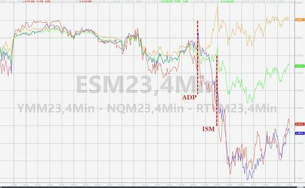
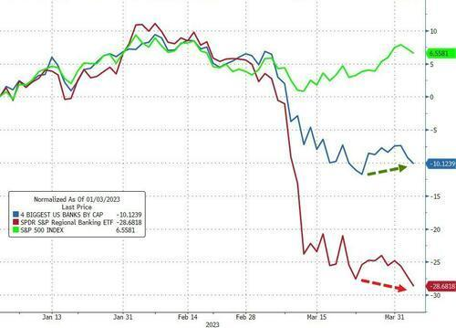
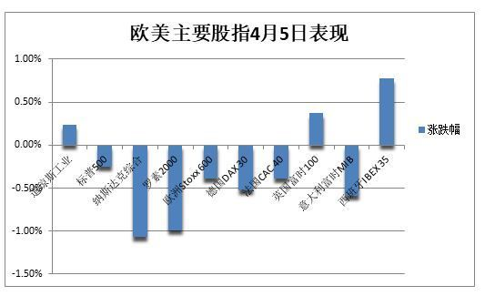
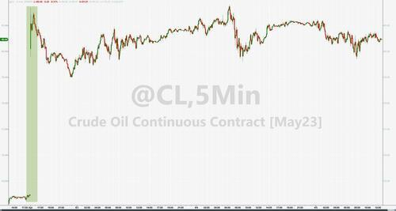
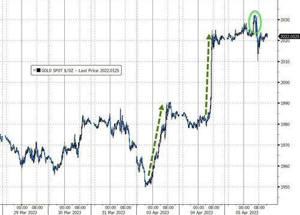

# 美股收盘：衰退担忧升温，纳指跌超1％，AI概念股继续重挫

美国多项经济数据不佳，体现劳动力需求、通胀和经济的降温趋势：

3月ADP就业人数增加14.5万，远低于预期的21万和前值26万，同时工资增长放缓，突显出劳动力市场需求出现降温迹象。

3月ISM服务业指数降至51.2的三个月新低，逊于预期的54.6和前值55.1，衡量新订单、商业活动和就业的指标均下降，投入品价格指数降至2020年7月来最低，表明通胀压力放缓。

2月贸易逆差705亿美元超预期，为去年10月以来最大逆差，或拖累一季度GDP表现。亚特兰大联储的GDPNow模型预计美国一季度经济增长1.5%，显著低于两周前预测的3.5%。

上述数据再结合本周发布的2月JOLTS职位空缺数近两年里首次跌破1000万，以及3月ISM制造业指数在剔除新冠疫情因素后创2009年来最低，均支持美联储或不需要进一步加息的观点。

美国利率期货市场押注美联储在5月暂不加息的概率一度从55%升破60%，小幅加息25个基点的概率从45%降至不足40%。周一时，市场对美联储进一步加息的押注还曾超过50%。

市场预期美联储5月完成加息，年底前四次降息至基准利率4%

明年鹰派票委、克利夫兰联储主席梅斯特周三仍称，预计利率将“稍微走高一点”，然后维持不变直到通胀下降，现在判断美联储会否在5月加息还为时过早，她支持基准利率上调至超过5%。

市场高度关注周五的美国3月非农就业，预计新增23.8万人低于前值，失业率或维持在3.6%不变。

不过，新西兰央行意外大幅加息50个基点，为2021年10月以来第11次加息和今年第二次大幅加息，理由是“通胀持续过高”，新西兰纽元兑美元一度涨超1%至两个月新高。

经济衰退担忧升温，标普连跌两日，纳指、纳指100和罗素小盘股齐跌1%

4月5日周三，市场对美国经济增速放缓甚至衰退将至的担忧升温，美股三大指数集体低开，随后道指转涨并涨超百点，主要受到以制药巨头强生为首的医疗保健成分股提振。

午盘时道指一度短暂转跌，标普500指数最深跌0.7%并失守4100点，纳指最深跌近200点或跌1.6%，失守1.2万点整数位，罗素小盘股也跌超1%。

**截至收盘，**
标普连跌两日，周内转跌；道指收涨并逼近周一所创的逾六周高位；纳指、纳指100和罗素小盘股均连跌三日并创一周新低，科技股指进一步脱离逾半年高位：

标普500指数收跌10.22点，跌幅0.25%，报4090.38点。道指收涨80.34点，涨幅0.24%，报33482.77点。纳指收跌129.46点，跌幅1.07%，报11996.86点。纳斯达克100指数跌1.01%，罗素2000小盘股也跌1%。“恐慌指数”VIX收涨0.42%，报19.08。

标普11个板块多数收跌，可选消费跌2%表现最差，工业和科技跌超1%。防御型板块齐涨，日用消费品涨近0.6%，能源涨超1.4%，医疗保健涨超1.7%，公用事业涨2.6%。

标普连跌两日，周内转跌，纳指、纳指100和罗素小盘股均连跌三日并创一周新低

**明星科技股齐跌。**
“元宇宙”Meta跌1.5%，无缘11个月新高；苹果和微软跌1%，进一步失守七个半月高位；奈飞跌1.3%，进一步失守六周最高；谷歌A跌0.2%，失守逾一周高位。亚马逊跌近3%失守两个月高位。特斯拉跌3.7%，连跌三日至两周半新低。

**芯片股也普跌，**
费城半导体指数跌1.8%，失守3100点，连跌三日至一周新低。AMD跌超3%至三周低位，英伟达跌2%至一周新低，英特尔跌近1%失守七个半月新高。

**昨日两位数百分比大跌的AI概念股继续重挫**
。昨日跌超26%的C3.ai再跌超15%至三周新低，SoundHound.ai跌超12%抹去上周五以来涨幅，BigBear.ai跌18%，接近抹去上周四以来涨幅。

消息面上，上周意大利暂时禁止ChatGPT，德国、美国、加拿大等国开始关注AI领域风险，加拿大就数据安全问题调查OpenAI公司。谷歌称自家AI超算系统优于英伟达。德国称苹果将受到更广泛的反垄断监管。意大利反垄断机构对Meta平台公司展开立案调查。

**热门中概连续两日追跌美股大盘。** 中概ETF
KWEB跌2.5%，CQQQ跌1.6%，纳斯达克金龙中国指数（HXC）跌近3%，成分股金山云跌6%。纳斯达克100四只成份股中，京东跌近2%，百度跌近3%，拼多多跌超1%，网易跌近2%。其他个股中，阿里巴巴、腾讯ADR和B站跌约2%，蔚来和理想汽车跌近3%，小鹏汽车小幅转涨。

**银行股中：**

行业基准费城证交所KBW银行指数（BKX）跌0.5%，至3月24日来最低，KBW纳斯达克地区银行指数（KRX）和SPDR标普地区银行ETF（KRE）跌1%，均创2020年11月来最低。

地区银行股指数刷新硅谷银行倒闭时的多年低位

阿莱恩斯西部银行跌超12%，领跌地区银行股

美国大型银行股普跌，但富国银行小幅转涨。摩根大通、高盛、花旗跌不足1%，美国银行、摩根士丹利跌超1%，资管巨头嘉信理财跌超2%至2020年11月来最低。

地区银行股多数下跌，阿莱恩斯西部银行（Western Alliance Bancorp）跌超12%至逾两周新低，西太平洋合众银行（PacWest
Bancorp）跌近5%，第一共和银行跌2.5%，KeyCorp跌1.5%。但收购硅谷银行大部分资产的第一公民银行股份（FCNCA）涨超4%，Zions
Bancorporation涨超3%。

消息面上，阿莱恩斯西部银行未提供关键指标“存款余额”，投资者怀疑没有好消息才不披露，有分析师猜测一季度该行存款下降15%。投行Baird将Zions
Bancorporation评级上调至“优于大盘”，理由是股价处于2008年金融危机以来最具吸引力的水平。瑞银将第一公民银行股份的评级从“卖出”直接上调两档至“买入”，目标价较周二收盘还有26%的涨幅空间。

瑞信的欧股和美股均跌1.5%，瑞银UBS的欧股和美股均跌超1%。瑞银举行收购瑞信之后的首个股东大会，瑞银称全面整合瑞信将耗时3至4年。

**其他变动较大的个股包括：**

货运巨头联邦快递盘初涨4%，收涨超1%至去年8月中旬以来的近八个月最高，将几个运营部门合并重组以削减成本，将2024财年的每股股息提高10%，并改变高管薪酬方案。

强生涨超4%至逾两个月新高，将在未来25年支付89亿美元，和解有关婴儿爽身粉和其他滑石粉产品致癌的指控，仍坚称这些索赔缺乏依据。

昨日申请破产保护的SpaceX劲敌、卫星发射公司维珍轨道尾盘转涨超34%，昨日曾跌23%至历史新低。伴随金价强势上涨，黄金股逆市走强，哈莫尼黄金一度涨近7%，创近一年最高。

除英股外的欧股普遍收跌。泛欧Stoxx
600指数收跌0.39%，连跌三日，接近抹去上周四以来涨幅，电信和医疗保健板块涨1.7%领跑，建筑和材料股跌2.6%，科技股跌1.8%，Stoxx
600银行股指数跌0.5%并抹去本周涨幅，意大利银行指数跌1%。

两年期美债收益率最深跌19个基点，10年期收益率近七个月最低

近期美国多项经济数据不佳，特别是就业市场需求降温，令分析师对美联储能否继续加息持怀疑态度。欧美国债收益率连续多日齐跌，且对货币政策更敏感的短债收益率跌幅更深。

10年期基准美债收益率最深跌7个基点至3.266%，创去年9月11日以来的近七个月最低。两年期收益率最深跌19个基点至3.65%，至3月24日来盘中最低，也接近去年9月来低位。短债收益率已经连续多日两位数大幅下挫，经济数据疲软刺激投资者的避险需求。

短债收益率已经连续多日两位数大幅下挫

**分析称，美债收益率继续表现出高度波动性。**
10年期收益率周一还曾因油价飙升引发通胀担忧之后触及3.54%的高点，两年期收益率周一达到4.14%，上个月则触及年内低点3.55%。三个月/10年期美债收益率曲线倒挂幅度徘徊历史最深，至近-158个基点。

美国经济数据公布后，欧债收益率止涨转跌。欧元区基准的10年期德债收益率尾盘跌近7个基点，两年期收益率一度跌12个基点并失守2.50%，连跌四日创五个月最长连跌周期。外围国家基准的10年期意债收益率跌10个基点，法国、西班牙和希腊基债收益率跌超7个基点。

美油WTI升破81美元后转跌，站稳80美元上方，布油尾盘转涨再创四周高位

油价盘中转跌，市场对经济不振拖累用油需求的担忧，超过了OPEC周末意外减产影响。

WTI
5月原油期货收跌0.10美元，跌幅0.12%，报80.61美元/桶，失守1月27日以来的逾两个月最高。但布伦特6月期货尾盘转涨0.05美元，报84.99美元/桶，再创3月7日来的四周高位。

美油WTI一度涨0.7%并升破81美元，转跌后跌超1%或跌近1美元，短暂失守80美元。布油一度涨1.3%或涨超1美元，日高升破86美元，转跌后跌超1%或跌超1美元，一度失守84美元。

美油收跌但站稳80美元上方，布油尾盘转涨再创四周高位

支持OPEC+超量减产之后，沙特对5月销往亚洲的所有等级石油涨价，涨价行动较市场预期提前。上周美国EIA商用原油库存超预期减少370万桶，汽油库存也降超400万桶，是需求利好信号。

昨日跌超12%的ICE英国天然气期货再跌超7%，失守110便士/千卡整数位。昨日跌9%的欧洲基准荷兰TTF天然气期货再跌近1%，进一步远离三周高位。美国5月NYMEX天然气期货盘中涨超4%，上逼2.20美元/百万英热单位，上周三曾失守2美元创2020年9月来的两年半最低。

美元转涨仍不足102，徘徊两个月低位，日元三连涨，以太坊创近八个月最高

衡量兑六种主要货币的一篮子美元指数DXY在ADP就业数据发布后下跌，美股盘初转涨，但仍不足102关口，徘徊2月初以来的两个月低位。有分析称，这是由于投资者在周五公布更重要的美国非农就业报告之前，趁机减持空头头寸以获利了结。

美元转涨仍不足102，徘徊两个月低位

欧元兑美元转跌0.4%并下逼1.09，脱离两个月高位。英镑兑美元跌0.3%并失守1.25，脱离十个月新高。美元兑瑞郎创2021年8月以来的逾一年半新低。美元兑日元连跌三日至一周低位，一度失守131。离岸人民币兑美元交投6.88元，几乎收复所有日内跌幅。

主流加密数字货币再度多数上涨。市值最大的龙头比特币站稳2.82万美元上方，第二大的以太坊再涨2%并升破1900美元整数位，创去年8月中旬以来的近八个月最高。

黄金升破2030美元再创去年3月以来最高，伦敦工业基本金属连续三日普跌

COMEX 6月黄金期货冲高回落，收跌0.1%，报2035.60美元/盎司，盘中一度涨0.5%并上逼2050美元，刷新去年3月以来的13个月高位。

现货黄金一度涨超10美元或涨0.6%，日高升破2030美元，连涨三日并刷新13个月最高。现货黄金曾在2020年8月创下2075美元的历史最高，一些分析师预计金价今年会再破纪录，瑞银预测2024年3月底金价或突破历史新高至2200美元，受益于对美联储可能放松加息的押注。

黄金升破2030美元，再创去年3月以来最高

经济前景不佳，伦敦工业基本金属连续三日普跌。但昨日跌近2%的伦铜转涨0.4%，脱离两周最低。昨日跌超1%的伦铝再跌1.6%，伦镍再跌1.8%并失守2.3万美元，昨日跌4%的伦锡再跌3%，均刷新至少一周低位。昨日跌超2%的伦锌再跌1.5%，失守2800美元刷新五个月最低。

