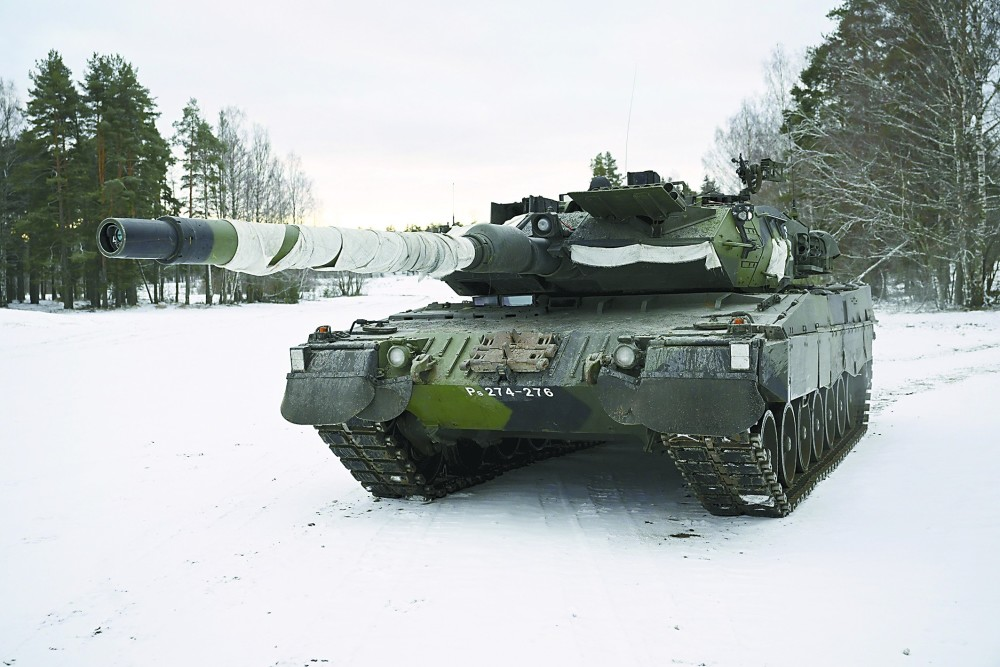

# 芬兰加入北约，与俄上千公里的陆地边界“随时可能成为前线”

【环球时报特约记者 章节 柳玉鹏 环球时报记者 刘扬】4月4日，芬兰正式成为北约
（NATO）的第31个成员国。芬兰在得到“庇护”的同时，它的加入也增强了北约的实力。芬兰境内的海空基地一旦供北约其他国家使用，将给北约带来哪些军事潜力的提升？俄罗斯又将用什么方式来应对？

_芬兰2月展示“豹2”A6主战坦克。（视觉中国）_

**与俄上千公里的陆地边界“随时可能成为前线”**

美国有线电视新闻网（CNN）4日报道称，芬兰当天成为北约第31个成员国，标志着东北欧安全格局的重大转变。芬兰总统在一份声明中说：“芬兰今天已成为北约防务联盟的成员。我们历史上的军事不结盟时代已经结束，一个新时代开始了。”他还表示，作为合作伙伴，芬兰长期积极参与北约活动。未来，芬兰将为北约的集体威慑和防御做出贡献。

CNN称，芬兰加入北约之前，俄罗斯与5个北约成员国共有约1215公里的陆地边界。芬兰与俄罗斯的边界大约1300公里。芬兰的加入使北约与俄罗斯的陆地边界增加了一倍多。

CNN的报道称，芬兰成为北约成员国，这保证了这个北欧国家在受到攻击时可以获得整个联盟的资源。

加入北约还可以让芬兰军队与北约盟国一起参与训练和规划。实际上，芬兰对与北约合作并不陌生，其军队以伙伴身份定期参加北约演习。北约官网4日题为“芬兰国旗在北约空军司令部升起”的报道称，十多年来，北约空军司令部在演习期间与芬兰空军合作以支持北约行动。之前，芬兰空军还参加了北约反应部队，并定期加入盟军警戒飞行，在波罗的海上空进行警戒。

俄罗斯“生活”网5日报道称，在芬兰申请加入北约过程中，北约国家与芬兰的联合演习次数急剧增加。去年夏天，芬兰参加了一场名为“欧洲卫士”的演习，该演习演练了从黑海到波罗的海与俄罗斯的假想战争。从芬兰边境到俄罗斯摩尔曼斯克的距离只有200公里，到俄北方舰队的主要基地北莫尔斯克的距离稍远一些，到俄造船中心北德文斯克的距离是500公里，而离圣彼得堡只有152公里。俄芬两国之间上千公里的陆地边界在芬兰加入北约后随时可能成为前线。未来芬兰将无法阻止美国在其领土上部署核弹，甚至部署短程和中程弹道导弹。芬兰当局最近保证，不允许在其境内部署核武器，但北约官员表示，北约没有向俄罗斯保证，如果瑞典和芬兰加入北约不会在两国部署核武器。同时，俄北极地区的大部分军事和民用设施将处于北约武器的打击范围内。

**芬兰军事家底有哪些**

芬兰的地面、海上和空中力量都经过训练并拥有一个主要目标——击退俄罗斯的入侵。英国路透社4日报道称，二战后，芬兰是少数几个在几十年的和平时期保留一支备战军队的欧洲国家之一，该国对其东部邻国俄罗斯保持警惕。

芬兰每年训练大约2.1万名新兵，然后他们成为芬兰28万名战时预备役士兵的一部分，其中每年约有1万人轮流被征召参加训练。大约87万名年龄在17至60岁之间的芬兰人有义务在需要时被征召入伍。合同人员由1.2万人组成，其中8000人是军人。俄《国防》杂志主编科罗特琴科称，芬兰军队动员潜力可达到100万人。这将是一支训练有素的军事力量。芬兰在军事上不仅拥有军事潜力，而且拥有强大的电子情报资源。北约的远程侦察机也可能会出现在其领空，这将增加对俄罗斯的压力。

芬兰陆军装备了大约650辆坦克，其中大约200辆是德国制造的“豹2”A6和“豹2”A4型。而且，该国拥有“西欧最强大的火炮部队”，包括大约1500门火炮，其中榴弹炮和加农炮大约700门、700门迫击炮和大约100门重型和轻型多管火箭炮。芬兰炮兵的火炮火力超过了波兰、德国、挪威和瑞典军队目前的总和。它还引进了以色列制造的ELTA反炮兵雷达系统，使其能够定位和跟踪来袭的火箭弹、炮弹和迫击炮。

芬兰的防空装备包括至少650枚导弹，它还在从瑞典萨博公司和以色列拉斐尔先进防御系统公司购买更多导弹。它最重要的防空系统是和北约兼容的挪威与美国联合研制的NASAMS
2。芬兰正处于新型高空防空系统招标过程的最后阶段，将从以色列航空航天工业公司或拉斐尔先进系统公司采购。

芬兰拥有数量不详的非武装型“轨道飞行器”无人机，并且正在购买1000-2000架以上的无人机。

芬兰空军拥有一支由61架F/A-18“大黄蜂”战斗机组成的机队，它们将被64架F-35A所取代，这些战斗机将于2026年开始交付。上个月，丹麦、芬兰、挪威和瑞典宣布，将联手运营一支总数包括250架战机的庞大机队。北约空军司令詹姆斯·赫克将军出席了在德国空军基地签署合作意向书的仪式。他还明确表示，这个新的联合战斗机编队将在功能上“融入”更大的北约作战司令部。

相比之下，芬兰海军较为弱小，拥有4艘指挥舰、5艘布雷舰、8艘导弹艇、3艘反水雷舰、13艘扫雷舰以及较小的登陆艇。芬兰正在采购3艘用于水面作战的新型多用途护卫舰，这些护卫舰目前正在芬兰建造，将于2029年投入使用。

**俄将在西部组建新部队集群**

CNN报道称，芬兰加入以美国为首的安全联盟对俄罗斯来说是一个打击。对于北约将如何利用芬兰的军事资源，《俄罗斯报》5日援引俄军事专家阿列克谢·列昂科夫的话称，事实上，北约首先需要芬兰境内广泛的机场网络，芬兰境内有18个机场，很容易作为军民两用机场。北约长期以来一直希望在这些机场部署前沿基地部队、导弹系统、反导防空系统。此外，西方国家相信，芬兰和瑞典加入北约将“关闭”芬兰湾，因为它将完全处于北约的火力控制之下。波罗的海将成为北约的内海。据俄媒上月报道，美空军一架B-52H战略轰炸机在芬兰湾中立水域演练了对俄罗斯第二大城市圣彼得堡的模拟核打击。

俄《论据与事实》周报5日报道称，俄军事科学院教授维塔利·斯特卢戈维茨称，从最近的芬兰城市到俄罗斯维堡只有65公里。现在到圣彼得堡，北约坦克只需要一次加油就可到达。

由于芬兰加入北约极大危害了俄罗斯的国家安全，俄罗斯对此作出强烈反应。CNN称，俄罗斯警告称，北约的进一步扩张不会给欧洲带来更多稳定，如果北约向新成员国派遣任何部队或装备，俄罗斯将在芬兰附近扩大兵力部署。

俄罗斯外交部副部长亚历山大·格鲁什科告诉俄新社，“如果北约成员国在芬兰领土上部署部队和装备，我们将加强西部和西北部的军事能力。”俄总统新闻秘书佩斯科夫重申，芬兰的加入将迫使莫斯科“采取反制措施，以确保我们在战术和战略上的安全”。

据俄罗斯《报纸报》5日报道，俄军将在西北方向和西部方向组建新的部队集群。今年早些时候，俄罗斯国防部长绍伊古表示，将加强与芬兰邻近地区（卡累利阿共和国和列宁格勒州）的部队集群，该集群将包括3个摩托化步兵师和2个空降突击师，同时还将考虑完善雷达侦察系统、防空导弹和歼击航空兵系统。俄军需要组建新的防空导弹部队、无线电技术部队，重建苏联时期驻扎在该地区的所有航空兵团。俄军陆上和岸防部队可能会增加，导弹部队和炮兵的数量也将大幅增加。在规划作战行动时可能会考虑到使用远程高精度武器对芬兰和瑞典境内的目标进行打击的可能性。这首先将使用远程航空兵以及配备“口径”巡航导弹的海军编队。

