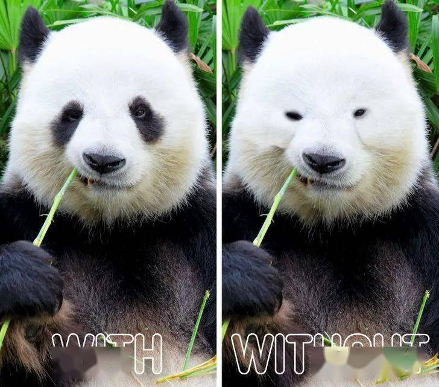
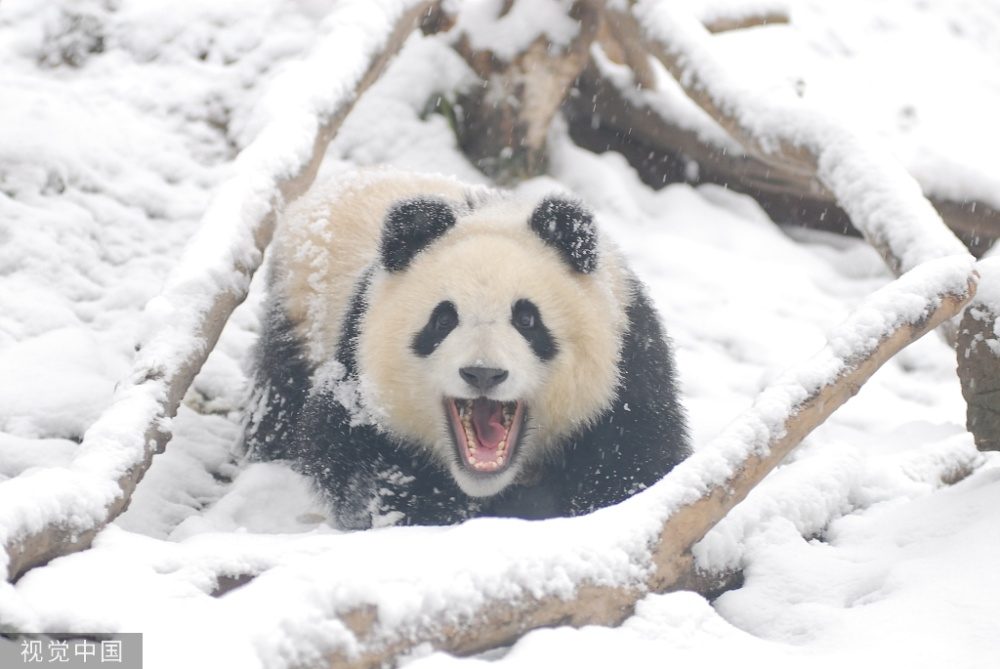

# “中国专家抵美后熊猫丫丫眼里有光了”？专家：过度“萌化”是种歧视

当地时间4月6日晚，美国孟菲斯动物园发布消息称，将为大熊猫丫丫举办告别派对。丫丫归期在即，围绕它的纷争耶愈演愈烈。

人们为丫丫表达喜爱、同情、愤慨，其中不乏过激言论与行为。我们为何会对动物投射浓厚的爱意？如何在众多信息中甄别谣言、更理智地表达爱？过度“萌化”对野生动物保护有何影响？

核心要点：

  * _1_ 人类会对动物产生共情，且亲缘关系越近，共情越容易发生。共情背后的生理机制是“镜像神经元”的作用，人和动物尤其是灵长类动物都有类似的神经结构。
  * _2_ 大熊猫的形象同时具有生物学、文化和政治三个层次上的意义。在此基础上，大熊猫已经成为每个中国人个体记忆和公共记忆的一部分，对熊猫的爱已经植入大家心底。
  * _3_ 野生动物饲养管理原则最根本的就是尊重自然，尽量为大熊猫提供和野外相同的食物条件。尽管大家都喜欢大熊猫，但还是要以更客观、科学的角度来看待。
  * _4_ 将动物行为“拟人化”，营造其是人类“好伙伴”的刻板印象，这实际上人还是占主导地位，这是一种“积极的歧视”，即对动物的过度保护本质上其实还是对动物的歧视。
  * _5_ 部分自媒体常利用用户情绪博取流量，受众应增强知识储备、提高媒介素养，以增强信息鉴别能力。同时，也需要专业人士进行科普，帮助受众理性认识、辨别谣言。

嘉宾介绍：

马凌 复旦大学新闻学院教授

张昕 北京大学心理与认知科学学院副教授

杨毅 博物学指导老师、科普作家

丁阳 圆桌主持人、《较真鉴定局》主理人

一、共情丫丫：生理机制与进化机制并行，“萌萌使者”牵动人心

丁阳：人类为何会对大熊猫丫丫等动物产生如此深度的共情？

**张昕：** 不光对大熊猫丫丫，我们对其他伴侣动物也会出现人与动物之间的共情。

所谓“共情”，在心理学上是指把自己的情绪推及别人或别的动物，达到“想他人所想”。
**共情背后的生理机制是“镜像神经元”的作用，人和动物尤其是灵长类动物都有类似的神经结构。**
之所以叫“镜像神经元”是因为我们在做模仿动作或照镜子时这一神经元会放电。

此外，共情背后还有进化机制，这一机制让我们表现出更多的“利他行为”，当我们意识到他者（人或动物）与我们一样时就更容易出现这样的亲社会行为。有研究发现，从进化上讲，与我们亲缘关系越近的动物，我们越容易与之共情。比如灵长类动物在进化树上的分叉离我们很近，是我们的近亲，因此人类更容易与它们而不是鱼类共情。

而对大熊猫来说，之前在网络上有一张图片，如果把熊猫的黑眼圈涂掉变成白色，你会发现它眼睛变小了、然后就不那么可爱了。

_当熊猫没有黑眼圈（图源：网络）_

进化心理学角度看，人类幼崽或动物幼崽头身比例是很大的，头很大，身子很小，眼睛也会大一些，这是进化中的一种自我保护，用这些特质激起人的保护欲。而熊猫的形象显然是符合这种特质的，因此会天然地惹人“怜爱”。

**杨毅：**
人们确实更喜欢与自己亲缘关系较近的动物。作为前一线动物园饲养员，我发现一些游客到动物园参观时是有选择的。受思想观念和教育影响，蛇在大多数人的认知里是有毒、“阴险”的，因此很多游客就避而远之，转而选择参观熊猫、大象、长颈鹿、老虎等动物。

作为饲养员，应该是科学唯物主义的。但饲养员也是人，也容易对某一类动物抱有偏见。例如我有的同事看到青蛙、蛇等冷血动物就起鸡皮疙瘩，或者害怕尖嘴或带毛的生物，于是选择调到其他场馆工作，并不是所有动物都会被人类接纳、令人类共情。

除了人类对动物的共情，跨物种的爱也会出现在动物与动物身上。我们会看到母狮子将羚羊妈妈捕猎后留下小羚羊，这可能是她失去了孩子后将这种爱投射到了另外的活体身上。我工作过的动物园树懒展厅里会将同来自南美雨林的巴西夜猴与树懒混养，夜猴会贴着树懒的后背抱着树懒休息。而狨猴和鬣蜥混养时会骑在鬣蜥身上让鬣蜥驮着它们晒灯......这种情况其实不是食物链互助关系，而是共生。

_大熊猫丫丫（图源：Memphis
Zoo）_

丁阳：人对动物的喜爱背后有哪些情感或心理因素？我们在共情过程中获得了怎样的慰藉？

**张昕：我们确实会把社会陪伴的需求投射到动物身上，所以我们会强调陪伴动物（宠物）的陪伴作用。**
这也有现实因素，一些年轻人没有时间经营亲密关系，但有陪伴或社交的需求。或者他们容易和自己的父母或他人产生各种矛盾，但陪伴动物则不会与我们发生冲突，所以“陪伴动物”正变得越来越普遍。

不仅是年轻人养猫狗，老年人也会有这种倾向。我国老龄化比较严重，而老年心理学中就有一种“宠物疗法（pet
therapy）”，可降低老年人社交孤独感。此外，若老年人记忆力下降，记不清某时要吃什么药，遛狗、（给狗）添食可能就可以与吃药关联起来，起到定时提醒的作用。

丁阳：相较于喜欢动物带来的愉悦、治愈等积极情绪，丫丫事件中人们的情绪大多是同情、质疑、愤怒。这背后映射出哪些心理变化？

**张昕：**
共情可以促进亲社会行为，帮助我们更好理解他人，但过度共情也不利，很多人心肠很好，希望帮助别人，但又没有受过专业临床心理学训练，甚至会比真正受伤的个体感受到更多的痛苦和更强烈的心理创伤，引发愤怒、焦虑等系列消极反应。正确的抽离很重要，把自己的具身（编者注：具身指认知对身体的依赖性）剥离出来，可以缓解过度共情带来的负面情绪。

丁阳：大熊猫是如何成为和平友好的“萌萌”使者？

**马凌：** 大熊猫已经成为中国人个体记忆和公共记忆的一部分，
**每个人从小学开始就在课本、春游中遇见大熊猫，对熊猫的爱在个体的社会化过程中已经植入大家心底。**

其实大熊猫在中国人记忆中很晚出现，到19世纪后期才正式进入大众视野。大熊猫曾广泛分布在我国南部和南亚地区，但或许由于居住在深山老林、很少现身人前，我还未曾在我国诗词歌赋和古代绘画作品中见过大熊猫。

19世纪一名法国传教士在四川宝兴发现熊猫并将标本带回法国，在国外爆火，有大量探险家来中国猎杀熊猫，导致1939年国民政府颁布禁止大熊猫运输出口的禁令。所以一定程度上是西方的熊猫热让我国意识到大熊猫的珍贵，也引起我们的兴趣。1941年，宋庆龄、宋美龄姐妹就曾向美国一个援助了我国难民的协会赠送一对大熊猫以表谢意。

我国大型运动会和博览会的吉祥物很多都是大熊猫，比如1990年亚运会的盼盼、2008年北京奥运会的福娃晶晶、2018年上海进博会的进宝、2022年冬奥会的冰墩墩等。人民日报从1949年到2019年的新闻简讯和图片中以大熊猫为主题的共有911条，纽约时报1949年到2018年关于大熊猫的主题报道有236篇，说明大熊猫不仅是中国的，更是世界的。国外也基本认可大熊猫是最受海外大众喜爱的中国符号。

_盼盼、晶晶、进宝、冰墩墩（图源：网络）_

总结下来，大熊猫的形象有三层意义：第一是生物学意义上的，它们毛茸茸的、憨态可掬，让人喜欢；第二是文化意义上的，公众、媒体、官方和动物保护机构为其建构了“活化石”“国宝”“生态保护”等代表和平、和谐的形象；第三则是政治意义上的，大熊猫是友谊大使、和平使节，甚至可能是中国本身。

近年西方媒体上会有山姆大叔与大熊猫互殴的漫画，大熊猫之于中国可能就相当于山姆大叔之于美国，都代表了国家形象。或许也正是如此，“丫丫在外受虐”的新闻才更加牵动人心。

_大熊猫雪中嬉戏（图源：视觉中国）_

二、流言漩涡：理性厘清科学事实，避免无意识卷入谣言

丁阳：关于丫丫的众多信息中，有哪些虚假信息被普通受众信以为真？我们应该如何理性识别信息？

**杨毅：** 尽管大家都喜欢大熊猫，但还是要以更客观的角度来看待它。我可以从动物学的专业角度来解读几条围绕大熊猫的流言。

有言论认为“丫丫每天吃零食很少”是其所受照顾不周的证据， **但其实不论野外还是人工饲养，大熊猫主要食物都是竹子，占到每天饲料总量的99%甚至更多。**
胡萝卜、苹果等零食是为了满足更多的营养需求，并不能作为主食来吃。

有人质疑，“给丫丫吃的笋不够多”， **但野生动物饲养管理原则最根本的就是尊重自然，尽量为大熊猫提供和野外相同的食物条件。**
比如老虎食肉，但除了特殊时期或老年临终关怀，我们不能每天给它提供猫罐头，因为在野外是不会有人为老虎做肉泥的。

至于质疑丫丫在“吃干竹子”，其实竹子从冷库出来很快就会卷叶，看起来像是干的。而且
**大熊猫一年四季吃的竹子部位不同，春天笋量大，开春时主要吃竹叶或竹竿；夏天竹子营养主要存在竹竿里，就多吃竹竿；秋冬季竹叶增多，就更多吃竹叶。**
全世界可供大熊猫食用的竹子有180多种，每个国家适宜生长的种类不同，不能说熊猫在中国吃的是冷箭竹，出国也必须吃冷箭竹。

有人质疑“丫丫的生活环境不好”，其实大熊猫内舍外舍的面积、朝向、甚至栏杆间距都有国际统一标准，从上世纪90年代开始我们以租借的方式将大熊猫送出国，就会给对方提供大熊猫饲养管理标准。
**场馆是否到位、兽医团队和营养团队是否合格、对方是否负担得起大熊猫饲养成本，我们都会提前评估。**

其实孟菲斯动物园对大熊猫的行为训练很负责，对国际标准野生动物行为训练做得很到位，饲养操作和安全检查防范也很标准。

丁阳：丫丫活到二十多岁，这本身是否能说明它平时受到了良好的照顾呢？

**杨毅：** 20多岁对丫丫来说已经是老龄阶段，大熊猫平均寿命只有20年。饲养管理到位、营养和兽医团队到位，就有可能延长动物寿命。

其实，野外大熊猫的繁殖率很高，但存活率低。这主要是因为我国古代大熊猫分布非常广，秦岭、山西、河南、湖广地区甚至北京郊区都有大熊猫分布。而随着人类生活面积扩大，开山种田、破坏林区，导致大熊猫栖息地破碎化，从而导致其数量减少。

而在人工圈养条件下，大熊猫在野外常有的寄生虫、犬瘟热、细小病毒或气候变化、发情期争斗受伤不治而亡、熊猫妈妈没奶等致死因素少了很多，大熊猫的寿命得以极大延长。

丁阳：中国专家组成员、北京动物园的兽医和饲养员已于美国当地时间3月16日抵达孟菲斯动物园。“娘家人”到达孟菲斯，丫丫的情绪和表现是否会有所提升？

**杨毅：**
其实，专家即便去了孟菲斯动物园，也不会参与对方的饲养管理，至多是进到内舍观察熊猫的粪便情况、进食情况、饲料营养是否到位、日常操作规程记录，观测丫丫状态是否达标等。
**毕竟丫丫到美国已经很多年，适应了当地的环境和饲养员的气味、声音，也认不出远道而来中国的专家。所谓的“中国专家抵达后，丫丫吃甘蔗时眼里都有光了”之类的说法，自然有失偏颇。**

但专家抵达肯定是对熊猫交接有帮助的。我们能在第一时间接收丫丫在孟菲斯的饲养记录，帮助丫丫适应上飞机回国的笼箱，检疫丫丫的粪便、观察消化率和营养吸收率，让丫丫尽快适应中国饲料。

丁阳：当下为丫丫发出的各种声音中，有哪些声音对大众可能存在误导？更负责任的做法是什么？

**马凌：** 在我国“谣言”含贬义，但西方的“谣言”更像是“流言”，是大众正在传播和关注的信息，有虚假成分、也有一定真实成分。

新闻学里讲，谣言某种意义上更像是一种变形的公众舆论，体现的是某种群体心理的集中爆发。所以研究谣言，不仅要研究谣言本身，更要看公众想借媒介事件来表达什么样的情绪。

不过，大部分公众的过度关心甚至焦虑或许已经有些变形：有些人因为朋友不关心丫丫的事情就拉黑朋友，家庭甚至还会爆发争吵，对丫丫的发声某种程度上已经极化、变成站队行为。例如“但凡你爱国，就要表态自己关注丫丫，不然你就是对面阵营的，是敌人”这类表达。

群体极化还意味着“通过交流说服对方”不再可能，越辩论越会激化矛盾，辩论双方越发固执，这也颠覆了我们过去对公共协商的认识。尽管我非常理解网友们的心情，但也发现大量网友借此发泄情绪。

从新闻传播学的角度，只有一招，就是提高媒介素养
**。公众媒介素养普遍较低，不会主动寻找信源，也不够冷静，容易瞬间愤怒或瞬间感动，他们往往不明白社交媒体平台的算法策略，容易陷入某个话题的循环，过度沉溺。**

极高明而道中庸，希望大家不要过度联想，也不要无限上纲上线，拿事实说话。

丁阳：基于传播学角度，如何看待熊猫丫丫相关流言盛行的现象？

**马凌：** 我们可以把传播分为传播者、传播过程和接受者三个层次。

首先，从传播者角度来讲，虽然新闻学院培养正宗媒体人，但其实国内持证记者也就十几二十万，大部分媒体从业者都是我们说的“自媒体人”，自媒体造成的总体信息环境与从前相比繁杂很多，人人都有麦克风。
**部分无良媒体的主要运作方式就是制造话题、蹭流量、贴标签，喜欢将话题极端化、炮制耸人听闻的新闻来迎合大众好奇心。**
“丫丫快饿死了”的标题就是渲染悲情的极端化方式，有若干个账号都只做这一个内容，进行垂直细分领域的渲染。而短视频为王的背景下，这类媒体一旦拿到一个选题，会不停地生产出相似内容以换取商业利益。

**此外，“坏消息就是好新闻”，即特别糟糕的信息对新闻人来讲是好机会，历史上战争或灾害时期反而是新闻业比较繁荣的阶段。**
所以对某些无良媒体来说，确实有“唯恐天下不乱”的想法。他们不仅贩卖悲情，还贩卖焦虑、贩卖愤怒。这些传播者其实并不关心丫丫如何，只关注账号点击量和流量背后的广告利益。

其次，是传播过程。
**受众确实容易被困在信息茧房里，每天关注同一话题引发焦虑进而形成某种心理创伤；受众也容易被话题框定，不停观看类似内容并误以为这就是真相，“回音室”就此形成。**
而受众认知逐渐偏差，更容易导致更负面的情绪和更严重的社会反应。

最后，是受众自身。谣言止于智者，很多明显反智的谣言却有很多人相信，这是由于
**我国十几亿普通受众的知识储备参差不齐，不足以辨别谣言，加之“宁可信其有”的传统习惯，就容易相信谣言。**

此外，每个受众不是孤立地看待某一事件，各种信息会结合受众自己的心理取向和知识背景，形成一个冲量，我们可以将其理解为一个旋风一样的螺旋，受众会被无意识地卷入其中。偏见肯定会干预人的认知，但在信息如此复杂的时代，人多多少少都会有一定的偏见或成见。

**所以我们对自己的偏见要有一定的觉察和警惕。要记住，“爱”不一定代表“常识”，这也是为何我们需要更多专业领域人士进行科普。**

丁阳：从心理学角度来看，面对丫丫相关谣言泛滥问题，有什么好的解决办法？

**张昕：**
我们先要学会对信息进行二分。一类是事实性信息，不易造假，也不易成为谣言，不然很容易戳破；一类是观点性信息，尤其是带有特别强烈情绪色彩的，例如“有良知的人就不应该xx”就特别容易引发大众情绪共鸣，也很容易成为谣言。

从心理学角度看，观点性信息比事实性信息更容易吸引眼球、更容易被记住，其中积极和消极情绪的记忆效果则又优于中性情绪。
**而消极情绪相较积极情绪有更多进化意义上的生存价值，例如恐慌情绪可以让我们人类的祖先避免被猛兽吃掉，愤怒可以让祖先反抗经常欺负自己的人，所以大家更容易注意到并记住消极情绪。**

而从受众角度来看， **第一，认知资源不足的人更容易上当受骗。**
对于未知是否为谣言的信息，没有办法分辨或找不到分辨途径，为节约认知资源，这些人就会相信听到的所有信息，这类情况在老年人中常见。
**第二，很多人不能容忍“不确定性”，一定要得到一个答案，至于答案是对是错则不在乎。** 这些人也会容易相信谣言，甚至转发给他人，成为谣言的中介站。

所以还是建议平台方做更多的努力，现在也有一些事实核查媒体，帮助大家辟谣或核查事实。

三、守护动物：放下“积极的歧视”，尊重动物自然状态

丁阳：作为野生动物，过度萌化对熊猫的保护、繁衍有哪些影响？大众对动物的认识是否走偏了？我们该如何表达爱，才是对动物更好的做法？

**马凌：** 科普人士希望大众了解真实的大熊猫，比如其惊人的咬合力和战斗力，但大众不能接受血盆大口的熊猫形象。

从这个角度讲，我们可能还是想维护心目中和平友好的呆萌、没有攻击性的熊猫形象。其实熊猫形象是通过互动来共同建构的，所以其未来如何发展并不能准确预测，若干代后大家是否还如此喜欢熊猫也不一定，毕竟熊猫广泛受人喜爱也就这一百多年的事情。

_现生大熊猫（Ailuropoda
melanoleuca）的头骨模型，示包括骇人的犬齿在内的各个牙齿。红色的部分是“裂齿”，右上作为参照的是宠物貂（Mustela putorius
furo）的牙齿，它们都是食肉目的成员。（图源：果壳）_

**美国华裔学者段义孚开创了人文主义地理学，去年出版的一本书叫《制造宠物——支配与感情》，他认为我们把生物宠物化的行为，体现的是一种权力的支配。**
比如通过对丫丫事件的关心表达自己的爱国情绪、借助宠物满足个人对陪伴的需要，满足的都是我们作为“人”的需要。我们稍微超出一点人类中心论、从动物本身的角度来看，猫究竟愿意给人当一辈子宠物，还是愿意在野外奔跑抓老鼠？大熊猫愿意生活在大自然、保留本身的样子，还是愿意被圈养但拥有更长的寿命？没有人能妄下定论。我们又凭什么决定一个动物的命运？所以这一点是很复杂的。

**杨毅：**
大熊猫的圆滚滚、黑白配色、毛茸茸很讨人喜爱，不管周边产业还是传统水墨画，都着重表现大熊猫的毛茸茸质感。但熊猫出笼伤人的事件也很多，有人觉得熊猫很可爱，上手去摸，结果被咬了，但媒体可能也没有着重报道。所以，
**媒体在科普方面尤其要做到科学、客观，把真相和利害关系都讲清楚，大家对动物的喜爱也要点到为止。**

丁阳：心理学上来说，为什么人类会代入自己的经验去理解动物？我们在与动物的相处时需要注意什么？

**张昕：**
在刻板印象研究领域有一个现象叫“非人化”，就是用非人属性描述本属于人的属性。比如种族主义者把黑色人种和猴子挂钩来丑化黑色人种，这时我们可以发现我们天然对人和动物有等级上的划分，认为人高动物一等。

**而丫丫事件则是将动物“拟人化”，把动物的地位拔高，营造其是人类“好伙伴”的刻板印象。但实际上人还是占主导地位，带着怜悯的态度去看待丫丫，始终认为动物不如人，需要我们的保护和支持，在刻板印象中这被称为“积极的歧视”，即对动物的过度保护本质上其实还是对动物的歧视。**

所以我们和动物应该如何相处？或许还是要尊重其自然状态：它们在野外该是什么样，我们就为它们打造什么环境。在此基础上加入一些人文关怀，比如生病了进行治疗、老了保障营养摄入等等，这样人与动物的关系会更加和谐。

整理：王嘉欣

