# 中国现在，非常缺锂

作者：严寒

校稿：朝乾 / 编辑：板栗

最近，江西宜春地区私挖锂矿事件，已经引起了广泛的舆论关注。中央政府也派出了多批工作组前往宜春 **整顿** 。

江西是矿产大省，锂矿被私挖盗挖，直接原因是这种资源越来越有利可图了，作为新能源电池的关键配料， **锂元素**
被誉为第四次工业革命的“白色石油”，是不可或缺的工业原料。中、日、美、欧、澳相继将锂列为 **战略性金属** ，其重要地位可见一二。

_宜春市的宜丰县、奉新县、高安市三县市交界地带的瓷土瓷石矿伴生着丰富的锂资源_

中国目前是世界第一大新能源车生产国，随着产量突飞猛进，碳酸锂的价格也爆发式增长，截止2023年1月，锂价已经 **强劲上涨** 了18个月。

_最近锂价有所回落，但价格仍然不低_

随着锂价大涨，去年12月，江西宜春部分村民就上山私挖滥采锂矿，这种操作对资源显然是 **破坏性掠夺**
，国家自然高度重视。当然，江西的锂矿乱象，一方面是屡禁不止的民间行为，一方面也折射出我国的锂不够用。

_原本装饲料的麻袋，现在却装了满满当当的石头（图：eco.gov.cn）_

今天我们就来从地理视角说说 **中国“缺锂”** 的问题。

中国缺锂

中国的锂，从储量来看并不算太少，根据相关统计数据，全球锂资源量8600万吨，所谓资源量就是已探明的量，加上地质学家预估的储量，可以说是“最佳猜测值”，其中已探明储量是2100万吨。

根据“中国矿产资源报告2022”，中国的锂折合成氧化锂（Li2O）的储量有404万吨，排名第四，占全球储量的8.9%，占全球产量的13%，属于比下有余，比上不足。

但相比于我们的 **锂元素消费量**
，这点产能就完全不够看了。根据预测，到2030年，中国锂元素需求将高达70万吨，其中45~50万吨要进口，对外依存度65~70%，如果不能提前布局，以后很可能像其他矿产一样被各种收割。

_中国碳酸锂的消费量和进口量年年攀升_

而南美的一些国家，锂矿富得流油，多到用不完。作为一种高度集中的矿产， **全球58%的锂资源量都集中在南美“锂三角”**
。其中，玻利维亚2100万吨、阿根廷1930万吨、智利960万吨，中国这么大疆域也只有510万吨，品质最好的是智利的Atacama（念阿塔卡马）盐湖，单个资源量就高达惊人的630万吨。

跟他们比，我国锂矿最大的问题其实不是储量，而是开发难度太大。

盐湖锂矿确实多

但真的难

人类能利用的锂元素主要藏在 **盐湖、岩石和沉积盆地**
的粘土中，这就决定了三种主要锂矿类型：盐湖卤水型锂矿、伟晶岩型锂矿和沉积型锂矿，我们简称为盐湖锂矿、硬岩锂矿和沉积锂矿。

其中，前两者构成了全球锂资源的 **90%** 。而盐湖卤水生产锂的成本更低，污染也更小，所以地位格外重要。

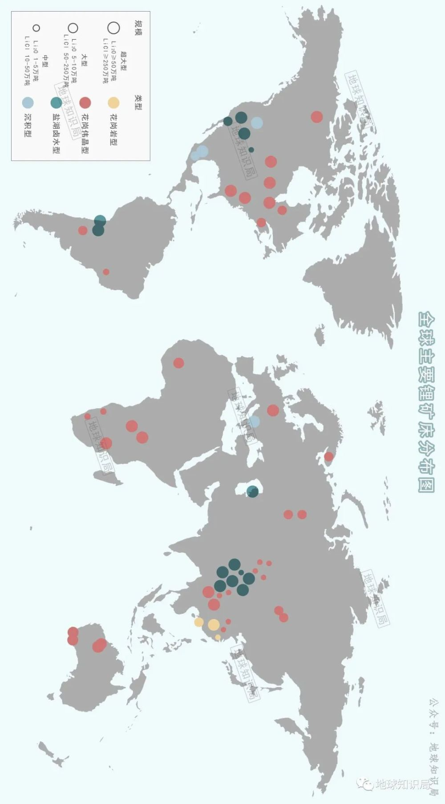

_全球主要锂矿分布图_

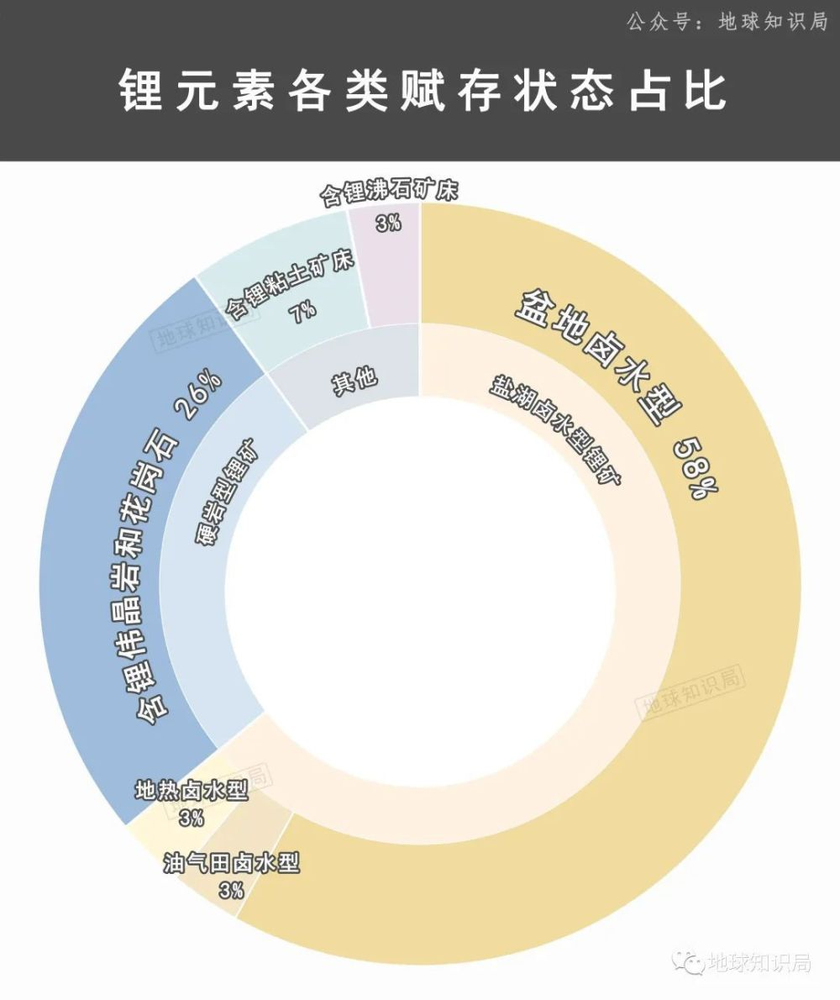

在干旱地区的内陆湖，或者内陆湖干涸后留下的盐壳（qiào）中，往往会富集大量的锂元素，这就是盐湖卤水型锂矿，盐湖中锂的浓度越高，开采价值越大。

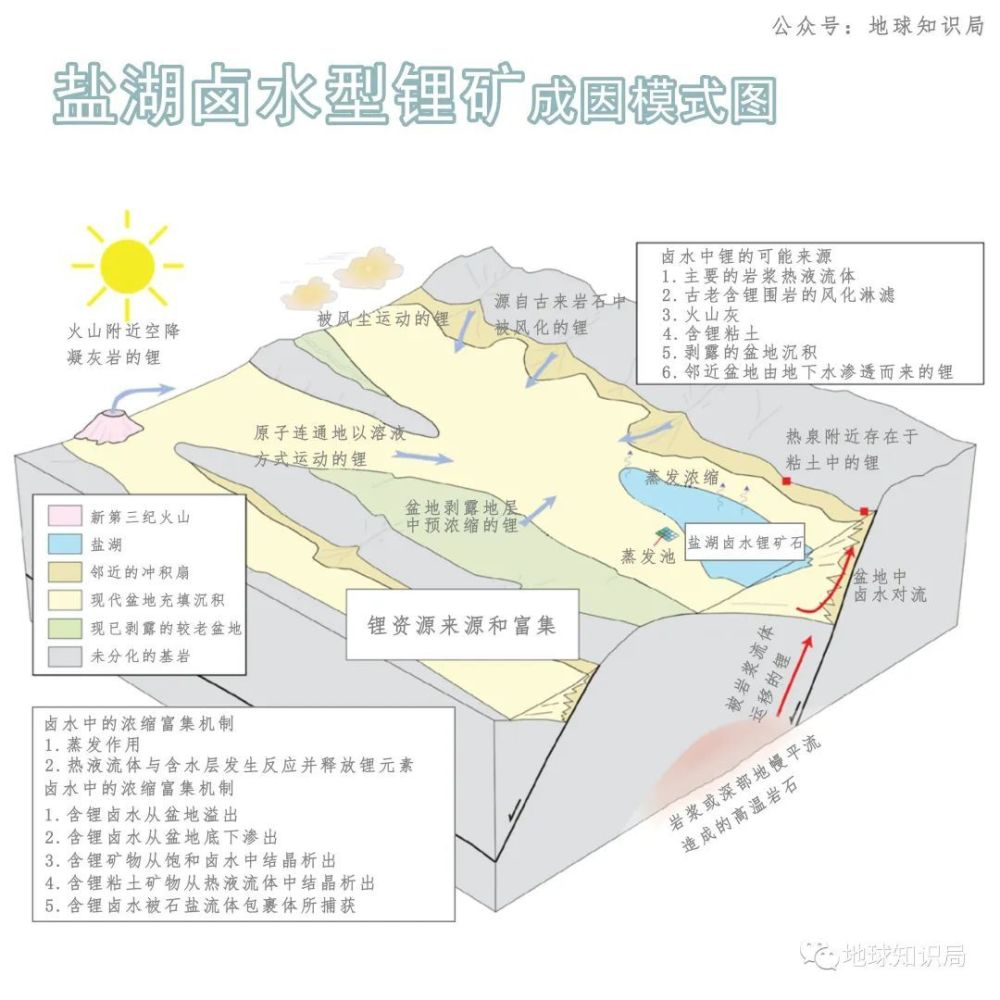

盐湖锂的主要来源是新生代的火山和地热活动。地热水会 **淋滤** 地层和矿物中的锂元素，并将其 **运移** ，再通过火山和地热作用 **带到** 地表，
**汇聚** 在盐湖中。地热还会加速水分蒸发，相当于加速锂元素的浓缩富集。

由于这种矿床的形成条件十分独特，在全球主要分布在三大盐湖集中区： **南美安第斯高原、美国西部高原和中国青藏高原**
。这三个地方全都是板块碰撞的产物，也都有活跃的地质活动，玻利维亚阿塔卡马盐湖、美国大盐湖、中国的扎布耶盐湖都是其中的代表。

_三大盐湖集中区都在群山环绕的高原上_

由于青藏高原隆升阻挡了印度洋的暖湿气流，使得高原内部变得干旱寒冷，在中部西部和北部形成了一大堆盐湖，其中 **富锂盐湖就有80多个**
，它们的氯化锂（LiCl）含量大于每升0.3克，锂离子浓度大于每升0.05克，都 **超过** 了锂矿的工业品位。

_青藏高原以前是一片汪洋大海，后因印度板块与欧亚板块碰撞才逐渐形成了“世界屋脊”（图：中国科学院西双版纳热带植物园）_

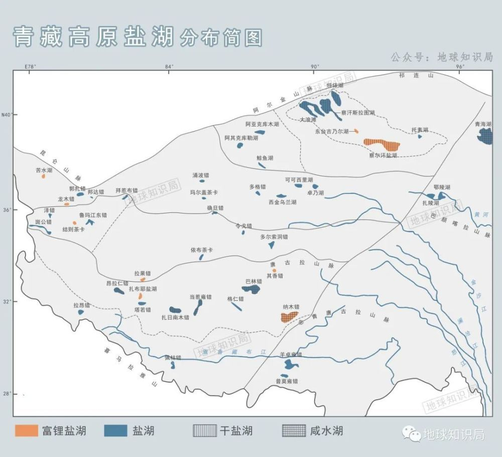

此外，由于青藏高原的北部比南部更干旱，所以 **盐湖发育也是北边更早** ，柴达木盆地的盐湖形成就早于西藏的盐湖，导致湖里面的东西也不太一样。

在盐湖水分不断蒸发的过程中，会依次析出各种化合物晶体，结晶顺序一般是 **从碳酸盐型，到硫酸盐型，再到氯化物型** 。

柴达木盆地的盐湖由于发育比较早，已经大量进入了“ **氯化物型盐湖** ”的阶段。虽然在卫星图上十分壮观，但这些 **“锂矿聚宝盆”其实很难开发** 。

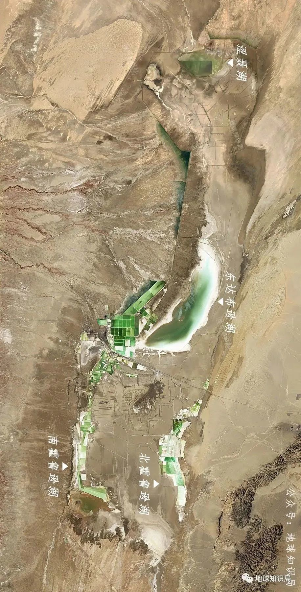

_靠北的察尔汗盐湖就是氯化物型钾镁盐矿床 （察尔汗盐湖）_

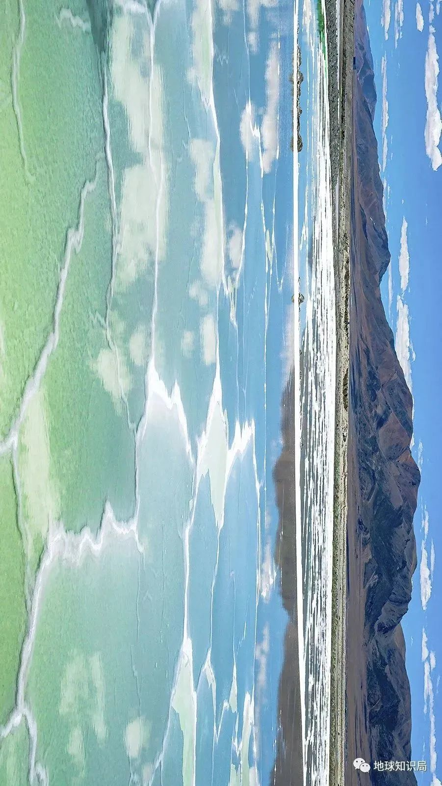

_靠南的扎布耶盐湖就是世界独有的，天然结晶碳酸锂的碳酸盐型盐湖
（扎布耶盐湖图：图虫创意）_

这就涉及到盐湖提锂的一个关键障碍——“镁锂分离”，镁和锂的离子半径十分接近、化学性质相似，而且经常在盐湖卤水中共生，我国大部分盐湖中都含有较多的镁离子，要提取锂元素，就要“镁锂分离”，
**分离都需要成本** ，镁离子的含量越高，分离难度就越大，成本也就越高。

_不同的盐湖适合的分离技术也不一样_

所以盐湖卤水中的镁锂比值的就成了盐湖锂矿 **价值高低** 的关键指标。

前面说的三种盐湖，“氯化物型”的镁锂比值最高，“硫酸盐型”次之，“碳酸盐型”最低。

这就很尴尬了，我们 **最不缺** 的“硫酸盐型”和“氯化物型”盐湖，其实开采价值很低。

比如柴达木地区盐湖的镁锂比值均值就高达80左右，南美三国的盐湖就要低得多，只有5-20左右， **成本完全不能比** 。

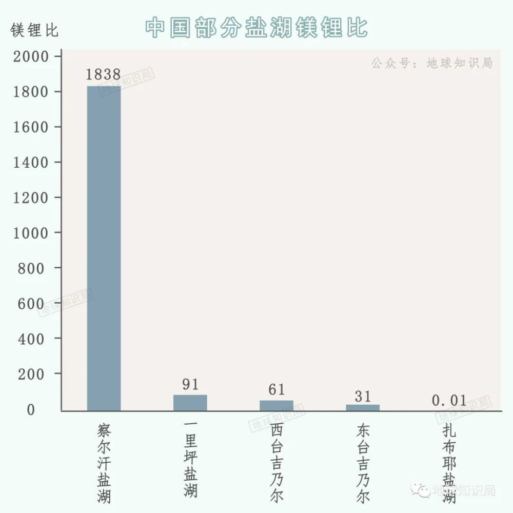

_察尔汗盐湖虽是中国已探明，资源储量最丰富的可溶性钾镁盐矿床，但其超高的锂镁比，导致提锂十分困难_

我们其实也有镁锂比值比较低的“碳酸盐型盐湖”，但基本都在西藏，在4000米左右的高海拔区， **能源匮乏、交通不便、生态脆弱** ，地形直接把成本拉上去了。

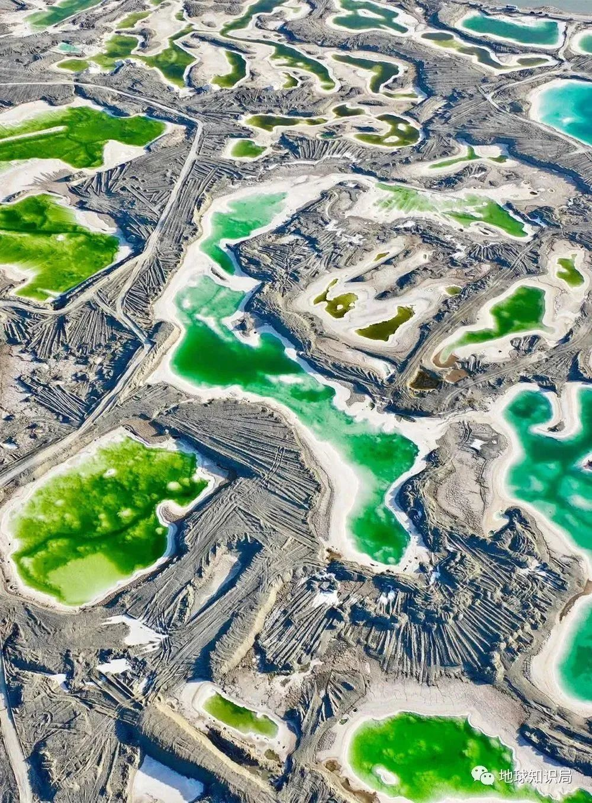

_高寒地区的生态环境一旦被破坏就很难再恢复，在这开发资源需十分谨慎（图：图虫创意）_

总之，我们的盐湖锂矿虽然 **资源量十分可观** ，但开发困难，成本远高于美洲国家。

硬岩型锂矿

巨大的潜力股

相比于盐湖锂矿， **硬岩锂矿的投资周期短、增产快**
，讲求的就是短平快，随着全球锂价暴涨，硬岩锂矿的市场地位迅速逆袭。2019年全球锂产量43万吨，硬岩型锂矿26万吨，占比60%，已经超过了传统的南美盐湖锂矿巨头，这些产能主要来自非洲南部、澳洲西部和南美洲中南部，比如著名的津巴布韦Bikita矿山，年产能高达惊人的8万吨。

_盐湖卤水型和硬岩型锂矿产量变化图_

虽然我国的硬岩锂矿 **成本同样高于国外** ，但在价格暴涨的行情下，仍然能赚到高利润。视频开头说的江西锂矿私挖乱采，就是硬岩锂矿。

我国最著名的硬岩锂矿，就是 **可可托海三号坑**
。新疆可可托海有86种重要和稀有矿产，锂只是其中之一。在上世纪50年代，可可托海矿务局偿还国外的矿产价值占到总外债的40%左右，可以说战略价值非常重要。

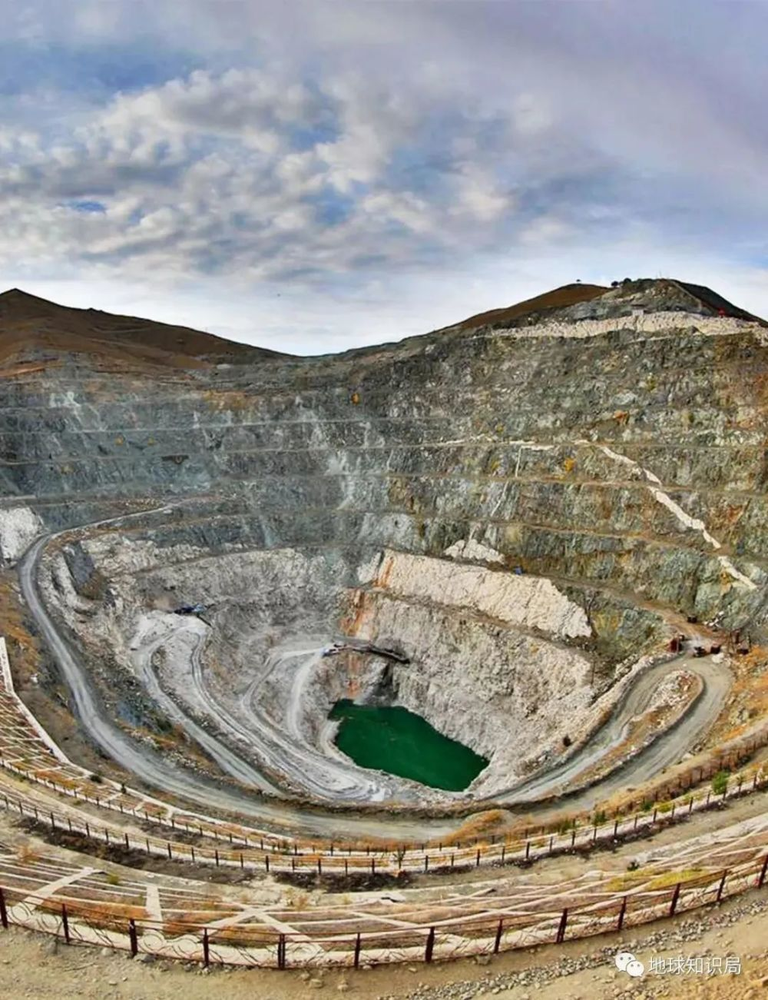

_可可托海三号坑除了锂还有铍、钽、铌等稀有金属，其中铍资源量居全国首位
（可可托海三号坑 图：壹图网）_

硬岩锂矿又分为“ **花岗岩型锂矿** ”和“ **花岗伟晶岩型锂矿** ”。

前者在我国江西、湖南、广西都有大量分布，但这类矿床的 **锂矿品位比较低，开发成本高**
。像江西宜春、宜丰的花岗岩型锂矿床主要用作陶瓷材料，而且资源消耗极快。现在由于锂价暴涨，反而成了民间盗挖的对象。

和前者相比，“花岗伟晶岩”中的 **锂品位更高，也容易开采** ，在我国主要位于新疆阿尔泰和川西松潘-
甘孜地区。其中新疆的可可托海三号坑、川西的甲基卡最为出名。

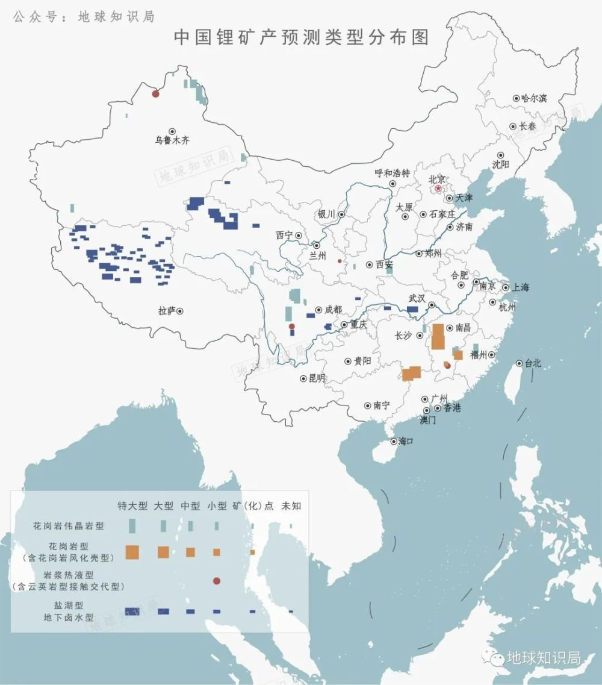

这种矿基本分布于各个时代的造山带。

比如横贯我国东西的昆仑-天山-祁连山-秦岭-大别山造山带和横断山脉造山带。但相比国外，我国勘探到的矿点还太少，而且 **储量有限** ，有些矿点海拔很高，
**交通也是个问题** 。

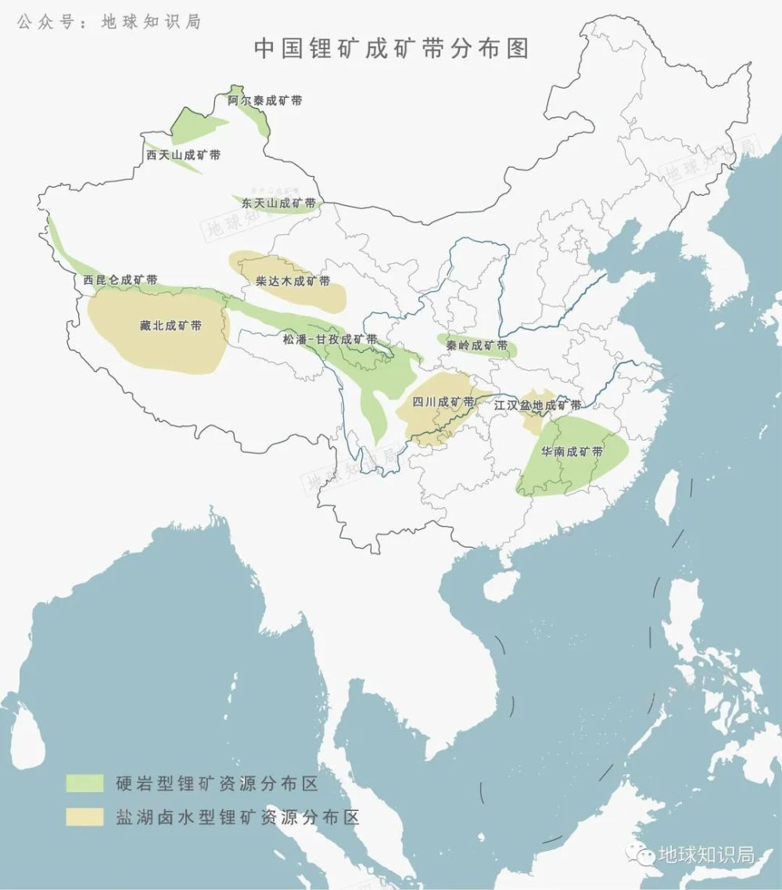

比如我国最大的伟晶岩型锂矿床——甲基卡矿床，位于四川康定、雅江和道孚三地的交界处，海拔4300~4500米（念四千三到四千五百米），已经属于青藏高原东部的高寒山区，距离国道川藏公路塔公站有25公里，
**运输十分困难** 。

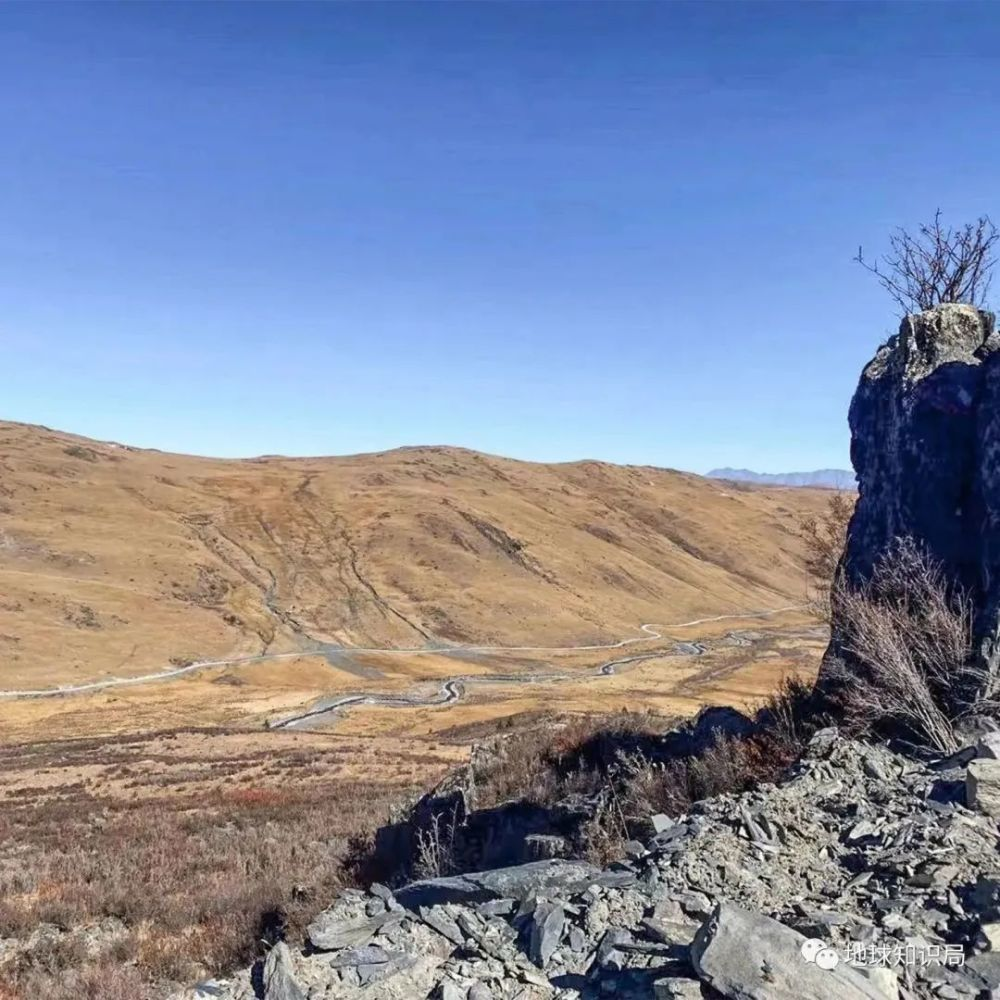

_不知得翻越多少个山头才能从深山中把矿运出去（通往甲基卡矿的公路 图：guba.eastmoney）_

目前看来，我国最有成矿潜力的硬岩锂矿还是——新疆阿尔泰-天山-昆仑山成矿区，新一轮的勘探也正在开展，新疆之外， **松潘-甘孜和秦岭地区**
也是未来的潜力股。

总体来说，我国无论是盐湖锂矿还是硬岩锂矿，都有很大的提升空间，但前提是 **化学提纯技术** 要提升、 **矿床勘察工作** 要开展。

而且我国最大规模的锂矿都储存在青藏高原上，既要 **降低** 高原开发的成本，还要 **平衡**
采矿和环境保护的关系，这些都还需要时间，而且即使成本降下来，也不能竭泽而渔。

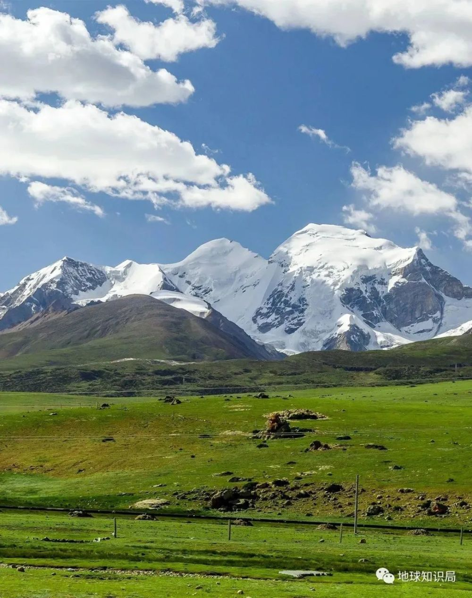

_绿水青山就是金山银山，不必操之过急，毕竟矿就在那里（图：图虫创意）_

这一问题，对于青藏高原的其他矿藏也适用，以后我们会专门出一期讲解青藏高原的采矿问题。

总之，从短期来看， **大规模进口锂资源** 是不可避免的，国内企业也确实在 **提前布局海外锂矿**
，比如前面说的津巴布韦Bikita矿山，中矿资源就收购了100%股份，赣锋锂业也收购了加拿大Millennial矿业公司和墨西哥Bacanora矿业公司。可以说现在国际市场对锂矿资源的争夺已进入白热化，好在这一次，我们的布局还不算太晚。即使以后卡脖子也不会太紧。

参考资料：

[1]高春亮,余俊清,闵秀云等.全球盐湖卤水锂矿床的分布特征及其控制因素[J].盐湖研究,2020,28(04):48-55.

[2]赵元艺.中国盐湖锂资源及其开发进程[J].矿床地质,2003(01):99-106.

[3]董涛,谭红兵,张文杰等.西藏地区盐湖锂的地球化学分布规律[J].河海大学学报(自然科学版),2015,43(03):230-235.

[4]王卓,黄冉笑,吴大天等.盐湖卤水型锂矿基本特征及其开发利用潜力评价[J/OL].中国地质:1-24[2023-03-14].

[5]隰弯弯,赵宇浩,倪培等.锂矿主要类型、特征、时空分布及找矿潜力分析[J/OL].沉积与特提斯地质:1-21[2023-03-14].

[6]陈衍景,薛莅治,王孝磊,赵中宝,韩金生,周可法.世界伟晶岩型锂矿床地质研究进展[J].地质学报,2021,95(10):2971-2995.

*本文内容为作者提供，不代表地球知识局立场

**END**

