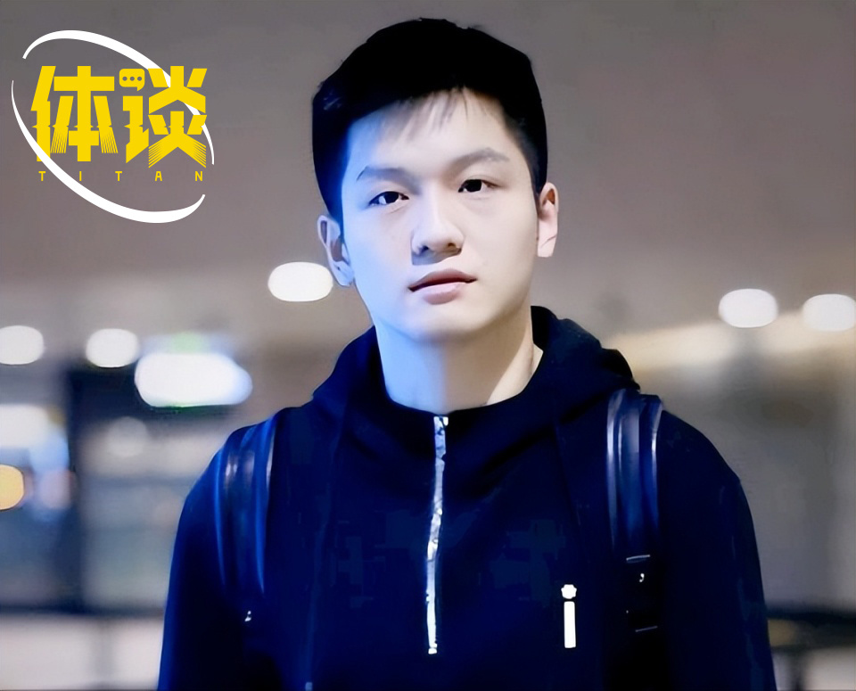
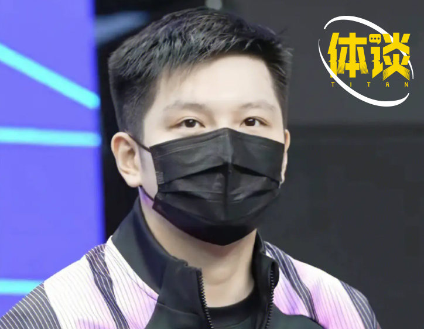

# 体谈 | 体育饭圈化，不仅是运动员的负担，更污染了体育纯粹的底色

一石激起千层浪。

2023年4月6日，网传国乒奥运冠军樊振东下榻的住所遭人非法入侵，原本许多人以为是谣言或者以讹传讹，没想到樊振东本人做出了回应：

属实。

通过调取监控，樊振东发现“某女士通过多日跟踪确定本人在酒店的房间号，又通过酒店前台拿到本人房卡”，而且还是“多次”进入他的房间，目前已经报警处理，同时希望球迷们“切勿沾染饭圈习气”。

然而问题在于，这种习气在体育圈的蔓延，绝不仅仅是樊振东所能遏制的；即便他真的能约束自己的粉丝，那么张继科的粉丝呢？马龙的粉丝呢？许昕的粉丝呢？

体育“饭圈化”追星一再刷新下限

普遍认为，乒乓与体育圈“饭圈化”是近几年才有的事情，这是有道理的。

据前国乒队医关俨等人回忆，1979年第三十五届世乒赛，中国男队遭遇惨败，引发了全国各地许多球迷的震怒，不过当时没有发达的互联网，所以只能写信进行批评，最为甚者，是给时任主教练寄来了一块剪成圆形的臭鞋垫，直言这是颁给他的“奖牌”，但也仅此而已。

随着人们交流方式的增加，球迷与运动员、教练员之间的互动方式也越来越多，但在一段很长的时间里，大家主要还是就乒乓球本身的话题展开讨论，比如谁的技术更先进，谁的心理素质更佳，谁的战绩更出众。

当然，茶余饭后聊花边新闻也是人之常情，但曾经的球迷确实更加执着于这项运动本身，不会轻易和某一位选手或教练员产生心理上的“依附”关系。

慢慢地情况逐渐发生了改变。

随着社交媒体的发展，越来越多的人将目光从赛事本身转向体育运动员的生活。一些体育迷会模仿运动员的穿搭，也会在社交媒体上进行投票、点赞等行为，还可能会组成粉丝团体为喜欢的偶像“应援”。

现如今，几乎每一位稍有名气的运动员或教练（前者居多）都会有自己的粉丝团体，而粉丝团体以外，还会有许多人愿意来蹭热度和流量，而其中不少人关注的点根本就与乒乓球没有关系，平时如何追娱乐明星，现在就如何追体坛明星。

尤其是2016年里约奥运会结束后，乒乓球突然火出圈，捧起了像张继科这样的体坛超级巨星，连刘国梁也被戏称为“不懂球的胖子”，随后各种后援团纷纷成立或扩张，但大家交流的话题却越来越多地停留在了那些与乒乓球运动不沾边的事情上，相互间更是经常会剑拔弩张、相互掐架。

而在线下，更是有不少人围堵国乒球员，强行拍照，到现在居然发展成为了明目张胆的犯法行为，再次刷新下限。

饭圈化的体育界，缺乏了竞技的纯粹，增强了戾气

这些年，中国运动员在赛场上捷报频传，也承载了远高于以往的关注。很多粉丝不甘于仅关注赛场表现，开始复制起了无脑追星那一套。跳水运动员全红婵夺冠后，一众人马涌入其家中“打卡”直播；游泳运动员汪顺曾在机场被“狂热粉”强行戴帽子……

“饭圈文化”具有很强的排他性，粉丝需要无条件支持偶像，容不得半点批评，只许自己“守护”，不准他人置喙，这很容易把赛事讨论变成非黑即白的“控评”和“站队”。运动员成绩好了，粉丝就拉踩队友对手，比赛输了，就辱骂教练裁判，甚至各种赛事新闻之下都要控评互撕。

必须看到，职业运动员的本职工作就是竞技本身，体育之所以能“破圈”，很大程度也在于其给大家传递出的拼搏精神和向上态度。

饭圈那些盲目偏执的情感绑架，不仅是运动员的负担，更污染了体育纯粹的底色。

对于运动员本人来说，日常训练和大小赛事都异常紧张，比如最近正是国乒出征WTT新乡冠军赛的周期。在赛场之外，他们更加需要一个能放松身心、专注备赛的私人空间。被如此无礼又病态地“围观”骚扰，遭受的困扰和压力可想而知。

所有粉丝都要清醒一点，用健康合理的方式表达喜爱。无论各行各业，“用成绩说话”是对偶像最大的尊重支持，更是追星应有的正向价值。

