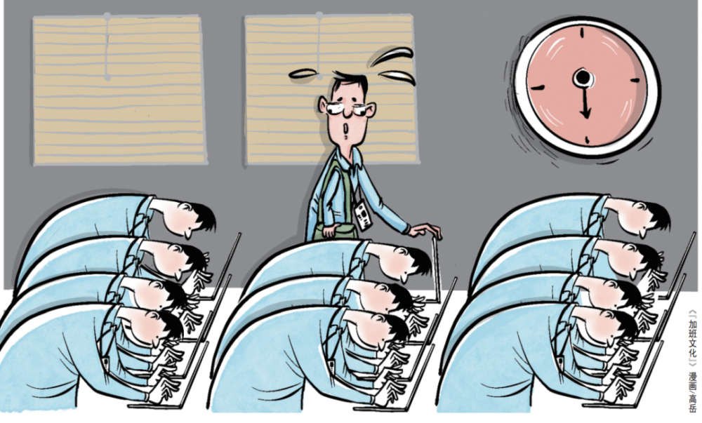

# 媒体谈病态“加班文化”：企业违法成本低 员工不愿加班又不敢不能拒绝

连日来，“清明节强制加班，员工怒怼领导”一事持续引发网络热议，相关话题多次冲上热搜榜。

讨论中，很多网友在直言看“怒怼”过程很解气之外，也不免发出各种无奈——“我们企业也一样，天天加班”“强迫加班，不加不行，没法拒绝”“大家都加班，自己很难不加班，按时下班跟做贼一样”“上哪儿去告？没有用的，告赢了工作也没了”，引发共鸣。

_《“加班文化”》（漫画：高岳）_

病态的“加班文化”是如何形成的？大家为何对“无效加班”深恶痛绝？劳动者不愿加班又不敢不能拒绝怎么办？如何解决劳动者维权不够积极、维权困难等问题？围绕社会大众关注的问题，《法治日报》记者进行了深入采访。

受访专家认为，病态的、畸形的“加班文化”侵害劳动者休息权和健康权，形成有其深刻的经济社会根源，与企业管理观念、工作流程设置、工作氛围等因素紧密相关。要通过进一步完善严格的劳动监察机制，强化执法力度，建立完善投诉举报和举报人保护机制，加大企业工会建设和相关法治教育，合力维护劳动者合法权益。

**企业管理不善违法成本低**

**隐形加班等加班文化盛行**

“清明节强制加班，员工怒怼领导”一事发生后，有劳动保障监察部门回应称，如果网络截图所传“早8晚11”工作的情况属实，那么该公司涉嫌违反劳动法。

网络评论中，很多网友称，此事件中怒怼领导的员工道出了很多打工人的心声。近年来，默认加班、隐形加班、“狼性文化”等“加班文化”层出不穷，有企业甚至明目张胆要求员工周六上班，屡屡触及劳动法律红线，员工怨声载道。

实际上，现行法律制度对劳动者休假的权利和工作时长予以了明确规定。根据劳动法第三十六条规定，国家实行劳动者每日工作时间不超过8小时、平均每周工作时间不超过44小时的工时制度。

北京海润天睿律师事务所律师孙鹏告诉记者，现实生活中，一些企业通过隐蔽的方式迫使劳动者加班，比如领导临时布置一些紧急任务，不明说要求劳动者加班，但会要求劳动者尽快反馈结果，或者要求劳动者以值班的名义在休息日加班，面对强势的用人单位，大多数劳动者敢怒不敢言，只能选择接受。

首都经济贸易大学劳动经济学院副院长范围说，在一些企业，加班常态化，原因主要包括三个方面：

一是企业人员配置不足。严重加班问题的本质是企业“事多人少”，而“事多人少”既可能是企业有意控制人员规模，节约成本也可能是临时性工作导致的短期内劳动力不足。

二是企业管理不善。一些企业无法实现员工的合理配置和有效激励，导致“忙的忙死、闲的闲死”的局面，尤其是部分企业领导能力、管理科学性不够，给员工增加了大量无效工作。

三是外部监察执法不严。关于劳动工作时间的法律规定非常明确，但一些地方仍存在有法不依、执法不严的情况，导致市场欠缺公平性，让一些企业管理者有了诸如“其他企业都在长时间加班，我们企业为什么不”的错误理念。

“按照现行法的规定，劳动争议裁判中，加班的举证责任原则上在劳动者，很多单位可能通过不考勤的加班、加班审批制度等规避，导致劳动者举证困难，无法主张加班费。”中国劳动关系学院法学院院长沈建峰说，相对于大量的企业及违法行为，劳动保障监察的力量比较薄弱，当违法成本很低甚至无成本时，违法行为就会更加普遍。

**不愿加班又不敢不能拒绝**

**软性的强制加班大量存在**

上述事件之所以引起很多网友“义愤填膺”，原因之一在于存在“强制加班”。之前，一些互联网企业出现超过法定延长工作时间的加班现象，但超长加班并不一定为强制加班，可能是经协商同意的，而强制加班员工是被动的，且往往是超长加班。

“劳动法规定加班需要协商一致，对于企业的加班要求，劳动者可以拒绝。因此，在规范层面不应存在‘强制加班’的说法。”范围告诉记者，但在实践层面，由于企业是相对强势方，且目前劳动就业压力较大，所以很多加班协商流于形式，结果对劳动者形成软性的强制加班，即不愿意加班但是又不敢或者不能拒绝。

我国劳动合同法明确规定，用人单位应当严格执行劳动定额标准，不得强迫或者变相强迫劳动者加班。

沈建峰直言，相比于超过法定延长工作时间的加班，强制加班更恶劣，且前者比较容易举证，强制加班涉嫌两方面违法：按照现行法律的规定，加班要通过工会和劳动者的同意；强制加班对加班费的支付、加班时长的计算更为模糊，相对来说也更难计算。

多位劳动者告诉记者，在工作中经常“被自愿”加班，比如企业领导要求“自愿报名”、管理者利用员工找工作不易的心理，以“被自愿”的方式形成从众效应，让很多人敢怒不敢言。一些企业还通过“加班文化”给员工“打鸡血”，灌输“加班光荣不加班可耻”观念，把加班作为指标列入绩效考核。身边出现过拒绝加班而被告知不用来上班了的情况。

对此，受访专家指出，“被自愿”已经成为目前加班的普遍状况。“这反映了劳动关系中的劳动者与用人单位之间的不平等状态。目前就业形势整体压力较大，用人单位享有较大的话语权，而外部的行政执法和内部的工会组织监督又相对较弱。”范围说。

孙鹏接触过不少“受委屈”的劳动者，他对此深有同感：“目前，很多行业的劳动力供大于求，用人单位处于强势地位，劳动者普遍依赖通过稳定的工作获取报酬。所以，对于用人单位的一些违法用工行为，在自身竞争力不是很强的情况下，劳动者宁愿忍受，也不愿与单位撕破脸。”

**“无效加班”成为一大槽点**

**员工用“摸鱼”来表达反对**

在“清明节强制加班，员工怒怼领导”一事中，“无效加班”成为网友们的一大槽点，类似“明明一天就能搞定的工作非要拖4天”让大家感到极为反感。

“很多人并不抗拒尊重劳动法合理补偿基础上的加班，但那种纯消耗、无意义还违法的加班，显然是大家无法接受的。”范围说。

受访的劳动者之一刘甜(化名)在北京一家互联网科技公司上班，朝九晚五于她而言已经成为遥不可及的梦。因为即便干完了手头工作，也总会“人为”拖延而不能按时下班。

“公司规定早上9点打卡到岗，下午6点半打卡下班，但部门形成了一种奇怪的氛围，领导不走，我们就不能走，似乎为了让领导看到我们艰苦奋斗的样子，坐都要坐到晚上9点。”刘甜苦笑道，无奈之下，大家刷手机消磨时间。

存在这种“加班文化”的企业并非个例。网络上有人将此现象总结成一个词语——“摸鱼式加班”。意思是企业、部门领导没有下班，员工也不能提前离开，坐班不做事、唯时长论。

多位受访劳动者向记者表达了对被迫无效加班的无奈：走形式、摆阵势、做样子、表演式的加班让人心累。

也有受访劳动者直言，公司的形式主义加班已经让其心生去意。

中国劳动关系学院副教授张丽云认为，在“领导不走，你也不能走”的不成文规矩涵化之下，企业底层员工战战兢兢，而部分领导也以公司加班盛行为荣，直接将加班与工作态度、对公司忠诚度挂钩，认为不能加班的员工不是好员工，反向压迫员工必须加班。

“形式主义加班的存在与企业管理制度和文化有关，即一些企业缺乏科学管理，对正常工作时间缺乏科学的安排和监督，导致在正常工作时间内无法完成应该完成的工作，或采取单纯形式主义的管理方式，让员工只能采取消极的方式‘摸鱼’来表达反对。”张丽云说。

“目前这种形式主义加班现象比较普遍，也是职场超长时间加班的另外一种呈现形式，而员工‘摸鱼’是对形式主义加班的无奈或者被迫的反馈。”范围说。

他提出，一些企业对于加班外在的法律压力、内在的经济压力等相对较弱，即这种不科学、不规范的加班安排没有让企业感受到违法处罚的压力、加班工资支付经济成本增加的压力，且企业内部对领导的审计、监督没有落实，不必考虑工作效率问题。

**建议建立举报人保护机制**

**严格执法保障劳动者权益**

实际上，近年来有关部门对侵害劳动者权益行为的整治力度一直在不断加大。

去年3月以来，北京、山东、安徽、河南、广西、青海、湖南、湖北、江西等多地人社部门宣布，集中开展为期两个月左右的超时加班排查整治工作，释放的就是纠偏畸形“加班文化”、保障劳动者合法权益的鲜明信号。

孙鹏说，2021年8月，最高人民法院、人力资源和社会保障部向社会公开发布《劳动人事争议典型案例（第二批）》，其中一则案例明确，严重违反法律关于延长工作时间上限的，相关公司规章制度应认定为无效，“可以说，各部门正在通过各种方式避免劳资关系出现所谓的‘加班文化’，决不提倡公司的发展建立在牺牲员工身体健康的基础上”。

有网友称，许多职场规则的制定者、职场文化的谱写者理应对镜自照，对于超长或无效加班之类的职场陋习加以纠正。受访专家认为，根治病态的“加班文化”，遏制职场中的形式主义风气，需多方协同发力。

范围建议，在理念层面，尊重和关注劳动者的尊严和价值，人既承担生产职责也承担着社会职责，需要在工作与生活之间取得平衡。社会需要形成共识，即严重的超长时间加班对劳动者、企业、市场以及社会都存在弊端。应通过劳动监察和工会建设，强化对劳动关系在劳动时间方面的管制，确保合理合法的工作时间得以贯彻落实。

“一方面，需要有严格的劳动监察机制，以严格的行政执法来保障劳动基准的落实，对于超过法定标准加班的，应该给予单位相应的行政处罚；另一方面，要强化工会的力量，工会是平衡劳动者与用人单位力量的重要主体，能够通过团体的力量，促进劳动者与用人单位之间的平衡。”范围分析说。

“目前因为超时加班被处罚的企业，与实际的违法企业数量相比，比例应该非常低。这也反映出劳动监察机制存在一些问题，如监察力量和手段无法满足实际需要等，亟待优化。”范围说，相关问题的发现主要来自三个方面，即劳动者举报、工会等组织的监督举报、劳动监察部门主动执法发现，因此，应通过提高工会的建会率等，发挥内部监督作用，完善劳动监察机制，强化对用人单位遵守工时的监督。

张丽云告诉记者，工会组织可以对企业存在的不合理劳动进行制约，积极同公司领导沟通、商榷。但一般情况下，只有员工找到工会组织时，工会才会启动协商机制跟领导层沟通，这种沟通并非敌对的，而是以内部民主协商的形式进行。企业一般会重视工会的意见并及时解决问题。建议员工在遇到强制性、不合理的劳动安排时，积极向工会组织寻求帮助。

采访中，不少劳动者提出，加班并非自愿，但不敢去维权，选择“能忍则忍”，除了觉得程序复杂、费时费力外，还担心赔了夫人又折兵——撕破脸皮丢了工作还拿不到赔偿。

**如何破解这样的局面？**

范围建议，建立举报人保护机制，严厉惩处超时加班以及对超时加班举报者的打击报复；完善投诉举报机制，优化投诉举报的方式方法；发挥工会的作用，由工会代替劳动者来督促用人单位。

“劳动者维权不够积极、维权困难是一个很现实的问题。我国的劳动争议调解仲裁法也考虑到了这个问题，比如对加班费争议的时效，只要劳动者不离职就不会起算，以此来缓解劳动者在职期间主张加班费核算的问题。”沈建峰说。

对于加班时长严重超时、劳动者举证困难的问题，沈建峰认为，在数字时代，微信截图、电话录音、信件往来、短信聊天等形式都可以证明用工企业存在强制加班的行为。劳动者也可以直接给劳动监察部门打电话举报，劳动监察部门一旦介入调查，会比较容易确认企业是否存在强制加班的情况。

对于员工如何确定企业加班涉及违法的问题，沈建峰说，正常工作时间是每天8小时，按照现行法规定经员工同意可以加班1小时，特殊情况可以再延长但最长不超过3小时。每个月不能超过36小时，这既包括每天延长的工作时间，也包括周末的加班，“这是一个比较清晰的计算问题，只要加班时间超出现行法律规定，就相对容易举证”。

作者｜法治日报全媒体记者 赵丽 实习生 胡淼

来源｜法治日报

编辑｜韩玉婷 季天 刘旭雨

