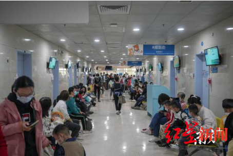
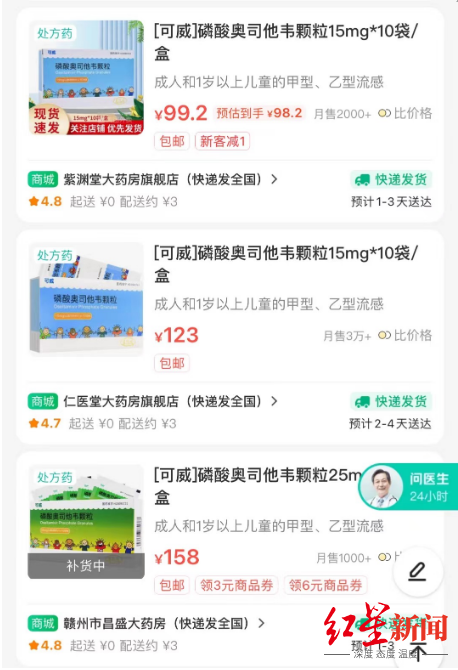
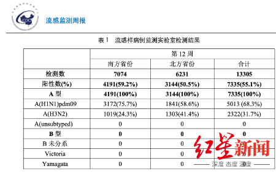

# 广东流感呈上升态势 流感药线下断货 专家：或与“回南天”有关

据中国疾控中心4月1日消息，近两周全国各地流感病毒阳性率上升趋势已趋缓。3月20日至26日期间，各地流感样病例就诊量占比已从高峰时的9.1%，逐步下降至8.5%。与此同时，广东的数据呈上升态势。相关数据显示，广东在今年2月26日报告的流感样病例暴发疫情仅2起，但到3月26日，一月内广东新增流感样病例暴发疫情就达到了152起。

红星新闻记者多方采访了解到，广东本轮甲流感染者以儿童居多，部分广州当地的家长称孩子到医院就医需排号100多个；此外，作为治疗流感“特效药”的奥司他韦也在多个药店处于断货状态，线上同规格药品售价比线下高出了2倍有余。

广州市疾病预防控制中心6日发布的最新监测数据显示，该市甲流进入新流行高峰期。

**多所医院儿科就诊人数攀升**

“目前广州的确处在流感春季感染的高峰期。”红星新闻记者以市民身份咨询广州市卫健委相关人员时得到如是回答。

国家流感中心发布的《流感监测周报》也显示，截至今年2月26日，广东省仅报告2起流感样病例疫情(10例以上1起)。随后感染数开始攀升，一个月内新增152起，仅3月20日-26日一周就有89起。感染攀升的同时，一些医院急诊门诊人数也随之高企，尤其是儿科门诊。

_不少家长带着孩子在等候就医。图据南方日报_

“孩子周六开始发烧，晚上7点多带去医院，结果前面排了100多个号。”家住广州番禺区的沈女士告诉红星新闻记者，大约是在上周六，家里10岁的孩子出现了发烧和咳嗽的症状，最高时烧到了39.5℃。担心孩子被传染了甲流，沈女士的丈夫带着孩子来到了番禺何贤医院，但到了医院才发现，儿科门诊人满为患，沈女士丈夫拿到的挂号单显示，他们已经被排在了100号以后。沈女士表示，在等了近5小时后，直到夜里12点多孩子才顺利看上病，目前病情已明显好转。另据沈女士透露，孩子所在的班级，到目前已有8人因发烧咳嗽等症状申请了请假，但学校方面并没有通知停课。

家住广州越秀区的冯女士也告诉红星新闻记者，家里8岁的孩子上周也同样出现了高烧的情况，她于3月29日下午，带着孩子来到越秀区儿童医院门诊就诊，医院挂号信息显示，她的前方还有142人等待就诊。

广州当地医院的数据也同样显示出近期儿科就诊人数的攀升。红星新闻记者咨询越秀区儿童医院、广医三院黄埔院区等医院了解到，近一周时间出现流感症状前来就诊的人数急剧上升，尤其儿童急诊尤甚。越秀区儿童医院一名急诊科接线员回应记者称：“现在整个医院都很忙，儿童就诊量成倍增加，已调度其他科室支援急诊了。”

另据南方网报道，广州市妇女儿童医疗中心儿内科和发热门诊主任李淑华在接受采访时指出，近一个多月医院儿内科普通发热门诊就诊量处于增长态势。从2月25日开始，就诊量为1500-2000人；到4月初，这一数字飙升到4475人，几乎翻了一番。其中，流感阳性率升至35%-40%。

**多地称未发布统一停课要求**

流感病毒阳性屡攀升同时，不少家长也表示孩子所在学校近期也陷入了分批停课的状态。广州市民陈先生告诉红星新闻记者，他的孩子正在读二年级，因学校甲流感染人数增加，年级7个班里已有3个班陆续停课，而他的孩子所在班级上周刚进行了为期4天的停课。此外，也有不少受访家长告诉记者，自己孩子所在班级前后已出现超过10人因发烧等症状请假，但并非每个学校在出现多人请假后就选择停课。

下一步广东各地是否会要求统一停课？记者致电包括珠海疾控中心、广州卫健委、佛山12345询问此事，多方均回应称：目前均未发布统一的停课要求。广州卫健委和珠海疾控方面同时解释称，“学校停课与否要按照国家制定的标准执行，在上报病例情况后，由直管单位来决定是否进行统一停课。”

红星新闻记者查询国家卫健委发布的《流感样病例暴发疫情处置指南(2018版)》了解到，执行停课需达到以下标准：（1）该班级当天新发现流感样病例达5例及以上（2）该班级现症流感样病例达30%及以上（3）一周内发生2例及以上实验室确诊流感住院或死亡病例（不包括门诊留观病例）；经评估疫情存在进一步扩散可能，该班可实施停课，并立即报告当地疾病预防控制机构。停课期限一般为4天。

广州卫健委相关人员同时指出：“已对各个学校下发了应对流感的通知，包括开窗通风、消毒等措施，学生到堂上课建议佩戴好口罩，家长不必过分恐慌，”

**流感药线下断货 线上价格翻2倍**

作为在临床上可预防与治疗流感“特效药”的奥司他韦，记者多方采访了解到，目前广东多家药店表示该药品已经全线售罄，即便每周补货也仍供不应求。

位于广州天河区的一家药店工作人员告诉记者，奥司他韦、连花清瘟等药品已经售罄，虽然每周二和周五会进行补货，但现在补货也无法保障。另一家药店也表示，因为不确定奥司他韦多久能补上货，所以目前不能进行预定。该药店也表示，奥司他韦自去年12月后就开始断货，布洛芬现在也已所剩不多。

广州番禺区一家药店也表示，奥司他韦已断货月余，昨天刚到货立刻售空。此外，南沙区有药店也回应称奥司他韦无货，其他针对流感的利巴韦林等药品也库存告急。至于后续药品是否会涨价，各家药店均表示目前还不清楚，会依据药品进价而定。

对于本地缺药的情况，广州市卫健委指出，对于市民反应的奥司他韦药物紧缺的情况，卫健委已在联系市场监管部门和行业协会等作出部署，以确保后续市民正常用药供应。

_线上平台奥司他韦售价在100-160元不等_

不同于线下药店的供应紧张，部分线上药店供全国发货的商家仍可提供奥司他韦，但涨价明显，价格多为为100元至160元。记者看到，其中一家网上药店显示，可威磷酸奥司他韦颗粒（15mg*10袋）1盒装规格的产品，售价为128元；而线下药店表示，该药品的线下售价应在60元左右。换言之，该药品线上售价比线下翻了2倍有余。对此，线上药店工作人员表示是因为目前进价高，所以有所涨价，另外也有店家解释是因市场变化，所以价格上涨。

**专家：或与广东“回南天”有关**

**但4月流行并不反常**

相比于北方地区，南方地区流感病毒阳性率处于高位。红星新闻记者梳理国家流感中心3月29日对外发布的今年第12周《流感监测周报》（下称《周报》）看到，在3月20日至26日一周内，南方省份哨点医院报告的流感样病例百分比为10.1%，高于前一周水平（9.9%）；同一时北方省份哨点医院报告的流感样病例百分比为5.8%，低于前一周水平（7.7%）。从病例数据来看，当周南方省份检测到4191份流感病毒阳性标本；北方省份检测到的流感病毒阳性标本为3144份，较南方少了1047份。

_图据国家流感中心_

今年3月10日，广东疾控就发布消息称，从2月下旬开始，广东省甲型流感活动水平就有所上升。广州疾控也随即发布官方消息称，近期各项监测数据显示，以甲流为主的流感活动水平持续上升，广州已进入流感春季高发期。

关于本轮广东甲流疫情相对于全国的“滞后”，病毒学家、香港大学李嘉诚医学院生物医学学院教授金冬雁分析指出，这主要与南北方的天气差异有关。金冬雁告诉红星新闻记者，近期正是广东“回南天”的时期，当地早晚温差较大、空气湿度大，这种环境会让流感病毒更加活跃。而就传播源来看，金冬雁认为，也可能是由于前期北方的流感发生，逐步将北方的流感带入南方，而广州因为当前处在“回南天”的阶段，潮湿环境加之近期的降温，让流感形成了集中传播：“但具体病毒的来源，这需要国家流感中心或者疾控中心来确定。”

“病毒其实是常年存在于人体，只是因为季节不同，病毒活跃程度不同，所以才形成了季节性流感。”金冬雁表示，甲流的传播并不局限于某个月份，但一般而言冬春季、夏季都有可能出现一波感染潮。在金冬雁看来：“1-4月、7-8月都容易出现甲流集中传播，所以不能认为广东4月现流感潮是一种反常现象。”

金冬雁同时表示，流感大多为自限性疾病，即通过自身正常免疫就能康复：“所以对于青壮年来说，即便没有奥司他韦也不用紧张，症状不严重甚至没有必要到医院就诊，正常休息基本很快就能自愈。”

红星新闻记者 杨雨奇 实习生 李佩欣

编辑 邱添

