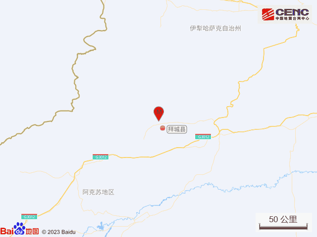
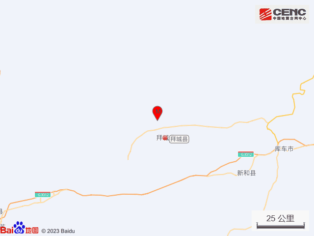
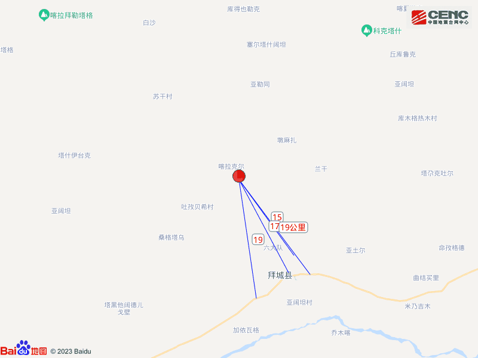
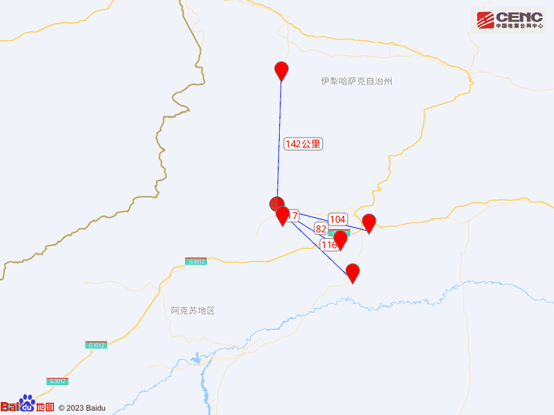
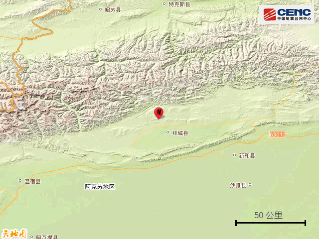
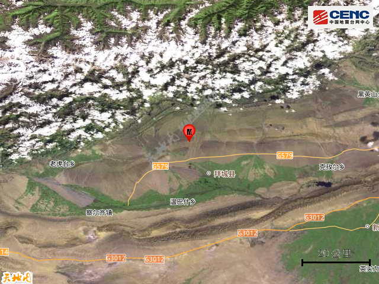
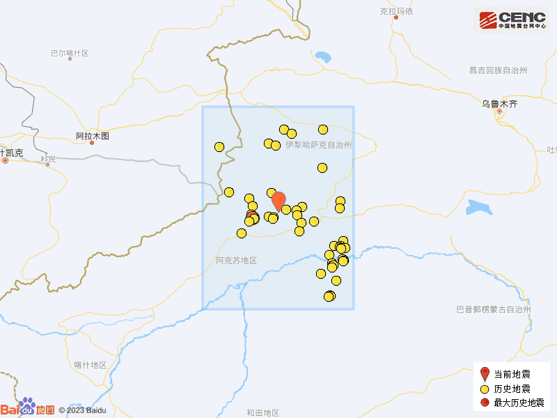

# 新疆阿克苏地区拜城县发生4.6级地震 震源深度15公里

据中国地震台网正式测定，4月7日20时17分在新疆阿克苏地区拜城县发生4.6级地震，震源深度15公里，震中位于北纬41.94度，东经81.78度。

本次地震周边5公里内的村庄有伯日克尔，20公里内的乡镇有布隆乡、拜城镇、康其乡、米吉克乡。

震中距拜城县17公里、距新和县82公里、距库车市104公里、距沙雅县116公里、距特克斯县142公里，距阿克苏地区153公里，距乌鲁木齐市520公里。

震中5公里范围内平均海拔约1730米。

根据中国地震台网速报目录，震中周边200公里内近5年来发生3级以上地震共215次，最大地震是2021年3月24日在新疆阿克苏地区拜城县发生的5.4级地震（距离本次震中62公里），按震级大小前50次历史地震分布如图。

