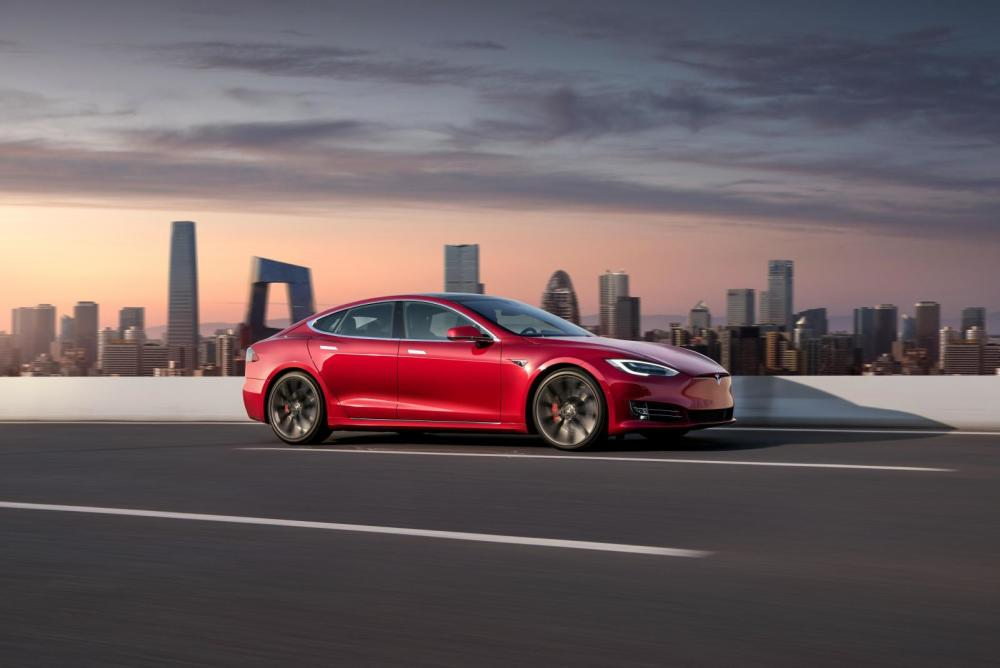
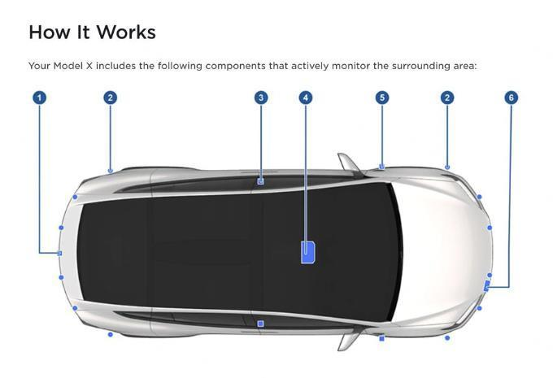

# 特斯拉员工爆料称，内部聊天系统中曾暴露车主隐私视频

**划重点**

  * _1_ 九名特斯拉离职员工爆料称，从2019年至2022年期间，特斯拉员工通过内部聊天系统私下分享了许多车主汽车摄像头记录的敏感视频和图像，其中有些具有很强的侵入性。
  * _2_ 去年，特斯拉的某些部门还可以分享车主记录的视频或图像。不过，有些离职员工称，他们观察到的唯一分享是出于合法的工作目的，比如寻求同事或主管的帮助。
  * _3_ 为了开发自动驾驶汽车技术，特斯拉利用其在全球上路的数百万辆汽车收集了大量数据。大约从2016年开始，特斯拉先后在非洲和美国雇佣了数百人，为图像贴上标签，以帮助其汽车学习如何识别行人、街道标志、施工车辆、车库门以及在路上或客户家中遇到的其他物体。特斯拉越来越多地将这一过程自动化，并于去年关闭了位于加州圣马特奥的数据标签中心。不过，该公司仍在纽约布法罗雇佣了数百名数据标签人员。
  * _4_ 特斯拉在其客户隐私通知中解释说，如果客户同意共享数据，你的车辆可能会收集数据，并将其提供给特斯拉进行分析。这种分析有助于特斯拉改进其产品、功能，并更快地诊断问题。

腾讯科技讯
4月7日消息，特斯拉曾向数以百万计的电动汽车车主保证，保护他们的隐私“至关重要”。它甚至在其网站上指出，该公司在车辆中安装的辅助驾驶摄像头“完全是为了保护车主的隐私而设计的”。然而，九名特斯拉离职员工爆料称，从2019年至2022年期间，特斯拉员工通过内部聊天系统私下分享了许多车主汽车摄像头记录的敏感视频和图像，其中有些具有很强的侵入性。

有些视频或图像甚至让特斯拉车主陷入尴尬境地。一名离职员工描述了一段视频，视频中一名男子赤身裸体地接近一辆汽车。

同样被分享的还有车祸和路怒事件。另一名离职员工称，2021年的一段撞车视频显示，一辆特斯拉汽车在居民区高速行驶，将一名骑自行车的儿童当场撞飞。这名员工说，这段视频通过一对一的私人聊天在加州圣马特奥的特斯拉办公室里传播开来，“就像野火一样”。

其他被分享的视频或图像则比较普通，比如狗狗的照片和有趣的路标，员工们会在上面加上有趣的文字说明或评论，把它们做成表情包，然后发布到私人群聊中。据几名离职员工透露，虽然有些帖子只在两名员工之间分享，但其他帖子可以被数十人看到。

特斯拉在其在线“客户隐私通知”中表示，其“摄像头记录保持匿名，与车主或其车辆无关”。但据七名特斯拉离职员工透露，他们在工作中使用的电脑程序可以显示视频录制或图像拍摄的位置，这可能会暴露特斯拉车主的居住地信息。

一名离职员工还表示，有些视频或图像似乎是在汽车停车和熄火时录的。几年前，如果车主同意，即使在汽车熄火的情况下，特斯拉也能收到车辆录制的视频。但自那以后，特斯拉已经不再这样做。

“我们可以看到人们的车库和他们的私人财产，”另一名离职员工说。“比如说，一位特斯拉车主的车库里有许多与众不同的东西，你知道，人们对晒这些东西很感兴趣。”

据两位看过视频的人说，大约三年前，有些特斯拉员工偶然发现并分享了一段视频，视频中有一个外观独特的潜水器停在车库里。这艘名为“Wet
Nellie”的白色莲花Esprit潜艇曾出现在1977年的詹姆斯·邦德电影《海底城》中。

潜艇目前的主人是特斯拉首席执行官埃隆·马斯克，他在2013年的一次拍卖会上以96.8万美元的价格买下了它。目前尚不清楚马斯克是否知道存在这段视频，也不清楚它是否被分享过。马斯克没有回应置评请求。

笔者没能获得任何被特斯拉员工共享的视频或图像，接受采访的离职员工也说他们没有保存这类资料。现在无法确定特斯拉员工分享视频的做法有多普遍，以及是否现在仍在继续。去年，特斯拉的某些部门还可以分享车主记录的视频或图像。不过，有些离职员工称，他们观察到的唯一分享是出于合法的工作目的，比如寻求同事或主管的帮助。

**标注行人和街道标志**

特斯拉员工分享敏感视频暴露了人工智能系统一个不太引人注意的特点，即它们通常需要大量人力来帮助训练机器学习驾驶等自动化任务。

大约从2016年开始，特斯拉先后在非洲和美国雇佣了数百人，为图像贴上标签，以帮助其汽车学习如何识别行人、街道标志、施工车辆、车库门以及在路上或客户家中遇到的其他物体。为了实现这个目标，数据标签人员被允许访问数千个由汽车摄像头记录的视频或图像，他们可以查看和识别其中的物体。

特斯拉越来越多地将这一过程自动化，并于去年关闭了位于加州圣马特奥的数据标签中心。不过，该公司仍在纽约布法罗雇佣了数百名数据标签人员。今年2月，特斯拉表示，在过去六个月里，该公司的员工人数增长了54%，达到675人。

两名离职员工说，他们对分享图片和视频并不感到困扰，因为客户已经同意，或者他们很久以前就放弃了对个人数据保密的合理期望。然而，另外三人表示，他们对此感到担忧。

“说实话，这是侵犯隐私。我总是开玩笑说，在看到特斯拉如何对待这些人之后，我永远不会买特斯拉，”一位离职员工说。

另一位离职员工说：“我对此感到困扰，因为那些买车的人不知道他们的隐私没有得到尊重……我们可以看到他们洗衣服和做些非常私密的事情。我们可以看到他们的孩子。”

一名离职员工认为分享图片和视频没有错，但他将允许数据标签人员查看谷歌地图上视频录制或图片拍摄位置的功能描述为“大规模侵犯隐私行为”。

美国东北大学网络安全和隐私研究所执行董事戴维·肖夫内斯称，特斯拉员工分享敏感视频和图像“在道德上应受到谴责”。

“任何正常人都会对此感到震惊，”他说。他指出，传播敏感和个人信息可能会被视为违反特斯拉自己的隐私政策，可能会引来美国联邦贸易委员会的干预，该委员会负责执行与消费者隐私有关的联邦法律。但美国联邦贸易委员会的一位发言人说，他们不对个别公司或它们的行为置评。

为了开发自动驾驶汽车技术，特斯拉利用其在全球上路的数百万辆汽车收集了大量数据。在特斯拉收集车辆数据之前，该公司要求车主允许他们使用汽车的触摸屏。特斯拉的网站上写道：“你的数据属于你。”

特斯拉在其客户隐私通知中解释说，如果客户同意共享数据，“你的车辆可能会收集数据，并将其提供给特斯拉进行分析。这种分析有助于特斯拉改进其产品、功能，并更快地诊断问题。”它还指出，这些数据可能包括“短视频或图像”，但与客户的账户或车辆识别号码无关，“也不会识别你的个人身份”。

德国数据隐私律师卡洛·皮尔茨称，根据欧洲的数据保护和隐私法，很难找到在内部传播车辆记录的合法理由，因为这些记录“与提供安全汽车或特斯拉自动驾驶系统的功能无关”。

近年来，特斯拉的汽车摄像头系统始终备受争议，监管机构已经审查了特斯拉的系统是否存在潜在的侵犯隐私的行为。但隐私案件的焦点往往不是特斯拉车主的权利，而是那些不知道自己可能被停放的特斯拉车辆记录的路人。

今年2月，荷兰数据保护局(DPA)表示，已经结束了对特斯拉“哨兵模式”(Sentry
Mode)可能侵犯隐私的调查，该功能旨在记录汽车停放时的任何可疑活动，并提醒车主。

“经过这些车辆的人在不知情的情况下被拍摄了下来。特斯拉的车主可以回头查看这些视频和图片，”DPA董事会成员卡特亚·穆尔在一份声明中说。“如果有人把其中一辆车停在别人的窗户前，他们就可以窥探里面，看到其他人在做什么。这是对隐私的严重侵犯。”

DPA已经确认，车主应该对自己汽车录制的视频或拍摄的图像负有法律责任，而不是特斯拉。该机构还表示，在特斯拉表示对“哨兵模式”进行了几项改进后，其中包括让车辆的前灯脉冲通知路人他们可能正在被记录，决定不对其进行罚款。

DPA发言人拒绝就调查结果发表评论，但在一封电子邮件中表示：“个人数据必须用于特定目的，敏感的个人数据必须受到保护。”

**取代人类司机**

_图注：这幅图来自特斯拉Model
X车主手册，解释了该车配置的Autopilot系统，包括记录车辆周围环境视频的摄像头。图中六个数字按顺序分别代表后牌照上方摄像头、前后保险杠超声波传感器、门柱摄像头（两个）、天窗摄像头（三个）、前挡泥板摄像头（两个）、前保险杠雷达。_

今年2月，特斯拉在美国召回了超过36.2万辆汽车，以更新他们的“全自动驾驶软件”，此前美国国家公路交通安全管理局表示，该软件可能允许车辆超速行驶，并可能在十字路口造成碰撞。与许多人工智能项目一样，为了开发Autopilot，特斯拉聘请了数据标签人员来识别图像和视频中的物体，教系统如何在车辆行驶或停车时做出反应。

据知情人士透露，特斯拉最初将数据标签工作外包给了当时名为Samasource的旧金山非营利组织。该组织在肯尼亚内罗毕设有办事处，专门为处于困境中的女性和青年提供培训和就业机会。2016年，Samasource为特斯拉提供了约400名工人，远远超过最初约定的20人。

然而，到2019年，特斯拉不再满足于Samasource数据标签人员的工作。在2021年的特斯拉人工智能日活动上，时任特斯拉人工智能高级总监安德烈·卡帕西说：“不幸的是，我们很快就发现，与第三方合作获取如此关键的数据集是不够的……老实说，质量也并不令人惊讶。”

特斯拉的一名离职员工这样评价Samasource的标签人员工作：“他们会把消防栓标成行人，总是会漏掉物体。他们画箱子的技能水平也很低。”Samasource现在被称为Sama，该公司拒绝就其为特斯拉提供的服务置评。

最终，特斯拉决定将数据标签工作引入内部。卡帕西在2021年8月的演讲中说：“随着时间的推移，我们已经发展成为一个拥有超过1000人的数据标签组织，其中包括许多专业标签人员，他们与工程师密切合作。”

特斯拉自己的数据标签人员最初在旧金山湾区工作，包括在圣马特奥的办公室。多位离职员工说，数据标签人员被分配了各种不同的任务，包括标记街道车道线或应急车辆。

曾经有一段时间，启动Autopilot后，特斯拉汽车很难从车库倒出来，而且在遇到阴影或花园软管等物体时会感到困惑。因此，很多数据标签人员被要求识别在车库内录制的视频中的物体，问题终于解决了。

在采访中，两名离职员工表示，在正常的工作职责中，他们有时会被要求查看客户在家中及其周围的图像，包括车库内的图像。

“我有时在想，这些人是否知道我们正在观看他们，”其中一人说。

“我有时会看到一些令人尴尬的内容，比如非常亲密的场景，但没有裸体，”另一个人说。“从我个人角度来说，我肯定不想让任何人看到自己的生活场景。”他举例称看到了“令人尴尬的东西”，比如“某些洗好的衣服，某些性健康用品……”

**圣马特奥办公室的表情包**

特斯拉在圣马特奥办公室的员工大多是20多岁到30岁出头的年轻人，他们带来了一种重视娱乐表情包和病毒式传播在线内容的文化。这些离职员工描述了聊天室里自由自在的氛围，员工们经常拿自己贴标签时看到的图片开玩笑。

据几名离职员工透露，有些人在特斯拉内部消息系统Mattermost上的私人群聊中分享截图，有时还使用Adobe
Photoshop进行标记。在那里，他们会得到其他员工和经理的回应。参与者还会添加自己的标记图像、笑话或表情符号，让对话继续下去。

一位此前从事标注工作的离职员工将分享图片描述为“打破单调”的一种方式，还有人称这种分享赢得了同事们的赞赏。

“如果你看到了一些很酷的东西，会引起人们的兴趣，你就会把它贴出来，然后在休息的时候，人们会走过来对你说：‘哦，我看到你发的东西了，这很有趣，’”这位离职员工说。“那些被提升到领导职位的人，也分享了很多这些有趣的事情。”

有些被分享的内容类似于互联网上的表情包，有狗，有趣的汽车，还有特斯拉摄像头记录下的人们绊倒和摔倒的片段。一名离职员工说，还有一些令人不安的内容，比如有人似乎被强行拖进了一辆车里。

几名离职员工表示，涉及特斯拉的撞车视频有时也会在Mattermost的私人聊天中分享。这些例子包括人们驾驶不当，或在骑自行车或摩托车时发生碰撞的例子，比如那个被撞飞的孩子。有些标签人员会倒带这些片段，并以慢动作播放。

有时，特斯拉的管理人员会清理在Mattermost公共频道上不当分享图片的行为，因为他们声称这种行为违反了公司政策。不过，几名离职员工说，基于这些照片的截图和表情包继续在平台上的私人聊天中传播。就在去年中期，员工们还会一对一或以小组方式分享这些信息。

据两名特斯拉离职员工称，在圣马特奥从事数据标签工作的福利之一是有机会赢得奖品，比如免费使用公司的汽车。但一些幸运儿在驾驶这些汽车时却心存隐忧，他们说：“知道这些车辆能够收集大量数据，肯定让人感到紧张不安。”
（金鹿）

