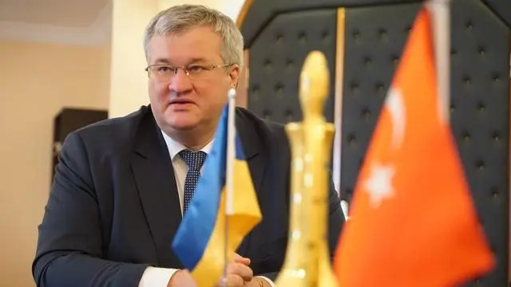
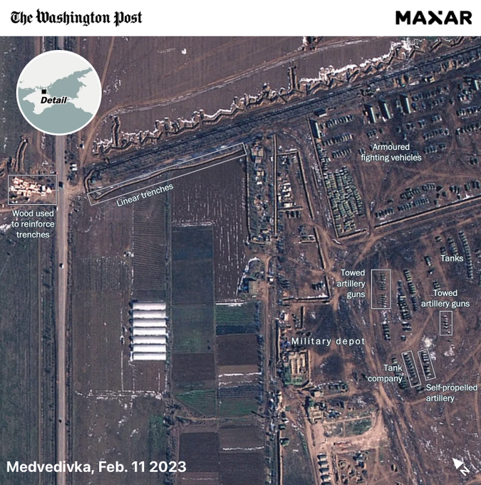
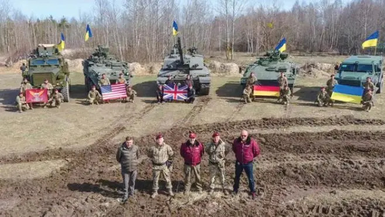
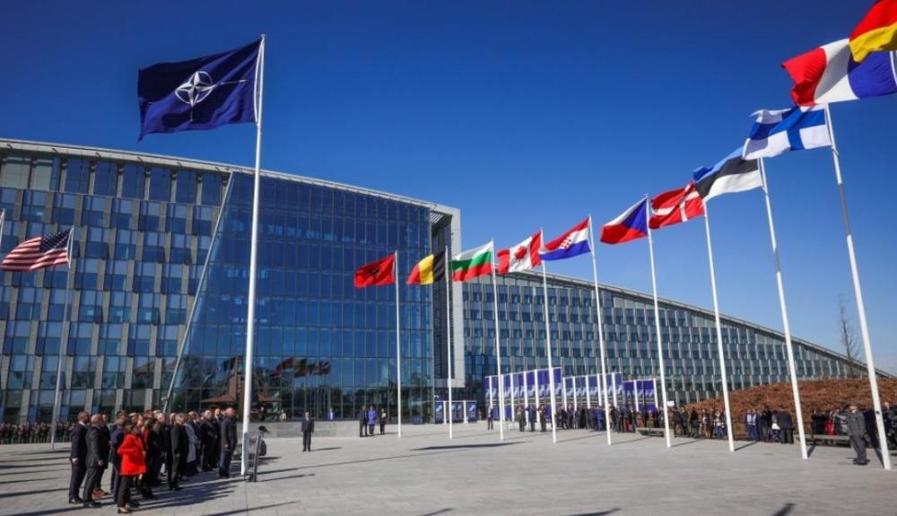
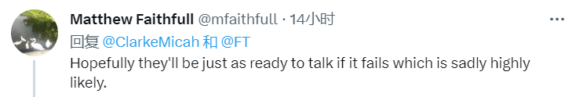
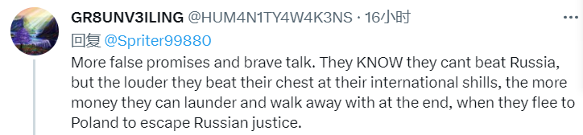
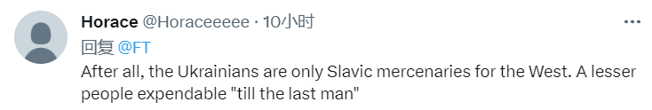

# 真的打不动了？乌克兰罕见松口愿意和俄罗斯“讨论”克里米亚

在今年俄乌冲突局势陷入僵局后，乌克兰方面近日罕见地透露出与俄罗斯谈判的意向，但同时提出了一个前提条件。

据英国《金融时报》5日报道，乌总统泽连斯基办公室的副主任安德里·西比加对该报记者表示，如果乌军到达克里米亚半岛的边界，基辅愿与莫斯科讨论克里米亚的未来。

_乌克兰总统办公室副主任安德里·西比加资料图_

**俄罗斯：想要克里米亚？等你打到边界再说**

_卫星图片显示，俄罗斯军队正在克里米亚半岛边界加强防御（图片来源：华盛顿邮报）_

西比加这番言论，是乌克兰自去年4月中断与俄方和谈以来，对谈判意向最明确的声明。

据悉，乌克兰军队最近加大了对克里米亚半岛俄方军事设施的攻击，此外，泽连斯基的顾问波多利亚克还指出，乌克兰军队将在“5个月至7个月”后抵达克里米亚大门口。

与此同时，俄罗斯一再强调，会以任何必要手段保卫克里米亚。莫斯科还警告西方，不要通过供应武器来鼓励基辅夺回克里米亚。

据华盛顿邮报提供的卫星图片显示，目前俄军已经开始在克里米亚北部边界地区挖掘战壕，并部署了坦克和火炮，严阵以待。

对于西比加“乌军到达克里米亚”的表态，俄罗斯导弹和炮兵科学院副院长康斯坦丁∙西夫科夫反驳称，相关言论毫无依据，基辅没有这样的力量和资源。

据俄罗斯卫星通讯社报道，西夫科夫说，“这是一项政治声明，旨在提高士气。他们（乌方）所说的没有任何前提。克里米亚在哪儿？乌克兰军队又在哪儿？距离太远了。”

**乌克兰：想让我反攻？等坦克到位了再说**

_乌军发布的接收西方援助坦克装甲车的照片（图片来源：乌克兰国防部）_

从乌方此次表述来看，他们并不是不想谈判，而是一心想要在取得决定性胜利后坐上谈判桌。这也是为什么乌方从年初就开始渲染自己的“春季大反攻”。但总是雷声大雨点小。

3月29日，乌防长列兹尼科夫再次表示，乌克兰将西方坦克用于战场的反攻行动可能在4月或5月开始。

但根据各方公开报道，目前仅有4个国家向乌克兰提供了不到50辆较新型主战坦克，相对于双方2000多公里长的战线来说无异于杯水车薪。

鉴于乌克兰东部地区春季的“翻浆”地理特点来看，在缺乏履带式装甲车辆及相关训练的情况下发动大规模反攻并不现实。

《纽约时报》4月3日也报道称，有迹象表明，乌克兰将在未来一个月前后发起攻击。报道同时也指出，在巴赫穆特持续数月的战斗中，俄军通过打消耗战，把乌克兰疲惫不堪的士兵逼到了极限。

为支持乌克兰，美国防部4月4日宣布，将向乌克兰再提供总计26亿美元的军事援助。

就在美国宣布军援的第二天，北约秘书长斯托尔滕贝格5日表示，北约已开始着手制订计划，为乌克兰长期提供武器，这一计划将为期十年。也有分析人士指出，北约主张为乌克兰长期提供武器，是在回避乌克兰加入北约的问题。

**美国：想加入北约？等你打败俄罗斯再说**

_北大西洋公约组织(北约)4日在其位于布鲁塞尔的总部举行芬兰加入北约仪式（图片来源：新华社）_

本周二，芬兰正式加入北约。乌克兰外交部长库莱巴当天在北约总部发表讲话时表示，乌克兰“旨在实现相同的目标，成为北约的正式成员”。

但事实上，美国并不想这么快接纳乌克兰。

据英国《金融时报》6日报道，虽然波兰和波罗的海国家等国正努力向乌克兰提供加入北约的
“路线图”，但美国，德国和匈牙利正在抵制这一做法。这也暴露了西方对基辅战后地位的分歧。

一位美国高级官员说：“我们必须'确保乌克兰作为一个主权、独立的国家占上风'。”

对此，泽连斯基也毫不含糊。他告诉北约领导人，只有在北约准备推进与乌克兰具体合作的前提下，他才会参加7月在维尔纽斯举行的北约峰会。

综合以上信息可以看出，在援乌的重武器真正到位并训练完毕前，在关于乌克兰未来走向和定位确定前，双方发生大规模交火的可能性并不大。

总结一下就是，俄罗斯想现在就谈，乌克兰想打个胜仗再谈，美国明显是不想双方谈。这可能也是马克龙和冯德莱恩日前访华的目的之一，期望通过别的外交途径尽快解决乌克兰危机。

**推特网友@mfaithfull：**

希望乌克兰在失败的情况下也做好（关于克里米亚问题）对话的准备，因为这很有可能发生。

**推特网友@LeftRightBooby：**

但是普京做好（对话的）准备了吗？也许他会说：“还不如去打冰球”。

**推特网友@GR8UNV3ILNG:**

越来越多虚假承诺和大胆发言。他们知道自己打不过俄罗斯，但他们越是在他们国际上的“托儿”面前拍胸脯，就越能捞到更多钱，最后他们（可能）逃到波兰去，逃避俄罗斯的制裁。

**推特网友@Horaceeeee：**

归根结底，乌克兰人只是西方的斯拉夫雇佣军，让他们牺牲“直到最后一个人”。

**推特网友@errinle：**

乌克兰现在就是一个香蕉共和国（注：指依赖外援的贫穷国家），被美俄对抗搞得分崩离析。

**推特网友@teejaybaba：**

（美国拒绝为乌克兰加入北约给出“路线图”）

美国像在说：不行哦，继续帮我们打代理人战争吧。

**推特网友@PoonBerry01：**

如果我们不想让乌克兰加入北约的话，到底为啥帮他们打仗呢？

**推特网友@FreenBraveStar：**

哈哈，结束了，北约得到了芬兰，没有人再需要乌克兰啦。

**微博网友@A46784421:** 这是回答了西方其实真正担心的克里米亚问题解决方案？

**微博网友@两点之间直线最近:** 500万都还没中就想着怎么花了？

**微博网友@安朵梅达:** 克里米亚，当年曼施坦因打了8个月才打下来。

**微博网友@zcwolfman：**
第一次世界大战的第一年，德国人觉得打三个月就够了；第二年，德国人觉得年底能赢；第三年，想打赢战争的德国人大多死了；第四年，想活下来的人推翻了政府。

**微博网友@索隆才不路痴:** 上一次信誓旦旦收复克里米亚说的是年底，2022年年底。

**微博网友@还是曼走庄园：**
又来画大饼了...夏季攻势、秋季攻势、冬季攻势，现在是春季攻势，这都把四季给凑齐了，一次没成功过...要不要借中国的24节气去用？一年能画24次饼。

**微博网友@大-地_雄_心：** 给台阶就下了吧，免得到时更尴尬。

**微博网友@断剑天涯：** 谈判的可能性很小。

**微博网友@白猫带点儿橘：** 虚虚实实，这是战前放烟幕弹。

**微博网友@马尔高的：** 克里米亚位置很重要，乌克兰绝无可能放弃。

**微博网友@寒宇之子：** 到达克里米亚附近，就可以炸桥断水，困死俄军，不需要牺牲太多士兵….

综合：新华网、参考消息、环球网、中新网等报道

