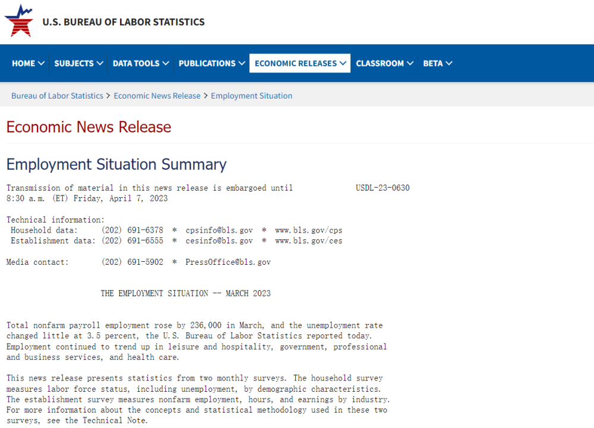
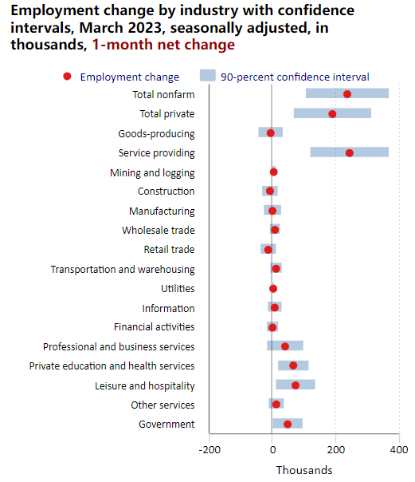

# 美国就业市场降温 3月非农创2020年末后最低值 薪酬增速亦弱于预期

**财联社4月7日讯（编辑 史正丞）**
当地时间周五早晨，美国劳工部发布3月非农就业报告，展现美国就业市场逐渐转冷的迹象。由于耶稣受难日的缘故，今日欧美股市大都休市，不过刚刚在21点15分收盘的美股期指在数据发布后稍稍拉升，给下周市场留下乐观的念想。美债（收益率）、美元指数则在短线冲高后稍稍回落。

_（来源：美国劳工部）_

根据数据，
**美国3月非农新增就业23.6万人（预期23.9万人），失业率稍稍下降至3.5%，颇受关注的平均小时工资年率为4.2%（预期4.3%），延续回落态势。**
此外，今年1月非农下修3.2万人至47.2万，2月非农上修1.5万至32.6万。3月非农也是自2020年12月之后的最低值。
**实际上，刚刚公布的3月数据也是2020年4月非农大跌2051万后，第二低的值，清晰展现了火热就业市场慢慢转冷的状态。**

_（非农就业人数，来源：tradingeconomics）_

今天的数据也令经济学家们如释重负，此前两个月他们也曾预期非农新增二十来万，结果遭到市场的一致嘲讽。

从行业分布数据来看，服务业依然是就业增速的大头，其中休闲与接待行业在3月新增7.2万就业。绝大多数的就业来自于食品服务和饮料行业（+5万）。目前休闲与接待行业的整体就业数较2020年2月的疫情前水平仍有36.8万的差距。

除此之外，政府雇佣（+4.7万）、专业与商业服务（+3.9万）、健康保健（+3.4万）等行业也呈现明显的就业增长；与之相对的是，零售贸易行业就业人数减少1.46万人，其他行业则整体波动有限。

_（来源：美国劳工部）_

值得一提的是，由于3与非农大致上只统计到3月早期的数据，因此硅谷银行暴雷等一系列风波对这份数据的影响并不大。然而，经济走向的重大不确定性可能会触发就业市场的加速转冷。

在非农数据公布后，CME“美联储观察工具”显示FOMC在5月继续加息的概率蹿升至七成。宾州相互人寿保险公司资产组合经理George
Cipolloni解读称，最新的非农报告继续展现就业市场稳固的状态。考虑到就业数据与预期值的偏差幅度有限，这并不足以让美联储改变既定的加息路线。

_（来源：CME）_

（财联社 史正丞）

