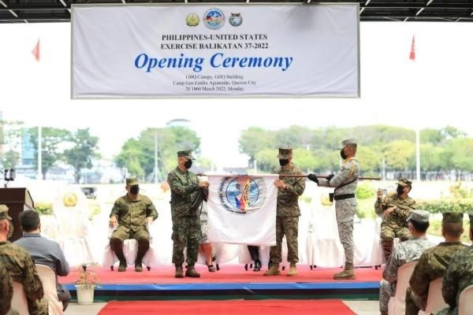
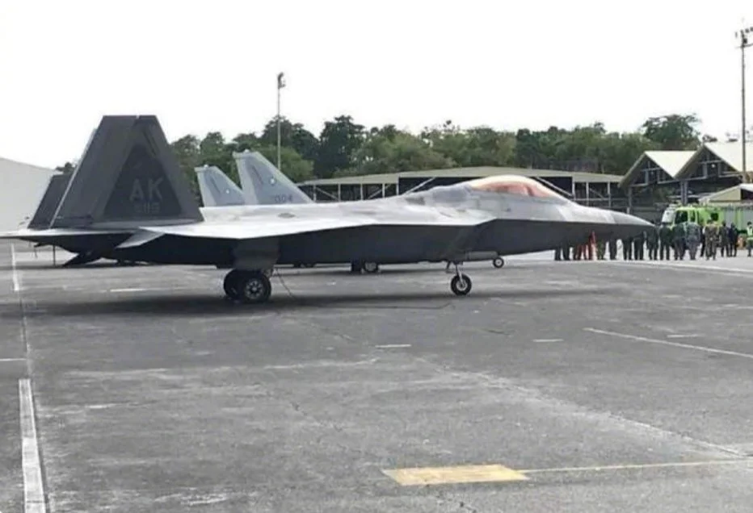

# 菲律宾新增4个美军基地针对中国？在菲9个美基地中6个面向台海南海

4月3日，菲律宾政府正式公布了今年2月同意向美军开放的4个新增军事基地的具体位置。这4个新增军事基地有3个位于菲律宾北部吕宋岛，即卡加延省的卡米洛·奥西亚斯海军基地和拉洛机场以及伊莎贝拉省加穆镇的梅尔乔·德拉·科鲁兹兵营，还有一处基地位于菲律宾西部面向南海的巴拉望省巴拉巴克岛。

正如菲律宾国防部长加尔维斯所言，这些基地的位置“非常具有战略性”。其中，卡加延省和伊莎贝拉省的基地位于吕宋岛北部和东北部，距离中国台湾很近，而位于巴拉巴克岛的基地则靠近南海。

_美菲举行“肩并肩”联合演习_

**美菲军事关系快速演进的动向**

实际上，上述举措仅是菲律宾总统费迪南德·小马科斯自2022年6月上任以来，美菲军事关系升温的具体表现之一。双方还采取了一系列动作推进军事合作，这使得美菲军事同盟关系明显巩固和强化，其对南海、台海形势的影响令外界高度关注，在菲国内也引发争议。

近期，美菲军事合作的加强主要体现在以下几个方面。

一是《强化防务合作协议》（EDCA）框架下的基地合作提速。美菲2014年达成《强化防务合作协议》，该协议允许美军进入和使用美菲双方同意的“军事地点”，并在这些地点建设必要设施，预置武器装备和物资，轮换部署人员，实际是变相实现重返菲律宾，美菲军事合作得到实质性提升。但杜特尔特任内美菲关系总体低迷，EDCA的推进受阻。小马科斯上台后，美菲明显加快了EDCA框架下的合作。一方面，美菲决定加紧对2016年已确定的5处军事基地进行设施扩建或新建。2022年11月，两国同意两年内斥资6650万美元，对巴萨空军基地、马格塞塞堡军营、伦比亚空军基地进行设施升级改造。2023年1月，美国国防部长奥斯汀访菲，美方又宣布拨款8200万美元用于现有5处可供美军使用的菲军事基地设施建设。目前，巴萨空军基地的机场跑道翻新工程已正式启动。美国还将在该基地建设一个飞行联队行动中心。另一方面，奥斯汀访菲期间，菲方同意在“战略地区”再向美军开放4个基地，如前所述，这些基地的具体位置已确定。如此，菲提供给美军的9个基地中，将有6个直接面向台海或南海。

二是进一步完善海上防务和安全合作内容和架构。基于南海问题的存在，以及菲律宾地缘战略位置对美国维护所谓“航行自由”的意义，海上合作是美菲同盟合作的重要内容。2022年4月，美菲举行首次海洋对话，旨在以一体化综合方式来应对海洋问题。同年5月23日，美菲军方签署海上安全框架协议，意图提升海上态势感知能力，并通过海上力量的互操作性以及跨机构合作，以政府间、整体性方式来应对海上安全威胁。值得关注的是，美防长奥斯汀今年初访菲期间，双方同意重启南海联合巡航。2023年2月，美国海军作战部长迈克尔·吉尔戴访问菲律宾时，重申美国“致力于”在南海与菲律宾进行海上联合巡航。菲律宾方面表示，菲正在与美国和其他地区合作伙伴起草关于在南海部分区域开展联合海上活动（包括联合巡航）的规则。

_今年3月，两架美国空军F-22A隐身战斗机抵达菲律宾，这是该机首次现身菲律宾_

三是通过联合演训、情报共享等举措提升互操作性。美菲推进军事合作还体现在双方以更大力度提升互操作性，加强联合行动能力。2023年，美菲双方将举行496场军事活动，数量创下新高。其中，为外界关注的“肩并肩”演习今年将有约1.7万人参演，规模为史上最大，且演习新增网络防御和海上实弹射击科目演练，针对海上态势的意味明显。另外，美菲计划2023年底前达成《一般军事信息安全协议》，强化情报共享。美国还将继续支持菲律宾军队现代化建设，2022年已承诺向菲提供1亿美元军事援助。

四是“美菲+”小多边合作模式渐趋成型。美菲日方面，2022年9月，美菲日举行首次三边防务政策对话。12月6日，日本航空自卫队派遣2架F-15战机赴菲律宾进行空军交流活动。这是二战后日本战机首次出现在菲律宾。2023年2月，小马科斯访问日本，日菲双方表示要加强国防和安全合作，并签署有关人道主义援助和灾害救援的防务合作文件。后续两国还可能以此为基础探讨签署《互惠准入协定》或《访问部队协议》，以及达成美、日、菲三边协议的问题。近日，有媒体透露，日美菲拟就安全问题建立一个部长级对话框架，并考虑最快在4月举行首次会议。美菲澳方面，菲澳早在2012年就签署了《访问部队地位协定》，2021年又签署《相互提供后勤支持协议》。2023年2月，澳大利亚国防部长访菲，双方表示将探讨在南海开展联合巡航。在三边基础上，美日澳菲四边合作也在推进。菲律宾表示，美菲南海联合巡航可能会邀请日、澳等地区伙伴参与。另外，自2014年以来，澳大利亚已成为美菲“肩并肩”演习的参演国，日本也作为观察员国参加。

总体看，此轮美菲军事关系的强化呈现美方主导、推进速度较快、全方位铺开并向纵深发展的趋势，其中基地合作、海上合作是重点。同时，美菲军事关系的加强与菲律宾同日、澳等国军事关系的提升呈现同步联动态势，进一步放大了美菲军事合作的效果及影响。

_菲律宾海军使用美国赠送的二手军舰与美国海军进行海上联合演习_

**美菲强化军事关系的多重动因**

当前，美菲加快推进军事合作是多方面因素作用的结果。

首先，在“遏制中国”这一“印太战略”主旨下，菲律宾在美国“印太战略”中的地位上升。美国看重菲律宾，与其所处的地缘位置密切相关。毗邻两个最大潜在冲突爆发点——南海和台海，让菲律宾作为美“印太战略”重要支点的角色日益凸显。

其次，美国在军事上对菲律宾的需求增大。除了南海问题外，菲律宾在美国应对所谓“台海危机”事态中的重要性日益突出。在美国印太五大盟国中，菲律宾是距离台湾最近的。近日，特朗普政府时期负责印太安全事务的助理国防部长薛瑞福表示，美国军方对台湾可能遭受攻击的担忧日益增加，希望在未来一两年内能确保对菲律宾的进入。

再次，小马科斯政府对美政策的调整，为美菲军事关系的推进创造了条件。尽管小马科斯总统上台后表示将继续奉行独立外交政策，但比杜特尔特政府明显更为重视美菲同盟。他曾表示，“无法想象没有美国作为伙伴的菲律宾”。在南海问题上，小马科斯较其前任展现更强硬的一面，且基于菲国内亲美势力的压力不断增大，其政策空间缩小，对美依赖或加大。

此外，美国拜登政府致力于推进印太盟伴体系的网络化，与菲律宾为应对中美战略竞争而日益重视强化与日本、澳大利亚等第三方合作的努力相互作用，推动了“美菲+”合作模式的成型。

**对我国周边海上安全形势的影响**

美菲强化军事合作的趋向，将给我国周边海上安全带来不利影响。

最突出的是，美国获得对菲更多基地的进入权，将增强美军对南海和所谓的台海危机事态的应对能力。在吕宋岛和巴拉望省两个地区增设美军基地，可使美军获得最优战略位置：一旦台海或南海发生冲突，美军可以从这些基地发起行动，将让美军反应能力、处置能力大幅提升。菲北部吕宋岛与台湾仅隔一个巴士海峡，美部分智库认为，可在菲北部部署导弹、火炮、火箭炮，反制对台湾的两栖进攻。美国还可利用菲律宾基地演练“远征前进基地”作战概念。2022年3月，美海军陆战队濒海作战团已经在美菲“肩并肩”演习中，重点演练了这一新作战概念。还需关注的是，美获准进入的新基地中包括海军基地，意味着美海军舰艇部队或海军陆战队可轮换部署至菲律宾，其在南海、台海方向的海上前沿预置兵力将大幅增加，而且美国可以以这些基地为依托开展海空封锁等行动。

其次，美军在菲律宾全面部署后，将与驻日韩美军连成片从而强化第一岛链。菲律宾位于美国打造的“三层岛链”中“第一岛链”的中间位置，且正对中国大陆腹地，处于印度洋与太平洋的关键通道，是美国岛链战略的重中之重。相比美在日韩有大型基地和大量驻军，菲律宾是美国急欲加强的环节。美军在菲九个基地的设立以及相关设施的建设，将是对第一岛链菲律宾部分的强化。

另外，美菲军事合作的对华指向可能对中菲关系造成负面影响。美国积极推进对菲军事合作针对性和目的性很强，意在强化对华威慑，同时给菲律宾撑腰打气。在中美博弈日趋激烈的情况下，菲律宾对美开放新基地，加之近期美国在中菲之间频频煽风点火，炒作中菲在南海矛盾争端，公开表达对菲支持，给中菲在南海的互信与合作带来挑战。

_菲律宾空军战机飞越美两栖攻击舰上空_

**美菲推进军事关系面临多个制约**

但也要看到，美菲加强军事关系仍存在一些制约因素。

一是菲国内因素。美国对菲律宾长达半个世纪的殖民统治，使菲精英阶层深受美西方的影响。但是，殖民统治没有普遍惠及菲律宾普通民众。历史和现实的原因，使得菲国内始终存在反美力量。就美军在菲律宾设立和增加军事基地，有近半数的菲律宾民众心存疑虑，还有约30%的民众坚决反对。菲部分学者和地方官员担心，美菲军事关系过快推进，会使菲陷入更危险的境地，沦为美国代理人。菲卡加延省省长就曾表示，反对中央政府扩大美国进入菲军事基地的举措，外国军队的存在可能损害菲律宾与中国的关系。

二是菲在中美之间维持平衡的考虑。在中美战略竞争加剧的情况下，菲律宾主观上想继续在大国之间搞平衡，规避风险左右逢源。小马科斯上台后，坚持独立外交政策，提出“与所有国家做朋友，不与任何国家为敌”。而且，小马科斯政府执政重点在于解决经济、民生问题，在这些方面，菲律宾需要中国的支持。中菲已同意深化农业、基建、能源和人文四大重点领域合作，并在国防、安全、科技、贸易等领域拓展更多合作途径。在这种情况下，菲律宾需要精准掌握美菲防务合作的限度，将美菲合作对中菲关系的冲击效应降至最低。目前来看，菲律宾仍试图在中美之间保持平衡。尽管小马科斯政府在南海问题上有强硬的一面，但也展现出对华合作姿态，如表示南海问题不是中菲关系全部，同意重启油气勘探开发磋商，建立外交部直接沟通机制等。

三是美菲军事合作中还面临一些具体问题的挑战，如美军人员的法律豁免权、基地建设资金投入是否具有可持续性、双方对合作协议具体条款可能存在分歧等等。

美菲加强军事合作的趋向，不利于地区安全稳定。正如我国外交部发言人所言，美方出于一己私利，抱持零和思维，不断在本地区加强军事部署，其结果必然是加剧局势紧张。地区国家应该深入想一想，到底什么才是合适的，什么才是互利的，从而做出真正有利于自身利益，有利于地区和平稳定的选择。

（作者系军事科学院研究员）

