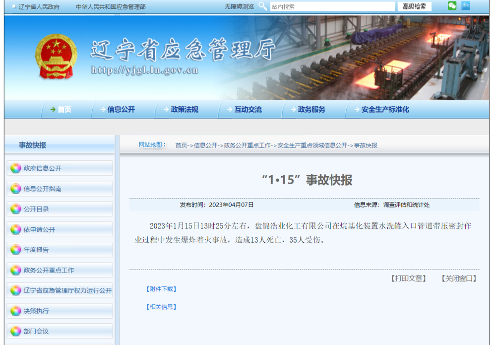

# 辽宁公布3起安全生产领域事故快报：共24人死亡，35人受伤

4月7日，辽宁省应急管理厅网站公布“12·1”“12·31”“1·15”三起安全生产领域事故快报。

2022年12月1日16时35分许，鞍山鞍钢股份有限公司炼铁总厂二烧作业区脱硫塔发生塔斗脱落坍塌事故，造成8人死亡。

2022年12月31日12时50分左右，鞍山鞍钢氧化铁粉有限公司运营的鞍钢股份有限公司冷轧三分厂再生机组区域发生煤气泄漏，造成3人死亡。

2023年1月15日13时25分左右，盘锦浩业化工有限公司在烷基化装置水洗罐入口管道带压密封作业过程中发生爆炸着火事故，造成13人死亡，35人受伤。

