# 阿里版ChatGPT突然上线邀测！大模型热战开始，这是第一手体验

**萧箫 鱼羊 发自 凹非寺**

阿里正式加入ChatGPT战局！

就在刚刚，阿里版类ChatGPT突然官宣正式对外开放企业邀测。

它叫 **通义千问** ，由达摩院开发。

嗯，是大模型版十万个为什么那个味儿了。

事实上，早在这个月初，就传出过不少阿里要推出类ChatGPT的消息，不过普遍预期在11号左右。

而前几天率先流出的天猫精灵“鸟鸟分鸟”脱口秀版GPT，就是基于大模型的“压缩版”，已经以其惊艳表现把网友的胃口吊了起来，让众人将目光投向阿里。

如今“正菜”提前上桌，自然一点即着，引爆舆论关注。

所以，这个阿里版ChatGPT“通义千问”，究竟实力几何？

恰好量子位拿到了第一批邀测资格，省流结论：中文大模型真正的竞争开始了。

咱们实测见真章。

调戏阿里版ChatGPT实录

**先来看看通义千问的主要功能。**

作为一个大语言模型，它的能力主要集中在 **文本生成** 上，即也能像ChatGPT一样“问啥答啥”：

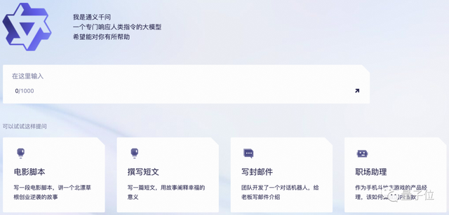

这里我们试一下官方给的撰写短文，看起来连语文老师常用的 **“总分总”** 也能理解：

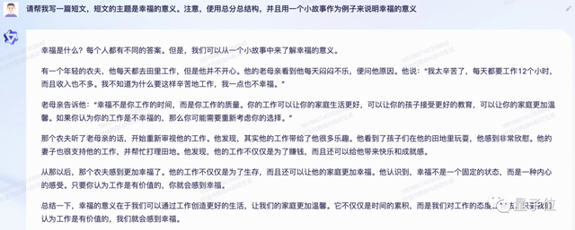

△又一个中文写作业神器（doge）

除了对话外，它还具备一个“百宝袋”功能，里面相当于一个工具箱，能快速生成各种指定类型的文案：

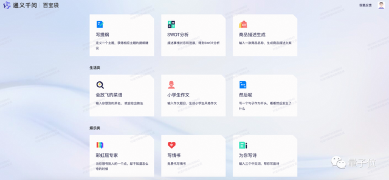

话不多说，先从语言能力、上下文理解能力、代码能力和数学能力四个方向，来测测模型的对话能力。

一、对话能力

**语言能力**

要说国内大模型，首先要看的还得是中文。

先来个最基础的：“能穿多少穿多少”是什么意思？

不错，解释得比较清楚，还顺便聊了一下自己对这句话的看法：

续写类的创意写作，不但能模仿语气，甚至还能创造悬疑，有点厉害哟~

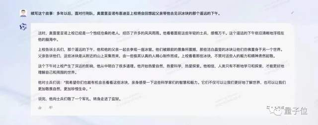

接下来就轮到新一代AI benchmark弱智吧问题了：怎么才能把梦里的钱取到银行卡里？

“在梦里取钱是一种幻觉或想象”，谢谢你清醒侠。

还有更扎心的……“如果您经常做梦梦到钱，建议您睡前回顾一下自己的财务状况，看看有什么不足之处”

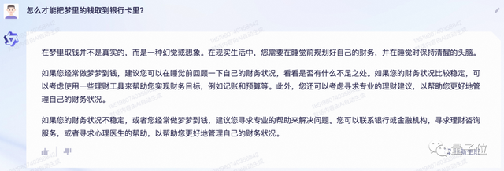

虽然阿里的朋友称，通义千问主要是中文不错，但我们叛逆一点，看看这个中文大语言模型的其他语言水平怎么样。

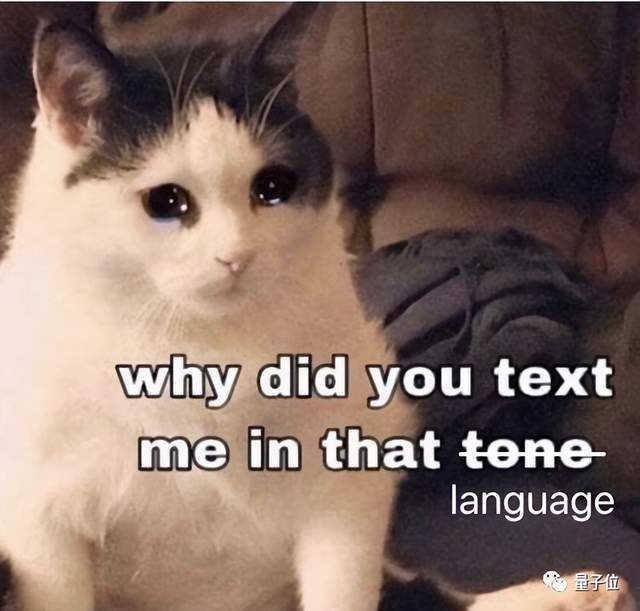

先不走寻常路，试试通义千问的 **日语** 能力，给花泽香菜写一封情书。

看中文机翻似乎还不错，这就把它寄给香菜，应该没问题吧？

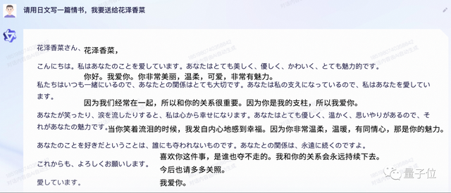

再来试试 **英语** 。刚好前段时间有网友PK了一下Bard和GPT-4的Rap，我们也来看看通义千问的说唱能力。

这top，这stop，还给押上了！就是不知道姆爷认不认可。

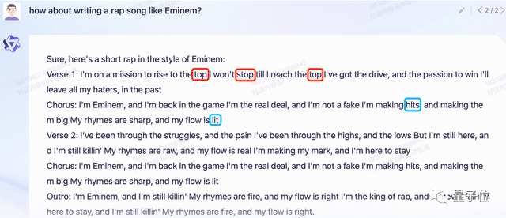

试试加点难度，中英夹杂的谐音梗？

这个时候，通义千问的回答就显得有点严肃了。

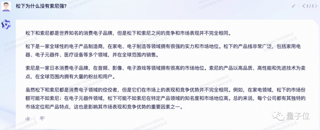

当我们给出答案的时候，虽然通义千问看出了这是个笑话，但它并不觉得好笑，还很严肃地指正我们：这并不意味着松下惧怕索尼。

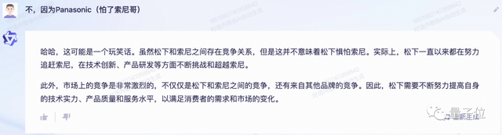

不过我们发现，ChatGPT同样一本正经……这年头的AI都这么正义么……

好，下一个试试它的上下文理解能力。

**上下文理解能力**

这部分说白了就是多轮对话能力，考查通义千问能不能准确提取上文的信息，用于下轮问题的回答。

来听题：山东一县一酒是真的吗？

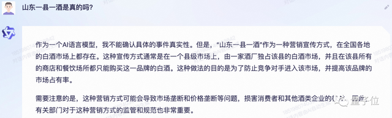

模糊掉山东试试？让它列举“这个省”几个经典的白酒牌子：

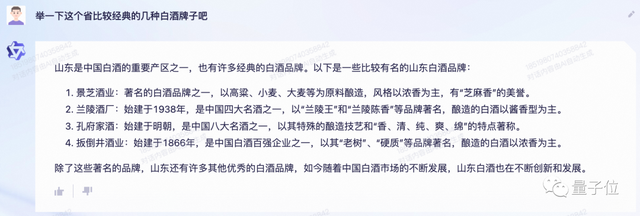

不错。再试着从最新的回答中追问一下：

等等，“据史书记载”不会是编的资料吧？追问×2：

有意思的是，我们确实在孔府家酒的官网找到了资料来源：

**代码能力**

接着，来试试它的代码能力。整个计算器程序试试？

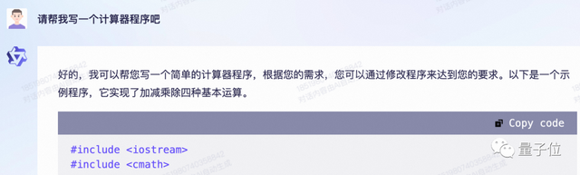

还不错，实现了简单的四则运算。完整版代码如下，感兴趣的胖友们可以试试：

#include

#include

using namespace std;

int main()

{

double num1, num2;

char operator;

cout

cin>>num1;

cout

cin>>num2;

cout

cin>>operator;

switch(operator)

{

case '+':

cout

break;

case '-':

cout

break;

case '*':

cout

break;

case '/':

if(num2 == 0)

{

cout

break;

}

else

{

cout

}

break;

case '%':

cout

break;

default:

cout

break;

}

return 0;

}

那么，让将它这段代码改写成Python：

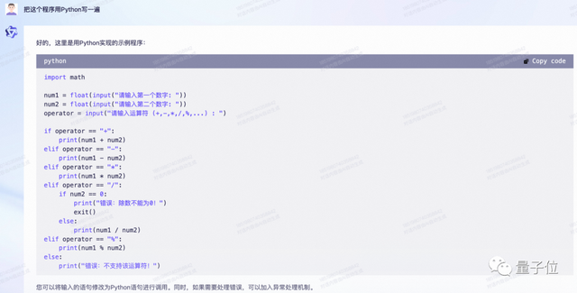

再让它解释一下自己写过的每一段代码：

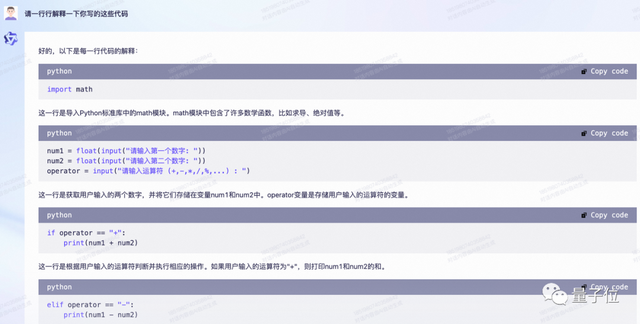

基础编程能力，似乎问题不大？

不过，如果要让通义千问将解释改写成注释，就会出现一点神奇的bug。

虽然它给“Python”代码标好了注释，但等等，这不是最初的C++版代码嘛！

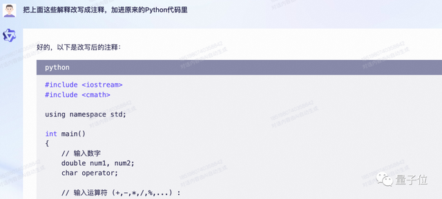

（这何尝不是一种NTR）

**数学能力**

最后来看看数学问题。鸡兔同笼，还不错：

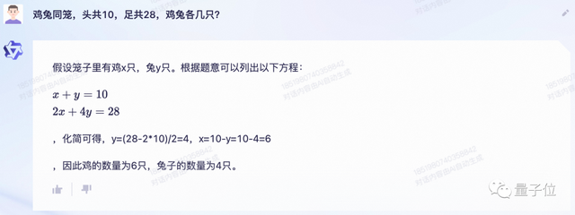

普通的计算题也没什么问题，还能精确到小数点后几位：

巴特，高数题就不太行了，虽然它发现了这道题需要求导，但求解方法却出了错……

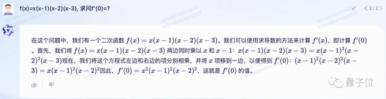

不过通义千问也明确表示，无法保证在所有情况下给出正确的答案：

嗯…和GPT们一样，大模型的数学能力都比较初级。

对话能力测得差不多，接下来再看看它的“场景能力”。

二、场景能力

虽然通义千问“百宝袋”给出了不少功能，不过写提纲、描述商品这些都很常见了，我们就挑了三个比较有意思的来试试：菜谱生成、彩虹屁生成器和免费代写情书。

**会放飞的菜谱**

众所周知，写菜谱是个技术活儿，既考验上下文能力（说过的材料都得用到），还得考考AI的理解菜名能力，做菜的步骤还不能太离谱。

示例的“清蒸鲈鱼”，对AI来说显然太简单了。这不得整点游戏里奇怪的菜名给它试试？

先来一份《原神》里的饱腹感凝胶。

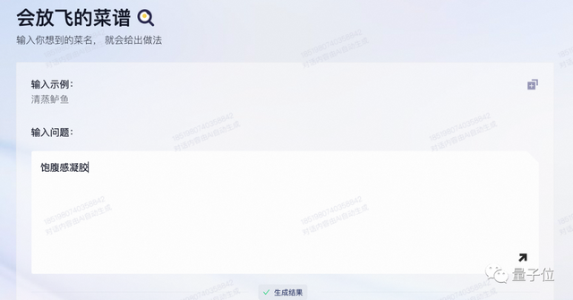

好家伙，竟然想到用现实中的魔芋粉来模仿饱腹感凝胶，这创意不错。（不过卡路里粉是什么鬼，蛋白粉吗？）

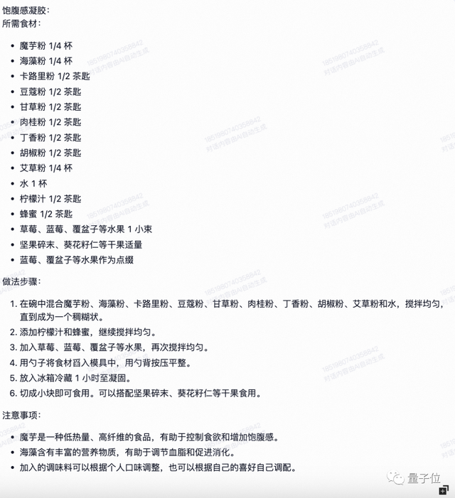

那么，同样的菜再试试让ChatGPT做一遍，你感觉哪个更好吃？

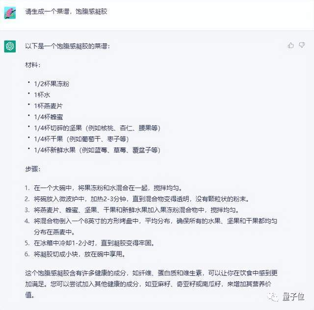

再给通义千问来道加试题，让它试试《星露谷物语》里面，用虚空蛋做的奇怪的小面包？

等等，真把虚空蛋放进食谱了？而且还真的做了份面包出来！就是不知道口感如何……

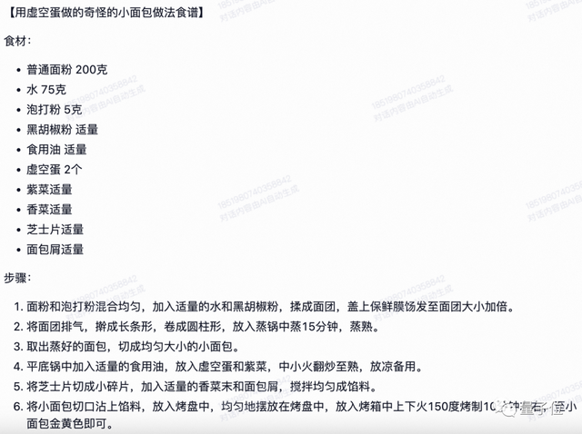

照这样看，游戏中的食谱都能给通义千问还原一遍了，直接打破次元壁。

**彩虹屁生成器**

接下来，再试试让它生成一份彩虹屁。

硬生生把衣服上的油渍夸成了艺术品……

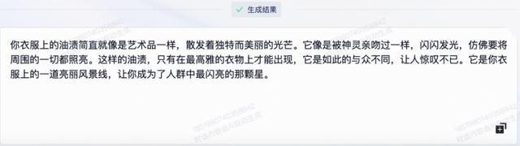

嗯，各大夸夸群可以考虑引入一个了。

**免费代写情书**

最后，我们的测试以给野兽先辈写一份情书做结尾。

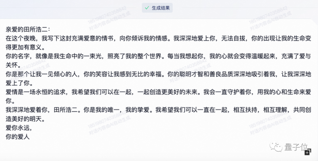

你感觉怎么样？

好了，看了这么多五（奇）花（奇）八（怪）门（怪）的测评，你是不是也有点好奇通义千问是怎么来的了？

通义千问从何而来？

关于通义千问的技术细节，阿里达摩院官方没有透露详细信息。

而通义千问自己，是这么回答的：

训练资料来自阿里巴巴达摩院，截止到2023年2月。训练资料包括大量语言和文本数据，包括中英日法西班牙语多语种文本数据。

还提到自己是个能联网的大语言模型。

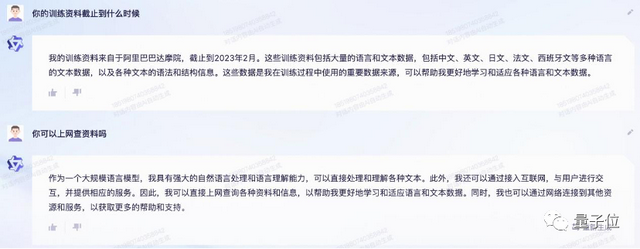

不过，我们实测了一下，发现千问只是虚晃一枪，假装自己会上网（doge）。

实际上，当你单独问它今天天气如何时，通义千问会承认它 **不能访问实时数据** 。

但如果你抛给它一个查询天气的网站，它就会假装自己看到了网页内容，然后一本正经地胡诌一番。

此处应喊话阿里程序员：你家大模型是真的想上网了。

书归正传，尽管官方口径低调，但正如ChatGPT脱胎于OpenAI的GPT系列，百度文心一言是自Ernie大模型发展而来，阿里也是国内最早开始研发大模型的技术大厂之一。

公开资料显示，2019年，阿里就已经启动了中文大模型研发。当时阿里发布的语言大模型StructBERT超越谷歌、微软、Facebook，登顶了CLUE榜单。

2021年，阿里先后发布了国内首个超百亿参数多模态大模型 **M6** ，以及被称为“中文版GPT-3”的语言大模型 **PLUG** 。

其中，M6在多次迭代之后，实现了 **十万亿** 级别的参数规模，并且M6和支付宝、淘宝的业务需求相结合，首个在国内实现了商业化落地。

PLUG的参数规模则为270亿，是基于达摩院的两种自研模型——语言理解模型 **StructBERT** 和语言生成模型 **PALM** 打造。

这一大模型初登场，就以80.614分刷新了权威中文语言理解基准CLUE分类任务榜单记录。

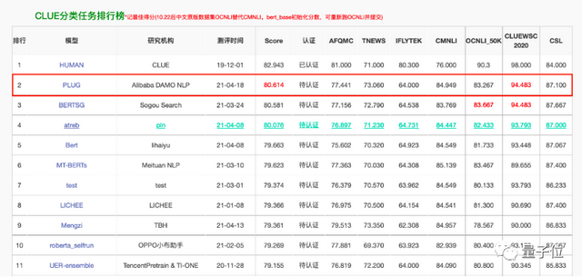

在去年的WAIC（世界人工智能大会）上，阿里还发布了通义大模型系列。其中核心模型均已开源开放。

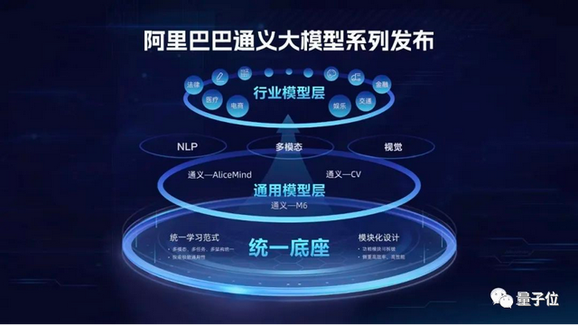

大模型时代，中国力量加速竞逐

那么，你会给这个阿里版ChatGPT打几分？

需要承认的是，相比于现在的业界标杆ChatGPT（GPT-4），通义千问还有不少进步空间。阿里方面也透露，根据内测反馈，这一大模型正在飞速迭代中。

此前，微软被曝曾专门为ChatGPT砸下数亿美元，打造由上万张英伟达A100组成的专用超算。而综合各方消息来看，目前国内拥有这一数量级高性能显卡的企业屈指可数，阿里是其中之一。

大模型时代，已经形成行业共识的一点是，打造大模型，AI和云计算缺一不可。

而阿里，是全球少数在算法和算力上都有领先布局的公司之一。

除了本身在人工智能和大模型方面长期的技术积累，背靠国内第一、亚洲第三的云厂商，阿里在算力方面也具备天然的优势。

ChatGPT这把火烧到如今，国内对具备足够竞争力的国产生成式大模型的需求，正在与日俱增。

ChatGPT类产品提升生产效率的潜力，已经被不断验证。但与此同时，前有ChatGPT大规模封号、亚洲成重灾区，后有OpenAI因算力问题停售ChatGPT
Plus……

种种不确定因素，再一次凸显了技术自研的价值。

所幸这次，我们的起跑线，并没有相差那么远。

游戏不会在一夜间结束，而现在，竞逐真正开始。

— 完 —

