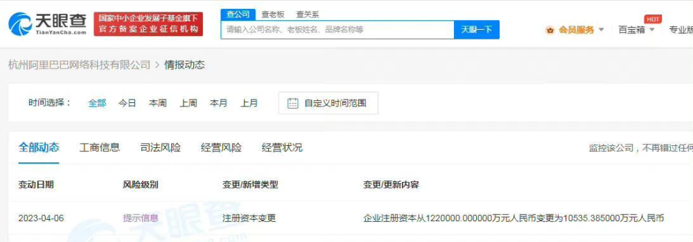

# 阿里相关人士：网传不属实，减资系公司正常工商登记变更

Tech星球4月7日消息，日前，网传“杭州阿里巴巴网络科技有限公司应监管要求减资”，对此，阿里相关人士回应称，消息不属实，系公司正常工商登记变更。

此前据报道，近日，杭州阿里巴巴网络科技有限公司发生工商变更，注册资本由122亿人民币减至约1.05亿人民币。该公司成立于2018年3月，张勇为法定代表人、董事长兼总经理，由淘宝（中国）软件有限公司全资持股。

