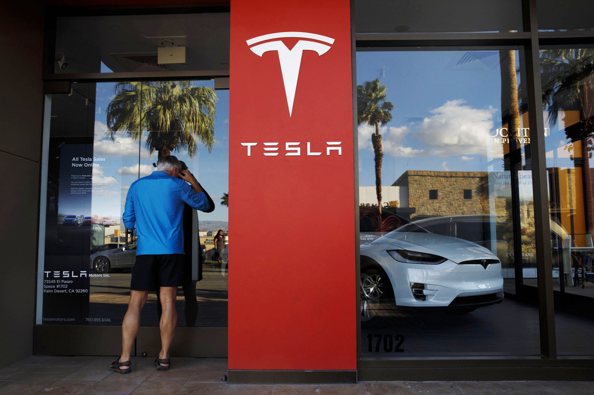
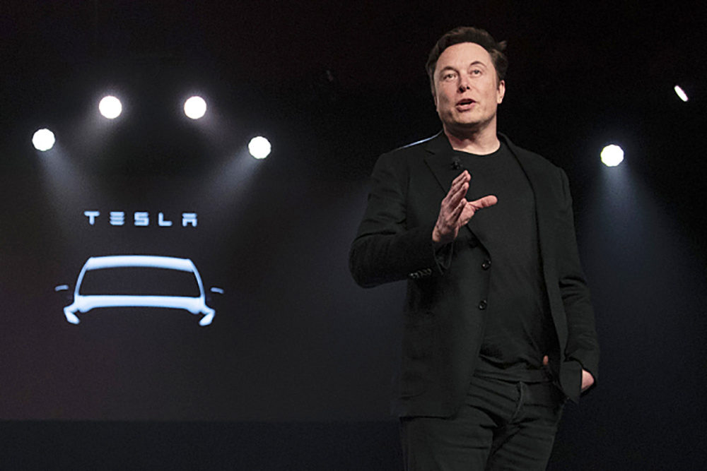
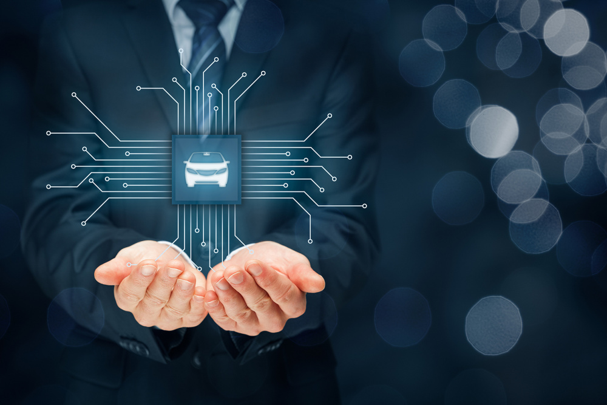

# 震惊！特斯拉员工被曝私下分享车主隐私，“可以看到非常私密的事情”

每经记者：董天意 每经编辑：裴健如

据路透社4月6日报道， 9名特斯拉前员工在采访中爆料，2019至2022年间，特斯拉员工曾通过内部消息系统，私下分享客户车载摄像头记录的部分视频和图像。

“我们能够看到车主的车库和私人物品，比如某位特斯拉车主的车库里有一些特殊的东西，大家就会把它发出来。”特斯拉前员工在报道中称，部分记录还拍下了特斯拉车主的尴尬瞬间，包括“裸男”、车祸和“路怒”事件。

对于上述消息，截至《每日经济新闻》记者发稿，特斯拉相关负责人暂未回复。

“说实话，这是在侵犯隐私。我总是开玩笑说，在看到他们如何对待这些车主之后，我永远不会买特斯拉。”一位特斯拉前员工向路透社表示。

报道中提到，特斯拉在其“客户隐私注释”中表示，该公司的“摄像头记录的内容保持匿名，不会与您或您的车辆关联”。但有7名特斯拉前员工表示，他们工作时使用的计算机系统可以显示画面拍摄的地点，这或意味着，特斯拉车主的居住地也有可能被暴露。

_图片来源：视觉中国_

另有一名前员工称，部分记录似乎是在车辆停止和熄火状态下拍摄的。“几年前，只要车主同意，特斯拉就会接收停车状态下拍摄的画面，但此后已经取消了这种做法。”报道中称。

值得一提的是，特斯拉CEO马斯克也是被“偷窥”的对象之一。报道援引两位知情人士表示，大约3年前，有员工偶然发现一段视频，并传播了出去，而视频内容为马斯克车库内的一款车。

_图片来源：视觉中国_

两名特斯拉前员工对此表示，他们对共享图片并不在意，因为客户已经勾选了“同意”，还有的人早就放弃了对个人数据保密的期望。然而，另有三名特斯拉前员工表示，他们对此感到困扰。“买车的人，我认为他们不知道他们的隐私不受尊重。我们可以看到他们洗衣服和非常私密的事情。我们还可以看到他们的孩子。”上述前员工表示。

“任何正常人都会对此感到震惊，传播敏感和个人内容可能被视为违反特斯拉自己的隐私政策，这可能会导致美国联邦贸易委员会的干预。”波士顿东北大学网络安全与隐私研究所执行主任戴维斯·乔弗尼斯(David
Choffnes)表示，特斯拉员工分享敏感视频和图像的行为“在道德上应受谴责”。

需要注意的是，特斯拉的车载摄像头系统近年来争议频发。在中国市场，部分区域曾一度禁止使用特斯拉车型。此外，此前也有部分车辆功能因“存在泄露隐私风险”被停用的先例。

2022年3月，比亚迪和东风日产旗下车辆相继停用了远程拍照功能。据了解，上述两个品牌的“千里眼”及远程拍照功能可远程记录并查看车外摄像头拍摄的影像信息。2022年5月，有网友称通过高合汽车HiPhi
X的“车车互联”功能，可实时查看多位高合汽车用户的行车记录仪实时画面，随后高合汽车宣布关闭该功能。

“为了实现自动驾驶、辅助驾驶、人机交互、智能网联等功能，智能网联汽车会不断地采集环境感知、车辆工况，还有驾驶人员以及乘客的个人信息，并利用这些信息来更好地提供功能，包括千人千面的个性化服务。但在使用这些重要数据的过程中，车企需要做好安全防护，并合规使用，避免出现数据和隐私安全风险。”电子科技大学嵌入式软件工程中心主任、TIAA网络安全委员会秘书长罗蕾在此前接受《每日经济新闻》记者采访时表示。

另有法律界人士表示，远程拍照功能可能会涉及路人的面部信息，而这些信息属于敏感个人信息。此外，该功能可能拍摄到重要敏感区域的地理信息、人员流量、车辆流量等重要数据。

“如果不对‘车端对数据中的人脸、车牌信息进行匿名化处理’，汽车厂商可能会构成在未经路人或其他车辆车主同意的情况下，收集、存储他人个人信息的法律风险，直接违反《民法典》《个人信息保护法》《汽车数据安全管理若干规定（试行）》等法律法规。”上海汇业律师事务所律师史宇航表示。

_图片来源：视觉中国_

事实上，为规范智能汽车数据收集与使用，2021年以来，多部门相继出台《关于加强智能网联汽车生产企业及产品准入管理的意见》、《汽车数据安全管理若干规定(试行)》等规定，要求加强汽车数据安全、网络安全、功能安全和预期功能安全管理。

不过在实际面对智能网联汽车繁杂的信息收集条款时，消费者依然很难做出分辨。J.D.
Power（君迪）之前所做的一项调查显示，只有21.8%的智能汽车用户“一直都知道”个人敏感信息被收集，明显低于智能手机用户（31.2%）；而超过20%的用户很少知道或完全不知道个人敏感信息被收集，明显高于智能手机用户（16.7%）。同时，近半数（47.8%）的受访车主表示从未收到过汽车品牌或经销商对个人信息收集的提示。这表明，很多的数据收集行为是在用户“不知情”的情况下进行的。

在国家工业信息安全发展研究中心副总工程师兼信息政策所所长黄鹏看来，尽管相关部门在推进产业发展和保障数据安全方面具有关键地位，但当前法规体系、标准体系仍存在多头监管的问题，还需尽快细化一些行业性的管理要求。“从数据安全监管的角度，国家网信部门是牵头部门，但是涉及具体行业细则的出台，还需要行业主管部门，以及一些重要的行业协会去推动相关工作。”黄鹏表示。

“不知道有多少车主仔细阅读过相关的隐私政策条款，可能在使用车辆时不经意间就已经勾选了‘同意’选项。但这方面还是需要国家有关部门给车企‘划底线’，某些霸王条款越过了法律红线也是无效的，因此需要立法界的支持。”金诚同达律师事务所律师蔡硕告诉记者。

