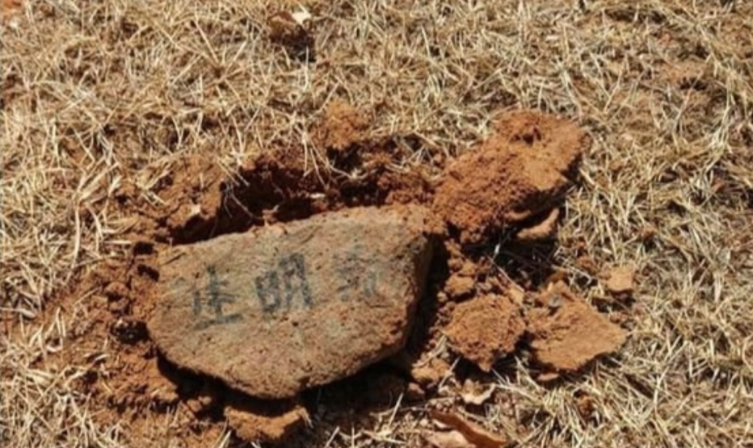
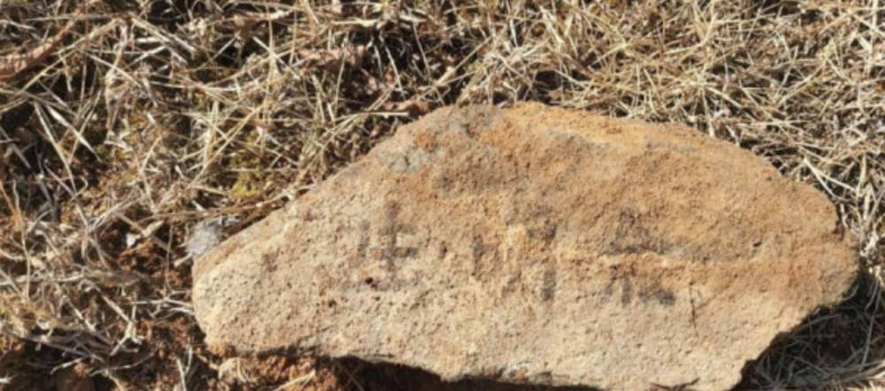

# 韩媒：韩85岁男子承认自己动了李在明祖坟，宣称是为其“补气”

【环球网报道 实习记者
王沅】据韩国《中央日报》报道，就此前韩国最大在野党共同民主党党首李在明父母墓地被人为破坏一事，85岁男子李某6日前去警局自首，声称是自己和家族人员在该墓地周围埋了石头。韩国庆北地方警察厅7日透露称，当地时间6日下午6时30分许，李某在接受警方调查时，反复重申其家族为了支持李在明参加地方选举，在后者父母的墓地埋了写有“生”“明”“气”字样的石头。

据《东亚日报》6日报道，李某辩称，之所以在李在明第一次表示有人破坏其父母的坟墓时没有出面解释，原因是“事情闹得太大了”。“当时，他们没有把我的字看成是‘生’‘明’‘气’，而是读成了‘生’‘明’‘杀’，我的意思完全被以讹传讹。我在农村，找不到解释的方法。”他说。

_韩国共同民主党党首李在明在脸书上公开的庆北奉化郡父母墓地现场的照片。图源：韩媒_

“我与当时一起去墓地的家族人员商议后，到警察局说明了原委……在地方选举3天前（即去年5月29日），我和家族人员一起在庆尚北道奉化郡为李代表父母的墓地‘补了气’，”他称，“李代表的祖坟虽然有很多气，但是父母墓地的方向不对，所以气很弱……（我们）从生产高丽青瓷的康津郡拿走了6块石头，写上汉字‘生’‘明’‘气’，埋在了坟头边缘”。

至于为何没有将这一行为告知李在明本人，报道称，李某表示：“选举临近，一起去的家族人士也不知道如何与李代表取得联系。”

《中央日报》称，李在明6日下午通过脸书就此事表示，“希望不要再重复类似的事情”，“虽说覆水难收，但对于没有恶意的事情，还是希望警察从轻处理”。

据媒体此前报道，今年3月，李在明父母墓地被发现埋入不明石块，上面写有“生”“明”等汉字，其后模糊的汉字像是“杀”字。对此，李在明曾在社交媒体发文称，“不知道是谁在墓主人后代不知情的情况下埋下写有这些文字的石块，不知道是什么意思？”报道称，李本人并未流露出过多的感情色彩。不过共同民主党副发言人李庆当时在社交媒体上发文称，李在明党首父母的坟墓被埋入写有异常文字的石块，坟墓还有被践踏的痕迹，令人触目惊心。

