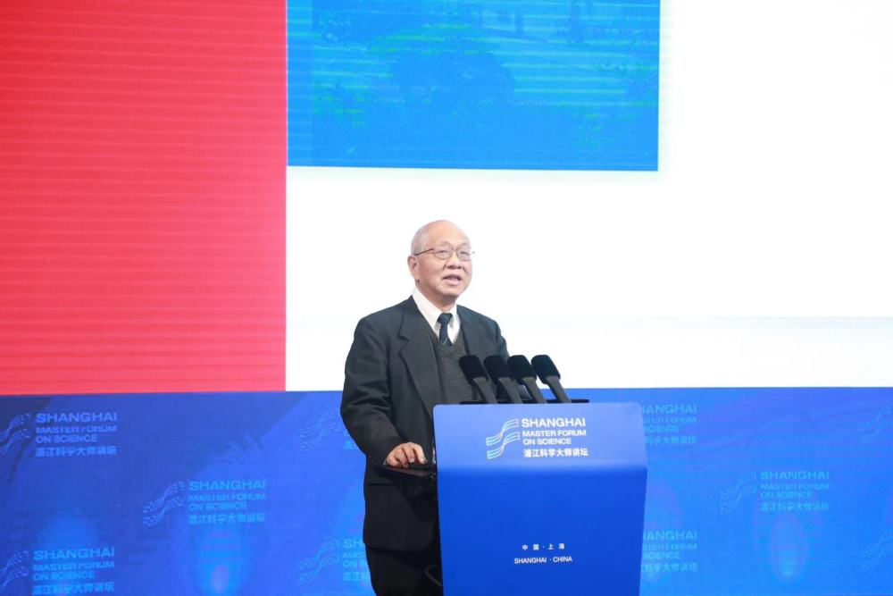
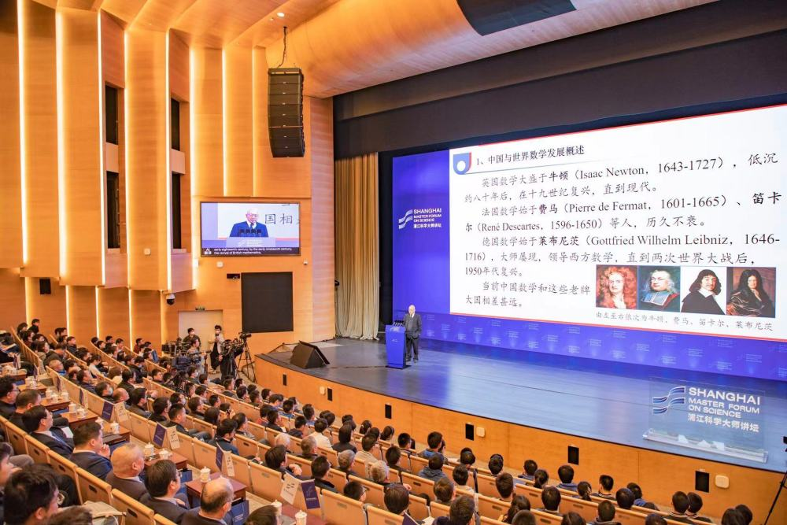

# 74岁数学家丘成桐：数学看未来3年，别再让年轻人为拿“帽子”做学问

**中青报·中青网记者 王烨捷**

4月7日下午，第二期“浦江科学大师讲坛”在复旦大学相辉堂举行。著名数学家、菲尔兹奖首位华人得主丘成桐以“中国数学的现状与未来”为题作报告。这也是丘成桐1980年首次到访复旦大学后的第二次访问。

丘成桐曾被国外同行评价为“数学界的恺撒大帝”，他1949年生于广东省汕头市，1969年毕业于香港中文大学数学系，1971年获伯克利加州大学博士学位，1982年33岁时获国际数学界最高荣誉的菲尔兹奖。丘成桐目前致力于为“数学强国”做贡献、带新人，他现为清华大学讲席教授、丘成桐数学科学中心主任、求真书院院长，北京雁栖湖应用数学研究院院长，致力于数学学科的发展和数学人才的培养。

_图为丘成桐。复旦大学供图_

“最近几年，越来越多的青年数学家选择回国发展。中国数学能不能在国际上崛起、有所发展，我认为最重要看未来3年如何发展。”丘成桐说，中国青年学生、学者的数学水平不比欧美等老牌数学高水平国家差，但有一个主要问题需要克服——做学问是为了追求大自然的真理、是真的对某个方向的研究有兴趣、想创新，而不是为了拿一个“帽子”、拿一笔经费去迎合某些评审的喜好。

中青报·中青网记者注意到，丘成桐的这场讲座座无虚席。台下坐着的，除了复旦大学数理领域的青年学生外，还有上海多所高中数学特色班、理科班的优秀学子。而高中生及高中老师们，特意被安排在了前排C位。

_图为丘成桐演讲现场。复旦大学供图_

丘成桐的话，主要说给青年学子、青年教师们听，也是在为青年人争取最好的科研环境。丘成桐说，如果未来3年学术环境不能有所改变，恐怕目前引进的优秀学者会逐渐离开中国，“这不是危言耸听，现在有能力的学者来中国，是希望未来能在世界数学舞台上占有一席之地。但如果中国不能提供这样的学术环境，他们恐怕会选择离开。”

丘成桐所说的“学术环境”，并不是指金钱、经费，而是指一个科学、公平的评审系统。

他说，近年来在国家和各地政府的大力支持下，针对数学家的资助、投入越来越多，中国的数学家在经费方面不比欧美发达国家少。然而，这些奖项的评估、晋升，却很少征求国际专家的意见，大部分意见由国内同行来决定。而中国数学学科的大部分学者年龄偏大，对现代数学发展的认识不够全面，对一些新兴学科的评估不够准确。

而一些学校即便引入了国际评估，其评估很多也是以论文多少、影响因子高低等来做决定。“这样的方法对于一般学问还算靠谱，但对于最前沿的学问却是远远不够的。”丘成桐说，引导世界的论文和最前沿的技术，并不是通过前述方法来评价的，“我们的高校既缺乏前沿科学家，又较少征求全球专家的意见，即使征求，也多局限于华裔学者，那实在是不够全面。”

丘成桐针对评价问题，举了一个具体的例子。去年，在北京市的支持下，他与清华大学数学科学中心、北京雁栖湖应用数学研究院的同仁们一起筹办国际基础科学大会，这场大会拟在今年7月举行，拟邀请全世界在数学、理论物理和工程上有重要贡献的学者，讨论前沿学问，并评选出“最佳论文奖”。为了这个“最佳论文”，组委会把数学、理论物理和工程领域的主要研究方向分为约40个分支，每个分支找到5名该领域最活跃的专家，来自欧美、俄罗斯、以色列、日本、印度等国家，其中5人是菲尔兹奖得主、2人是诺贝尔奖得主、2人是图灵奖得主，另有20多名其他国际大奖专家和60多名世界各地科学院院士。

而前述160多人经过1个多月讨论、评选出的87篇论文中，只有5篇是国内大学教授的作品，有70多篇是美国大学教授的作品。值得注意的是，很多在国内得到重要奖项的学者并没有入选。

“我注意到，深圳、上海、杭州等地方都给了数学家们很好的、丰厚的奖励，但令人遗憾的是，我们经国际同行挑选出来的5篇优秀论文的作者，都没有拿到过前述奖项。”丘成桐说，前述87篇论文中有24篇来自华裔作者，而这24人中只有一两人最近回到祖国工作，“是因为国内给的经费不够吗？并不是。这个现象值得我们花时间去反思。”

丘成桐说，中国数学的未来，在于年轻人，“我们要鼓励年轻人建立明确的目标，要有志气成为世界一流的学者，做出突破性的工作。而不是让年轻人的志愿就是拿政府颁发的各种‘帽子’，当个院士，或者是拿诺贝尔奖。”

他说，做学问的目标是要找到大自然的奥秘，找到一切有意义的规律，而不是为了“帽子”做学问。

两年前，为保障“丘成桐数学科学领军人才培养计划”顺利开展，清华大学求真书院成立，丘成桐担任院长。这两年，他前往全国各地走访中学甚至小学，选拔综合素质优秀且具有突出数学潜质及特长的学生。他发现，历史上几乎所有数学大师都是在十三四岁时开始发力。苏联数学界一代大师、首届沃尔夫数学奖获得者盖尔范德也曾提出，对未来顶级职业数学家进行数学专业培养，应当从13-16岁期间开始。

选拔人才后，丘成桐认为“激发好奇心”是第一步，“从好奇心发展出来的科学，往往会拥有比其他科学都要强大的影响力。”

这不是丘第一次强调好奇心的重要性。他曾在分析“中国孩子数学都很好，为什么中国出不了大数学家”这一问题时，就指出中国孩子与欧美孩子在好奇心、兴趣上的差异。

“欧美最好的孩子的数学教育其实比我们好很多，他们的老师不仅教了数学的内容，还教他们把数学的兴趣提起来，他们对数学有真正的兴趣，有很大的原动力去寻找数学美妙的地方；中国的小孩子，很多看不到数学最精华的地方，把题目做好、考好试，就很开心了。”丘成桐曾多次在公开场合表示，数学的真谛不是做人家所给的题目，而是要自己能发掘出一个好的方向、好的题目，要去做突破性的创新研究。

来源：中国青年报客户端

