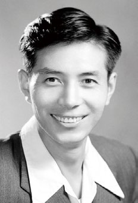
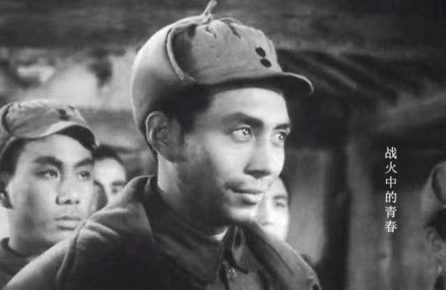
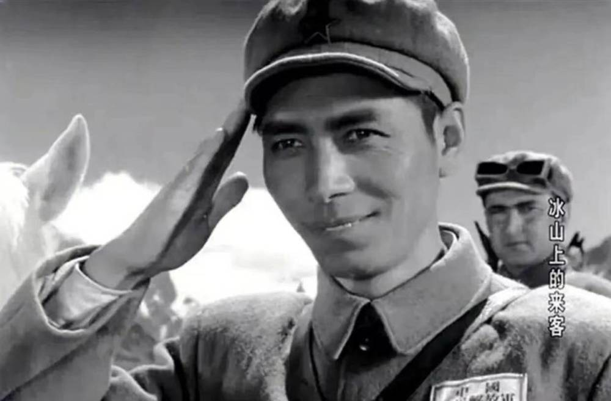

# 《冰山上的来客》“二班长”张辉去世，曾执导《不该发生的故事》

今（8）日，长影集团官方微博发文称，中国共产党党员，长影电影演员、导演张辉于4月6日去世，终年91岁。

张辉在《董存瑞》《新局长到来之前》《母女教师》《青云曲》等十几部影片中扮演不同类型的角色，其中《战火中的青春》中的连长、《冰山上的来客》中的二班长等银幕形象，给观众留下了深刻印象。

1974年起，张辉转型导演，陆续执导了《半边天》（联合执导）《燕青卖线》《元帅与士兵》《不该发生的故事》等影片。

其中，《不该发生的故事》荣获1983年文化部优秀故事片二等奖、第7届大众电影百花奖最佳故事片奖、第4届中国电影金鸡奖评委会特别奖。

编辑 李洁 图据长影集团

