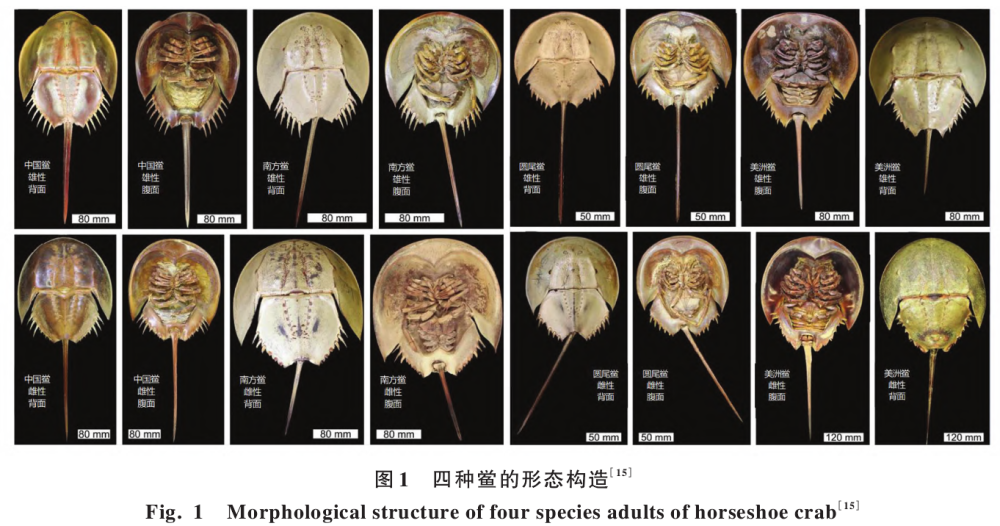
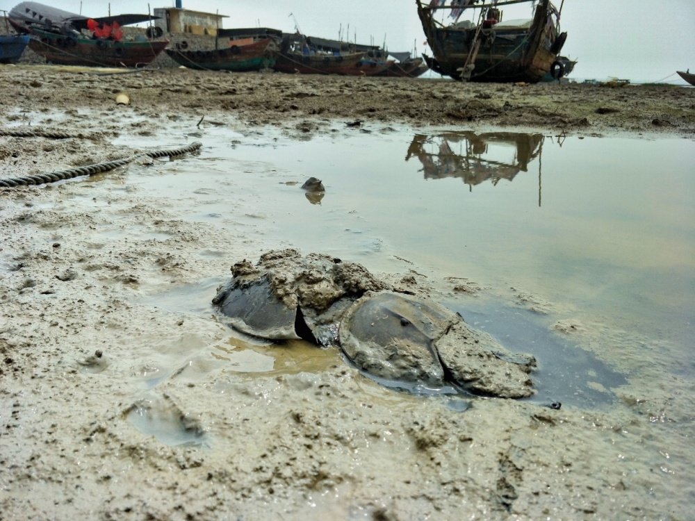
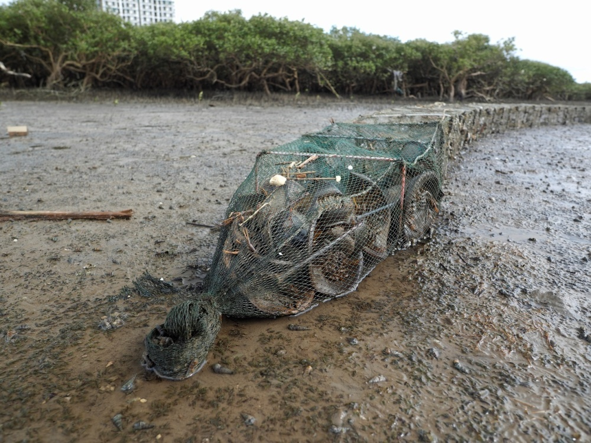
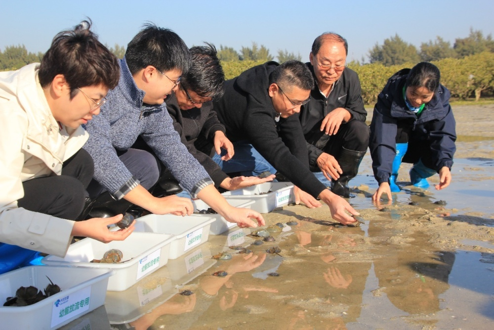

# 【流浪自然】海洋活化石濒危：4亿年前的“蓝血生命”何去何从？

环保意识深入人心的当下，保护生物多样性、保护珍稀野生动植物早已从学术领域转变为公众议题。每年4月8日“世界珍稀动物保护日”这一天，珍稀动物的保护进展就更会成为媒体和公众关注重心。在中国，对珍稀动物保护工作的报道更容易引起热议，这一方面是因为中国幅员辽阔、陆海兼备，多样的生态系统塑造了极为丰富的生物多样性，中国本就不缺少奇特珍稀的物种；另一方面则是由于过去几十年政策法规、科研投入和民众参与的推进，中国的珍稀动物保护工作取得了诸多成就，已经在全球生物多样性保护领域交出了许多亮眼的成绩单，保护珍稀动物课题上，中国有足够的话语权。

不过，当我们为这些保护成就欢欣鼓舞时，也始终无法回避一个事实——当一种动物还被普遍视为“珍稀”，实质上就折射出它仍在面临许多种群恢复的困境，而当我们讨论如何更好地保护珍稀动物时，就必须直视这些切实存在的问题。

从这个角度切入，中国的两种鲎的保护工作颇具代表性，在历史时期，中国长江以南沿海地区都有鲎分布的记录，70年代的渔业捕捞记录上，鲎在多个南方省份还是随手可及的普通海产，但在今天，不仅两种鲎密集上岸产卵的盛景已经很难见到，一些传统产卵场的鲎种群更是彻底绝迹。从上世纪90年代初开始，南方各省、自治区相继将两种鲎列入省、自治区级重点保护动物，2021年，两种鲎又被列为国家二级保护动物，相关的保护法规和努力不可谓不大，却依旧没有显著改善这种颓势。

中国的鲎究竟面临哪些威胁？我们又该如何扭转这种局面？带着这些疑问，我于日前专访了北部湾大学海洋学院教授、广西北部湾海洋生物多样性养护省级重点实验室（北部湾大学）主任关杰耀教授。

**流浪：**
关教授，在采访您之前，我事先在自己的读者群里发起过一个问卷，询问大家对“鲎”这类物种有什么样的印象，得到的结论就是三个关键词：一个是“活化石”，很多朋友都听说过它可能是几亿年形态上没有特别大的变化，现在看起来也是一个比较古怪的形状。第二个是“海鲜”，尤其是南方沿海地区的朋友们会有这样的认识；第三关键词是“医用”，有一些朋友提到鲎的血液可以用来做鲎试剂，用来检测内毒素。

但除了这三个关键词之外，大家对鲎的一些生物学上的知识反倒就不是特别了解。所以想邀请您给大家介绍一下，鲎具体有个什么特点，现在总共有几种鲎还现存，我们国家分布的主要是哪几种？

**关杰耀：**
你的读者群的生物学知识还是比较高的，对鲎的认识还挺丰富。实际上我在南方沿海地区走访居民的时候，大家也只关注3个问题——这东西能吃吗，好吃吗，怎么吃？（笑）关注到它医用用途或者活化石的人其实都不算太多。当然了，自从它被列为国家二级保护动物之后，民众对鲎的关注度也普遍提升，也更希望了解到关于鲎的知识。我们北部湾大学在积极开展海洋物种科普工作过程中也把鲎当做科普的明星物种在宣传，每年6月20日国际鲎保育日的时候，我们学校也有相应的鲎科普宣传工作，也希望通过这种方式增进师生和民众对鲎的了解。

目前全球现存的鲎还有4种。其中美洲东岸——也就是从美国到墨西哥湾一带分布着美洲鲎。我们亚洲从日本一直到中国南海一带分布着中国鲎，也有把它称为中华鲎或东方鲎的。而从我们香港地区一直往南延伸的区域还分布着圆尾蝎鲎，也叫作圆尾鲎。

在更向南的东南亚地区沿海，还分布着一种南方鲎，虽然它的个体并不是最大的，但它的拉丁名中有gigas（注：巨无霸的意思）的种名，所以也叫作巨鲎。

图片来自黄文静, 张敬, 崔林青,等. 海洋活化石——鲎的研究进展[J]. 生物资源, 2022, 44(4):11.

其实你也能看到，几种鲎的分布主要是集中在温暖海域，因为水温是影响鲎栖息的一个重要因素，中国鲎对冷水的耐受能力略强，所以分布也更向北一些，而圆尾蝎鲎就需要更温暖的水域。此外，圆尾蝎鲎的英文名叫mangrove
horseshoe crab **——** 红树林鲎，这也反映出它对红树林生境的依赖。

在我们国家，历史上长江以南的海域都有鲎的分布，尤其是看历史文献上的记载，南方沿海的鲎分布还是很广泛很常见的，但今天的鲎受到过度捕捞和栖息破坏的威胁比较凸出，影响了鲎的分布范围。

对鲎的捕捞主要是基于两个目的，第一就是直接当做海鲜食用，第二就是用来做鲎试剂。而它的栖息地破坏主要体现在沿海的围填海建设上。我们以福建厦门为例，历史上这里的鲎非常盛产，现在种群已经很少了，当地的拖网渔船也很少能拖到。

**流浪：** 您刚才也介绍了，鲎在长江以南沿海曾经多有分布，历史上的县志也提到舟山一带有很壮观的鲎上岸的记录，那么现在这些地区的情况也和厦门一样吗？

**关杰耀：** 浙江舟山群岛曾经是我国鲎资源分布的北界，也是比较丰富的一个区域，但根据我的了解，最近几年浙江只能偶尔见到鲎，数量也很少。

**流浪：** 鲎的产卵似乎特别偏好于水流缓的砂质滩涂，这种环境是它繁育必须的吗？

**关杰耀：** 鲎的生活史其实分成三大块。也就是产卵，育幼，和成体觅食阶段。

其中成体觅食阶段主要集中在十几米的浅水区，最深下限一般不会超过三四十米。

鲎的产卵和育幼阶段确实集中在潮间带区域，每年繁殖季，成体的鲎就会向潮间带一带移动，如果没遇到其它阻碍，它最终会来到潮间带的高潮线以下的位置完成产卵。为什么偏向于这样的环境呢？因为潮间带高潮线附近既可以随着潮汐涨落保持湿润，又可以避免卵长时间泡在水里，卵的氧气交换比较便利。从我们的实际观察和试验来看，这种环境下卵的孵化率也是最高的。

上岸产卵的鲎（图片由北部湾大学关杰耀提供）

但目前的情况是，鲎要找到这样理想的产卵环境很不容易。我们的海岸线有许多海堤、虾塘等人造建筑，它们一般都位于潮间带高潮线以下，鲎还没有爬到最理想的产卵地就会被这些海堤拦住。我们在南方沿海注意到，很多鲎试图穿越虾塘围堤、海堤，尝试未果后只能在海堤前面并不是特别理想的地方产卵，这当然是它们迫不得已的选择，在这里产卵也肯定会影响卵的孵化率。

孵化后的幼体鲎个头很小，大概只有人的小指甲盖的一半不到，它的嘴部结构又比较简单，所以在幼体阶段是以滩涂上的有机质、底栖藻类、底栖小生物为食，比如在红树林外缘滩涂上，就能看到中国鲎和圆尾蝎鲎的幼体在滑动觅食，直到它们体型变大，才会逐渐转变为肉食性。觅食方式和食性的限制导致了幼体鲎和成体鲎不同的分布区域。

**流浪：** 您研究的重点区域是北部湾地区，这里的滩涂还能看到成规模的鲎产卵、幼体阶段吗？

**关杰耀：** 在20~21年左右，我们在北部湾做过一些本底调查，在北部湾的几处产卵场还是能见到鲎卵和幼体的，不过大多数是圆尾蝎鲎，中国鲎的卵就很难找到。

**流浪：** 这是个很奇怪的点，因为曾经有研究中国鲎的学者提到北部湾是中国鲎最理想的栖息和产卵环境(Sekiguchi,
1988)，上世纪80年代，还有许多专家在北部湾的北海沿岸滩涂见到成群的中国鲎上岸产卵，有的数据认为90年代北部湾中国鲎的数量还在每年60万对的规模，为什么短短几十年过去，这里的中国鲎也这么罕见了呢？

**关杰耀：**
这其实也反映出鲎资源量不太乐观的现状。除了我们刚才圈海填海、过度捕捞之外，我们目前还强烈的感受到当地滩涂的渔业生产对鲎上岸产卵带来的阻碍。北部湾还有许多滩涂上有密密麻麻的定置网、地笼，几乎摆成了一套“迷魂阵”，成体鲎要从十几~三四十米的水深上岸，就必须突破这些渔网，但它的腿很容易被网缠住。此外，地笼这样的非法渔具对圆尾蝎鲎的威胁比较明显，中国鲎体型比较大，只会被地笼缠住，一般不会钻到笼里去，反观体型更小的圆尾蝎鲎，可能本身就有钻洞的习性，所以经常能在地笼里找到，甚至我们把它解救出来，没过几天就又被地笼捕获了。

被困在地笼中的圆尾蝎鲎（图片由广西科学院王俊杰提供）

不管是被缠住，还是钻到地笼里被困在，这些鲎都很难逃脱，退潮之后，这些鲎要么会被晒死，要么就会被作为海鲜等利用了。

这些定置网和地笼其实都是非法渔具，但对这些非法渔具的管理很困难，首先是执法很难全覆盖，即便收缴了，这些网也很便宜，今天清理掉，明天就又装上新的，屡禁不止。

当然，这些非法渔具对鲎的影响肯定没法和大规模的填海导致的产卵环境破坏、大规模拖网渔业导致的成批量捕捞的影响相比，不过目前鲎资源已经很不乐观，这些非法渔具对鲎的种群恢复的威胁也是不容忽视的。

**流浪：** 我注意到您的研究方向里也有通过增殖放流来恢复鲎野生种群的内容，增殖放流的成效如何？

**关杰耀：**
目前来看，鲎的增殖放流虽然一直在开展，但增殖放流方法还有待规范，其中主要体现在两个问题上，其一是放流的鲎规格太小了，因为很多放流活动比较突出“量”，使用的是刚出生的幼鲎，甲宽可能只有6mm左右，按照其他国家的相关研究，这样大小的鲎放流后，90%都会被天然的掠食者吃掉。

更重要的是，增殖放流的场地可能也是不恰当的，如果我们放流的都是幼年小鲎，那应该把它放在滩涂，这里才是适合它们的生境，但我们以往的放流经常选择在对人来说更方便的码头，或海洋牧场等区域，这样的环境是不适合鲎、尤其是放流的幼鲎生活的。

所以，这几年我们一直在推动科学放流的理念，比如在什么水温、什么水流、什么底质下放流多大的鲎，会有更好的存活率，我们也已经摸索出一套体系。

在适宜的栖息地环境下放流个体较大、生存力较强的幼鲎，可以有效提升增殖放流的效果（图片由天津一瑞生物科技股份有限公司及全资子公司北海兴龙生物提供）

但目前看来还是比较难操作的，因为大家还是比较偏重“量”和“规模”，而这种侧重就必然决定了放流的都是小鲎——更大的鲎苗意味着更高的成本，更大的风险。基于这个现状，我也在摸索一些更低成本大量产生鲎苗的办法，比如和其他经济鱼类一起混养，在不增加太多成本的前提下，通过间接的方式来服务放流。

**流浪：**
其实您刚才提到增殖放流存在的一些问题，可能也不是鲎的个例，我之前也关注到包括长江水生态的一些濒危鱼类的增殖放流都有您说的类似的情况，在错误的生命周期放在错误地方，它的存活率应该是非常低的。

**关杰耀：** 是的，非常可惜。

**流浪**
：在一些经济鱼类虾蟹的增殖放流工作中，还会出现另一种情况——幼苗刚放流几个月，还没来得及长大参与繁殖，就又被渔业活动捕捞上来了，这就相当于增殖放流就没有起到恢复种群的作用。鲎的放流会不会也会因为这些情况而影响效果？

**关杰耀：**
鲎因为幼体在潮间带活动，受到的渔业威胁主要就是刚才咱们提到的非法渔具，但人为刻意的捕捞它的情况不多，我们当地的渔民也认为小鲎是有毒的，基本不会去吃它。我之前听说过福建的部分海滩有人捕捉小鲎卖给游客，但在目前应当也不多见了。

不过到了亚成体阶段，鲎就开始遭遇比较大的渔业威胁，亚成体阶段的鲎开始慢慢向更深的水域靠近，就很容易被渔网兼捕，而这个阶段的鲎还被民间认为是有毒性的，所以没什么太大的食用价值，但渔民认为，鲎浑身是刺和节肢，很容易破坏渔网，如果把它放生回海里，过几天还会再捕捞到、再破坏渔网，对渔业生产来说是个很恼人的“害虫”，所以他们倾向于直接把亚成体的鲎尽快的消灭掉。

这种心态是很普遍的，也不仅仅出现在中国的渔民群体里，东南亚、南亚的沿海渔民社区都有这样的做法，比如东南亚渔民捉到亚成体鲎就把它烧死，我们国内沿海也有直接晒死扔到垃圾桶里的情况。这种情况非常普遍，我经常在沿海渔村的垃圾桶里见到亚成体的鲎，有些已经长了6~8年，马上就要进入性成熟阶段，让人非常惋惜痛心。

**流浪：**
您最开始介绍美洲鲎的时候，让我想起了美国特拉华湾的美洲鲎和红腹滨鹬的故事，当地美洲鲎上岸繁殖的季节，正好是红腹滨鹬北飞迁徙的时候，红腹滨鹬依靠大量鲎卵补充营养，这也成为决定它后半程迁徙成功率的关键。几十年前美洲鲎种群显著下滑，对红腹滨鹬的种群也带来极大威胁。那么在我们中国，鲎的资源量下滑，会不会也对其他生物带来间接影响？

正在进食美洲鲎卵的红腹滨鹬（图片来自Gregory Breese/USFWS）

**关杰耀：**
在我们亚太区，这方面的研究还非常少。我们的鲎之前数量虽然也还很多，但亚洲的鲎繁殖习性和美洲鲎有所区别，即便是在繁殖季节，亚洲的这几种鲎也不会高密度的扎推，产下的卵也都浅埋在沙子下。而美洲鲎有在沙滩上争夺交配权的行为，不仅密度高，相互抢夺过程中就会把沙下的卵挖出来，这样卵在沙滩上暴露，才容易被候鸟觅食。

**后记：**
鲎的保育所面临的挑战，主要还是体现在过度捕捞利用、各生活史阶段的栖息地破坏，以及意外的兼捕等问题上，对鲎的野生资源补充修复，也还有许多需要优化的地方，这些问题的产生，其实很大程度是因为我们对物种的生物学习性研究还存在空缺，没有针对性的推广适合它的保育手段。同样的，在许多珍稀物种保育领域，也都还存在这样多样的挑战。要改善这些问题，当然离不开更规范的管理流程，更广泛的群众参与支持，但要实现这一步，更离不开更深入精确的科学认识做支撑。

这正是关杰耀教授、以及更多活跃在生物多样性保育工作的科研工作者们工作的意义所在。在泥泞滩涂、雪山密林、荒漠戈壁，数不清的保育工作者正在倾注心血，帮助我们构建对自然的认识，而这种认识正是保护的根基。值此珍稀动物保护日之际，再次感谢他们的辛勤付出，也期盼我们身边的万物生灵早日摆脱珍“稀”的境遇，以勃勃之姿尽显生机。

