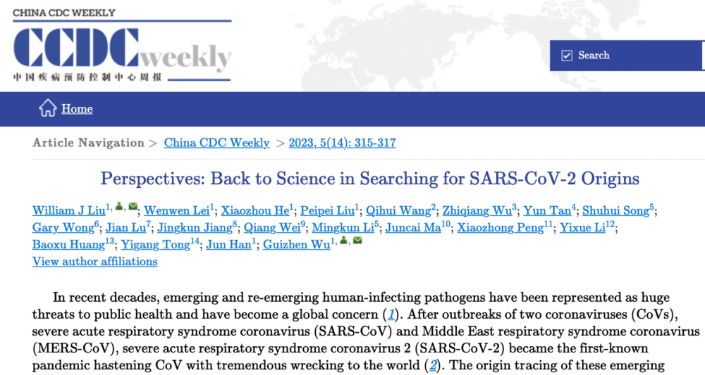

# 中疾控：新冠溯源“发现地”不等于“起源地”，目前无法确定病毒来源

**人民日报健康客户端记者 杨小明 陈龙飞**

4月7日中国疾控中心更新信息显示，3月30日的《中国疾病预防控制中心周报（China CDC
weekly）》刊登了中国疾控中心病毒病所武桂珍、刘军等人“让新冠病毒溯源回归科学”的主题文章。文章指出，最早报告的暴发地，不能等同于全球大流行的起源，即“发现地点”不等于“起源地”，所有研究和相关结论都应以科学为基础。

**病毒溯源是一项系统且耗时的工作**

文章提出，近几十年来，新出现的人类感染病毒，对公共卫生产生巨大威胁，并已成为全球关注的问题。经历了3年多的新冠病毒大流行之后，尽管世界各地的科学家正在做出巨大努力，新冠病毒的起源至今仍没有定论。

从其他传染性病毒的溯源来看，溯源是一项系统且耗时的工作，像包括SARS病毒和HIV病毒等许多病毒的起源仍没有定论。

**最早“发现地”不等于“起源地”**

文章认为，要确定一种新出现的人类感染病原体的确切起源，需要严格的逻辑关系、充分的因果关系和坚实的证据链。

从宏观角度来看，对于2019年新冠肺炎的全球起源，人畜共患病仍是最有可能的来源。然而，根据目前全球的证据，新冠病毒的天然宿主和中间宿主还没有明确的结论。

从狭义角度来看，对于特定地理范围（如国家、城市、学校或市场）或特定人群的起源，有多种可能性。例如，一个地理区域的最初病例，是由携带病原体人或是携带病原体的动物进入该区域引发的感染。

值得注意的是，即使发现了某一地区内的来源（最早报告的暴发地），也不能等同于全球大流行的起源，即“发现地”不等于“起源地”。

**新冠溯源的所有结论都应以科学为基础**

文章指出，关于新冠的溯源问题，所有研究和相关结论都应以科学为基础。中国科学家始终保持开放、透明、负责任的态度和实践，与世界各国科学家共同开展溯源工作，贡献了大量科学参考，《世卫组织-
中国联合报告》就是其中之一。

在2019年12月下旬新冠暴发的早期阶段，发现一些病例与中国武汉的华南海鲜市场有关。科学家在实地开展调查和监测工作后，对数据进行了进一步分析，向世卫组织专家报告了结果并进行了全面讨论。

**无法排除病毒通过被感染的人类或冷链产品进入华南海鲜市场的可能性**

世卫组织-
中国联合专家组收集了华南海鲜市场内和周围不同地点的环境样本以及动物样本，成功分离出3种活病毒。检测结果表明，市场上的病毒与早期出现的新冠病例中病毒分离株高度相似（99.980%-100%）；在市场上18种动物拭子中没有检测到新冠病毒；环境拭子样本中的新冠病毒与市场上的早期流行病毒高度相似；此外，在市场上的野猪、牛等动物样本中也发现了新冠病毒。

文章指出，目前还无法从现有的所有分析中确定病毒的来源，仍然不能排除病毒可能通过人类或冷链产品进入市场的可能性。由于市场每天有大量人流量，所有数据表明，华南海鲜市场在大流行期间只是充当了早期放大器，导致了聚集性感染。

文章指出，基于目前的科学逻辑和全球现有证据，《世卫组织-
中国联合报告》中关于新冠溯源的结论是科学和客观的。病毒溯源是一个科学问题，需要科学证据和逻辑推理。新冠病毒的溯源可能还有很长的路要走，相关研究为未来预防和控制其他新发传染病提供宝贵的经验。

