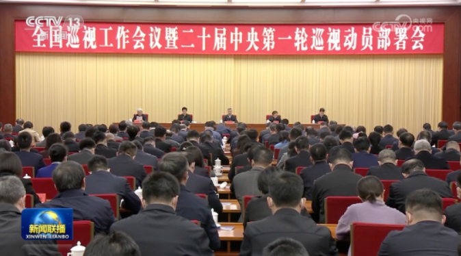
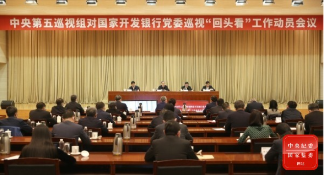
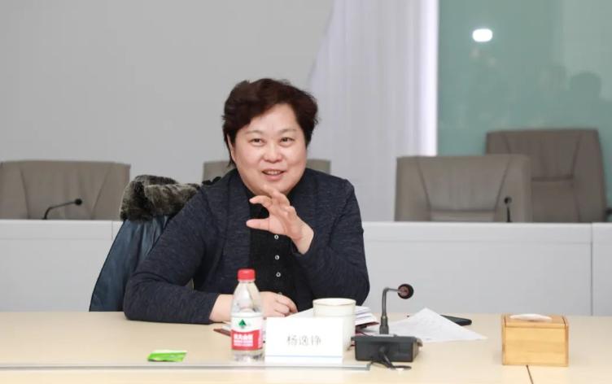
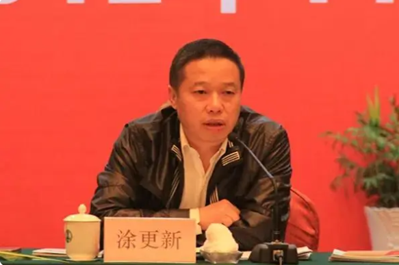

# 二十届中央首轮巡视10位组长亮相，有6个“新面孔”

**撰文 | 高语阳**

3月27日，全国巡视工作会议暨二十届中央第一轮巡视动员部署会召开。二十届中央首轮巡视拉开帷幕。

近日，中央视组巡视工作动员会先后召开，政知君梳理，已经有10位中央巡视组组长亮相。

**十八大以来首次**

3月27日，全国巡视工作会议暨二十届中央第一轮巡视动员部署会召开。中共中央政治局常委、中央巡视工作领导小组组长李希出席会议并讲话。

二十届中央首轮巡视拉开帷幕。

李希指出， **对中管企业开展常规巡视** ，着力查找影响制约高质量发展的主要矛盾、突出问题。 **对金融单位开展“回头看”**
，要深入检查落实上一轮巡视整改要求的实际行动和成效，推动解决金融领域存在的突出问题。 **对国家体育总局开展机动巡视**
，深入查找、推动解决体育领域特别是足球领域腐败问题和深层次体制机制问题，为建设体育强国提供有力保障。

同天，二十届中央第一轮巡视对象公布。

这次巡视将对中国核工业集团有限公司、中国航天科技集团有限公司等30家中管企业党组开展常规巡视；对中国投资有限责任公司、国家开发银行、中国农业发展银行、中国光大集团股份公司、中国人民保险集团股份有限公司等5家中管金融企业党委开展巡视“回头看”；对国家体育总局党组开展机动巡视。

**在一轮中央巡视同时安排常规巡视、机动巡视和“回头看”三种组织方式，这在党的十八大以来还是首次。**

**10位巡视组组长亮相**

近日，中央巡视组陆续进驻被巡视单位，中央巡视工作动员会先后召开。

**截至目前，二十届中央首轮巡视的10位中央巡视组组长亮相。** 组长和其进驻的巡视对象基本情况如下：

中央第一巡视组组长陈章永，进驻中国兵器工业集团有限公司、中国兵器装备集团；

中央第二巡视组组长孔圣根，进驻中国联合网络通信集团有限公司；

中央第三巡视组组长杨逸铮，进驻国家电网有限公司；

中央第四巡视组组长涂更新，进驻中国航天科技集团有限公司；

中央第五巡视组组长杨正超，进驻国家开发银行、中国农业发展银行、中国人民保险集团股份有限公司；

中央第七巡视组组长秦斌，进驻中国长江三峡集团有限公司；

中央第九巡视组组长张福根，进驻中国航空发动机集团有限公司；

中央第十一巡视组组长樊大志，进驻中国华能集团有限公司、中国大唐集团有限公司；

中央第十二巡视组组长祝树民，进驻中国核工业集团有限公司；

中央第十四巡视组组长高飞，进驻中国电子信息产业集团有限公司。

**其中，杨正超、秦斌、祝树民、高飞都是曾在十九届中央巡视工作中担任过组长的“老将”。**

**“新面孔”**

已经亮相的10位中央巡视组组长中，有6个“新面孔”。

**杨逸铮、涂更新、樊大志都是二十届中央纪委委员。**

**杨逸铮** 现任中央纪委国家监委驻国家市场监督管理总局纪检监察组组长、国家市场监督管理总局党组成员。

杨逸铮是“女将”，出生于1966年12月，曾任北京市纪委副书记，2020年3月前往国家市场监督管理总局出任现职。

**涂更新** 现任中央纪委国家监委驻商务部纪检监察组组长，商务部党组成员。

涂更新1964年6月出生，曾任中央纪委国家监委第七监督检查室主任，2020年6月前往商务部出任现职。

_樊大志_

**樊大志** 现任中央纪委国家监委驻中国证券监督管理委员会纪检监察组组长，中国证监会党委委员。

樊大志1964年9月出生，曾任中央纪委国家监委驻中国银行纪检监察组组长，中国银行党委委员，同年4月出任现职。

另外3人简历未有官方披露。

政知君梳理公开报道注意到，陈章永曾以中央纪委国家监委第八监督检查室主任身份接受采访，孔圣根曾以中央组织部干部监督局局长的身份出现在公开报道中，张福根则曾以中组部干部教育局局长身份参加活动。

**资料 | 中央纪委国家监委网站 央视新闻 人民网等**

**【版权声明】本文著作权归政知新媒体独家所有，未经授权，不得转载。**

