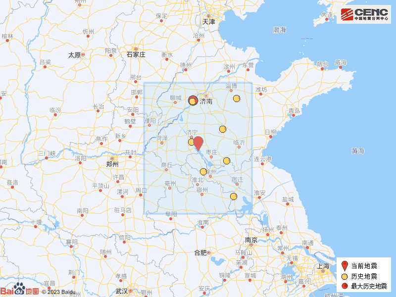

# 山东济宁市微山县发生3.2级地震，济南、枣庄、临沂等地有震感

山东商报·速豹新闻网记者 朱德蒙 见习记者 于洋

据中国地震台网正式测定，4月8日8时36分在山东济宁市微山县发生3.2级地震，震源深度8公里，震中位于北纬35.08度，东经116.83度。

据了解，震中5公里范围内平均海拔约32米。根据中国地震台网速报目录，震中周边200公里内近5年来发生3级以上地震共9次，最大地震是2020年2月18日在山东济南市长清区发生的4.1级地震（距离本次震中156公里）。

_（历史地震分布图）_

本次地震山东多地均有震感，据网友表示，济南、枣庄、济宁、泰安、临沂等地市均有微弱震感。

山东商报·速豹新闻网编辑 张蕾 王之煊

