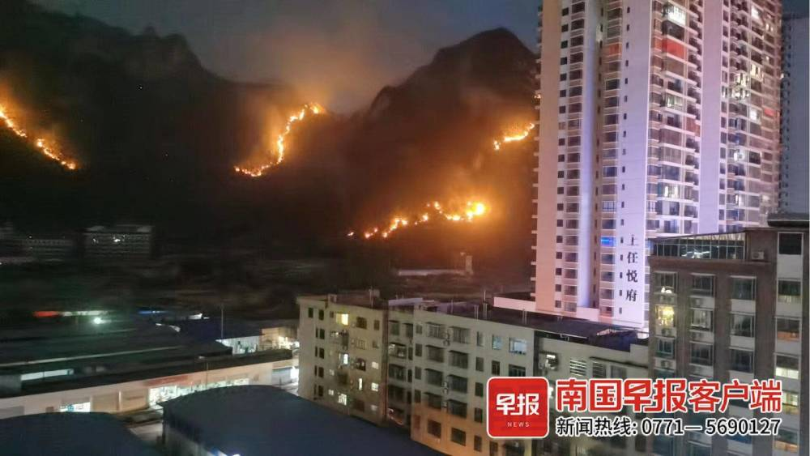
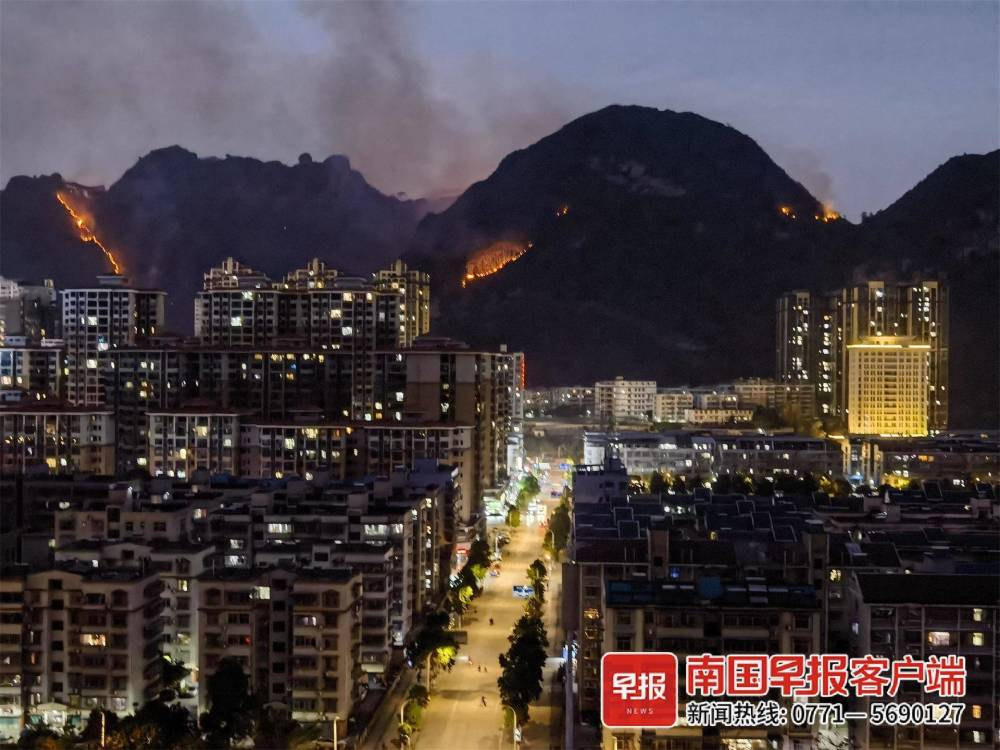
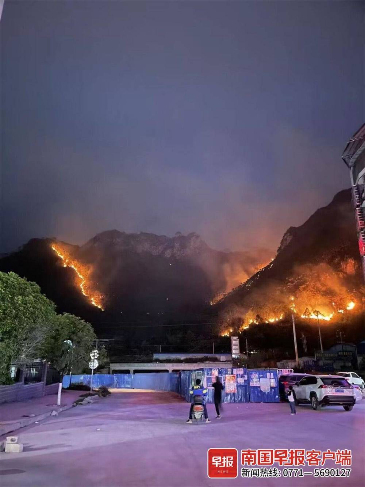

# 广西河池老虎山起火，从白天烧到晚上，山脚处靠近居民区

4月8日下午3时许， **河池市金城江区老虎山突发山火，** 当地组织森林消防等部门救援人员前往灭火。

**截至晚上8时20分，山火仍在持续。**

据悉，老虎山是金城江城区主要的山脉之一，占地面积较大。多名居民向南国早报全媒体记者反映， **当天下午3时许，老虎山靠近城东片区的山头开始起火，**
由于风力较大，天气干燥，火势蔓延较快，起火点呈多点分布。

_▲本次山火的起火点呈多点分布。网友供图_

当晚8时20分，记者从河池市应急管理局获悉，目前当地已组织金城江区应急管理局、森林消防、多个街道办工作人员抵达现场， **同时动用多架无人机参与灭火。**

_▲事发现场。网友供图_

目前， **山脚处靠近居民区的火势已得到控制，** 一些地势高、陡峭处的火苗仍未扑灭。 **山火暂未导致人员伤亡，事发原因仍在调查中。**

