# 最新画面！环台岛战备警巡和演习，更多细节公开

多艘驱护舰慑压进逼，战机挂载实弹空战对抗……

东部战区组织环台岛战备警巡和“联合利剑”演习，一起看更多细节。

**检验夺取制海权**

**制空权、制信息权能力**

今天的演练，重点检验联合作战体系支撑下夺取制海权、制空权、制信息权能力，任务部队同步组织环台岛战巡进逼，塑造全向围岛慑压态势。

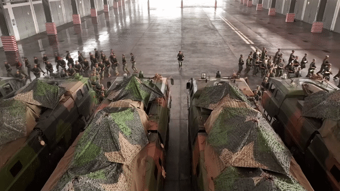

东部战区联合作战指挥中心下达指令后，从地面指挥机构到空中指挥枢纽，从陆上火力单元到海空作战平台，指挥信息高效流转，任务兵力密切协同。

战区陆军远箱火，海军驱护舰、岸导突击群，空军歼击机、轰炸机、特种机，火箭军常导火力单元等任务兵力快速向预定区域机动集结，展开行动部署。岸海空网电对抗力量，全程展开电子侦察、干扰压制等支援行动。

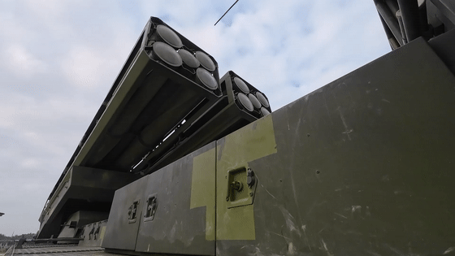

**海军多艘驱护舰**

**高速慑压进逼**

执行警巡任务的东部战区海军多艘驱护舰， **高速向台岛周边海域慑压进逼** ，灵活机动抢占有利阵位，根据现场态势，组织 **近距突击、远域慑阻、防空反导**
等课目演练。

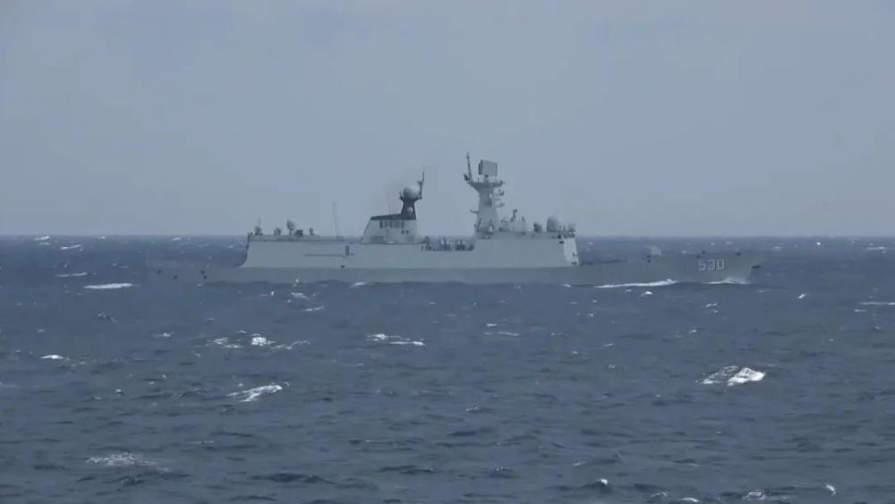

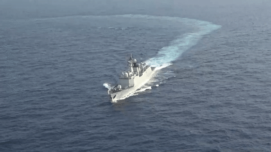

为全面夺控海空优势，在台岛周边海域， **联合反潜演练** 同步打响。警巡舰艇编队与反潜巡逻机组网建链，构成联合反潜体系。

反潜巡逻机率先发现“水下异常”，远程水声监听力量协同印证，引导多型平台装备前出侦察比对，经过数据融合分析，精准捕获目标信号，各水面舰艇迅即展开围堵驱歼，协同“猎鲨”。

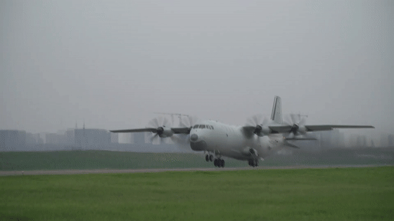

海上编队指挥员刘苏闽：“海军舰艇编队位台岛周边多域布势，检验部队侦、控、防、打、评等关键能力，进一步贯通了联合作战信火链路。”

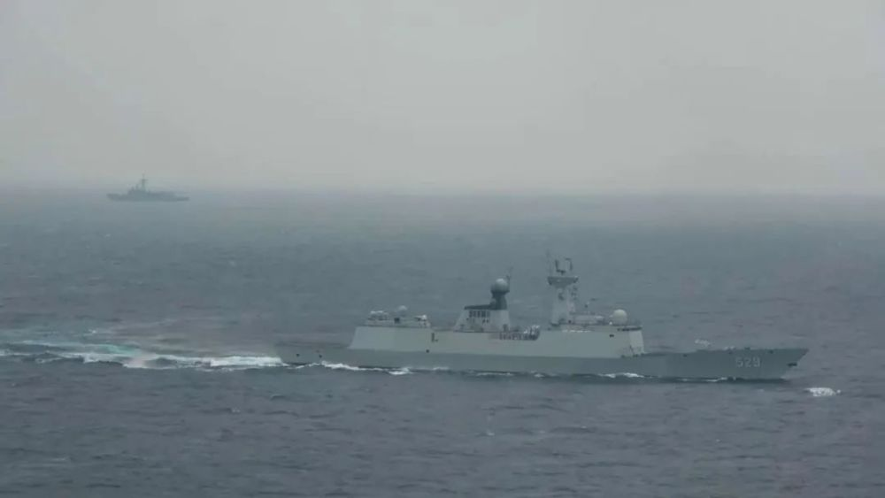

**空军数十架战机**

**多波次中远距空战对抗**

在夺取制空权演练中，战区空军数十架 **歼-16、歼-10C** 战机挂载实弹，在 **预警机、干扰机、加油机**
引导支援下，展开多波次中远距空战对抗。各型战机混合编组、灵活布势，运用干扰压制、占位阻击等方式，对“敌”空中兵力实施快速寻歼，有效夺取并保持任务空域制空权。

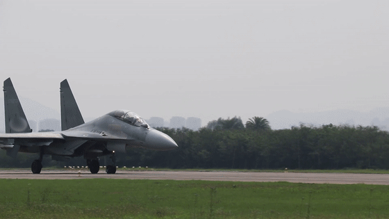

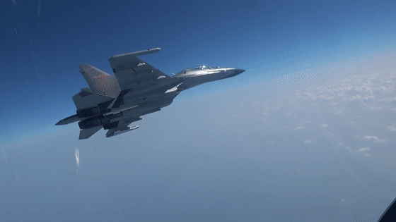

东部战区空军某旅旅长吕根章：“在空战对抗中，我们依托制空作战体系支撑，实现‘敌情’信息实时传递、战场态势快速共享、协同打击高效发起。”

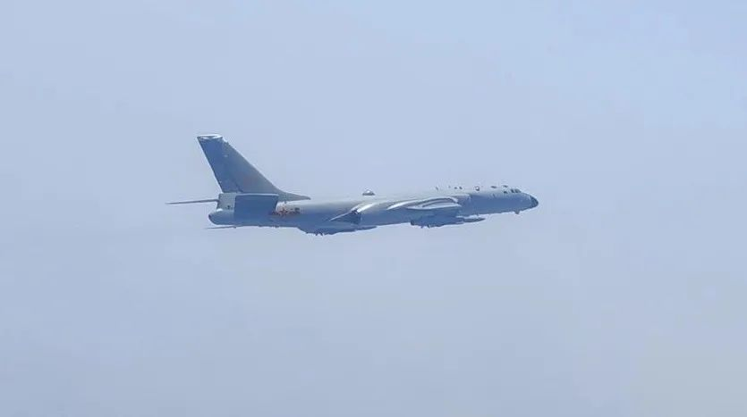

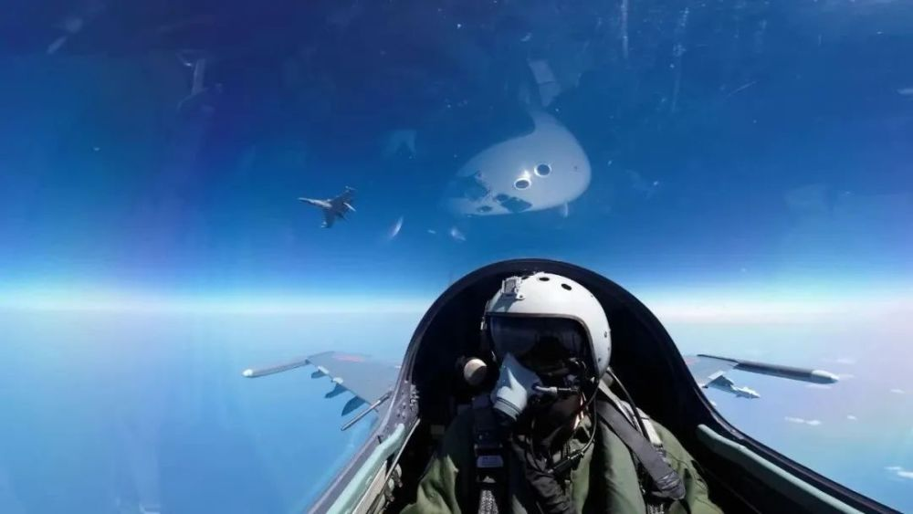

**陆军多个炮兵旅**

**火箭军多个常规导弹旅出动**

东部战区陆军多个炮兵旅、火箭军多个常规导弹旅依令进入预定作战地域，各发射单元迅即占领发射阵地，展开发射准备，协同海空突击力量，对预定目标实施模拟打击，检验联合作战体系支撑下火力快反和远程精打效能。

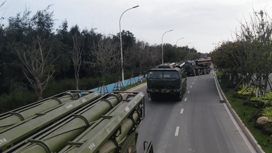

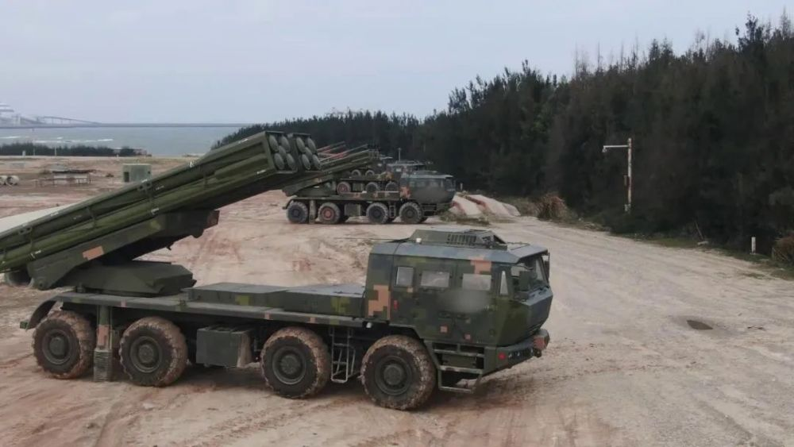

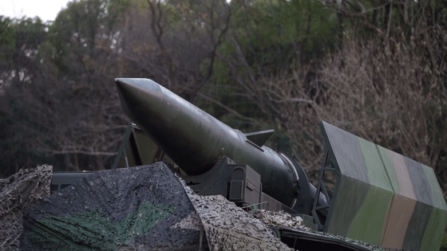

中国人民解放军东部战区按计划于4月8日至10日在台湾海峡和台岛北部、南部、台岛以东海空域组织环台岛战备警巡和“联合利剑”演习。东部战区新闻发言人施毅表示，这是对“台独”分裂势力与外部势力勾连挑衅的严重警告，是捍卫国家主权和领土完整的必要行动。

**监制丨马烨**

**主编丨白晨**

**记者丨樊斌 张磊 陈利 李骏 张文杰 洪治许溟**

**吕晓博 董满 李倩 王戈**

**韩学扬康鹏程 向黎鸣丁文俊**

**张先瑞 曹臻浩 甘凯魁**

**编辑丨王珊**

**视频编辑丨王婧晗**

**©央视军事**

