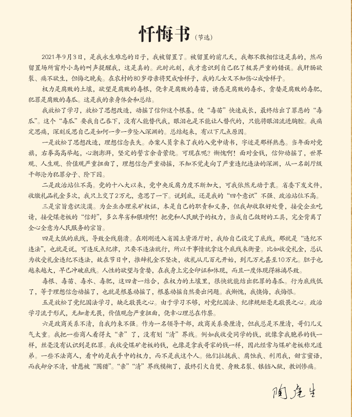

# 爱唱《铁窗泪》的贪官陶虎生，曾经“浑身上下都是权力”

澎湃新闻记者注意到，最新一期陕西省纪委监委主办的《党风与廉政》杂志刊发了《若念“铁窗泪”
何来“愁啊愁”——陕西省自然资源执法局原局长陶虎生案警示》以及陶虎生的忏悔书 （节选）。

文章介绍，在被称为“中国煤炭黄金10年”起点的2002年，时年41岁的陶虎生出任陕西省国土资源厅规划与评审中心副主任。

这是一个肩负全省矿产资源规划编制、矿产储量评审等重要工作的岗位，同时也承担着维护国家对矿产资源所有权的职责。陶虎生的贪腐之路正是从这一时期开始的，至2021年被查，时间跨度长达近20年。

2022年8月，检察机关依法对陶虎生涉嫌受贿案提起公诉。检方指控，陶虎生在担任陕西省国土资源厅规划与评审中心副主任、主任，省国土资源厅矿产开发管理处处长、监察局副局长、局长，省自然资源执法局局长等职务期间，利用职务便利，为他人谋取利益，非法收受他人财物，数额特别巨大，依法应当以受贿罪追究其刑事责任。

随着矿产资源领域反腐败工作持续深化，2021年9月，从陕西省自然资源执法局局长任上退休不到一周的陶虎生被查。

陶虎生的仕途起点很高。1996年3月，参加工作仅12年，35岁的他就出任陕西工程勘察研究院院长。

之后的22年间，陶虎生的事业步入快车道，几乎每两年就换一个岗位。他先后担任陕西省地质环境监测总站副站长，陕西省国土资源厅规划与评审中心副主任、主任，陕西省国土资源厅矿产开发管理处处长等职务；任期最长的5年，最短的只有3个月。

2018年5月，57岁的陶虎生再度获得升迁，担任陕西省国土资源监察局局长，正式跻身副厅级。次年2月，他再度履新陕西省自然资源执法局局长，直至两年后退休被查。

在矿产资源管理部门工作多年，且长期担任部门“一把手”，陶虎生可谓“浑身上下都是权力”。在陕西省国土资源厅规划与评审中心副主任的任上，陶虎生得以近距离接触很多煤老板，互动频繁：他利用职权为对方提供方便，对方则以“感谢费”为名向他进行利益输送。

“开始给500元信封，拿在手上，心里怦怦直跳。后来慢慢习惯了，心也不跳了。”陶虎生在忏悔书中坦言，逢年过节，他都能收到老板们送来的大大小小的红包，“特别是春节前夕较多，元旦、中秋、端午，零星也有。”

小节失守即是大节不保的发端。特别是2007年担任陕西省国土资源厅规划与评审中心主任后，当陶虎生看到身边的老板朋友们在他的帮助下日进斗金、住豪宅开豪车时，他已经不再满足于逢年过节收受礼品礼金了。

陶虎生的一个朋友想收购煤矿，希望获得便利条件。陶虎生爽快答应，事后对方给他转账200万元作为感谢费，他心安理得收下。另一个与陶虎生关系密切的老同学，同样得益于陶虎生的帮助，顺利承揽了全省矿产资源利用现状调查、煤矿储量勘探等多个项目，先后送给陶虎生130多万元。

矿业是国民经济的基础产业。与私营企业主沆瀣一气，“养肥”了陶虎生的“胆”。经查，陶虎生通过手中掌握的矿产资源规划编制、矿产资源储量评审、采矿权证办理等权力，累计索取或收受22名矿产私营企业主贿赂860多万元。

这种畸形的政商交往，是对营商环境的极大损害。在与陶虎生的接触中，很多私企老板的思维逻辑是“不拿钱根本办不成事”。

《党风与廉政》杂志文章介绍，相对其他领域，矿产资源审批程序复杂、时间较长，有些矿业权申请人为尽快取得矿业权，便想尽办法寻找“捷径”。在陶虎生看来，收受管理和服务对象送的礼品礼金，最多算是违纪问题。他甚至给自己设了一条底线——可以违反纪律，只要不违法就行。

事实上，领导干部往往是从违纪开始，进而违法的。虽然“四风”问题和腐败问题之间并没有明确的界线，但却有着直接的演进逻辑。许多时候，外在的作风奢靡，往往暗藏着严重的腐败问题。当收送礼品礼金的行为渗入公共权力和私人利益，“礼尚往来”就变成了“利尚往来”。陶虎生之所以走向自己人生的反面，与小节不守、小德不顾、小廉不行大有关系，与作风松懈、理想信念偏差、纪法防线全面失守密不可分。这从两件事中得以一窥。

其一，陕西省自然资源执法局党支部集体学习《中国共产党纪律处分条例》时，作为“一把手”的陶虎生不愿领学，安排一名副局长替他读《条例》。

其二，陕西省纪委监委下发的文件，陶虎生从来不愿意打开看。

在接受组织审查调查期间讲起这两件事，陶虎生坦言，之所以消极对待政治学习和纪法学习，最主要的一个原因是“不敢面对”：“党纪党规、法律法规中的很多条款，都能给自己套上，对号入座，内心有抵触情绪，所以不愿意学习。”

《党风与廉政》杂志文章介绍，矿产资源开发领域腐败问题危害十分严重。少数矿产私营企业主通过单井扩大、再扩大等方式进行虚假矿产资源整合，或者通过协议取得的方式获得矿产资源，再以股权转让代替矿业权转让的手法从事倒卖矿产资源活动，给国家带来重大损失。

更为严重的是，一些领导干部与矿产企业大肆进行权钱交易，不仅在经济上共同攫取国有资源，而且严重污染政治生态。

2020年3月起，陕西省开展为期两年的领导干部违规插手干预工程建设和矿产资源开发突出问题专项整治，严肃查处在工程建设、矿产开发中滥用职权、谋取私利，搞权钱交易、利益输送等行为。

《党风与廉政》杂志文章介绍，在陶虎生被查前，陕西矿产开发领域“地震”不断。《党风与廉政》记者梳理发现，仅2020年，陕西矿产资源开发领域已有至少2名省管干部接受审查调查，3名省管干部被开除党籍、开除公职或取消退休待遇。其中，对陕西燃气集团有限公司原党委书记、董事长郝晓晨的通报指出其“靠企吃企、滥权妄为，大搞权钱交易，利用掌握的国家垄断性资源攫取巨额利益，肆意践踏法纪”；陕西省发展和改革委员会原党组副书记、副主任贺久长则存在“在能源资源领域大肆进行权力寻租和权钱交易，逾越党纪国法底线”的行为。

在接受审查调查前，陶虎生预感到自己的问题可能会暴露，他将违纪违法收受的400余万元，分别储存在多个以同学或亲戚名义开设的银行账户中，企图掩盖其严重违纪违法的事实。一直到留置初期，陶虎生还认为“自己已经做得天衣无缝”，在事实面前百般抵赖，妄图蒙混过关。

2022年4月，陶虎生被开除党籍、开除公职。审查调查结果显示，陶虎生在矿产资源储量评审，矿区范围划定，采矿权设立、延续、变更等方面为他人谋取利益，其违纪违法金额合计达990多万元。此外，陶虎生还严重违反党的政治纪律、组织纪律、廉洁纪律、工作纪律和生活纪律，违反国家法律法规涉嫌受贿犯罪，且在党的十八大后不收敛、不收手。

《党风与廉政》杂志文章介绍，矿产资源开发领域政策支持力度大、资源集中、资金密集，行业统筹性强，本身就是腐败问题易发高发的行业。2022年5月12日，陕西省自然资源厅党组召开陶虎生严重违纪违法案以案促改动员部署视频会议。会议传达了《省纪委关于给予陶虎生开除党籍处分的通知》《省监委关于对陶虎生享受的待遇给予调整处理的通知》，强调要坚持以案治本、立足常态，全面从严管党治党，推动形成用制度管人、管事、管权的长效机制。

这是来自陶虎生案的警示。

“月儿啊弯弯照我心，儿在牢中想母亲，悔恨未听娘的话呀，而今我成了狱中的人。”年轻时，陶虎生对这首曾风靡一时的《铁窗泪》津津乐道，如果他真能听懂这首歌背后的深意，又何来今日的“铁窗之愁”。

