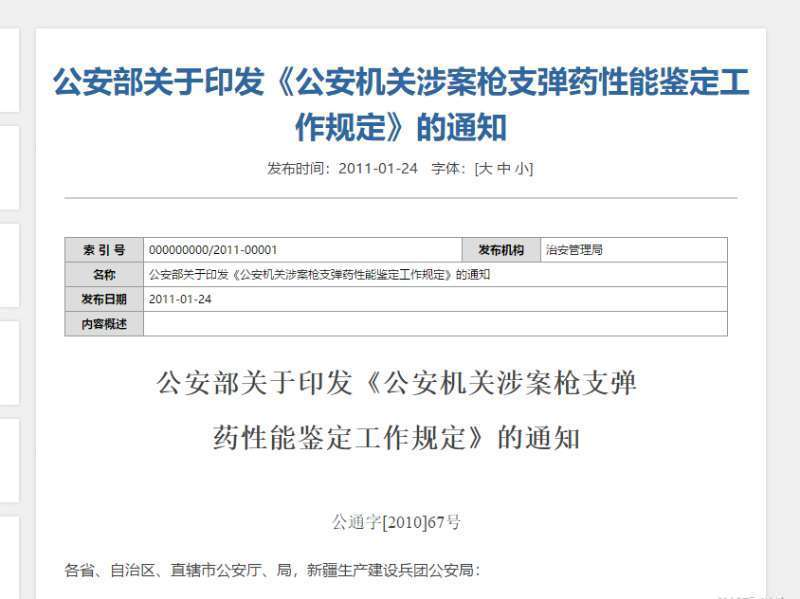
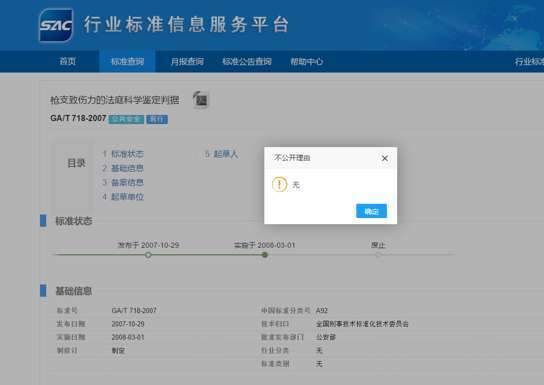
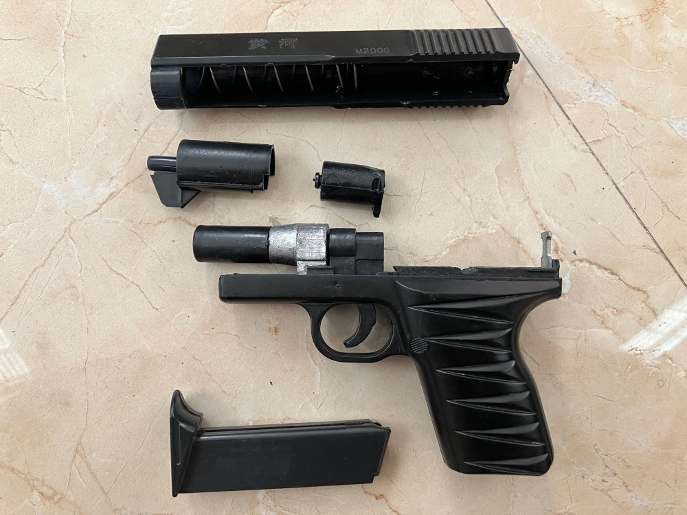
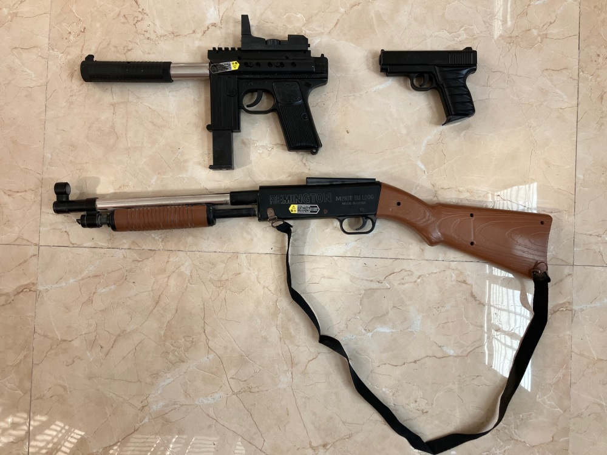
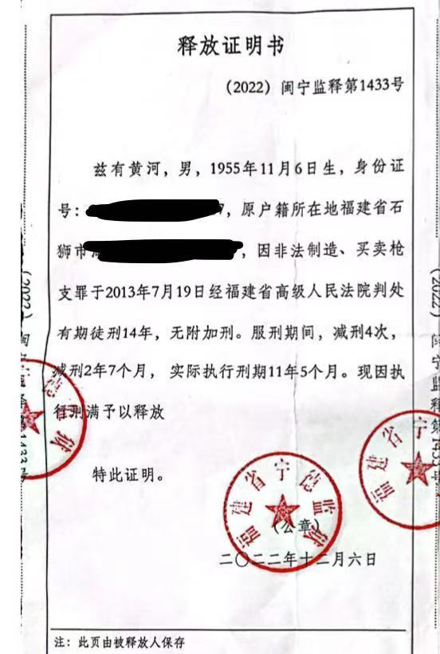

# 玩具厂造的数千支塑料枪被认定为枪支，负责人刑满后仍要申诉

“我造的‘枪’能装备一个师。”黄河用带有浓重闽南口音的普通话自嘲地说，“但我认为我无罪，我还要继续申诉。”

黄河是福建晋江人，仅有初中学历的他，早年在国企做电工，下岗后和朋友先后开办过弹簧厂、塑料厂。2003年9月，他在村里开办了一家玩具厂，并从香港买回台湾生产的玩具枪进行仿制，得益于当地众多的海外侨胞，黄河生产的黄河牌玩具枪一度远销捷克、菲律宾等国。

_公安部于2011年1月24日公布了《公安机关涉案枪支弹药性能鉴定工作规定》_

在黄河的玩具厂迅速发展之际，2010年，公安部印发《公安机关涉案枪支弹药性能鉴定工作规定》，明确了枪支认定标准，对不能发射制式弹药的非制式枪支，枪口比动能大于等于1.8J/CM2即认定为枪支。2011年4月，黄河的一个下游经销商在河南许昌被警方抓获，之后黄河进入警方视野。当年7月，黄河被刑拘，警方查抄他的玩具厂时，起获了近两万支塑料玩具枪，后认定其中6103支是具有致伤力的枪支。

2012年，因非法制造、买卖枪支罪，黄河一审被判处有期徒刑14年，其上诉后被驳回。

黄河被抓后，黄河牌玩具枪在市场上逐渐消匿。不过，随着短视频社交平台的兴起，又有一些人在社交平台上展示其拥有的黄河牌玩具枪，称其为“情怀玩具”。还有很多账号在发布玩具枪视频时，加上#黄河玩具枪#作为标签，而黄河辨认后指出，只有个别的是出自他的玩具厂，其余大多都是蹭热度。

2022年12月6日，经过4次减刑后，服刑11年5个月的黄河刑满获释。此时，黄河已67岁，他决定继续申诉。

_确定“未造成人员伤亡的非制式枪支致伤力判据为枪口比动能≥1.8J/CM2”的《枪支致伤力的法庭科学鉴定判据》在国家标准化管理委员会官网上是不公开状态。_

玩具厂成“兵工厂”

生于1955年的黄河曾是福建晋江市智高玩具有限公司总经理，该公司成立于2003年，主要从事玩具火车和玩具枪的制造与销售。2011年7月7日，黄河因涉嫌非法制造枪支罪被刑拘。

泉州中院于2012年12月20日作一审判决，认定被告单位智高玩具公司犯非法制造、买卖枪支罪，判处罚金三十万元；被告人黄河犯非法制造、买卖枪支罪，判处有期徒刑十四年。

法院审理查明，2005年7月，被告人黄河因其负责的智高玩具有限公司非法制造仿真枪支被晋江市公安局行政处罚。

2008年初，被告人黄河再次在其经营管理的晋江市智高玩具有限公司注塑车间、装配车间内，雇佣工人生产“黄河”牌系列塑料枪后出售。2011年7月案发时，公安机关扣押智高玩具有限公司生产的“黄河”牌系列塑料枪成品共计19824支。经检验鉴定，“黄河”牌系列塑料枪均以压缩气体为动力发射弹丸，其中5728支具有致伤力，认定为枪支。

此外，法院还审理查明，2010年3月，被告人黄河为牟取暴利，还在其经营的智高玩具公司厂区组建EG723型气手枪生产车间，被告人黄河负责EG723型气手枪的原料采购及产品销售，被告人葛鸿鑫负责车间管理及EG723型气手枪的研发、装配工作。

2011年4月2日，被告人黄河将智高玩具公司生产的50件（共计600支）EG723型气手枪托运至河南省郑州市，贩卖给张国林（另案处理），张国林购买后将部分EG723型气手枪转手出售。2011年4月21日，河南省许昌市公安局抓获张国林后，依法扣押了尚未卖出的EG723型气手枪413支。经检验鉴定，该EG723型手枪均以压缩气体为动力发射弹丸，其中375支具有致伤力，认定为枪支。

泉州中院认为，犯罪单位智高玩具公司违反国家枪支管理法规，非法制造、买卖枪支；被告人黄河作为该公司主管人员，违反国家枪支管理法规，非法制造、买卖枪支，其行为构成非法制造、买卖枪支罪，遂作出前述判决。

案发后，有媒体在报道时，将智高玩具厂称为“兵工厂”。

_涉案的黄河牌玩具枪_

狱中申诉被驳回

黄河坚称无罪，选择上诉。

黄河当时的上诉理由包括:《中华人民共和国枪支管理法》（简称《枪支管理法》）规定的枪支必须以火药或压缩气体为动力，足以致人伤亡（轻伤以上）或丧失知觉，公安机关根据《枪支致伤力的法庭科学鉴定判据》（简称《鉴定判据》）的规定将枪口比动能大于或等于1.8J/CM2全部认定为枪支，既没有科学依据，也不符合《枪支管理法》规定的“足以致人伤亡或丧失知觉”的情形；《鉴定判据》只是公安部制定的行业标准，没有以部门规章形式向社会公告，不具有部门规章的效力；《鉴定判据》从未在生产流通领域进行公告，其并不知道产品违反规定，主观上没有制造枪支的故意等，请求改判无罪。

福建高院审理后认为，经查，《中华人民共和国标准化法》第五条第一款规定：国务院有关行政主管部门分工管理本部门、本行业的标准化工作；第六条第一款规定：对没有国家标准而又需要在全国某个行业范围内统一的技术要求，可以制定行业标准。行业标准由国务院有关行政主管部门制定，并报国务院标准化行政主管部门备案。

《枪支管理法》第四条规定：国务院公安部门主管全国的枪支管理工作。根据以上规定，公安部是枪支管理工作主管部门，其负责管理枪支的标准化工作，在没有国家标准的情况下，有权根据需要报国务院标准化行政主管部门备案后制定枪支的行业标准。《枪支致伤力的法庭科学鉴定判据》是由公安部制定，经国家标准化管理委员会2008年第2号行业标准备案公告，2008年3月1日开始实施的枪支管理行业标准，该规定3.2条规定未造成人员伤亡的非制式枪支致伤力判据为枪口比动能大于等于1.8J/CM2。根据该规定，枪口比动能大于等于1.8J/CM2的非制式枪支均应被认定为具有杀伤力。

因此，福建高院认为，黄河的上诉理由没有事实法律依据，不能成立，不予采纳。

此外，关于黄河上诉称其并不知道产品违反规定，主观上没有制造枪支的故意这一上诉理由，经查，黄河于2005年即因制造仿真枪被公安机关查处，对其生产销售的产品已违反规定应属明知。该上诉理由不能成立，不予采纳。

2013年7月19日，福建高院驳回了黄河的上诉，维持了对智高玩具公司及黄河本人的原判。

虽然二审为终审判决，但黄河仍不服判，入狱后继续申诉，但先后被福建省检察院和福建高院驳回。

2022年12月6日，黄河从宁德监狱刑满获释。其在服刑期间减刑4次，减刑2年7个月，原本14年的刑期实际执行了11年5个月。

2023年2月，黄河接受澎湃新闻采访时表示，当年被定为枪支的5728支黄河牌塑料玩具枪，并不是以压缩气体为动力的，不符合《枪支管理法》中规定的“以火药或者压缩气体等为动力”这一情形。他还拿出两把当初遗留在家中的玩具枪拆解开来向记者展示其发射原理，“这是利用压缩弹簧来推动BB弹发射的，所以每次只能完成一次击发”。

但他承认，EG723型气手枪是利用压缩气体为动力，“枪体里有一个小气瓶，注入压缩气体后可以连发，给打火机充气的气罐就可以用来给这种枪充气。”智高玩具公司生产的EG723型气手枪共有375支被认定为枪支，也是导致该案案发的枪型。

_涉案的黄河牌玩具枪_

出狱后仍要申诉

目前，黄河已委托北京冠领（上海）律师事务所律师李阳、李向荣帮他写了申诉书，准备继续申诉。

其申诉事实及理由为，黄河主观上没有非法制造、买卖枪支的犯罪故意，客观上没有造成危害后果，社会危害性显著轻微，判决所依据的1.8J/CM2的枪支鉴定标准不合理、不合法，不应作为鉴定依据，且鉴定主体、鉴定程序不合法，鉴定过程及结果也存在不能排除合理怀疑情况，本案未达到刑事案件定罪标准要求，应判决无罪。

律师认为，刑事定罪应遵循主客观相一致原则，主观上必须具有犯罪的故意，不应客观归罪。本案要认定申诉人构成犯罪须证明申诉人主观上认识到自己的行为是一种非法制造买卖枪支的行为，才能认定申诉人构成非法制造、买卖枪支罪。

判决书认定的作案时间是2008年初至2011年7月，那么，从2008年初至2011年7月案发，申诉人黄河是否知道自己所生产和销售的玩具枪中有部分是枪口比动能超过1.8J/CM2而构成所谓的刑法意义上的枪支呢？

_黄河的刑满释放证明_

律师认为，枪口比动能超过1.8J/CM2一律认定为枪支的规定，直到2011年1月24日才由公安部在其网站上首次向公众公布，在此之前包括申诉人黄河在内的普通民众不清楚有此规定。

在此之前，普通民众在公开渠道上只知道1996年10月1日实施的《枪支管理法》第四十六条的规定：“本法所称枪支，是指以火药或者压缩气体等为动力，利用管状器具发射金属弹丸或者其他物质，足以致人伤亡或者丧失知觉的各种枪支。”

此外，律师还对1.8J/CM2这一枪支鉴定标准的出台程序、法律效力等提出质疑。

澎湃新闻查阅公安部官网发现，2011年1月24日，公安部官网公布了《公安机关涉案枪支弹药性能鉴定工作规定》，其中明确规定，“对不能发射制式弹药的非制式枪支，按照《枪支致伤力的法庭科学鉴定判据》（GA/T
718-2007）的规定，当所发射弹丸的枪口比动能大于等于1.8焦耳/平方厘米时，一律认定为枪支。”

《枪支致伤力的法庭科学鉴定判据》起草单位为公安部刑事科学研究所，公安部于2007年10月19日批准发布，从2008年3月1日起实施。公安部官网未公布该鉴定判据，而国家标准化管理委员会官网也只是公布了该鉴定判据的基础信息、备案信息、起草单位等，其正文也是不公开状态。

不过，由于近年来“假枪真罪”案频发，《枪支致伤力的法庭科学鉴定判据》内容得以通过其他渠道公开，其中规定：“制式枪支、适配制式子弹的非制式枪支、曾经发射非制式子弹致人伤亡的非制式枪支直接认定为具有致伤力；未造成人员伤亡的非制式枪支致伤力判据为枪口比动能≥1.8J/CM2。”

2018年1月，最高法、最高检发布《关于涉以压缩气体为动力的枪支、气枪铅弹刑事案件定罪量刑问题的批复》，其中规定，“对于非法制造、买卖、运输、邮寄、储存、持有、私藏、走私以压缩气体为动力且枪口比动能较低的枪支的行为，在决定是否追究刑事责任以及如何裁量刑罚时，不仅应当考虑涉案枪支的数量，而且应当充分考虑涉案枪支的外观、材质、发射物、购买场所和渠道、价格、用途、致伤力大小、是否易于通过改制提升致伤力，以及行为人的主观认知、动机目的、一贯表现、违法所得、是否规避调查等情节，综合评估社会危害性，坚持主客观相统一，确保罪责刑相适应。”

黄河认为，这是“两高”对以往枪支判定标准过低所带来的打击面过大过重问题的纠错。

