# 缅泰边境紧张局势升级，电诈园区末日来临？离被摧毁还有很长一段路

最近这段时间，缅泰边境妙瓦底一直处在风口浪尖上。

网络赌博、电信诈骗、人口贩卖、器官买卖……不少国内外媒体曝光了被骗人员的亲身经历，妙瓦底成了现实版“人间地狱”。

除了一系列“黑灰产业”的肆虐，近期，妙瓦底的战事也频频登上热搜。不过，这一次，对于战争，很多网友不再是“反战”的和平者。

**缅泰边境紧张局势进一步升级**

消息显示，3月25日起截至目前，高加力镇区与妙瓦底镇区亚洲公路沿线，政府军、克伦边防军（BGF）与武装联军之间，接连爆发了战事，地区局势进一步升级。

3月25日，缅甸妙瓦底贸易区的警察局、运输部门办公室遭到武装人员袭击，周边部分道路和车辆遭破坏，多人受伤。军方出动了部队和直升机，双方冲突持续了数小时。3月26日凌晨5时40分许，缅甸克伦邦妙瓦底边境贸易区的海关办公室遭身份不明的武装人员袭击和纵火，5名工作人员死于火灾。

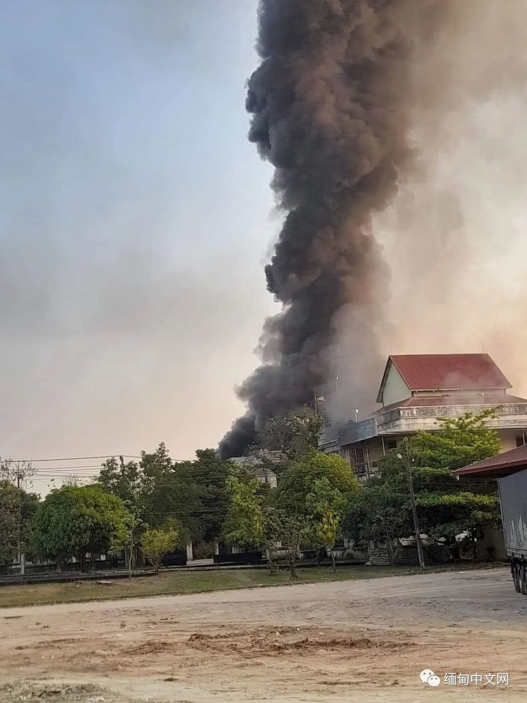

4月5日，瑞沟谷棉地区，克伦边防军（BGF）与地方武装联军之间，爆发了激烈战事。受此次战事影响，不断有居民逃往泰国边境避难。据最新消息显示，在泰国避难的难民人数已经超过8000人。

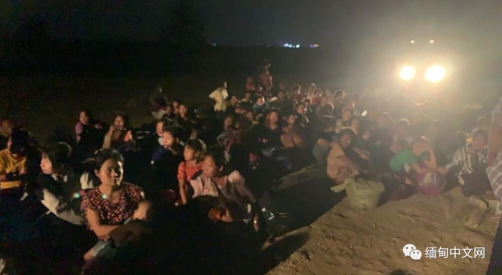

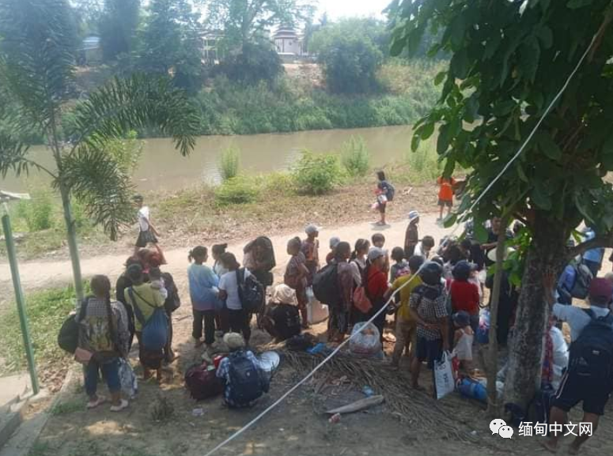

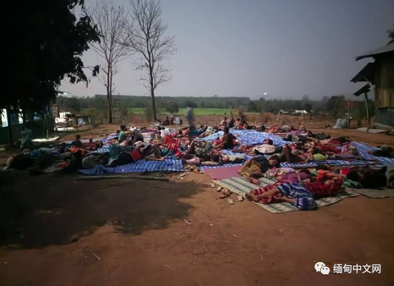

一名正在为难民提供帮助的居民表示，随着双方的紧张关系升级，前往泰国边境避难的人越来越多。目前，瑞沟谷城区几乎所有商店都关门了。受交通限制影响，居民只能逃往泰国边境躲避。在取得泰国当局的同意后，避难人员会被安置在湄索救济中心。

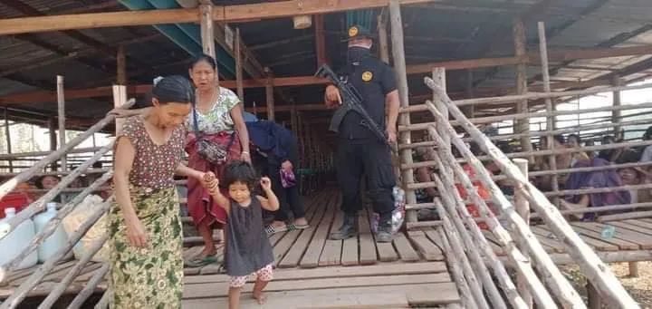

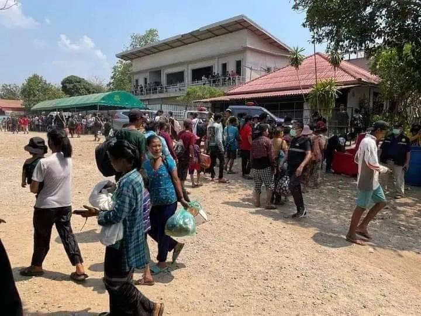

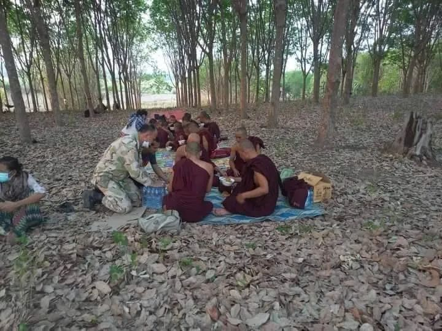

一名湄索当地的居民表示，当下正是登革热等疾病的高发季节，瑞沟谷已经很久没有发生过战事了。因为事发突然，很多人都没有提前做好避难的准备。避难人中包括老人和儿童，除了食品、药品外，还需要保暖衣物、太阳能充电板等物资援助。

4月7日，克伦邦武装联军发布了一则联合声明，4月7日至4月21日，禁止任何车辆来往妙瓦底-高加力亚洲公路。

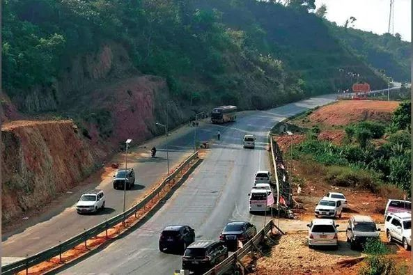

KNLA联军白虎战线负责人左特表示，前线联军召开了会议，我们达成了封锁亚洲公路的共识，希望当地居民能够遵守相关规定。近1~2个月内，我们发现政府军在使用私家车运输物资。发布声明对居民来说是好事，如果不封锁公路的话，我们的计划会有影响。

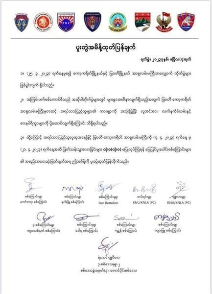

此外，4月7日，克伦邦一支名叫Lion
Battalion的武装联军组织，对外发布了一则声明。消息显示，在4月5日、4月6日的战事中，克伦边防军（BGF）死伤惨重，死亡人数为85人，受伤人数超过60人。

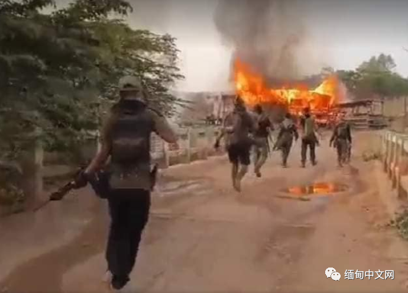

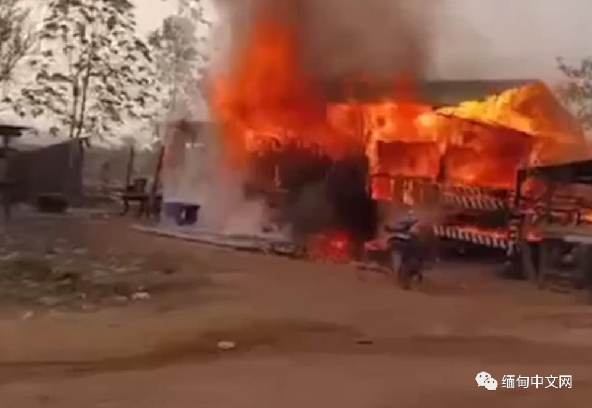

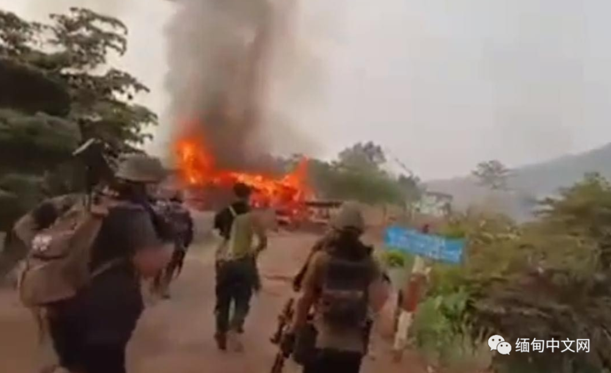

**战争对缅泰边境民生、经贸产生较大影响**

一场战争，成千上万缅籍民众沦为难民，只能逃往泰国避难。同时，缅泰边贸也受到不小的影响。

据报道，近几年以来，仰光-
妙瓦底边境贸易通道，军武时不时爆发激战战事。目前，缅甸当局升级加强了边贸通道检查力度，除了物流时效延长外，货运物流运输费用上涨了一倍左右。

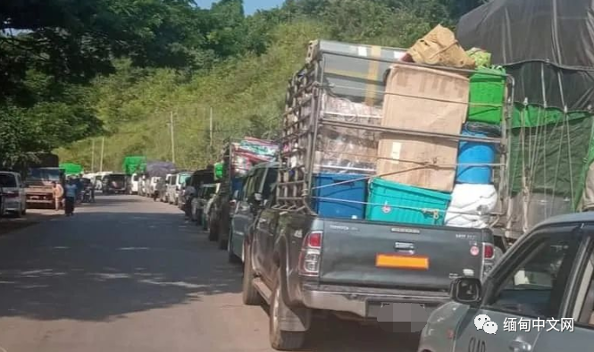

**妙瓦底电诈园区被战争摧毁了？**

缅泰边境紧张局势的不断升级，让一部分网友拍手叫好。这部分网友的观点无非就是：打仗了，那些电诈团伙也就遭殃了。

然而事实真的是这样吗？

从曝光的现场视频来看，逃难的大多是妇孺老幼，在逃难的几千人中是否包括电诈成员小编不得而知，但可以肯定的是，交战双方的目标，不是电诈分子。换句话说，摧毁妙瓦底电诈园区还有很长的一段路要走。

关于妙瓦底，我们已经写过很多次。但接连曝光的残酷事实，让小编笔下的文字也显得有些苍白。

在一系列的跨国勾兑和利益交换后，以妙瓦底地区为核心，以KK园区为代表，克伦邦就这样成为当下全球最黑暗的地区之一。

打开谷歌地图，搜索“KK园区”。你会看到在园区地图内，有许多网友所添加的“直接了当”的地名，比如：人体器官贩卖中心、保利园区（活噶腰子）···

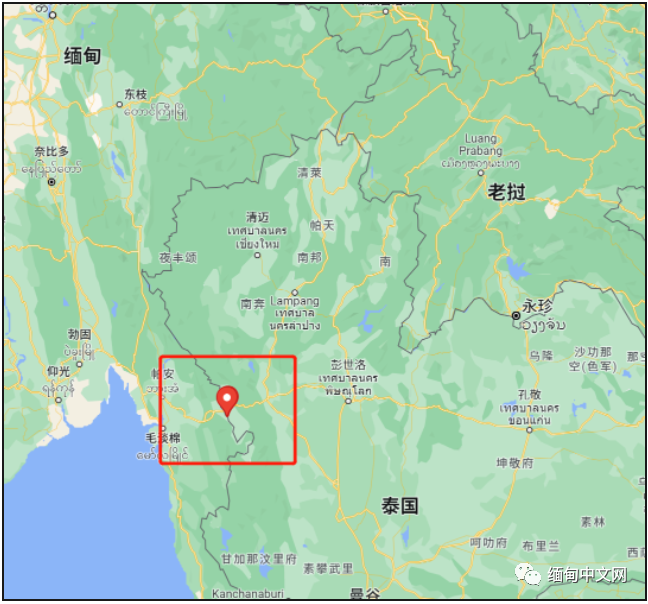

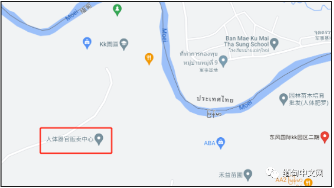

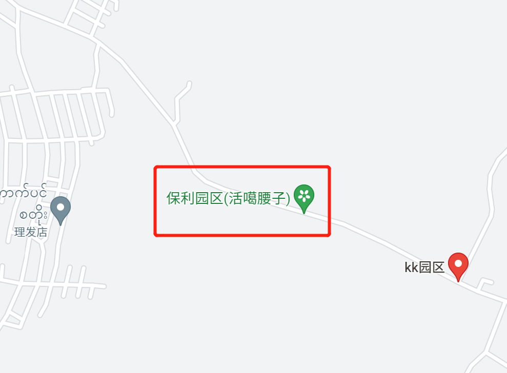

点开这些地点的评论，也是骂声不绝于耳。但网友的愤怒不无道理。

被送到妙瓦底诈骗园区的人，其国籍覆盖全球，不仅有东南亚的受害者，还有来自印度，甚至是欧美的倒霉蛋。这里面既有做着发财梦的十八九岁的小年轻，也有腰缠万贯前来做生意的大老板，甚至还有马来西亚政要的前助理。

这些人要么是被直接骗过去的，要么是被转运过去的，还有一些是在其他国家被“养肥”后骗过去的。而对“不听话者”的惩罚，要么是晚餐吃烤老鼠、未处理的鸡内脏、抹了大量青芥末的面包；要么就是去操场跑圈、做俯卧撑，直到累得站不起来为止。

还有一些试图逃跑、完不成业绩的人，惩罚就是三天三夜不能睡觉和休息，一打瞌睡就会被罚款和殴打。

一些人还会被施鞭刑，打到他们皮开肉绽晕死过去后，就接一壶开水，浇在他们的身上，让他们疼醒接着遭罪。

而那些被骗过来的女人，如果“本职工作”做不好，就会被逼着卖淫，一个小小的妙瓦底赌场，里面就藏了超过300名被拐来从事性服务的泰国妇女。如果一个女孩太胖，人贩子还会给他打药，然后不给她吃饭，直到她瘦到“能开始接客”为止···

在这些惨无人道的真相背后，是让人难以想象的巨大利益链条，牵扯到多个国家的不法分子，甚至是利益保护伞。要彻底摧毁，谈何容易···

此前我们就报道过，即使战事爆发，妙瓦底等边境地区的赌场仍然彻夜灯火通明，而诈骗园区也不例外···

