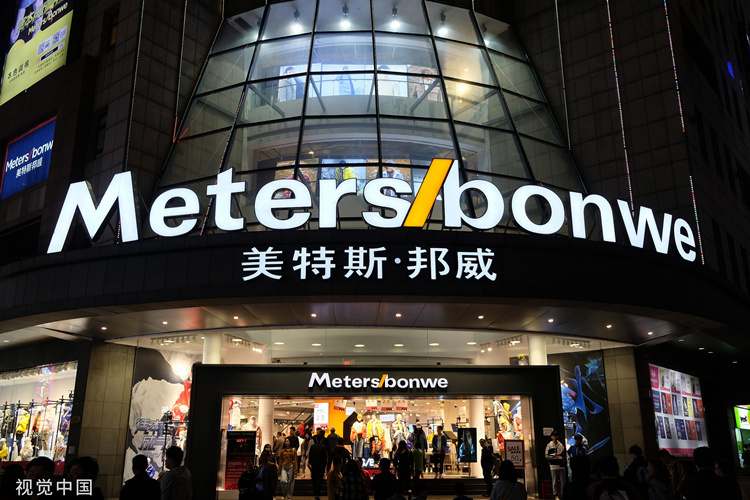

# 美特斯邦威从步行街“悄然消失” 这些记忆中的潮牌现状也不乐观

4月8日，#美特斯邦威是怎么从步行街消失的#登上微博热搜第一。

说起潮流品牌，在80后90后的学生时代，美特斯邦威一定拥有姓名。数据显示，鼎盛时期，美特斯邦威的门店数达到了5200多家，但如今它却从各大城市商圈悄然消失了。这个伴随了我们青春的“步行街之王”，几乎沦为了时代的眼泪。

**曾经的“步行街之王”**

1995年，第一家美特斯邦威专卖店在温州开业，随即迅速向全国铺开，拥有“Meters/bonwe”和
“ME&CITY”两大品牌，以“不走寻常路”为品牌slogan开启了中国本土年轻潮流休闲服饰的黄金时代。

2003年，美特斯邦威签约在音乐领域红透了半边天的周杰伦代言，一合作就是十几年；随后又签约郭富城、张韶涵等明星，成为80后、90后知名度较高的品牌服装。

2009年，美特斯邦威在当年创下收视纪录的电视剧《一起来看流星雨》中广告植入，迅速让品牌走入千万家。即便是现下，“端木带我去了美特斯邦威”依然是B站的名场面之一。

过去的几十年里，美特斯邦威都是当之无愧的“步行街之王”。

**高速扩张后的反噬**

当时的年轻人对美特斯邦威接受度很高，2007年美特斯邦威营收为31亿元，利润总额达到4.33亿元，毛利率高达38.84%，市场份额为0.95%，在国内排第一。2008年，美特斯邦威在深交所上市，成为“A股休闲服饰第一股”，市值一度达389亿元。

此后美特斯邦威依然在大踏步前进，2011年，美特斯邦威实现营收99.45亿，同比增长达到32.59%，净利润则超过12亿元。

不过，2011年也是美特斯邦威的巅峰时刻。

2012年，美特斯邦威的高增长戛然而止，其营收和净利均在2012年开始走下坡路。2012年，美特斯邦威营收同比下降4%，净利润同比下降30%。当年年报披露了原因，库存商品积压、国内外品牌竞争，其中最为重要的一点则是人们习惯在网上购买服装。根据公开数据显示，过去10年电商蓬勃发展，服饰行业的线上渗透率从2010年的0.4%增长到2020年的36.6%。

此后几年，美特斯邦威一直在试图转型，花了上亿元建设自有电商渠道和APP，却无疾而终。

据美特斯邦威的2022年半年度报告显示，去年上半年美特斯邦威实现营业收入约为7.23亿元，同比下滑47.49%，亏损6.89亿元。在半年报中，美特斯邦威解释了亏损的原因，公司表示，受疫情封控管制影响，公司物流有近2个月时间受到影响，导致公司营业收入及经营利润出现下滑。此外，疫情期间加盟商绩效不佳，导致还款出现逾期以及应收账款账龄变长，公司计提信用减值损失，对上半年净利润产生较大影响。

报告中还提及，目前旗下品牌共有56家实体门店，1193家加盟门店。而上半年关闭了77家直营门店、317家加盟门店。事实上，从2019年开始，美特斯邦威就已开始大规模调整线下门店。数据显示，从2019年到2022年的4年时间里，美特斯邦威已经关闭了2000多家线下门店。

为了获得更多现金流，美特斯邦威在2021年卖掉了全资子公司上海模共实业100%的股权，连带旗下那栋3.8万平方米的房产——里面还有被美特斯邦威引以为豪的博物馆。

然而，卖楼换来的4.48亿元“自救金”，依然难解困顿。

自从2008年上市后，美特斯邦威在品牌营收上就显得力不从心。仅三年时间，美特斯邦威从2018年的76.77亿元跌至2021年的26.39亿元。

亏损连年增加、营收大幅下滑、负债高企、存货高居不下、关店数量扩大，传闻拖欠工资，深交所也发来了经营问询函。

**败于“内忧外患”？**

美特斯邦威的衰落，也许可以用“内忧外患”这四个字来总结。

在“内忧”上，目前，美邦的直营店铺仅有56家，占比为4.5%，而1193家的加盟店占据门店总数的95.5%。部分加盟商经营不力，导致还款逾期，应收账款时间变长等蝴蝶效应，不仅品牌名声受损，还出现了现金流告急，去年还因拖欠工资一事登上热搜，让人一阵唏嘘。

经营不善造成了库存积压，长年累月吆喝着“打折清仓”，如同曾经的王子沦为沿街卖货的小贩，其品牌力在大众心中进一步降低。

“外患”同样严峻。2012年前后，Mango、ZARA、优衣库、H&M等早已进入中国市场的国外快时尚品牌在这一时期开始高速扩张，分别抢夺了传统服饰品牌们设计风格和价格上的优势，行业红利不再。

受冲击的当然并非美邦一家，但与李宁、太平鸟的翻身相比，美特斯邦威似乎一直没有爬起来。

**这些记忆中的潮牌现状也不乐观**

除了美特斯邦威以外，拉夏贝尔、森马、唐狮、以纯、真维斯、太平鸟等曾经风靡一时的老牌国货品牌，在时代的快速发展和变迁之中，逐渐失去曾经固守阵地，一度被新品牌和国潮取代。

拉夏贝尔曾是国产女装界的龙头品牌，可现在账面负债，上千家门店关闭。2021年11月，拉夏贝尔公司发出公告，因资不抵债公司被申请破产清算。2022年3月，拉夏贝尔收到上交所拟终止公司股票上市的通知，并于5月24日正式被摘牌。

另一家潮流服装品牌森马服饰。根据森马服饰发布的2022年半年度报告，上半年森马服饰实现营收56.4亿元，同比下降13.4%；归母净利润达1.04亿元，同比下滑84.3%。

还有2003年进驻中国市场的班尼路，刘德华和王菲曾为其代言，彼时风光无限。最后它的结局是，累计关店3000多家，被母公司2.5亿贱卖，工厂关闭。

面对这样的情况，不少网友纷纷感到惋惜。有网友称“美特斯邦威是一代年轻人的回忆”“谁年轻时没穿过森马的衣服呀！”“我还给我女朋友买过拉夏贝尔的衣服呢”……也有网友隔空喊话，希望这些潮流品牌可以加入新鲜元素、尽快转型，重新在市场上绽放光芒。

在行业大洗牌当中，哪些因素决定了品牌迭代升级？据《国潮品牌年轻消费洞察报告》显示，随着年轻一代消费需求的复杂多元化，国潮品牌不断调整供给策略，除了提升品质，将年轻人对外观、科技、情感、文化内涵的新需求投入到产品设计、研发环节，提供多样化的新品，在年轻人聚集的线上渠道首发，获得品牌增值新空间，成为国潮品牌核心策略。从2011至2021年十年间，国潮搜索热度增长超5倍，78.5%的消费者更偏好选择中国品牌，90后、00后贡献了74%的国潮消费。

资料来源 现代快报 每日经济新闻 中国新闻周刊等

编辑：饶治美

责编：张松涛

审核：冯飞

