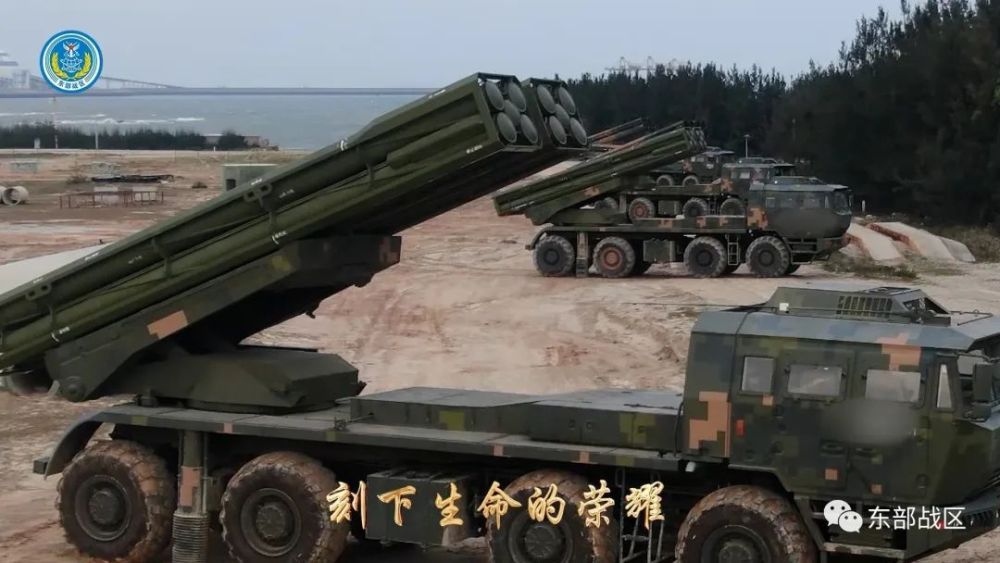
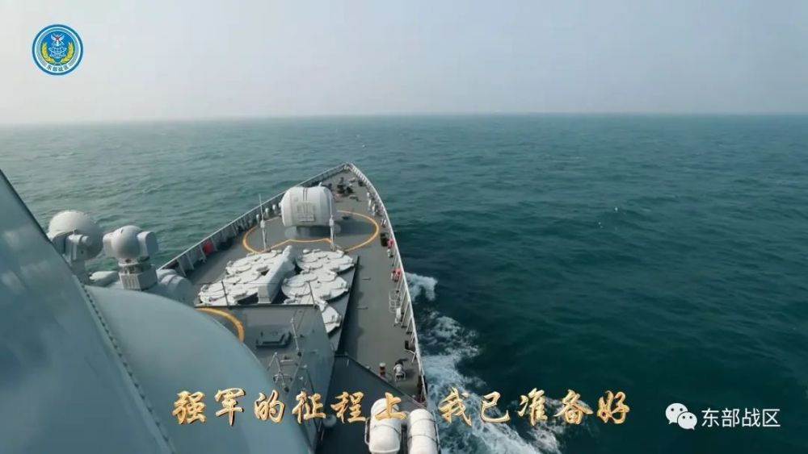
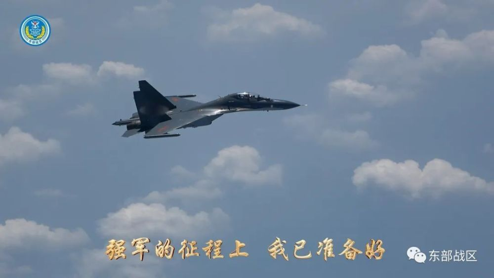
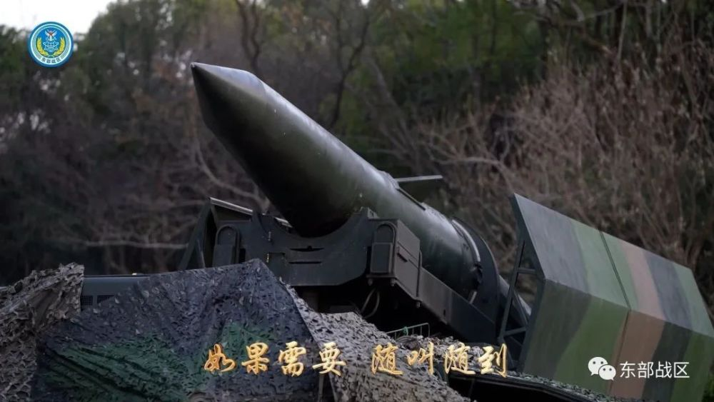

# 东部战区MV《利剑出鞘》震撼发布：如果祖国需要，我会随叫随到

作词 | 周广兵

作曲 | 左文先

制作 | 东部战区融媒体中心

**如果祖国需要**

**我会随叫随到**

**守我山河**

**护我人民**

**祖国请放心**

**人民请放心**

**信仰吹响号角**

**山河还在呼啸**

**没有什么能阻挡**

**胜利的出鞘**

**青春浴火涅槃**

**传奇我创造**

**强军的征程上**

**我已准备好**

**到 到 到**

**喊出军人的意义**

**战 战 战**

**信念不可动摇**

**如果需要**

**随叫随到**

**刻下生命的荣耀**

**我们时刻准备着！**

