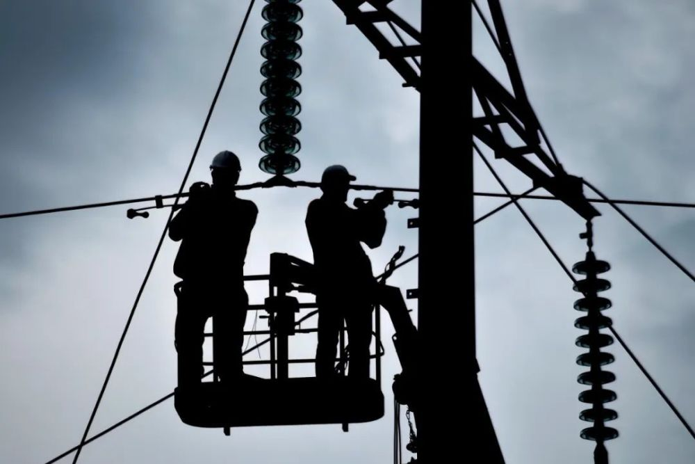

# 北汽、中核、中铁多名官员被查，国企再掀反腐风暴

近期，国企再次掀起反腐风暴。

3月27日，全国巡视工作会议暨二十届中央第一轮巡视动员部署会召开，确定对包括中国核工业集团有限公司、中国航天科技集团有限公司、中国航天科工集团有限公司等在内的30家中管企业党组开展常规巡视；对中国投资有限责任公司、国家开发银行等5家中管金融企业党委开展巡视“回头看”。

此前不久，中央政治局常委、中央纪委书记李希到湖北进行首次外出调研。在对武昌船舶重工集团有限公司、中国长江三峡集团有限公司进行调研时，他指出，要深入推进国有企业党风廉政建设，推动国有企业做强做优做大，更好服务国家战略。

数位专家在接受《中国新闻周刊》采访时称，当前，纪检监察机关面临的最大挑战和任务之一是为经济社会发展提供强有力的监督保障。由于国企在政治和经济上的重要地位，因此成为此轮反腐的重点。

_图/视觉中国_

**国企反腐，恰逢其时**

3月31日，北京汽车集团有限公司原党委书记、董事长徐和谊被官宣正接受纪律审查和监察调查，成为此轮国企反腐最新落马的官员。

3月以来，根据中央纪委国家监委网站所公布的消息，已有数位国企官员被查，包括中国银行原党委书记、董事长刘连舸在内的国有大行8人，以及中国铁路南宁局集团有限公司副总经理黄玮，中核集团核工业二〇八大队原党委书记、副大队长郭志平，航空工业原总经济师姚江涛，中国船舶集团华中光电技术研究所原所长陈福胜，中国石油天然气股份有限公司炼油化工和新材料分公司高级副总经理陈俊豪等人。

这一轮轰轰烈烈的国企反腐早在今年1月已有部署。

今年1月，在二十届中央纪委二次全会上，习近平总书记强调，反腐败斗争形势依然严峻复杂。二十届中央纪委二次全会工作报告强调，要深化整治金融、国有企业、政法等权力集中、资金密集、资源富集领域和粮食购销等行业的腐败，为国资央企纪检监察机构深入开展反腐败斗争提供了“路线图”和“施工图”。

此后，中央纪委国家监委网站数次发文，强调必须要深化行业性、系统性腐败治理。2月23日发表的《坚决打赢反腐败斗争攻坚战持久战》一文共3500多字，8次提及央企。外界分析认为，此文释放了强化央企监管的鲜明信号。

文章指出，要坚决查处政治问题与经济问题交织的腐败，坚决防止领导干部成为利益集团和权势团体的代言人、代理人，坚决防止政商勾连、资本向政治领域渗透等破坏政治生态和经济发展环境。

国企反腐之所以重要，与其特殊的性质有极大的关联。《中国纪检监察报》曾发表《透析国企腐败与反腐败》，分析称，“国企既不是完全的公共组织，也不是纯粹的私人组织，它介于两者之间。而世界银行的研究表明，腐败问题多出现在公共部门和私人部门的结合处。显然，国企的双重组织属性更容易满足腐败发生的基本条件。”

“如果国有企业利用其与政府之间的联系谋求优先竞争地位，那么其就极有可能通过市场垄断、价格差、政府补贴等方法确保自身的高利润水平。这可以理解为垄断领域的政策资源。而这种资源容易导致国家利益部门化、部门利益个人化，成为滋生腐败的温床。”上文指出。

浙江省纪委监委也曾发文指出，国企直接和“钱”打交道，资金密集、资源富集、资产聚集是国企最鲜明的特点。这也意味着，国企领导人员更经常、更直接地受到各种物质利益的诱惑，“哪里资金多，哪里的路就滑”。

该文举例称，在工程项目招投标环节，就存在假招标、陪标、围标、串标等一系列廉政风险行为。不仅如此，国企改制重组、项目投资、产权交易、资本运营、物资采购、财务管理、境外投资经营等都是廉政风险较为突出的薄弱环节。此外，国企具有独立的法人地位，经营中的商业秘密也不宜全部公开，企业的盈利亏损也是市场常态，这些都让国企腐败具有一定的隐蔽性。

而国企腐败造成的破坏性是很大的。《透析国企腐败与反腐败》一文分析，国企腐败不仅破坏了价格、贸易、投资等方面的市场秩序，更为严重的是，其损害了社会公平，侵蚀了公共部门在社会中的信誉和声望。

在2020年1月举行的十九届中央纪委四次全会上，习近平总书记强调，要加大国有企业反腐力度，加强国家资源、国有资产管理，查处地方债务风险中隐藏的腐败问题。据中央纪委国家监委网站数据，仅2020年上半年就有至少40名国企领导人员被通报。

而对于今年再掀高潮的国企反腐，中国人民大学反腐败与廉政政策研究中心主任毛昭晖告诉《中国新闻周刊》，“由于国内经济下滑、大量企业出现亏损，纪检机关面临的最大挑战和任务是为经济社会发展提供强有力的监督保障。”他指出，政治监督的重点有所调整，之前的重点是维护政治安全、消除政治隐患，现在“保障监督”成为纪检工作主线。

_3月23日，中央纪委国家监委网站发布消息，6名央企领导人员被调查，其中5名来自能源央企，并集中在电力和电网系统。图/视觉中国_

中国廉政法制研究会常务理事、上海社会科学院法学研究所廉政法治中心主任魏昌东在接受《中国新闻周刊》采访时也表示，此轮国企反腐是腐败治理深化的内在要求，“从中观层面来看，国企近年发生了多起重、特大腐败案件，暴露出腐败预防机制和控制机制有待进一步深化、提升和完善”。

因此，此轮反腐与前几轮有所不同。尤其是，随着近些年反腐工作的不断深入，中央不断优化完善反腐政策，由早期的“标本兼治”到后来日益强调治本即凸显预防作为，由此贯彻习近平法治思想中关于“完善预防性法律制度”的指引要求。中国犯罪学研究会理事、常州大学史良法学院教授赵赤告诉《中国新闻周刊》，该轮国企反腐是在上述背景下的继续展开。

赵赤提到了由最高检推动的企业合规改革。从2020年起，最高检探索涉案企业合规改革试点。他分析，从发展趋势上看，企业合规试点改革的前三年里，主要针对中小企业以及小微企业，接下来则将拓展延伸到国有企业、大型企业和跨国企业，“国企反腐及国企合规，是企业反腐、企业合规的重要方面。国企应该在企业反腐及企业合规上发挥示范、表率和引领作用”。

他认为，现在抓国企反腐，恰逢其时，未来一段时间内，也会是重要的反腐方向。一方面这是高质量发展的需求。国企作为国家经济的主要力量，要在经济高质量发展中有更多担当。企业反腐是企业治理的一个重要方面，这就要求企业更多承担反腐的责任，行稳致远。

另一方面，他认为，中国现在正加快对外开放进程，国企要更多参与全球竞争，要打通国际、国内双循环，就应遵守国际通行的反腐、企业合规规则。

**能源领域反腐受关注**

在此轮国企反腐中，能源领域反腐十分受关注。

3月23日，中央纪委国家监委网站发布消息，6名央企领导人员被调查，其中5名来自能源央企，并集中在电力和电网系统。他们分别是国家电投原党组成员、副总经理夏忠，国家能源集团科环集团国能朗新明环保科技有限公司原党委书记、董事长徐志清，中国大唐电力燃料有限公司原副总经理张志刚，中国大唐北京大唐燃料有限公司原总经理盛晓明，以及国家电网特高压事业部计划处副处长曲辉。

这些央企中，大唐集团、国家电投集团、国家能源集团是中国主要电力央企，国家电网则是中国最大的电网公司。被查官员存在一些共同特点，即都位居公司核心部门、职务，掌握着企业资源、资产、资金的管理处置权。

这是今年以来第二批能源领域官员集体落马。此前，从1月31日到2月8日，辽宁省能源局长汪洪溟，晋能控股煤业集团有限公司副总经理兰奕文，四川省能源投资集团有限责任公司总经济师张昌均，国家能源投资集团有限责任公司原党组成员、副总经理李东这四位能源领域官员已接受组织调查。

事实上，在过去数次国企反腐中，能源反腐都是重点。公开资料显示，十八大后落马的央企中管干部中，能源领域位居榜首，占整个落马央企领导数量的40％以上。

北京大学廉政建设研究中心副主任庄德水向《中国新闻周刊》指出，能源领域是国家重点投资领域，也属于资本密集型行业，投资数额大，动辄数以百亿计。能源领域腐败问题的发生，不仅会损害党和政府决策的权威性，降低能源政策的效力和执行力，甚至会干扰中央政府对能源产业的宏观管理，影响国家经济安全和稳定。

中央纪委国家监委网站曾发文指出，能源主管部门的党员领导干部在政策制定、项目审批、行业监管等方面手握重权，很容易成为不法商人重点围猎的对象。

文章还指出，能源领域相对集中的能源审批权和国有企业的垄断经营权，很容易成为想要进入或涉足能源行业的企业或个人公关的对象，导致能源领域成为权力寻租的重灾区。

另外，管理和监督机制存有漏洞，审批权运转不透明，缺乏有效的内外部监督机制。而也正因为这些漏洞，互相制衡的双方或多方权力主体容易产生共谋和非法协作倾向，形成窝案串案。

梳理中央纪委国家监委网站通报的相关案件可以看出，能源腐败主要集中在资源、建设、工程等环节，表现为靠企吃企、设租寻租、关联交易、内外勾结等形式。

例如，中海石油炼化有限责任公司原党委委员、副总经理韩星三“在材料供应、设备采购、货物运输、货款拨付、企业经营等方面为他人谋取利益”；中国煤炭科工集团有限公司原党委书记、董事长王金华受贿多与煤炭开采销售有关，包括为某公司承接煤炭开采业务提供帮助；陕西燃气集团有限公司原党委书记、董事长郝晓晨“靠企吃企、滥权妄为，大搞权钱交易，利用掌握的国家垄断性资源攫取巨额利益”等。

除此之外，犯罪数额特别巨大也是能源腐败的一大特点。中国华电集团原总经理云公民收受财物共计折合人民币4.6866亿余元，位居能源贪污金额之首，是能源领域的巨贪。黑龙江龙煤矿业控股集团物资供应分公司原副总经理于铁义、国家能源局煤炭司原副司长（正处级）魏鹏远的涉案金额也均超过3亿元。

在我国对能源安全的重视度不断提升的当下，能源反腐极具重要性。毛昭晖告诉《中国新闻周刊》，十九大后，为保持反腐高压态势不减，案件查办呈现“区域轮动”和“精准动态”相结合的特点，突出重点领域，清理风险隐患大的行业性、系统性腐败。依据此标准，能源领域无疑是重中之重，“这些年来，我们未能对能源领域腐败进行全面系统的整治，最近能源领域的腐败案件的曝光，仅仅是一个信号，后续反腐力度可能会持续加大”。

发于2023.4.10总第1087期《中国新闻周刊》杂志

杂志标题：国企再掀反腐风暴

作者：佳玮

