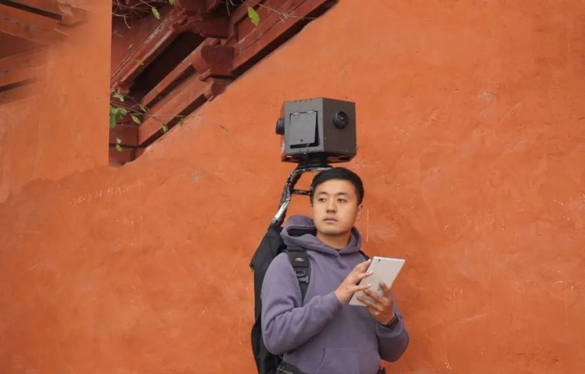
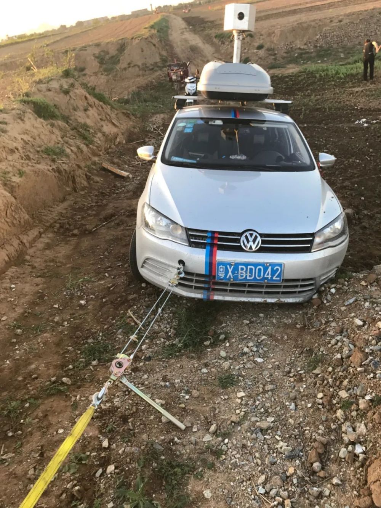
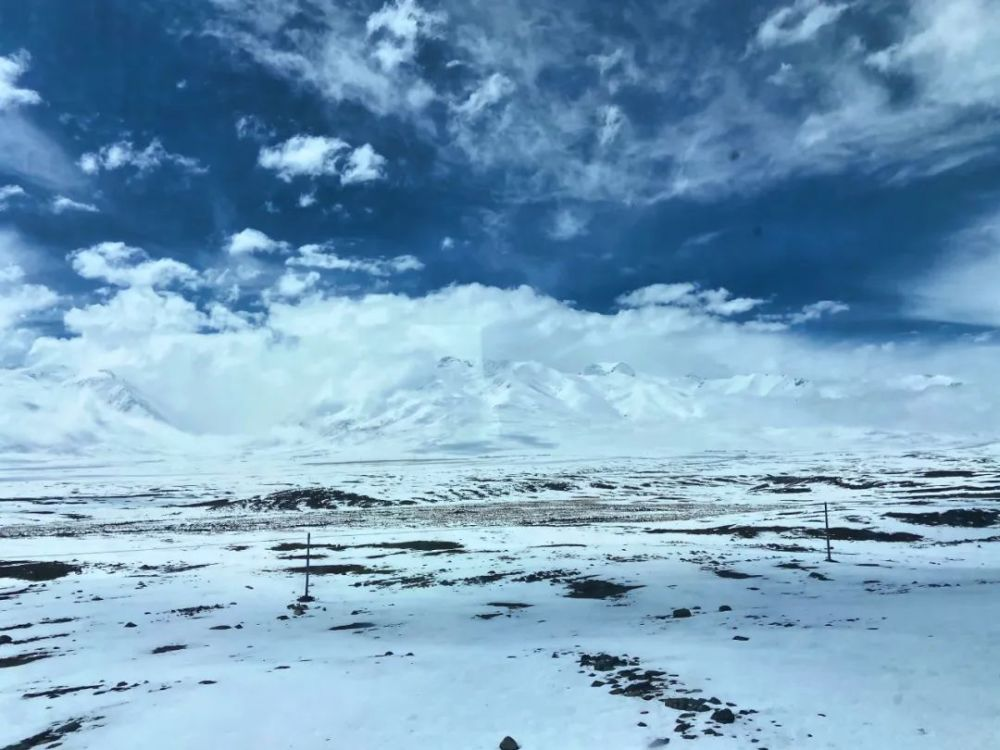

# 太阳落山就收工！月入过万的我，孤独又快乐

**当地图采集员是带薪旅游？这是一种错觉。**

作者：许晔

当你使用手机里的地图APP，精准导航到达目的地时，是否曾产生这样的疑问：这么精确的地图数据都是从哪儿来的？

这背后其实有赖于地图采集员的工作。

他们奔波于大街小巷，穿行于旷野山川，拍下最新的道路信息，经由AI处理后，呈现在用户眼前。

25岁的李猛是其中一员。

自两年前入行后，他步履不停，仅仅今年3月，足迹就遍及云南、重庆、湖北、陕西、甘肃5个省市。

_2023年3月，李猛在甘肃甘南藏族自治州翠峰山景区进行采集工作。_

在不少人看来，地图采集员是一份“神仙职业”——

不用打卡，不用“996”，可以月入过万，还能全国各地跑；

天气好的时候，早上8点开工，太阳落山就收工，因为天黑后采集来的照片质量不佳；

天气不好的时候，无法采集数据，则干脆休息。

李猛的家人一度有种错觉：这工作就是游山玩水，而且还是带薪旅游。

“实际上不是那么回事。我们为了保证数据的完整性，要翻越高山、穿越沙漠，可不像很多人想象中那么轻松。”李猛对《环球人物》记者说。

_地图采集员不只要跋山涉水，还要穿越沙漠。_

**和孤独共处是必修课**

李猛走在陌生的村子里，4条没拴绳的大狗同时探出头来，紧紧盯着他，朝他狂吠。

他顿了顿，不敢停也不敢跑，只能小心翼翼地往前挪着步子。狗主人听见动静出来后，他悬着的一颗心才放下。

对地图采集员来说，被狗追、被猴挠都不算最囧的事。他的同行曾在架设采集设备时，遭国家安全意识比较高的群众举报，被带到了公安局……

李猛倒没遇到过这种乌龙事件。他入职时，技术进步了，绝大部分地区已不再需要他们自己架设备。但常年在外跑，突发情况总难避免。

去年3月，他一个人开车上山采集数据，下山时就遇到了麻烦。

那段山路比较窄，他轧着路边的一片草坪掉头，刚轧上去便发现不对劲——这不是正常草坪，草下面是沼泽地。

然而为时已晚，车子的两个前轮瞬间陷了进去，动弹不得。

路上一直无人经过，手机信号也不好，消息很难发出去。李猛试着自救，然而不管往车轮下垫什么硬物，都很快被沼泽吞没。

等了近两个小时，他终于等来两位热心大哥，开车帮他把车拖了出来。

_全景采集车常会遇到突发状况，不得不向外界求助。_

这场意外算不上惊心动魄，却始终让李猛难忘。因为那天，他深刻地体会到，和孤独共处是地图采集员的必修课。

“可能还有很多这样的小路，没什么名气，甚至鲜少有人踏足。但我要走一遍这些路，即便孤独，也要采集到准确无误的数据。”

入行之前，李猛对这个职业的了解并不算全面。

他大学学的化学，毕业后从事人力资源管理工作，负责到各个高校进行校招。他原本设想这样可以到不同的城市体验生活，结果每次出差只去学校，活动范围十分有限。

恰在此时，一位朋友向他推荐了地图采集员祝自臣的短视频账号。

看到祝自臣能每天去不同的地方采集数据，李猛兴奋地想，这工作简直就是为自己量身定制！

那时，他和所有外行人一样，只看到这份职业又酷又爽的一面，觉得这就是“诗和远方”，满怀憧憬地应聘入职。

真正成为地图采集员后，李猛才知道这工作没那么简单。

开采集车工作时，车只要平稳行驶，车顶设备就会记录下所经道路的全景图。但总有些车开不进去的地方，比如公园、景区、购物中心等，只能由地图采集员完完整整走一遍所有路，拍下沿途照片。这既考验人的观察能力、应变能力，也很考验体力。

李猛主要做的就是步行采集，大多时候通过手机里的公司自研APP拍照记录数据，有时需进行高精度采集，则得背上30斤重的采集背包——背包上有全景镜头。

他粗略算了算，自己平均每周要爬一座山，每天要走2.3万步以上。最多的一次，他一口气走了23公里，差不多3.3万步。

_李猛在进行地图数据采集。_

一年有300多天，李猛就这样“漂”在全国各地采集道路信息。

长期住宾馆，总要搬来搬去，“家”被他简化成了一个行李箱加一个背包。只要决定上路，他10分钟之内就能拎包出发。

如此轻装简从，是李猛慢慢养成的习惯。他曾试过带半行李箱书，打算一边行万里路一边读万卷书，后来发现不现实，只能放弃。

但无论如何，他还是会带一本最新的地理杂志，看完寄回老家，再买下一期。

**不止看见了大好河山**

李猛热爱地理。

小时候，他特别喜欢《三国演义》，看到官渡之战时，觉得“官渡”二字很好听，就问父亲这是哪里的地名。

他父亲是一名小学语文老师，知道要如何激发孩子的兴趣，回答说：“我也不知道，咱们一起查一下吧。”

一查，李猛知道了官渡在如今的河南郑州附近。父亲告诉他，昆明还有一个官渡区。李猛好奇，这地名又是什么来历，查了发现此官渡是因官家渡口而得名。

两个“官渡”点燃了李猛对地理的热情。

于李猛而言，当地图采集员，就是把工作和爱好结合在一起，带着任务去看祖国的大好河山。

路上有各种各样的风景，也有各种各样的人。

不久前，李猛去云南省红河哈尼族彝族自治州做采集。这里的哈尼梯田是世界文化遗产、全球重要农业文化遗产，一年四季呈现出流动的美。

看着壮丽的梯田，他忍不住问了句：“这山这么高，为什么水也这么多？”

“山有多高，水就有多高。”一旁的哈尼族人答。

这句话说的是哈尼梯田的特点，但李猛听到的一瞬，只觉其中很有哲理。哈尼族人就如同这水，勇攀高峰，用智慧创造农耕文明奇观。

不过，对李猛触动最大的人，是去年遇到的一对五六十岁的土家族夫妇。

这年大年初七，复工第一天，李猛开车去重庆武陵山区采集数据，上山时一切正常，下山时却突遇大雪。

为了安全，他决定不再向山下行进，先在附近找个落脚点。当时，民宿都没开业，当地人大多还在市区过年，他找了好久终于看到人烟。

_2022年2月，李猛在重庆涪陵武陵山景区采集作业。大雪覆盖的道路上，只有他一个人的脚印。_

一对土家族夫妇正在自家门前清雪。

李猛上前说了下情况，夫妻俩尽管半信半疑，但还是把他搀扶到屋子里。大婶给他做了顿热乎饭，大叔则告诉他现在下山很危险，可以在这里留宿一晚。

第二天，看李猛要开车上山继续采集数据，大叔说“你的车上不了山，我这种越野车才可以”，然后执意开车把李猛送了上去。

路况好转后，到了分别时刻，李猛依依不舍。

“我刚好也要出去办事，一块走吧。”大叔说完，开车在前面开路，把李猛送到市区后，直接掉头回去了。李猛这才意识到大叔是怕路上不安全，专门护送他一程。

感动不足以形容那一刻的心情。李猛回想起这两年，遇到困难时得到了很多当地人的帮助。

“如果当时我没遇到这些人，很多事或许最终也有解决方案，但我真的无法想象自己要经历怎样的困难才能脱身。那些善良的人，让我这一路感受到了包容与温暖，也让我感受到了什么叫民族团结一心。”

**网友感叹“科技的温度”**

当上地图采集员，李猛有个出人意料的变化：成天在外面跑，和家人的交流反而变多了。

有次去昆明做数据采集，他了解了得胜桥的故事。此桥之所以名为“得胜”，是因为康熙年间，清军将领赵良栋率军在此大败吴三桂军队。他随即讲给父亲听，父亲又给他讲了些康熙平定“三藩之乱”的历史故事。

互动性一强，李猛更愿意和家人交流，不时聊聊自己在路上的所思所想。

有一年回家过年，父亲直白地表达了对他人生规划的支持：“你要有自己的想法。如果你觉得自己选的这条路可以走下去，哪怕别人都觉得你是错的，我也会觉得你是对的。”

李猛发自内心地喜欢这份工作。

不过，地图采集员去哪里采集数据，并不完全由着自己。“采集地点的安排受大数据的影响。”祝自臣比李猛入行早，更懂这背后的逻辑，“假如大数据说今年新疆、西藏旅游会火，那公司就会据此做相应的计划，再派我们去采集。”

_2022年5月，李猛前往西藏拉萨采集数据时途经青海玉树。_

至于一座城市的道路信息隔多久会复采一次，则取决于其经济在国内城市中的排名。祝自臣说：“排名前10的城市，每年复采两次；前50的城市，每年一次；50名以后的，基本上是3年一次。”

当地图更新时，之前采集的全景地图并不会被覆盖，而是被做成“时光机”存档。

去年底，一名网友用这项功能查看老家近几年的街景，偶然发现了自己去世爷爷的身影。画面里的爷爷身穿白色衬衫，骑着一辆自行车，在去买彩票的路上与采集车擦肩而过。

那一刻的景和人，被定格在时光记忆里。网友湿了眼眶，感叹这是“科技的温度”。

采集数据时，李猛也收到过很多暖心反馈。有人夸现在的地图导航已经精准到车道级别，连车辆行驶在哪条车道都一清二楚。每到此时，他就倍感自豪。

“工作时，我总有一个信念，就是我多走一段路，地图用户就能少走一段弯路。付出有了回报，我更真切地体会到一种使命感，要为国民出行努力做点事。”

如今，走过东西南北的百余座城市，李猛依然保持着一个特别的小习惯——在不影响环境的情况下，带走当地的一点点水或土。

从黑龙江黑瞎子岛的水，到云南边境小城西盟的土，他都妥善地装进小瓶子里，带回家收藏起来。

他希望未来能去到更多地方，走一遍当地的路，看不同的山川河流，体验多样的风土人情。

“那最想先去哪儿？”记者问。

“我想去新疆，在祖国最西边的喀什感受一下晚上10点的太阳。”他笑着说。

总监制：吕 鸿

监 制： 张建魁

主 编： 许陈静

编 审：苏 睿

