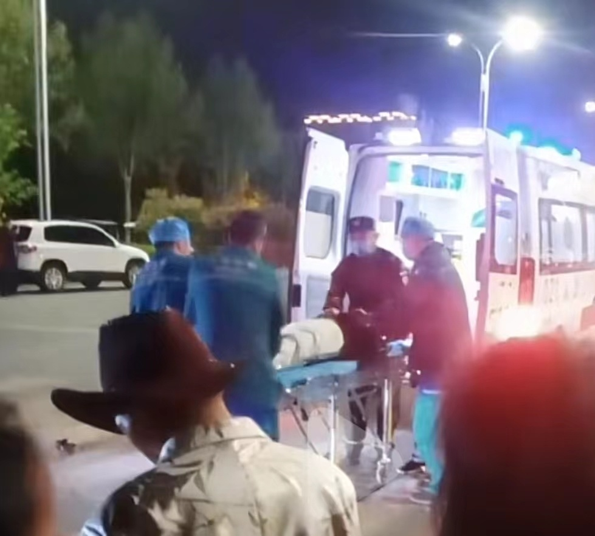

# 河南平顶山发生交通事故，村民称有五六人伤亡，警方正在调查中

网传“河南平顶山发生交通事故，现场多人伤亡”。4月9日，华商报大风新闻记者从警方获悉，事件正在调查处理。

根据网传视频显示，现场围观群众很多，多人躺在地上，救护车正在现场救援。多段拍摄视频中，拍摄者均表示，现场有6人。

4月9日，华商报大风新闻记者联系到平顶山市野王村多名村民，他们均表示，4月8日晚确实发生了一起交通事故，地点在新兴路野王村大桥附近。

其中一名村民说，事发于4月8日晚九时左右，有五六人伤亡。伤亡者听说都不是村里的人，应该都是过路的人。

华商报大风新闻记者从平顶山警方获悉，案件正在调查处理中，具体情况不方便透露，想了解处理情况，建议关注后续通告。

随后，记者联系到平顶山急救中心，工作人员说，昨晚确实有事故发生，市区多家医院都派了救护车，具体伤亡信息无法透露，联系关注后续公告。

**华商报大风新闻记者 佘晖 编辑 杨德合**

**（如有爆料，请拨打华商报新闻热线029-88880000）**

