# 解放军环台岛战备警巡演习，隐身导弹艇、新型岸舰导弹等武器登台亮相

4月8日，中国人民解放军东部战区展开环台岛战备警巡和“联合利剑”演习。

根据央视新闻报道，中国人民解放军东部战区按计划于4月8日至10日在台湾海峡和台岛北部、南部、台岛以东海空域组织环台岛战备警巡和“联合利剑”演习。东部战区新闻发言人施毅表示，
这是对“台独”分裂势力与外部势力勾连挑衅的严重警告，是捍卫国家主权和领土完整的必要行动。

根据报道，4月8日的演练重点检验联合作战体系支撑下夺取制海权、制空权、制信息权能力，任务部队同步组织环台岛战巡进逼，塑造全向围岛慑压态势。东部战区联合作战指挥中心下达指令后，从地面指挥机构到空中指挥枢纽，从陆上火力单元到海空作战平台，指挥信息高效流转，任务兵力密切协同。战区陆军远箱火，海军驱护舰、岸导突击群，空军歼击机、轰炸机、特种机，火箭军常导火力单元等任务兵力快速向预定区域机动集结，展开行动部署。岸海空网电对抗力量，全程展开电子侦察、干扰压制等支援行动。

解放军环台岛战备警巡和联合演习引发热议。那么，这次战备警巡和联合演习动用了哪些先进主力武器装备呢？

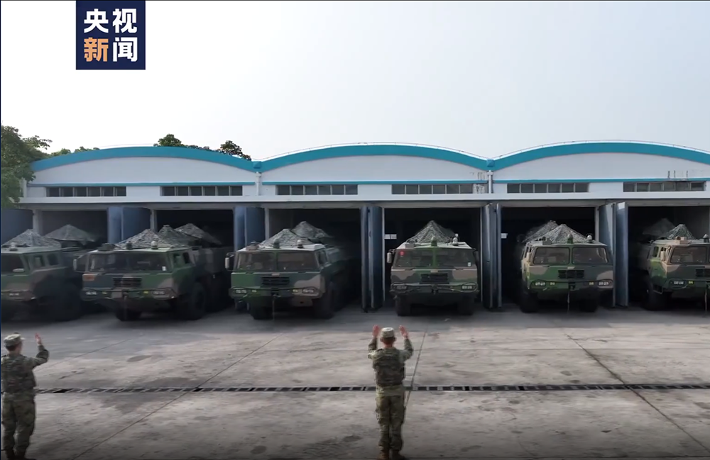

“东风快递”，使命必达，此次环台岛战备警巡和联合演习，火箭军的“东风”系列导弹再次出动。本文图片来源：央视截图

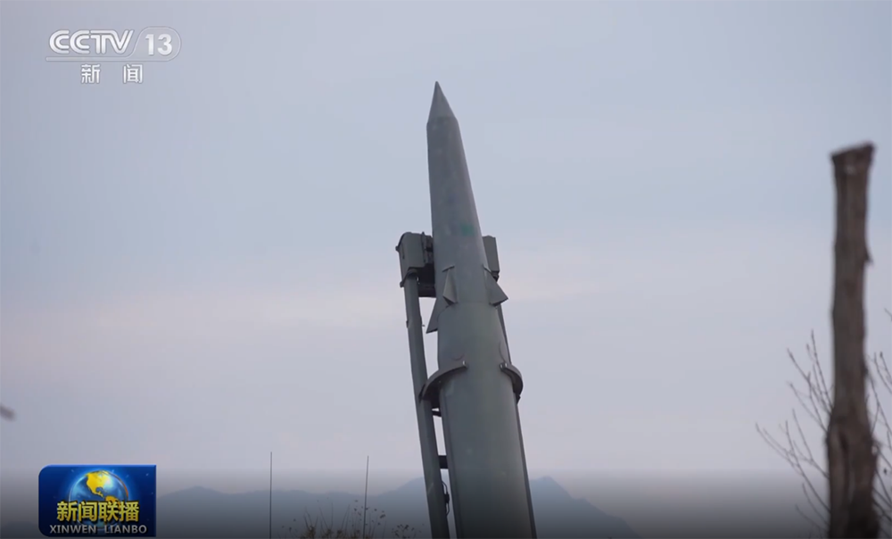

起竖中的“东风”-15弹道导弹。

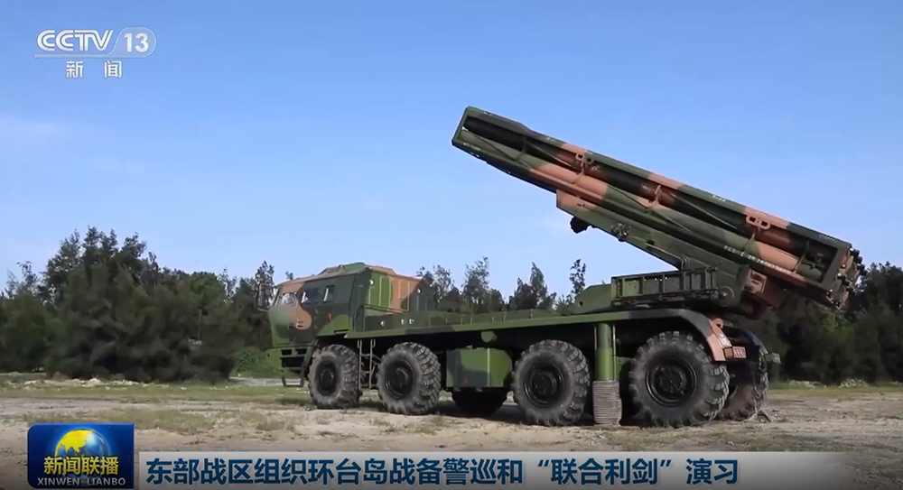

在去年的联合演习中，远程箱式火箭炮实弹射击引发高度关注，此次演习，该武器再次亮相。

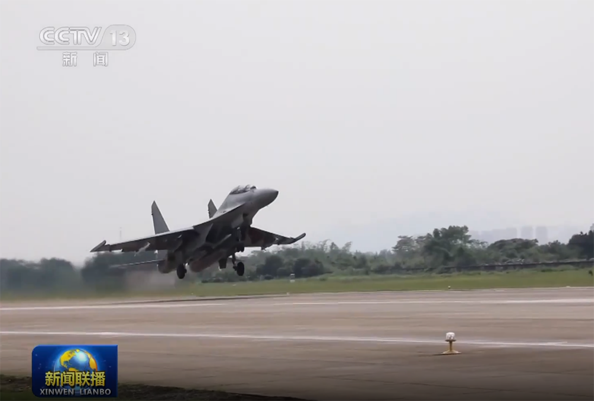

歼-16战斗机挂载实弹出击。

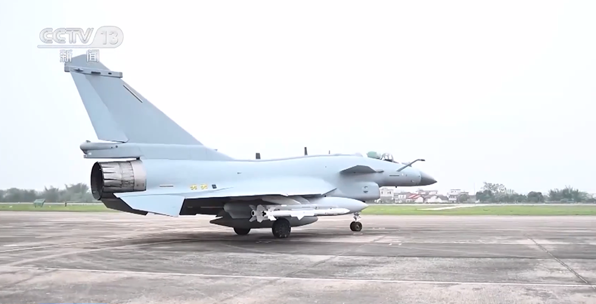

歼-10C挂载了最新型空空导弹。

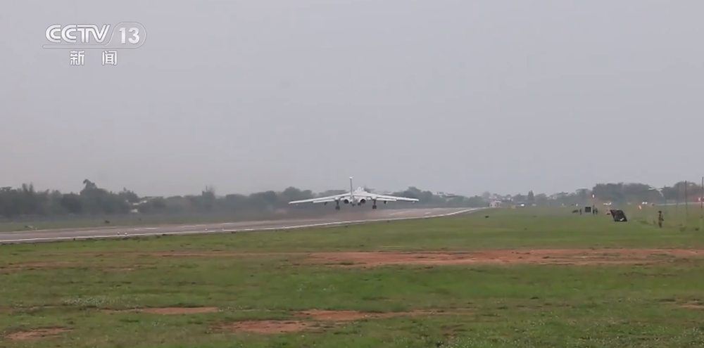

轰-6K轰炸机起飞。

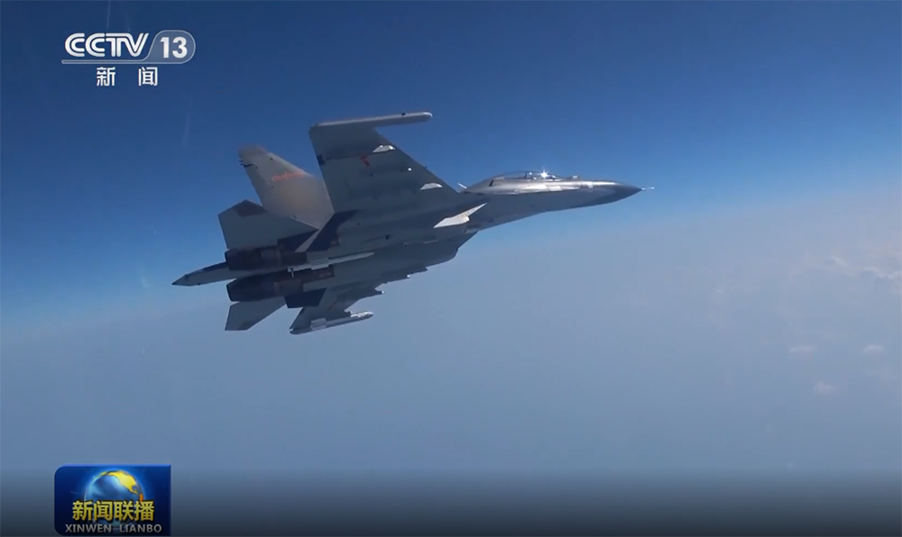

苏-30MKK也参与了行动。

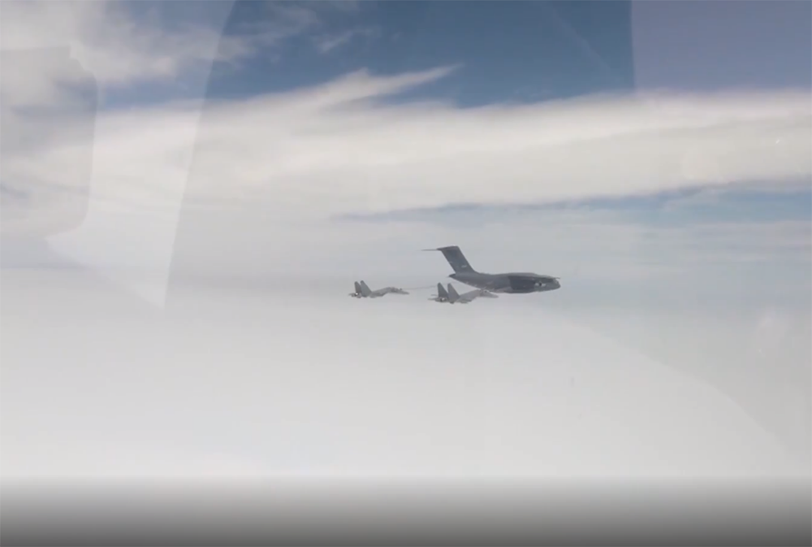

运油-20加油机为歼-16战斗机进行空中加油。

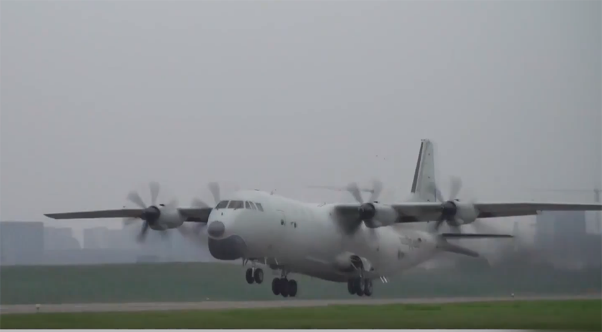

反潜巡逻机与各平台进行联合反潜。

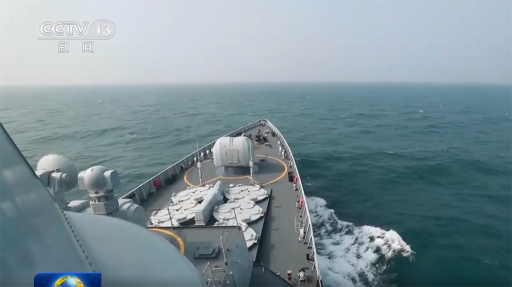

052C型驱逐舰。

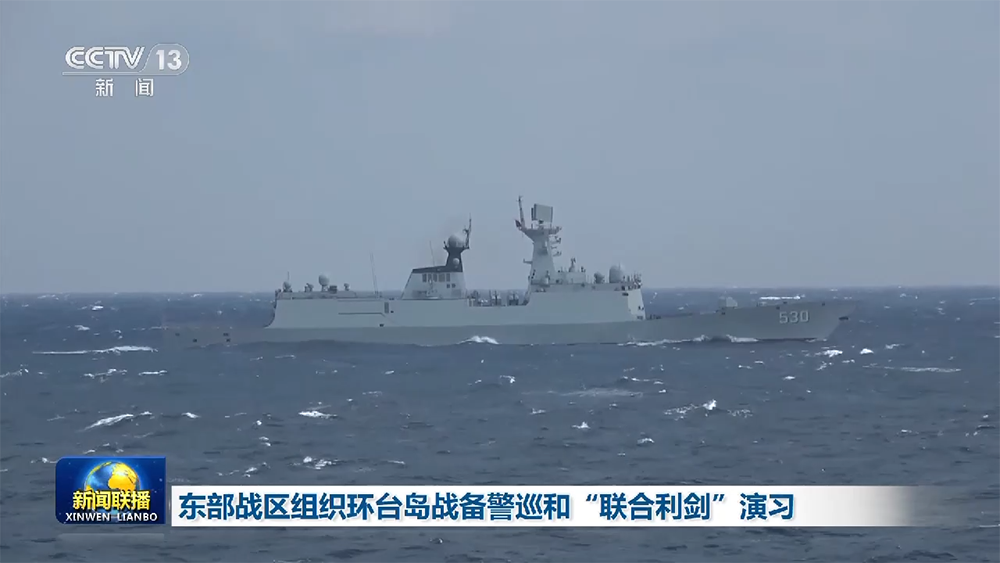

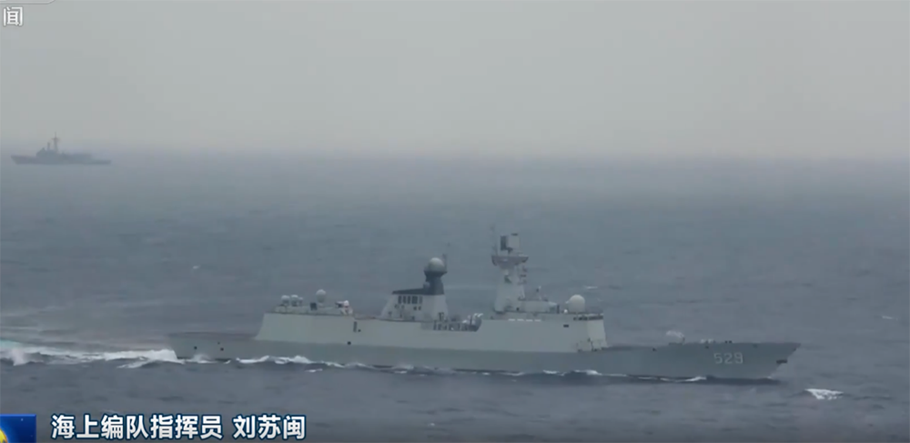

根据视频，海军054A型护卫舰的“徐州”号（舷号530）和“舟山”号参与了演练。

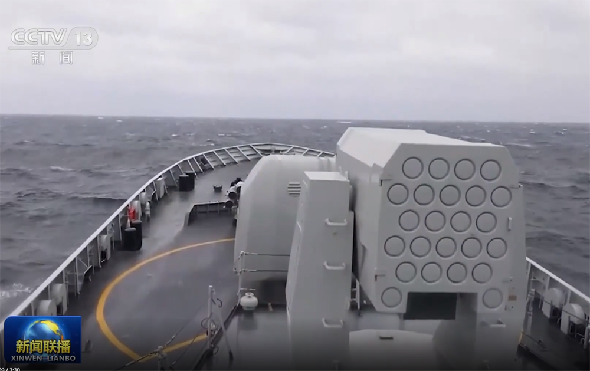

054型护卫舰“马鞍山”号。

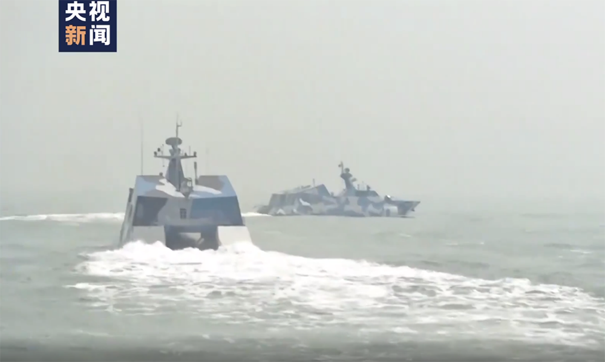

导弹快艇是近海作战的利剑，在此次演练中出动了隐身导弹艇。

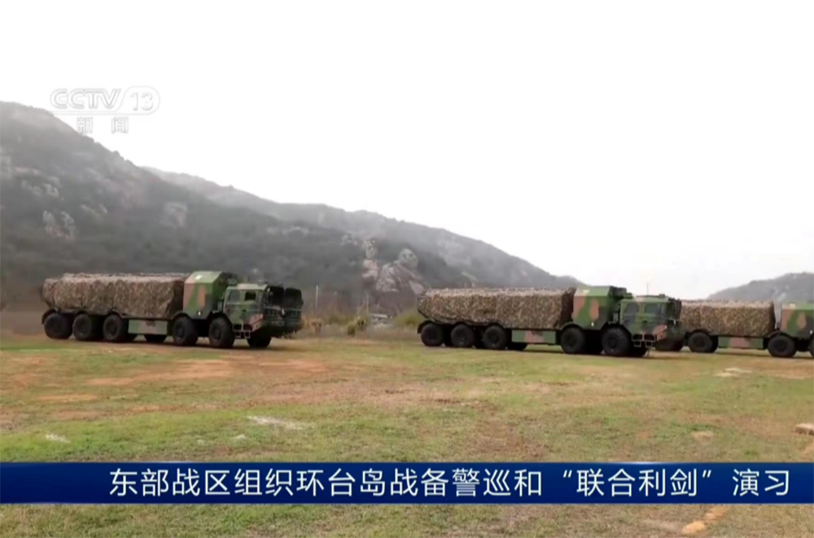

新型岸舰导弹具有射程远、机动能力强等特点。

可以看出，此次环台岛战备警巡和联合演习，解放军出动了不少主力先进武器装备，但上述截图只是参与演练的部分武器装备，还有其他武器装备没有出现在公开的视频中。

