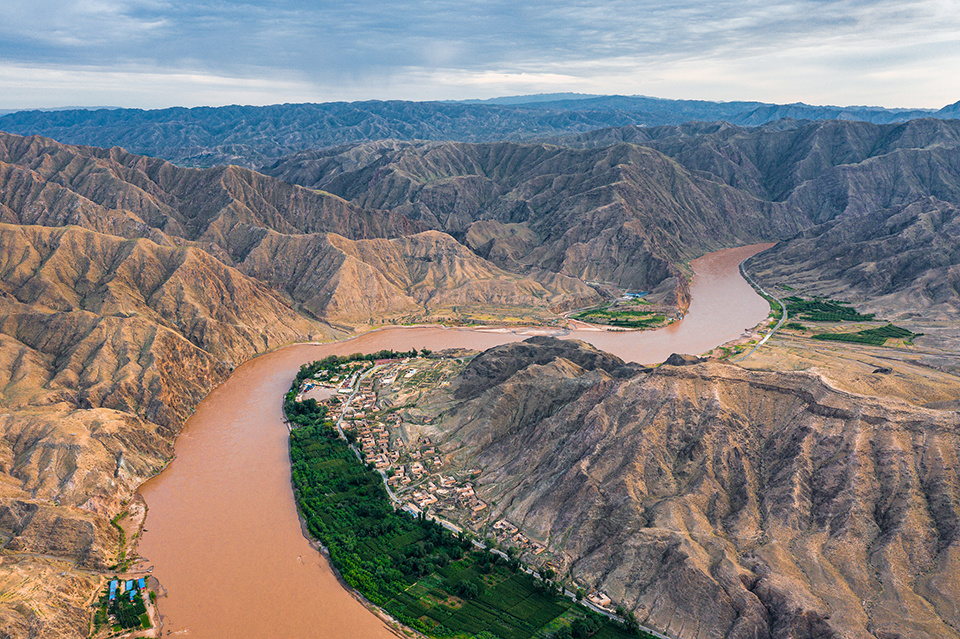

# 采1吨煤耗1.7吨水，黄河流域煤与水矛盾尖锐，一水多用能缓解困境

_黄河宁夏段。
（视觉中国/图）_

2023年3月27日，宁夏灵武马家滩镇，孙国友由于双马煤矿未向其供水而“跪地求水”，引发社会关注。据宁夏“美丽灵武”3月30日消息，灵武市认真履行监管职责，防止出现污染环境等次生问题。

“跪地求水”背后，除了旱地种树的问题，值得关注的还有煤矿开采对水资源的影响。

国家应急管理部矿山应急与安全工作委员会委员、中国矿业大学资源与地球科学学院水文水资源系副教授齐跃明告诉南方周末记者，在我国西部地区，开采1吨煤约消耗或破坏1.7吨水。

宁夏所在的黄河流域是我国主要的产煤区域，国家规划的14个大型煤炭生产基地，有9个在沿线分布，煤炭产量约占全国煤炭总产量的70%。

矛盾的是，这里也是全国水资源匮乏区。黄河多年平均降水量446毫米，仅为长江流域的40%；多年平均水资源总量647亿立方米，不到长江的7%；水资源开发利用率高达80%，远超40%的生态警戒线。黄河上中游大部分地区更是位于400毫米等降水量线以西，干旱少雨。

2023年4月1日，黄河保护法正式施行，黄河流域实行水资源刚性约束制度，坚持以水定产，严格限制在黄河流域布局高耗水、高污染或者高耗能项目，煤炭等行业依法实施强制性清洁生产审核。

高耗水的煤炭行业急需保水、节水。

煤炭开采耗水

煤矿行业是高耗水产业，在采煤、洗煤、冷却等环节，均需大量用水。

煤由植物经过漫长地质年代的天然煤化作用而成，深埋于地下。齐跃明介绍，地下水主要储存在地下含水层中，煤矿开采时会破坏开采煤层周边的围岩水文地质结构，令含水层和隔水层产生裂隙、孔洞，地下水顺着裂缝、孔洞流入矿井成为矿井水。矿井水浸泡煤炭、煤泥、井下乳化剂等，富含悬浮物、重金属、有毒有害物质。

井下作业时，为减少煤尘产生和爆炸风险，需要水冲洗，保持矿井湿度。开采出的煤炭还需要洗煤，分离出不同成分不同比重的原煤，并除去杂质。

中国工程院院士、中国矿业大学（北京）教授彭苏萍接受《中国自然资源报》采访时提到，煤炭开发成为黄河流域生态环境最严重的人为干扰因素。开采引起了地表沉陷、地面塌陷和裂缝，导致矿区地下水位大范围和大幅度疏降。同时，大规模煤炭开采具有干扰强度大、持续时间长、影响面积广等特点。

煤炭开采对水的影响，已有不少研究。

2015年，北京大学团队发表在国际期刊PNAS的论文显示，内蒙古草原区的湖泊锐减，64.6%归因于煤炭开采耗水。

2021年，作者为宁夏回族自治区煤炭地质局团队的一篇论文指出，大规模煤炭开采会产生一系列的蝴蝶效应，造成地下水位进一步下降，地表水系逐渐干涸，草场退化等问题。尤其宁东是宁夏煤炭资源开发程度较高、煤炭资源分布最大的煤田，其处于毛乌素沙漠东缘，未来的煤炭资源大规模开发直接将加速该地区的沙漠化程度。供水纠纷事件涉及的国家能源集团宁夏煤业公司双马一矿正位于宁东煤田。

一水多用，缓解水资源短缺困境

煤矿开采过程中的节水已有不少技术。齐跃明表示，煤矿可以采用保水开采等绿色开采技术，减少采煤对地下含水层的破坏程度；或在煤矿开采前，将含水层中的地下水预先储存在地下水库或者地表水库。

2022年，来自北京科技大学团队的一篇论文表示，宁夏多个煤矿实施了绿色开采技术，取得了显著的成果。但由于宁夏地区煤层埋藏较浅、风积沙严重、生态环境脆弱等现实情况，绿色开发技术还不完善，区内推广程度相对较低。

煤炭矿井水回用是重要的再生水利用的方式。齐跃明介绍，矿井水回用主要有引到地上利用和地下直接利用两种方式。

矿井水盐分过高不利于浇树。齐跃明解释，煤矿开采中产生的矿井水，不能直接浇灌树木，但矿井水通过处理回用，可满足灌溉、生产等要求。

通过水泵将矿井水引到地表再处理回用的成本较高。齐跃明表示，在宁夏建设地上矿井水处理设施的成本或达千万元以上，8元/立方米的处理费用也基本符合实际情况。

通过清水收集，或经过絮凝、沉淀等初级处理，井下直接利用的矿井水成本相对较低。“一般而言，煤矿会优先考虑井下利用，因为能节水且大大节省成本。”齐跃明称。井下利用再生水的方式包括井下修路、喷浆、消防、设备冷却等。

清华大学环境学院教授胡洪营告诉南方周末记者，通过再生水利用，一水多用，串联使用，能缓解宁夏等黄河流域地区水资源短缺的困境。

根据黄河水资源公报，2021年，黄河供水区地表水取水量为395.78亿立方米，农业用水量占地表水取水量的62.3%；生活用水、工业用水和生态环境用水用量占比依次为12.4%、8.2%和17.1%。

胡洪营表示，生活用水、工业用水和生态用水的用量相近，这就意味着三者用水可以统筹利用，例如生活污水处理之后，先用于生态用水，生态用水再成为工业用水，“黄河流域总用水量的20%以上可以用再生水来支撑”。

但是宁夏矿井水回用率不高。中央环保督察发现，双马一矿所属的宁东能源化工基地，2020年矿井水综合利用率仅为26%，2021年为37%，远低于《宁东能源化工基地2015年—2022年环境保护行动计划》提出的到2020年矿井水回用率达到85%以上的目标要求。

齐跃明表示，当前全国煤矿矿井水回用率偏低，有共性原因，如环保意识依然不够；生产成本压减；气候、交通等不便，使得矿井水高效处理设备及工艺的运输、安装、维护成本偏高；技术力量薄弱等。

2021年国家发改委等五部门联合发布的《关于印发黄河流域水资源节约集约利用实施方案的通知》指出，推进陇东、宁东、蒙西、陕北、晋西等能源基地的煤炭矿井水综合利用，到2025年，黄河流域矿井水利用率达到68%以上。

（南方周末实习生李一钒亦有贡献）

南方周末记者 林方舟

