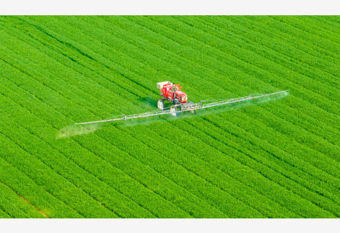
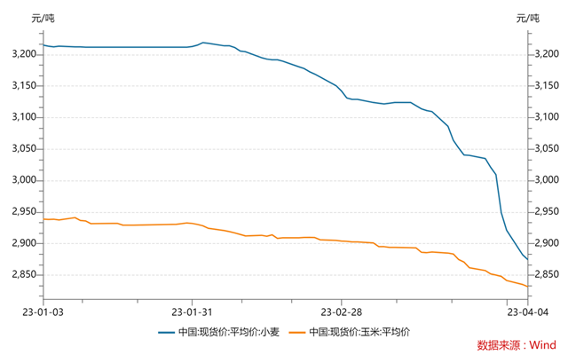
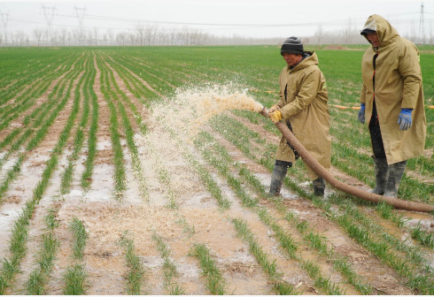
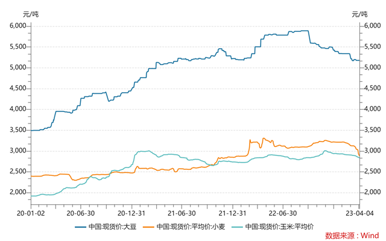

# 一季度小麦价格遭遇“塌方”，囤粮大户动辄浮亏数百万元

“近期，公司采购小麦，底价每吨3100元，成交价预期会向下竞价几十元，谁知道竟然2880元就成交了。”业内人士李大壮（化名）称，当前粮食贸易商正着急出手库存粮食。

这背后原因是，今年一季度小麦现货价格经历了一波急速下跌的行情。持粮成本与日俱增，而小麦价格一路下行。由于没有炒作空间，于是出现价格塌方。

持续的下跌，早就击穿了囤粮成本，贸易商原本囤粮待涨，如今却普遍遭遇惨痛损失。2023年初，每吨小麦价格3200多元。3月底，已经跌至2800多元，每吨跌去400元。李大壮称，从持粮成本来看，去年收购夏粮至今，已经不低于每吨3200元。由于贸易商囤粮往往以“万吨”为单位，也就意味着，囤粮1万吨，损失400万元。

4月第一周，麦价开始止跌回涨，呈探底回升的走势。4月6日下午，国家粮食交易中心发布“4月12日国家临时存储小麦竞价销售交易公告”。在这则公告中，并未出现最低收购价小麦的信息。

业内解读称，在国内麦价近期出现罕见大幅下跌之后，国家暂停最低收购价小麦的投放，这释放了一个积极信号。尽管今年以来最低收购价小麦市场投放量不多，对市场供应影响也较小，但市场将之视为一种政策倾向，特别是在3月份国内小麦塌方式下跌中，最低收购价小麦的较低成交价放大了其对国内小麦市场的影响，从而引发市场诟病。

从粮食全局来看，小麦的价格波动，是今年一季度粮食市场购销价格下降趋势的一个缩影。业内认为，一季度粮价的整体回落，可以视为2022年粮食供需格局的再平衡，或者可以说，回归常态过程中的震荡式调整。

**一季度小麦价格持续下跌**

“3月底是大家最恐慌的时候。当时麦价暴跌，囤粮贸易商损失惨重，面粉企业被迫停产或半停产。”至今，李大壮仍心有余悸。

一般来说，小麦价格波动1%~2%，市场都能接受。但今年异乎寻常，市场跌幅超过10%，这给市场带来严重影响。面粉主副产品价格同步走低，尤其是副产品跌幅超过30%；面粉厂开工率也不断下调，中小型企业只有30%~40%，大型企业只有50%左右。

“前期麦价急速下跌，贸易商踩踏式卖粮，而加工企业也拼命压价，甚至有面粉加工厂一度暂停收购，一方面是为了保证成本最优化，另一方面也跟自身仓容、加工能力有限等因素相关。”李大壮说。

对于3月中下旬麦价塌方式下跌，广东华南粮食交易中心粮食经济研究员郑文慧对第一财经记者表示，这是“囤积需求”的过度释放。

她提到，贸易商等主体持粮成本高昂，对后市又暂未看到明显利好，认为即使有反弹预期也不太可能回升至去年的水平。与其寄望于麦价小幅反弹亦无法覆盖继续持粮所需的成本，倒不如及时止损。因此，市场抛售积极性高涨。

“当前这段时间是黎明前的黑暗，就看谁能挺过去了。”她认为，当前餐饮等消费已经明显恢复，随着“产业需求”的逐步回升，拉动口粮消费；同时，随着小麦玉米价差收窄，小麦饲用价值凸显，饲料企业入市收购小麦，支撑麦价；三是在贸易商库存逐渐出清，各级储备轮出完成启动轮入之际，麦价回升可期。

在粮食需求中，既有真正用于生产的“产业需求”，又有反映市场预期和各种心理的“囤积需求”。由这两种需求对整体供需格局及后期行情走势影响的差异，有必要区分清楚。

郑文慧称，2022年，小麦尽管“产业需求”收缩，但“囤粮需求”旺盛，从而导致麦价全年狂飙。

前者之所以收缩，在于小麦饲用量大幅减少，口粮消费和工业消费也出现不同程度下降，产需形势总体呈产大于需的宽松格局；后者之所以旺盛，背后因素有多重。一是强预期。2021年底到2022年上半年，在新小麦产量数据出来之前，整个市场对小麦产量和质量预期都不太乐观；二是俄乌冲突。国际局势动荡，引发全球麦价暴涨；三是国内不同时段疫情防控，导致物流受阻，生产要素出现阶段性短缺；四是全年饲料产量创新高，玉米价格高位运行，对麦价有所支撑。

于是，在2022年涨价的整体氛围影响下，粮食贸易商、加工企业都加大了收购力度，收购量多于往年。

然而，进入2023年后，影响2022年全年麦价大幅上涨的因素悉数消退。尤其是2月份以来，麦价连续阴跌，既是对供需格局偏宽松的真实供需形势的反映，也是对去年过热行情的调整。

行业基本面是当前“供需格局偏宽松”的基础。中华粮网易达研究院副院长张智先对第一财经记者表示，去年全国小麦产量创历史新高，且当时价格较高，国家并未启动最低收购价政策，从而市场上当季小麦余粮较多。同时，累计进口小麦连续第二年超出进口关税配额。再加上春节后各级储备库轮换出库，密集投放最低收购价小麦，给市场造成较大供应压力。

其次是市场恐慌情绪蔓延。张智先称，麦价持续下跌，引发恐慌情绪，全行业几乎全部处于阶段性亏损状态，制粉企业开工率明显下降，囤粮贸易企业亏损严重，市场交投清淡，有价无市特征明显，进而加剧了市场的情绪化。

当然，也包括国际影响。张智先还提到，美联储持续加息的负面效应凸显，特别是美国个别银行出现问题，引发市场对金融危机的担忧。一些投资机构厌险情续上升，大宗商品价格普遍性回落，国际粮食价格也出现明显跌幅，从而刺激粮食进口，国内小麦市场信心再次受到冲击。从数据来看，2023年1~2月，小麦进口302万吨，同比增长38.2%。

**谷物价格下跌与粮食进口大量增长**

除了小麦，玉米价格在春节过后，也走出震荡下行的趋势，只不过相对小麦而言，在跌幅上稍微温和一些。

张智先解释称，本轮玉米价格下跌，主要是受小麦价格大幅下跌的拖累。由于小麦与玉米在饲用方面具有可替代性，麦价大幅回落，从替代性价比上讲，已经进入大量替代区间。山东、河南部分大型饲料企业，已经开始挂牌收购小麦用于饲料，冲击饲用玉米消费，对玉米价格形成压力。从后期来看，如果小麦价格稳了，玉米价格也就稳了。

郑文慧表示，从需求角度来看，玉米下游的养殖业压力不断，春节过后猪肉消费处于淡季，饲料需求相对低位运行，2023年一季度玉米饲用消费相比2022年四季度有所下降。各主体入市争夺粮源待涨的“囤粮需求”减少，意味着资本炒作对价格的推动也大为减弱。此外，今年一季度，进口玉米价格持续低于国产玉米，进口利润可观，春节过后玉米进口大幅增加。

值得关注的是，在国内粮价持续下跌之际，一季度粮食进口量继续增加。今年1~2月，我国进口粮食2674万吨，较上年同期增长7%。按品种分，玉米、小麦进口均有所增加。

郑文慧称，这背后原因是玉米、小麦的进口单价虽然仍同比增长，但相比去年下半年来说已大为下降。比如，玉米去年12月至今年2月价格在2520元/吨的水平，较前三月（2022年9~11月）的均值2920元/吨，足足下降了400元/吨，降幅13.7%。

再比如，小麦进口价格环比呈现持续回落态势。今年2月价格2655元/吨，较去年11月2913元/吨的高位，下跌8.9%。春节前，由于国内麦价仍然处于高位企稳态势，国际麦价不断回落，使得去年四季度以来我国小麦进口量增长明显，这一态势延续至今年。

春节后，国内麦价持续走弱，2~3月累计跌幅约200元/吨，尽管如此，但南方港口地区价格仍在3200元/吨左右。而进口麦价的回落，使进口优势再度凸显。当然，这也成为国内麦价跌跌不休的一个重要原因。

郑文慧称，总结来说，由于进口小麦和玉米自去年12月开始价格回落明显，因此订货量增加，于今年1~2月集中到港，同比增幅较大。这也对国内谷物市场行情造成较大压制。

除了进口有利可图之外，李大壮也提到，考虑到近年来粮食库存有所下降，如果国外成本较低的话，我国也会进口粮食用于战略储备，这部分粮食直接进了粮库而非打压市场。至于进口配额，原则上每年尽量用满，否则影响来年分配。

**客观看待国内外粮价倒挂**

从全球粮价来看，近二十年来，我国粮食进口价格整体低于国内生产价格。尽管近五年国内外粮价倒挂有所改善，但仍然明显。持续的价格倒挂，给国内粮食生产带来严重影响。

郑文慧称，对比国际粮价，国内确实相对要高。前者是充分竞争之下形成的价格水平，而后者在粮食整体处于紧平衡的背景下，仍需绷紧粮食安全这根弦，既要保障农民利益，继续采取最低粮食收购价政策托市，也不能完全放开进口配额。

要想提高我国粮食竞争力，郑文慧认为，应该从“性价比”切入，或质量提升，或价格下降。这需要从体系着手，比如经营方式规模化，运用科技提升单产水平，推动粮油市场高质量发展等。

张智先也提到，需要降低粮食生产成本及物流成本。当前，扩大高标准农田建设，旨在增加土地产出率，降低生产成本。

需要说明的是，2023年，我国将以大豆、玉米为重点，启动主要粮油作物单产提升工程。这使得玉米转基因产业化进程引起国内外强烈关注，因为这将引起全球玉米生产和贸易格局的重大变化。

由于国内玉米是非转基因品种，单产比美国的转基因品种低30%~40%。据业内报告研判，若中国广泛种植转基因玉米，将从当前的进口玉米逆转为出口玉米。郑文慧认为，我国转基因玉米产业化进程应该不会推进太快，而且如果玉米大量增产，大豆进口也会大幅减少，大部分增产还是会在国内消化，从而提振国内饲用粮自给率。

