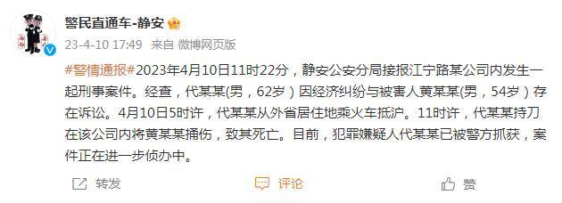

# 上海静安警方通报一起刑事案件：犯罪嫌疑人代某某已被警方抓获

来源：警民直通车-静安

2023年4月10日11时22分，静安公安分局接报江宁路某公司内发生一起刑事案件。经查，代某某(男，62岁）因经济纠纷与被害人黄某某(男，54岁）存在诉讼。4月10日5时许，代某某从外省居住地乘火车抵沪。11时许，代某某持刀在该公司内将黄某某捅伤，致其死亡。目前，犯罪嫌疑人代某某已被警方抓获，案件正在进一步侦办中。

