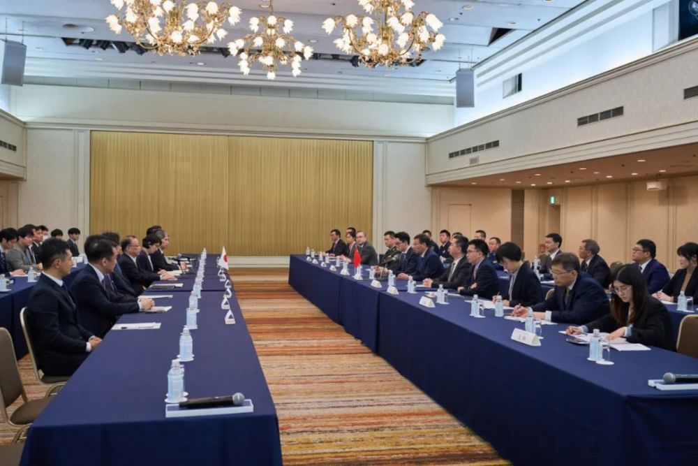

# 中方就日方在东海、钓鱼岛、南海、台海等问题上消极动向阐述严正立场

来源：边海纵横

2023年4月10日，中日海洋事务高级别磋商机制第十五轮磋商在日本东京举行，外交部边界与海洋事务司司长洪亮和日本外务省亚洲大洋洲局局长船越健裕共同主持。中方外交部、中央外办、国防部、自然资源部、生态环境部、交通运输部、农业农村部、国家能源局、中国海警局及日方外务省、内阁官房、内阁府、环境省、国土交通省、防卫省、水产厅、资源能源厅、海上保安厅分别派员参加。

双方举行了全体会议和海上防务、海上执法与安全、海洋经济三个工作组会议，就两国间涉海事务全面深入交换意见。双方一致认为，今年是《中日和平友好条约》缔结 45
周年，应以两国领导人重要共识为引领，重温和恪守条约精神，根据中日四点原则共识，通过对话妥善处理涉海矛盾分歧，深化海洋领域务实合作，为将东海建设成为和平、合作、友好之海，推动构建契合新时代要求的中日关系作出积极努力。

中方就日方近期在东海、钓鱼岛、南海、台海等问题上的消极动向阐述严正立场，要求日方停止一切侵犯中方领土主权、损害中方海洋权益及导致局势复杂化的言行，不得插手台湾问题。中方再次对日本向海洋排放核污染水计划表达关切，敦促日方正视国际社会正当合理关切，本着对海洋环境和人类健康负责任的态度，以公开、透明、科学、安全的方式妥善处理。

双方在磋商中达成以下共识:

一、双方积极评价中日防务部门建成海空联络机制直通电话，确认尽早启用，并进一步完善海空联络机制，维护海空安全。双方同意继续加强防务领域交流。

二、双方就加强中国海警局与日本海上保安厅对话合作达成一致，包括合作打击海上跨境犯罪、进一步发挥两国海警联络窗口作用、加强在多边海上执法合作机制下对话合作等。双方同意继续推进海上执法人员、海警院校学员交流。

三、双方一致认为，中日海上搜救机构保持顺畅沟通和良好协作，同意继续在《中日海上搜救协定》框架下深化海上搜救领域务实合作，支持两国地方海上搜救部门举行通信演习。

四、双方同意就办好2023年中日海洋垃圾合作专家对话平台第四次会议和第四届中日海洋垃圾研讨会加强合作，并在多边框架下积极推进应对海洋塑料垃圾务实合作。

五、双方同意全面落实《中日渔业协定》，争取尽快重启中日渔委会，继续就打击非法捕鱼，北太平洋渔业资源养护、鳗鱼资源保护等开展合作。

六、双方就开展海洋科研、海洋生态保护修复、发展蓝色经济创新技术等领域合作交换了意见，同意继续加强对口部门交流对接。

七、双方同意继续开展外交部门涉海人员互访，支持涉海智库、学术及教育机构间的交往合作。

八、双方原则同意，今年年内在中国举行中日海洋事务高级别磋商机制第十六轮磋商。

