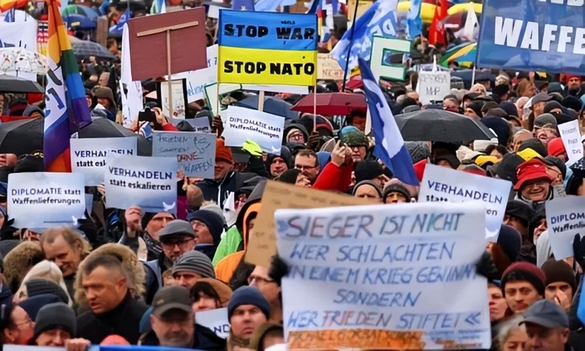

# 乌克兰的未来谁说了算？布林肯给出了答案

**俄乌冲突双方为何迟迟不能坐下来谈？人们似乎看到了一点端倪。**

乌克兰的未来，能否由乌克兰人说了算？美国与乌克兰最近的一轮互动给出了答案。

日前，乌克兰总统泽连斯基的高级顾问在谈到启动和谈的条件时，首次在克里米亚问题上松口，这一极不寻常的信号立即被国际社会所捕捉。但不久后，乌方高层就接连出面否认上述表态。

值得注意的是，在乌方改口的同时，美国国务卿布林肯“及时”出面挑拨，声称冲突不能以俄罗斯获益收场。

俄乌冲突双方为何迟迟不能坐下来谈？人们似乎看到了一点端倪。

**乌方高层着急“灭火”**

在刚刚过去的周末，乌克兰总统泽连斯基与乌克兰军队里的穆斯林士兵和来自克里米亚半岛的鞑靼人代表坐在一起共进晚宴，声称乌克兰决不放弃克里米亚。在乌克兰高层数日来关于克里米亚的密集表态中，这无疑是最具代表性的一次立场宣誓。

此前，乌克兰总统办公室副主任、泽连斯基的高级顾问安德烈·西比哈5日在接受英媒采访时释放了重磅信号。他说，当乌军反攻至克里米亚的行政边界时，乌克兰愿与俄罗斯就克里米亚的地位问题展开谈判。

_去年10月克里米亚大桥遇袭后，乌克兰后方基础设施遭到俄军大规模打击。图源：twitter_

这一表态与乌克兰的长期立场大相径庭。根据乌克兰政府的表态，克里米亚的归属不是可供谈判讨论的问题。在乌方去年11月发布的“十点和平方案”里，乌方要求俄军必须撤出乌克兰所有领土。

美国对于乌克兰高层这一表态反应迅速。美国国务卿布林肯迅速发表讲话，他承认如何及何时实现和平的决定权在于乌克兰自己，但强调冲突不能以俄罗斯“获得领土收益”收场。

分析人士认为，美方所谓的“领土收益”主要是指克里米亚。尽管美方在表面上尊重国际社会劝和促谈的愿望，但对于左右和谈前景的关键问题，美国要求乌方持毫不妥协的态度——这在实际上堵死了双方通过谈判达成妥协的路径。

面对美方的怒火，乌方高层迅速出面“灭火”。乌克兰总统办公室主任安德烈耶尔马克等表示，克里米亚不是可以谈判的筹码。泽连斯基9日再次强调，乌克兰不会放弃克里米亚。

**国际社会敦促对话**

但是，美国的一意孤行显然不是国际社会的主流愿望。随着俄乌冲突持续进行，越来越多的国家、尤其是巴西、印度、南非和印尼等主要发展中大国都要求冲突双方采取务实可行的态度，尽快开启停战促和的政治对话。

巴西总统卢拉6日表示，领土完整的原则应得到尊重，但乌克兰应该对以放弃克里米亚来换取和平的想法持开放态度。卢拉指责西方是在卷入而非制止冲突，各方不能什么都想要，“世界需要冷静下来”。

_西方军工厂正在迅速扩充弹药产能。图源：nyt_

卢拉最高外交政策顾问塞尔索·阿莫里姆从3月底至4月初先后访问俄罗斯和法国。他在莫斯科与俄总统普京举行了会谈，与之讨论了开启和谈所需的条件。3月2日，卢拉还与泽连斯基通了电话，讨论了结束冲突的外交手段。

塞尔索·阿莫里姆表示，据他的观察，俄罗斯很欣赏中国和巴西等国为和平所做的努力，他相信包括巴西在内的四、五个“在军事或情感上没有卷入俄乌冲突的新兴国家”可以促成俄乌对话。

对于即将开展的访华行程，卢拉表示自己将在访华期间与中方讨论乌克兰局势。

**美国多次阻止和谈**

在西方国家，对于和平的呼声也在迅速增强。

在德国，最近的一项民意调查发现，58%
的受访者认为外交努力还不够——这是迄今为止民意调查中的最高水平。在美国，选择“尽可能”地支持乌克兰和敦促基辅“尽快”实现和平的民众比例几乎平分秋色，分别为48%和47%。

_2月27日，超过10万人涌上柏林街头抗议对乌军援。图源：Reuters_

实际上，俄乌双方自冲突爆发以来并非没有直接接触，但都因为种种因素不了了之。去年4
月，俄乌双方试图达成一项协议，俄罗斯以将军队撤回冲突爆发之前的战线为条件，换取乌克兰永远不会寻求加入北约的承诺。但是，随着基辅郊区“布查事件”的出现和热炒，乌克兰退出谈判。

去年6月卸任的以色列前总理贝内特在一段采访中表示，他曾协调冲突双方展开谈判，但美国、德国和法国当时阻止了他的努力，因为“粉碎”普京对他们来说似乎更重要。在美国官员对此予以否认后，贝内特在社交媒体上改口称，他不确定谈判是否会达成任何协议，也不清楚谈判是否值得。

美国部分民主党人去年 10
月曾发布一封公开信，呼吁总统拜登寻求“迅速结束冲突”，但迅速撤回了这封信。几乎同一时期，美军参谋长联席会议主席马克·米莱将军在内部会议上表示，乌克兰不太可能在战场上取得更大的收益，应该将注意力转移到谈判桌上——但白宫迅速压制了这种主张。

就此看来，俄乌和谈迟迟无法开启，外部势力的干扰难辞其咎。在乌克兰内部，即便泽连斯基通过武力收回失地的意愿强烈，但乌方高层围绕克里米亚的罕见表态很可能说明，通过谈判解决冲突的选项并没有被彻底排除。

**出品 深海区工作室**

**撰稿 深海龟**

**编辑 深海獭**

