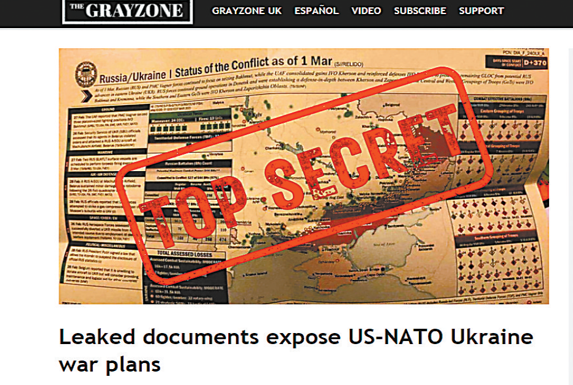

# 五角大楼“泄密门”惹恼多个盟国，凸显美国对其他国家安全的破坏

【环球时报驻美国、韩国特约记者 萧达 刘海生 环球时报记者 丁雅栀 柳玉鹏
陈康】“泄露的五角大楼机密文件暴露了美国同时对对手和盟友进行间谍活动”，当地时间8日，美国《纽约时报》《华盛顿邮报》等主流媒体纷纷在网站头条报道五角大楼机密文件和情报被泄露到网上的消息。据称这批泄露的机密文件足有100多份，主要是关于俄乌冲突的情报，还有涉及美国对中东、朝鲜半岛、印太国家和地区等的情报和文件。此次机密文件的泄露规模，以及文件本身足以造成巨大破坏的敏感性，让世界震惊。《纽约时报》称，有美高级情报官员称此次泄密是“五眼联盟的噩梦”。该事件凸显美国对其他国家安全的破坏，讽刺的是，这正值美国频频高喊本国安全“遭到威胁”之际。

**美国已展开调查**

“懊恼的美国安全官员正试图迅速找到罪魁祸首”，《纽约时报》引述五角大楼前高级官员马尔罗伊的话称，机密文件外泄反映出美国内部“出现严重安全漏洞”，是有人蓄意泄密，可能会破坏乌克兰、美国和北约的努力。几名安全机构官员警告，像这样源源不断泄露机密文件的情况可能会持续下去，必须尽快揪出罪魁祸首。报道称，目前美国司法部已开始对泄密事件展开调查，五角大楼也已启动内部自查。

_美国“灰色地带”网站有关五角大楼“泄密门”事件的报道截图。_

对于这些机密文件的真实性，美媒称大部分无法证实。美国有线电视新闻网（CNN）援引匿名官员的话确认，部分文件是五角大楼（向高层）提供的《每日情报汇编》的一部分，但具体内容似乎有被修改过的痕迹。

《纽约时报》称，泄露的文件主要揭示了美国对俄罗斯军事行动进行间谍活动的深度，“几乎每个俄罗斯部门在某种程度上都受到美国的渗透”。不过，这些文件的泄露可能让莫斯科有机会切断信息来源。此外，尽管泄露的文件不涉及乌克兰打算何时、在何地发动反攻，但对于专业人士来说，这些文件无疑提供了许多高价值的线索，比如文件中提到了美国向乌提供的“海马斯”火箭炮的弹药消耗情况。

**真泄密还是信息战**

对于美国机密文件泄露，乌克兰总统泽连斯基7日紧急召开最高统帅部会议，讨论防止机密泄露问题。美国独立新闻调查网站“灰色地带”称，其中一份被泄露的机密文件显示俄乌在战损方面惊人的差距，与乌克兰和西方宣称的“乌克兰必胜”的叙事不符，泄密事件激怒了乌领导人。

俄罗斯总统新闻秘书佩斯科夫7日表示：“我们对（文件显示的）美国和北约直接或间接卷入俄乌冲突没有丝毫怀疑……这会使整个过程复杂化，但不会影响特别军事行动的结果。”

实际上，俄罗斯对此事有很多疑惑。对于美媒声称俄各部门都被美间谍渗透，俄方没有回应。俄《论据与事实》9日质疑称，在美国，泄露机密事件经常发生，很难区分这次是真泄密还是对俄发起的信息战。

中国社科院美国研究所副所长袁征9日接受《环球时报》采访时表示，被泄露的所谓“美国机密文件”不能百分之百确认是真是假。不过，总的来看，这次事件可能令乌克兰士气大受打击，同时，对是否继续大规模援助乌克兰，美国国内的争论将更激烈，美国的盟友也将变得更加迟疑。

**韩国与以色列的不满**

让美国最担心的是，这些泄露的机密文件可能引发盟友对美国的信任危机。《纽约时报》称，这些文件还透露出华盛顿也一直在监视乌克兰、以色列和韩国等亲密盟国的领导人，这令美国与盟国的关系变得复杂。报道称，多份泄露文件显示消息来源于“信号情报”，这指的是通过电子窃听和通信拦截取得的情报。比如，中情局的“信号情报”显示，以色列情报机构摩萨德的领导人曾鼓动反对政府司法改革的抗议，韩国政府内部也对是否向乌提供炮弹等感到纠结。《华盛顿邮报》称，这些机密文件泄露后，美国盟友对文件所披露的美国对朋友也进行间谍活动的惊人细节感到震惊，并感到愤怒。

“外泄秘密文件显示美国也在监听盟国，这对美国与盟友关系产生致命打击”，韩国《朝鲜日报》9日称，未来随着事件的持续发酵，不排除发生盟国拒绝与美国进行情报共享等外交事态的发生。就美国对韩国官员的电话和电子邮箱进行监听的“疑云”，韩国总统办公室官员9日表示：“这还不是确定的事实，韩国政府有自己的基本立场”。他称，将就此与美国进行“讨论”。

以色列“犹太新闻社”称，美媒的报道证实了内塔尼亚胡的儿子亚伊尔推特上愤怒的言论:“泄露文件包含的信息……与此前未经证实的指控有重叠。”亚伊尔称，以色列情报部门和美国内部的敌对分子是以色列国内抗议司法改革活动的“幕后黑手”。

值得关注的是，据《纽约时报》报道，美国政府曾于2021年与以色列间谍软件公司NSO签订秘密合同，在国内外目标用户不知情或未同意的情况下对其进行跟踪监控监听。对此，中国外交部发言人毛宁7日表示，美国政府为维护其网络霸权，“明知故犯”，滥用网络监控及窃密技术，对包括盟友在内的国家实施无差别监控窃密，严重损害他国主权和全球互联网用户的隐私。

袁征表示，为了维护自身霸权，美国不择手段，不论是盟友还是对手，都会被美国当作监视、窃听的对象。这不仅损害了其他国家的安全利益，也破坏了国与国之间的信任，给地区安全和世界安全带来威胁。

