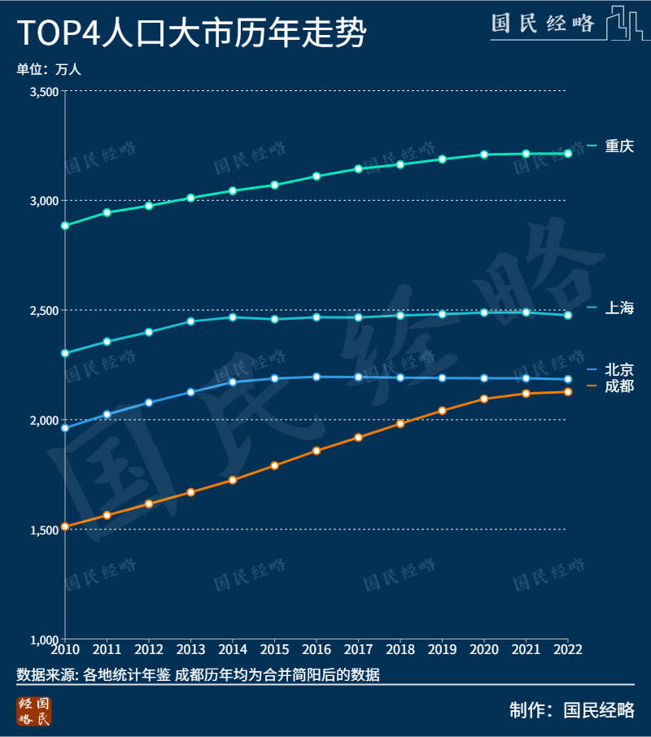
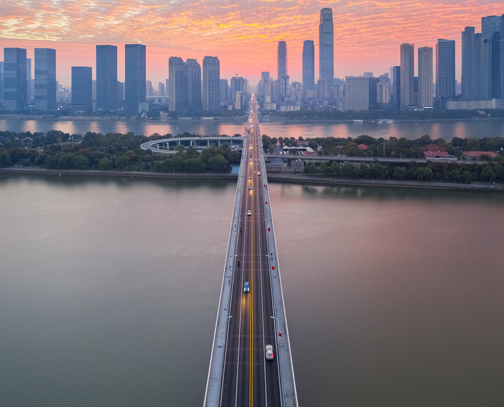
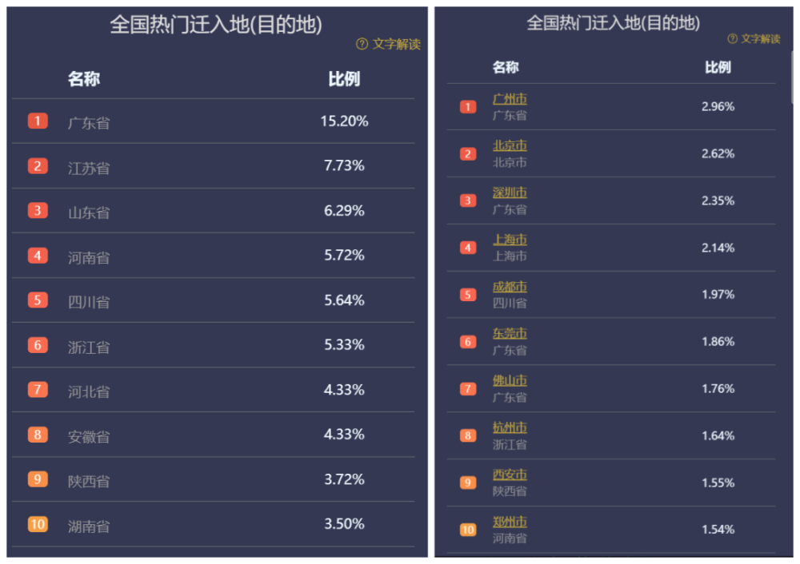

# 人口增量第一城易主背后：中西部，正在疯狂吸纳人口

**文|凯风**

人口流向，正在发生变化。

01

在刚过去的一年，全国人口形势出现了前所未有的新变局。

第一个变局是， **全国人口增长最猛的地方，不是广深也不是沪杭，而是连续两年都出现了中西部。**

2021年和2022年，人口增长冠军分别花落 **武汉和长沙。**

要知道，2010年-2020年，历年的人口增长冠军，几乎都在广州、深圳、杭州等城市间产生，“孔雀东南飞”的特色十分鲜明。

如今，风水轮流转， **人口开始涌向中西部了。**

**长沙，首次夺得人口增长冠军之位，且GDP增速位列万亿城市之首。**

2022年，长沙常住人口达1042万人，增加18.13万人；GDP为1.39万亿，增速达4.5%，位列万亿城市之首。

这个向来以“让炒房有去无回”而著称的中部省会， **低房价的“洼地效应”** 日益凸显。

2023年初，长沙房价仅为1万元左右，在全国排在60名之外，不及东部地区一些普通县市。

而在2021年一年狂增百万人口的武汉， **再次实现了双重突破。**

一个突破是， **超过天津，首次晋级全国人口第7城** 。数据显示，2022年武汉常住人口达1373.9万人，以10万左右的领先优势赶超天津。

另一个突破是， **武汉已经正式晋级，成为全国第8个城区人口超千万的超大城市** 。在此之前，上海、北京、深圳、广州、重庆、成都、天津已经晋级为超大城市。

同时，作为2000万人口俱乐部成员的 **成都，与北京的差距越来越小** ，未来几年不乏挑战人口第三城的可能性。

数据显示，2022年，成都常住人口为2119.2万人，与北京的2188.6万人相比，差距进一步收缩到57.5万人。

而在五六年前，两地的人口差距还有300万之巨。但这几年，由于疏解非首都功能和减量发展的需要，北京主动控制人口，常住人口连续6年下降。

一增一减之下，成都正在不断逼近北京。

02

第二个变局是，虽然人口大盘见顶， **多数省份出现负增长，但省会城市仍在增长。**

从已公布相关数据的城市来看，人口增量居前的城市，几乎都是省会，多数都是名副其实的强省会。

可以看到，湖南、山东、河南等省份常住人口集体负增长，但作为省会的 **长沙、济南、郑州** 依旧保持正增长。

长沙最为典型。作为人口增长冠军，长沙大增18.19万人，但其所在的湖南省人口却下降18万人。

就连多年陷入集体负增长困局的东北，作为国家中心城市有力竞争者的 **沈阳，常住人口也实现了连年正增长。**

2022年，沈阳常住人口达914.7万人，同比增长2.9万人，而其所在的辽宁省，常住人口减少32.4万人。

众所周知，人口增长，一方面看自然人口增长情况，即出生人口-死亡人口；另一方面看机械增长情况，即人口流入或外流的情形。

沈阳人口增长，显然得益于 **外来人口流入，尤其是东北三省。**

毕竟，沈阳人口出生率仅为5.04‰，而死亡率高达9.89‰，自然人口大幅负增长。

**全省人口下降而省会保持正增长，说明了什么？**

显然，人口向省会集中的趋势没有改变，省会作为全省人口蓄水池的功能日益凸显，在防止人口流失、吸引人口回流方面，发挥了关键托底作用。

虽然强省会模式遭受挑战，省域副中心横空出世，但强省会的影响力一时难以逆转。

当然，这些强省会的人口增长，一部分来自沿海地区的人口回流，一部分来自对省内其他地市的虹吸，基本都还 **集中在省内的一亩三分地** 。

但万事都要迈出第一步，先守住基本盘，再想着如何争抢高学历人才。

03

第三个变局，在东北之外，东部地区多个 **经济大省、人口强市出现人口负增长。**

这背后，或许不乏人口回流中西部所致，但更多还是疫情这一超预期因素的扰动所致，只是短期现象。

作为全国外来人口最多的地区，去年，广东省外流动人口一度减少69.2万人，由此带动全省人口罕见出现负增长。

广东统计局官网发布的文章表示：这是在疫情散发多发的因素影响下， **省外流动人口暂时回流返乡的阶段性现象**
……预期2023年广东常住人口将逐步恢复稳定增长。

既然是阶段性现象，那么随着疫情消退，全面拼经济成为主流， **“孔雀东南飞”将再次席卷全国** 。

的确，百度实时迁徙地图显示，广东连续2个月霸榜全国人口热门流入地首位，广州蝉联人口迁入地第一。

**地铁客流** 提供了更进一步的佐证。

近期，广州地铁最高单日客流量迅速迈上1000万人次大关，深圳地铁突破800万人次，超过2019年同期水平。

如果以更为客观的客流强度，即每公里地铁平均每天运输的客流来衡量，广深人流量之大，冠绝全国。

根据交通部提供的最新数据， **广州、深圳月平均客流强度** 分别高达1.43、1.37万人次/公里/天，力压京沪，超过了许多二线省会城市的2倍以上。

显然，从广东到广州、深圳，2023年人口实现大幅反弹，重夺增长之王，可谓毫无悬念。

04

人口，为何纷纷涌向中西部？

抛开疫情带动的人口阶段性返乡现象，中西部地区的人口回流也是客观存在的事实，背后的深层次推动力是什么？

**其一，产业西移。** 人随产业走，千亿级乃至万亿级产业的崛起，自然带动产业工人的回流。

近年来，随着全球产业大转移的趋势演变，以及国内国际大循环战略的提出，再加上创新驱动的日益凸显，中西部一些强省会正在脱颖而出，成为新的制造业中心。

根据赛迪发布的 **2022年全国制造业百强市** 榜单，成都、武汉、合肥、西安、郑州等城市跻身TOP20。

而在工信部发的先进制造业集群“国家队”榜单中，也不乏成都、长沙、武汉、西安乃至株洲、德阳等普通地市的身影。

**其二，强省会崛起** ，让中西部有了与东部经济强市一争高下的机会，也为产业、人口流入提供了支撑。

正如《中国城市大趋势》一书中所讲的，一个省份，如果连一个显眼的大城市都没有，恐怕都参与区域竞争的机会都没有，遑论在重大国家战略中获得一席之地？

一个共识是，弱省需要强省会，强省更适合多中心，而省会过度膨胀的地方，多中心则是必然的选择。

**其三，陆权复兴** ，中西部未来后来居上的重要逻辑所在。

在《中国城市大趋势》一书中，我们曾预测未来的8大城市趋势，其中之一即“内陆复兴”。

内陆复兴，一是得益于市市通高铁、县县通高速、中欧班列、陆海新通道、航空物流枢纽等基础设施的完善，中西部地区得以摆脱区位劣势，内陆地区得以蜕变成开放前沿。

二是随着国际经贸关系变迁，外贸开始遭遇挑战， **国内大循环** 的重要性日益凸显。人口众多，且拥有超大规模市场的内陆地区，成了这一战略的重要受益者。

三是以互联网为代表的数字经济等新型基础设施的完善，最大可能抹平了不同地区之间的差距。

可以说，面向未来，叠加了产业转移、人口回流、内需驱动、内陆开放、国家综合交通体系完善多重利好，中西部人口有望持续回流，重回高光时刻。

