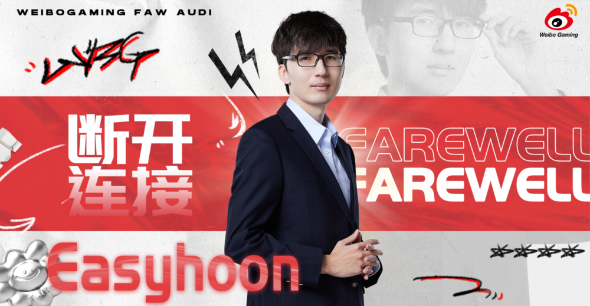
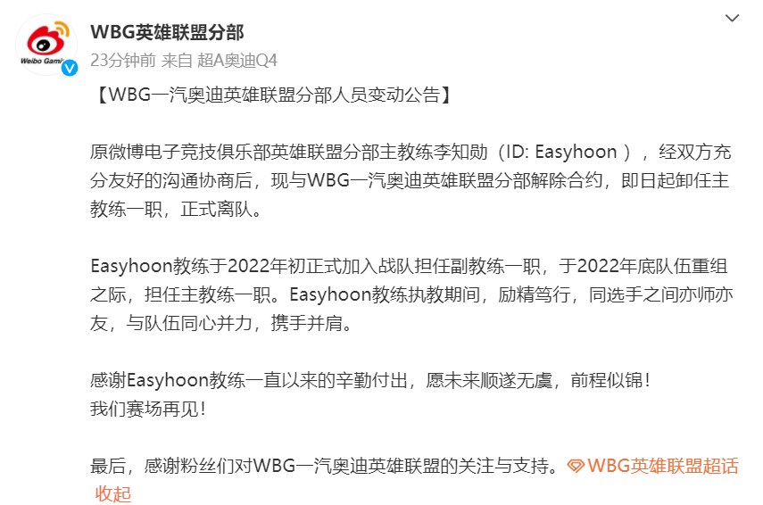
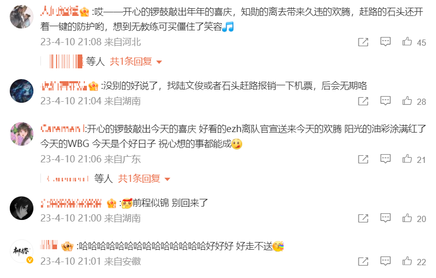
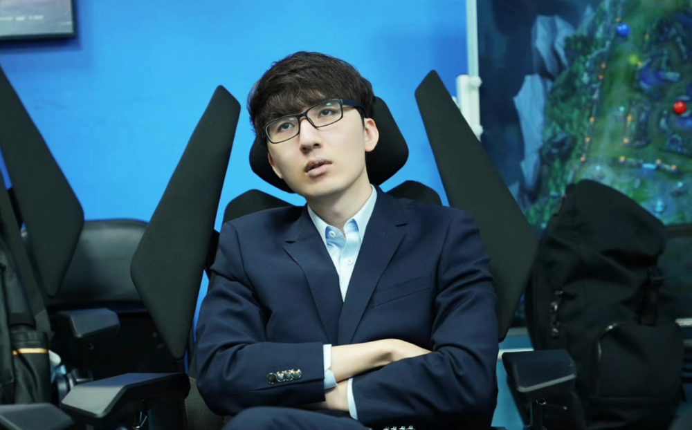
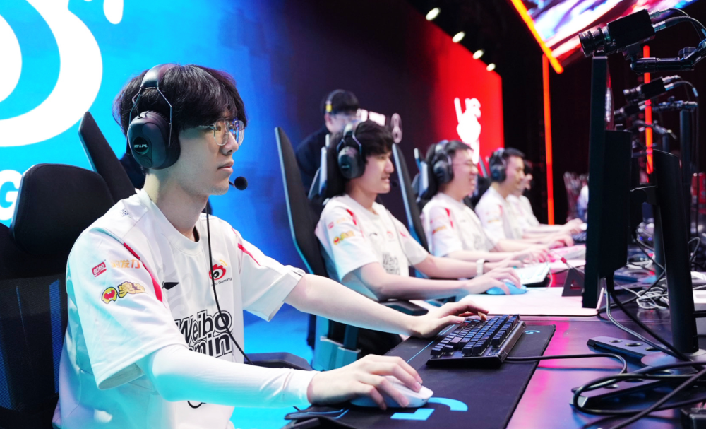
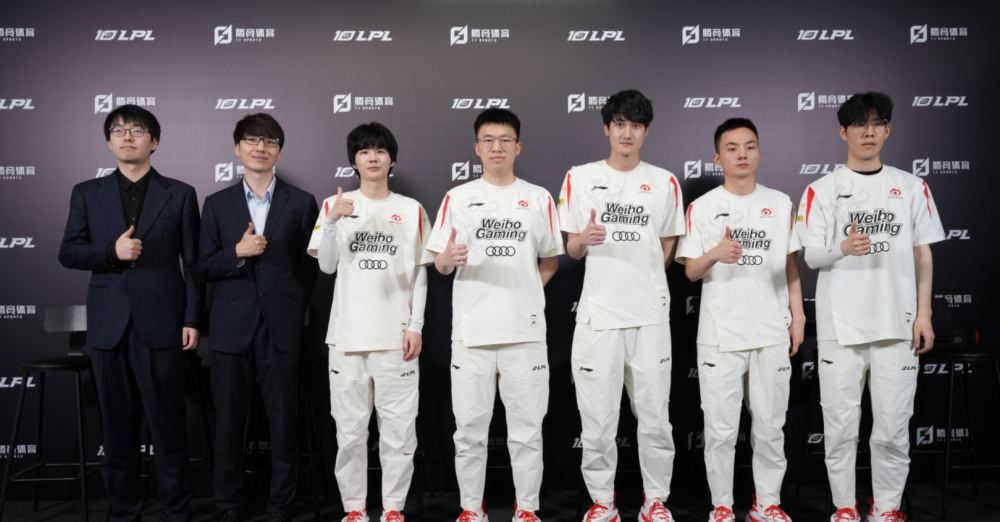

# 再见Easyhoon！WBG官宣：侯爷解除合约，正式离队！粉丝拍手叫好

LPL春季赛季后赛的比赛还在进行中，然而有的战队已经开始进行人员的变动的。WBG在10号晚上突然官宣，主教练Easyhoon宣布卸职，引发了不少的热议。

WBG官宣原文如下，表示经过双方友好沟通之后，原WBG主教练Easyhoon解除合约，卸任主教练一职，正式离队。之后回忆了Easyhoon自从2022年加入WBG到现在为止的一些经历，感谢了他的付出，祝福他未来顺利。最后则是感谢了粉丝们对WBG的支持。

在这条官宣离队微博下方的评论区，WBG的粉丝们都拍手叫好，不少人直接欢呼：好日子啊，开心，好走不送，别回来了，后会无期！也有人开始担心夏季赛的教练会是谁，因为目前市面上好教练不多了，WBG未必能竞争成功。

其实easyhoon离队并不意外，因为在春季赛WBG成绩不佳的时候，WBG老板就放过话，如果WBG在春季赛结束后没有取得好成绩，会在夏季赛更换教练组，果然WBG季后赛一轮游，被打了个0-3，输得特别惨，WBG老板也兑现了自己的承诺，让easyhoon离队了。当然以主教练的身份来看，Easyhoon带队的成绩肯定是不及格的，因为WBG这边多位S赛冠军以及MSI冠军选手，还有发挥一直都很稳定的Light，但是春季赛连四强都没有打进去，他作为教练负主要责任是正常的。

Easyhoon的BP确实有问题，但是WBG春季赛成绩不佳，不仅仅是教练一个人的问题，选手的英雄池，比赛中的操作以及配合都有问题。而easyhoon性格比较软，面对这么多大牌选手，说实话他应该是管不住的，WBG需要一个有魄力的教练，才有机会改变现在的局面，不然随便换一个教练，还是管不住队员，问题不改正的话，夏季赛也很难。

不过也有换了教练后，成绩突飞猛进的战队，比如说BLG买了Tabe之后，季后赛接连掀翻多支战队，直接拿到了LPL前三名的好成绩，现在更是被很多人看好晋级MSI。所以期待WBG也能找一个靠谱的教练吧，这套阵容已经花了很多钱了，如果夏季赛还不出成绩，那就尴尬了。

那么，对于这件事情，你们有什么想说的吗？你们觉得WBG更换教练后，夏季赛会进步吗？欢迎在评论区留言探讨。

