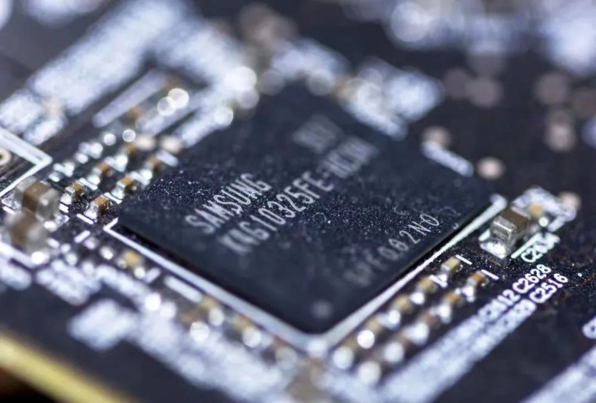
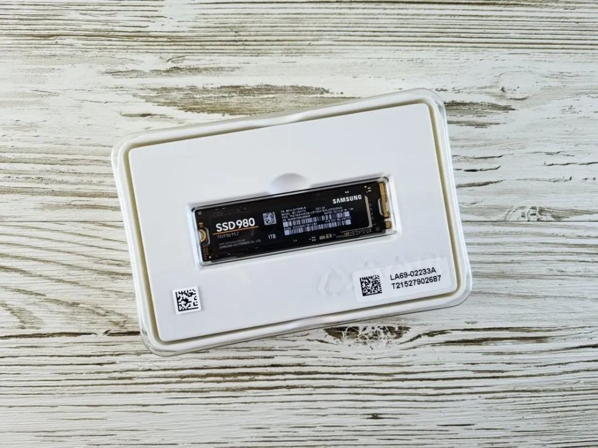
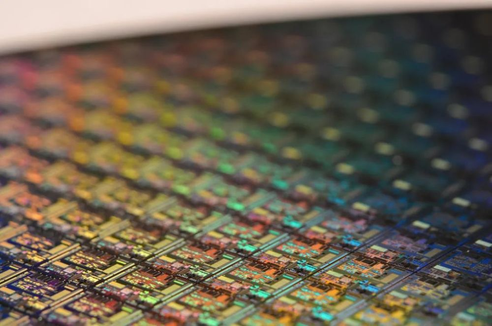

# 利润骤降96%，三星被芯片拖累了

撰文 | 刘星志 编辑 | 赵晋杰

半导体领头羊之一的三星电子，也“爆雷”了。

据韩联社近日报道，三星集团旗下最大子公司三星电子2023年一季度营业利润仅6000亿韩元（约31.3亿元人民币，下同），同比锐减95.8%，跌至14年来最低水平。三星电子这一季度少赚的利润，比国内半导体巨头中芯国际2022年全年营收还高出约200亿元。

利润“脚踝斩”以外，三星电子营收也大幅下降，公司一季度销售额63万亿韩元（约3276亿），同比下降19%。

**针对巨额亏损，三星电子解释说，它的所有业务——从芯片到显示器和电子设备——都经历了需求疲软。但分析师认为，芯片业务的亏损是主要因素。**

彭博社估计，三星电子存储芯片部门损失了约30亿美元（约206亿元），加之行业需求锐减，去年底三星电子库存高达52.2万亿韩元（约2724亿元），相当于其大半个季度的销售额。

业绩压力下，三星电子终于开始释放减产信号，公司表示“正在将内存产量削减至有意义的水平”，改变了此前不会人为减少产量的立场。随着减产信号释放，三星和海力士股价应声上涨。

半导体部门一直是三星电子的主要利润来源，巅峰时一度贡献了公司80%的利润，然而从去年开始，该部门贡献利润占比一路走低。

财报数据显示，2022年全年，三星电子利润为43.3万亿韩元（约2287亿元），其中，半导体业务贡献了23.8万亿韩元（约1254亿元）。

分季度来看，半导体部门去年四个季度利润分别为8.5万亿韩元（约444亿元）、9.9万亿韩元（约517亿元）、5.12万亿韩元（约267亿元）、2700亿韩元（约14.09亿元）。

需求疲软、业绩承压，今年2月，三星电子向兄弟公司三星显示借款20万亿韩元（约1044亿元）以确保运营资金充足。

据财报数据，去年底，三星电子账上拥有115.2万亿韩元（约6012亿元）现金。现金充足情况下还要向外借款，可能与其计划的投资有关。

高附加值、高利润的半导体行业背后，其所需研发、基础设施开支均十分高昂。2022年，三星电子在相关基础设施上投资达到53.1万亿韩元（约2771亿元），远高于其营业利润。

此外，3月15日，据韩联社报道，三星公司计划投资300万亿韩元（约1.57万亿元）在京畿道打造全球最大的半导体集群，其中将至少包含5座先进制程的晶圆代工厂。
**这一计划的投资额比去年中国（含台湾省）半导体项目总金额还高。**

三星此举，目的在保持内存芯片霸主地位的同时，缩小在逻辑芯片上与台积电的差距，以期在消费电子、汽车、AI等市场上获得更高的利润。但在行业的下行周期，维持投资正越发艰难，半导体业务正从三星电子的顶梁柱，一步步变成前行的负担。

三星减产的消息使得投资情绪显著恢复，消息发布当天，三星电子股价盘中涨幅4.7%，创三个月以来最高涨幅。

但股市往往领先于市场，分析师普遍预期，产能调整的效果将在下半年开始显现，这意味着半导体业务亏损缺口在二季度可能进一步扩大，三星电子在二季度有整体亏损的风险。

即便如此，外界对三星的举措并不意外。三星历来选择在困难时期不放慢脚步，以便从竞争对手处抢夺市场份额。

由于行业持续低迷，内存芯片主要厂商近几个月纷纷宣布减产。美光宣布DRAM及NAND Flash减产20％，铠侠宣布NAND
Flash减产30％。但只要份额最高的三星不妥协，其他厂商减产也无法获取定价权。

然而到了今年一季度，盈利和库存的压力，让三星也不得不向市场妥协，宣布减产。

**当然，内存市场的不景气，并非三星妥协的唯一因素，在半导体业务上“双线作战”的三星，也需要通过市场的复苏缓一口气。**

作为内存芯片赛道的执牛耳者，三星对周期如何影响行业体会最深，今年一季度的低迷业绩就是例证。正因如此，靠晶圆代工穿越周期的台积电，成了三星效仿的对象。

去年底有研究机构发布报告称，三星电子晶圆代工业务营收在2022年三季度达到55.84亿美元，高于NAND闪存业务43亿美元的销售额。外媒报道称，这是三星电子晶圆代工业务的营收首次超过NAND闪存业务的营收。

然而，这一成绩背后最主要的因素是NAND闪存的需求低迷、价格暴跌，而不是晶圆代工业务本身有多大的进步。

2020年、2021年底，高通先后发布骁龙888、骁龙8Gen1两款旗舰处理器，两款处理器均由三星代工。但三星制程工艺表现不佳，良率低，且功耗和发热高，市场反馈较差。

与此同时，高通的老对手联发科则携手台积电，蚕食高通的市场份额。市场压力下，去年5月开始，高通新一代旗舰芯片转由台积电代工。

3月12日，三星发布《电子事业报告书》，其中提到三星将从2023年上半年开始大规模量产第三代4nm芯片。但一周之后，高通发布骁龙7+处理器，依旧选择了台积电4nm工艺。

晶圆代工业务刚刚痛失大客户，消费电子行业迟迟不见复苏，三星也很难经受得起内存芯片继续降价的打击。

高通的转单，只是三星在挑战台积电路上又一次挫折。过去十几年，超越台积电几乎成了三星的一个执念。

2005年，全球内存市场下行至周期底部，业绩受困的三星开始切入芯片代工领域。在此之前，三星和台积电，一个做内存芯片，一个做逻辑芯片，井水不犯河水。

在芯片代工市场上，刚入局的三星迟迟未能打开局面，直到2009年才迎来转机。

受金融危机影响，半导体行业陷入低迷，这一时期的台积电做出大幅裁员降薪的决定。三星抓住这个机会，开出翻倍薪资，挖走台积电数十名员工，其中就包括蒋尚义的学生梁孟松。正是在梁的帮助下，三星的制程技术突飞猛进，抢在台积电前量产了14纳米制程。技术上的突破，让三星成功吸引到了苹果、高通等大客户。

但2011年，台积电对梁孟松发起诉讼，使得后者无法继续在三星工作，拖慢了三星的进程，于是从10纳米制程这一关键节点开始，台积电始终压三星一头。

这次挑战失败后，2019年，三星再次定下目标，要用12年时间，在保持存储芯片全球第一地位的同时，在晶圆代工领域超越台积电。

逆周期投资，曾是三星确立在内存领域地位的重要手段。2007年-2008年，内存市场陷入低迷，厂商纷纷减产，但三星却大幅提高产能，让内存芯片跌破材料成本价，逼得尔必达等巨头纷纷破产，三星一家独大。

如今，三星要用打败尔必达的方式压垮台积电。去年5月，三星对外宣布了一项巨额投资计划：未来五年，将在芯片、生物科技等领域投资3550亿美元（约2.4万亿元）。

三星的逆势扩张，不仅体现在资金和基建上，还体现在人才储备上。据韩媒去年底报道，三星电子System
LSI部门计划用5年时间，将员工人数从9000人扩大至15000人，重点加强半导体设计与研发的人力资源，以调整高通和索尼在细分领域的领导地位。

此外，或许是当初挖角梁孟松尝到了甜头，今年3月，三星又挖来19年台积电老将林俊成，以弥补在先进封装技术上的不足。事实上，半导体行业挖角行为时有发生，三星一直对科技人才虎视眈眈，近年来陆续从对手处挖来不少高管，比如苹果的半导体专家金宇平（Kim
Woo-pyeong）、英特尔的技术专家李相勋等。

三星每一次逆势投资的目的，都是获得更大的市场份额和利润。假如未来真能超过台积电，三星将在半导体市场掌握近乎绝对的定价权。但台积电不是尔必达，三星的豪赌面临极大的风险。

想要超过台积电，在资本支出上至少不能落后。2018-2021年，三星的资本支出虽然远高于台积电，但更多投入在了内存上；晶片代工业务的投资虽增长迅猛，但不及台积电投入的一半。

这也正是三星计划实施所面临的难点之一。
**三星既要不时通过价格战打压内存芯片厂商，又要在晶圆代工领域追赶台积电，过去晶圆代工可以靠内存芯片的利润输血，如今内存芯片本身都在亏损，成为公司的负担，三星电子也不得不靠兄弟公司输血维持巨额投资下公司的正常运营。**

此外，三星电子内部管理的混乱也值得警惕。继去年曝出公司内斗、良品率造假等传闻后，今年3月底，三星电子又在引入ChatGPT后发生了三起数据泄露事件。

即便如此，AI行业的需求仍是三星超越台积电的一大希望。

据外媒报道，三星电子晶圆代工业务部门已经开始为韩国本土无晶圆厂FuriosaAI代工名为Warboy的NPU。除了FuriosaAI外，韩国另一家专注于AI半导体设计的初创公司Rebellions，也将采用三星电子的5nm制程工艺代工他们设计的芯片。

虽然这些公司的订单规模本身很小，但它代表了当前半导体行业的一大趋势：消费电子市场持续低迷，AI行业的需求持续增长。

谷歌推出Bard，百度推出文心一言，微软将ChatGPT整合进Bing中，越来越多科技巨头正在准备加入AI大模型淘金潮。

**和历史上所有淘金潮一样，卖铲子的人稳赚不赔。**

ChatGPT引发的AI热潮中，尽管英伟达等大客户的订单流向了台积电，但有业内人士指出，随着全球公司争先恐后进军人工智能行业，代工市场或将快速增长。甚至连英伟达，未来也可能向三星电子分流一部分订单，以保证产能。

当然，AI的远水解不了近渴。内存芯片市场还未触底，晶圆代工业务仍未重获客户信任，接下来几个季度，承压的半导体业务，仍将是三星电子业绩的最大负担。

参考资料：

《三星System LSI部门“大跃进”，计划五年扩招6000人》集微网

《存储价格还要继续降？这是三星的阳谋》雷科技

《三星半导体，继续死磕》半导体行业观察

《三星引入ChatGPT不到 20 天，被曝发生3次芯片机密泄露》CSDN

《错过AI盛宴的三星，试图用2300亿美元“搅局”》虎嗅

