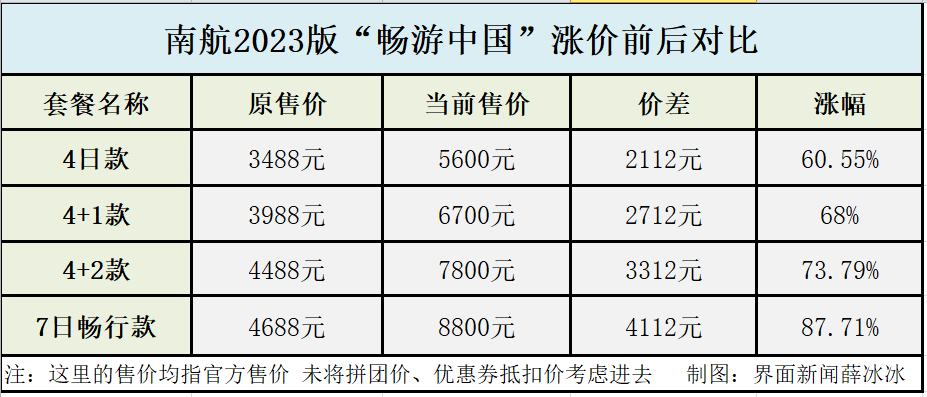

# 南航“随心飞”产品最高飙升至8800元，网友：得飞多少次才能回本

界面新闻记者 | 薛冰冰

近日有网友发现，南航“畅游中国”随心飞四个版本全线涨价，涨价幅度可谓“狂飙”。从价位区间看，之前的四个版本售价在3400元-4700元之间，此番涨价后最贵的一版飙升至8800元，上涨幅度已接近90%，创下随心飞产品最高售价纪录。

据界面新闻梳理，越高版本的“畅游中国”产品涨价越多，其中7日款已经涨了4112元，相当于原“4+2款”的售价；最低版本的“畅游中国”产品，也涨了2112元，涨幅在60.55%。

上个月21号，南航正式发售2023版“畅游中国”随心飞，活动宣布当天南航服务器一度挤到崩溃，开售两天“畅游中国”4日款和“畅游中国”天府版即宣告售罄，火爆程度远超疫情期间。

而在南航之后，3月24日春秋航空紧接着发售“想飞就飞5.0”版，其销售情况同样火爆，当天下午系统显示过于繁忙，购买入口短暂关闭。

2023年民航市场进入快速复苏通道，民航局数据显示，政策利好叠加春运出行需求集中释放，今年一月份航空公司实现盈利31.6亿元。但是春运旺季过后，三、四月份为民航市场传统的淡季，客座率表现不算理想。业内人士分析称，航空公司继续推随心飞主要是希望在航班淡季补充客源收益、充分利用空余的座位。

从定价来看，无论南航还是春秋航空，都保持了疫情期间3000元左右的定价水平。但是市场复苏期，随心飞包含的权益有一定“缩水”，旅客想要薅羊毛变得没那么容易。

以南航随心飞为例，相比此前5-6个月的航班日期，2023版畅游中国航班日期缩短至3个月；此外，为了防止有人反复订票退票，旅客每次兑换时都要额外支付票面价20元；座位投放数量上，2021年南航承诺“每天不少于2万个经济舱座位供套餐用户兑换”，今年仅表示，“可兑换航班及可兑换座位数以实际查询结果为准”。

今年以来机票价格逐渐回归常态，哪怕适用期限缩短、投放座位有限，3000余元不限次兑换的套票产品仍具有很强吸引力。但是南航随心飞近日全线涨价，产品权益上并未有任何增加，航班日期同样为3个月。

业内自媒体“航旅圈”文章提到，对于这次涨价，不少此前已经购买畅游中国的用户直呼赚大了；也有一些网友感慨，使用时间不变加价不加量，8800元每次还要付20元兑换费，这得飞多少次才能回本。

还有自媒体猜测，南航随心飞这次价格飙升可能是“国有航司被限制低价投放的政策又回来了”。

对此，民航专家李渊接受界面新闻采访时认为“二者联系不大”。至于为何涨价，他觉得随心飞产品发展最后是一个价值回归。他分析说，之前各种随心飞的逻辑就是填补空余座位，在淡季，这样的座位边际成本几乎为0，只要多一位旅客就是边际收益。但是在旺季这种边际收益就是负的。所以，即使要推随心飞，航空公司至少也会选择保本微利的定价。

民航即将迎来五一小长假出行。李渊表示：“航空公司设计产品不仅要考虑当下，也要兼顾到后续发展情况”。从近期票价走势看，航旅纵横数据显示，清明节（4月4日-6日）前后国内航线平均价格约为907元。截至4月5日，五一期间国内航线平均支付价格约为1250元，涨幅较为明显。

