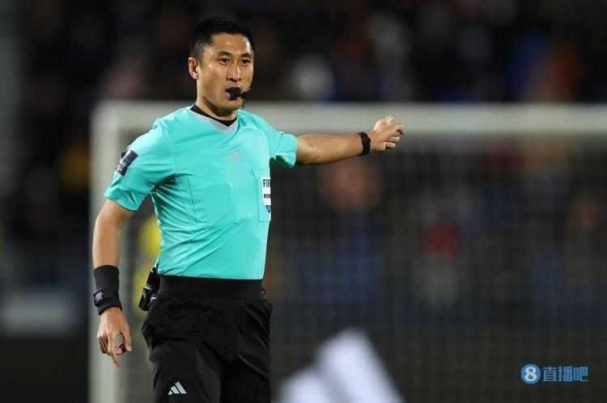

# 新赛季中国足球联赛裁判员场上判罚为最终判罚，俱乐部不得提出抗议

直播吧4月10日讯 北青消息，新赛季裁判场上判罚为最终判罚，俱乐部不得抗议。

在4月10日香河国家队训练基地召开的2023年职业联赛赛前工作会议期间，中国足协、中足联筹备组竞赛工作相关负责人明确强调，
**由裁判员根据比赛相关事实做出的场上判罚为最终判罚，（俱乐部）对此不得提出抗议。**

事关职业联赛判罚争议的《中国职业足球俱乐部申请评议办法》在被推行仅仅1个赛季之后，便于2023赛季被废止。

《2022年中国职业足球俱乐部申请评议办法》上赛季推出，作为俱乐部在对比赛中判罚持有不同意见时，与赛事组织方的沟通渠道。

按相应流程，若遇到争议判罚，各队领队在赛后30分钟向比赛监督提出评议申请，俱乐部需在赛后4小时内提交正式申请，赛事组织方将在24小时内评判予以受理或不予受理，并函告俱乐部。

若不予受理，则视为一次申请失败，若予以受理，则提交裁委会评议组，在规定时间内（赛会制为72小时，主客场制为48小时）做出评议结论，并函告申请评议俱乐部。

对于出现较大争议或媒体球迷高度关注的争议判罚，赛事组织方将及时向社会通报评议结果。

**只针对四种争议判罚接受赛后评议申请**

这四种争议判罚包括：

第一、进球/未进球导致比赛胜负关系发生变化的事件；

第二、罚球点球错、漏判导致影响比赛胜负；

第三、直接红牌正确与否；

第四、纪律处罚对象错误。

其他情况不接受赛后评议申请。

近几个赛季，由于对裁判判罚不满，部分球迷出现对裁判进行人身攻击的行为，包括“网暴”、“人肉搜索”、“查论文”等，部分俱乐部也在申请文件中宣泄不满情绪。

对此，中足联明确规定，“申请评议函内容应符合国家法律法规相关规定，不得对当事人进行人身攻击或诽谤，对有以上言行的，将不予受理。因此产生的一切法律后果，由申请评议俱乐部承担。”

此外，针对出现的多起替补席违纪事件，赛事组织方将进一步加强对替补席的管理。官员停赛由2021赛季的累计4黄（中乙为3黄）停赛1场调整为官员累计2黄停赛1场，若同时报名球员和官员是同一人员，则从严以官员身份执行，即2黄停赛1场。

