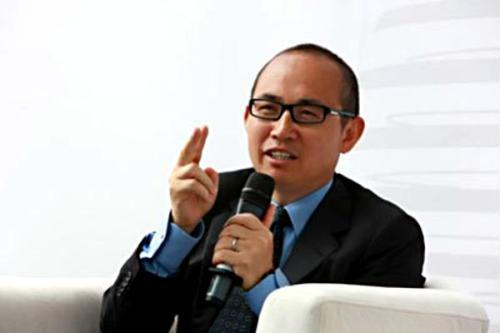

# 潘石屹卸任北京搜候公司董事长 但仍持有股份

天眼查App显示，近日，北京搜候房地产有限责任公司发生工商变更，法定代表人、董事长由潘石屹变更为徐晋。

据了解，该公司成立于2004年11月，注册资本9900万美元，经营范围含通盈首都花园巴黎城B地块一期和二期项目的开发建设及经营管理、房地产投资咨询，由SOHO中国（BVI-10）有限公司和潘石屹分别持股95%、5%。

文/北京青年报记者 宋霞

编辑/田野

