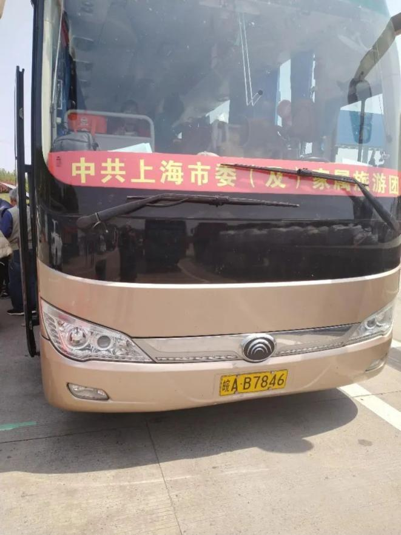

# 评论丨大巴载着“市委及家属旅游团”，不能止于辟谣

只有将这些细节明明白白地摊开，解释清楚每一个细节，才能真正地取信于人，获得舆论的认同

日前，有网友在社交媒体平台贴出一张图片，称在安徽池州旅游时，在一个服务区看到了一个老年游客团，其所乘坐的皖牌大巴前侧挂有“中共上海市委及家属旅游团”的条幅，质疑这样的旅游团名称不妥。

解放日报旗下“上海网络辟谣”就此向上海市相关部门核实，上海市委从未组织过相关旅游团，也不可能组织这样的“旅游团”。

_↑网传图片_

而当记者向各方求证时，也没找到横幅的来源。网传图片中的旅游大巴属于安徽新客流旅游运输公司。该公司一名谢姓负责人表示，没有接到过中共上海市委组织安排的旅游业务，公司层面也没有安排过在车上贴横幅的行为。至于是否存在大巴驾驶员或游客个人自行张贴的情况，对方表示需要进一步了解调查。

看来这副横幅目前无人认领。从网传图片看，这个横幅就挂在车辆的前方，颇为醒目。这不排除一种可能，即网友P图；但如果不是P的，这个横幅挂出的位置可谓醒目，很难想象不是有人有意为之。

而这样一副横幅显然不是无关紧要的，更像是一种“特权”的展示。将相关单位及家属的身份亮出来，首先就让人怀疑是否涉及公费旅游？此外把身份亮出来，是否也是希望沿途单位能够“行个方便”？这些当然是不合适的，甚至是违纪的，但一副含义模糊的横幅却足以让人产生这样的联想。

从目前网络舆论看，对于横幅大致有两类看法。一是对辟谣持保留态度，“谁会承认呢”；另一种则认同辟谣，认为横幅“肯定是假的”，毕竟将横幅明目张胆地亮出来，生怕别人不知道，这种操作属实不够聪明。

但无论如何，目前关于网传横幅来源还是没有确定，人们看到的只有文字层面的否认。因此事件还应当有后续，如果是有人P图造谣生事，有必要查清、处理肇事者，以正视听；如果确系有人不规范操作、挂上了这么一个横幅，那么也应当具体到人，并给予相应的处理。

**只有将这些细节明明白白地摊开，解释清楚每一个细节，才能真正地取信于人，获得舆论的认同。**
而这些其实也不难查清，车牌号、旅游公司信息都已经公开了，顺着这条线索应该不难挖掘出真相。这副网传横幅，已经关系到了部门形象以及干群关系，因此囫囵吞枣含糊过去并不合适，社会的关切需要得到回应。

而对于网友来说，此时不妨保持克制、理性，持续关注事件发展。其实近些年轰动一时的网络事件最后反转的不在少数，信息驳杂的网络很容易带动非理性情绪狼奔豕突，这也是一些反转新闻带给人们的教训。

**同时这起事件也是个提醒：横幅且不论真伪，这至少说明社会对于可能存在的“特权”是极为敏感的，单单一张语焉不详的图片就足以引发舆情。**
因此，各级单位部门都应当保持谨慎、注意影响，理解当前的舆论敏感点所在，妥善处理好和社会互动的细节。而这也是走好群众路线的必然要求，时时刻刻都不能忘了群众在乎什么、关注什么，并始终保持朴实、亲民的形象。

红星新闻特约评论员 清波

编辑 汪垠涛

红星评论投稿邮箱：hxpl2020@qq.com

