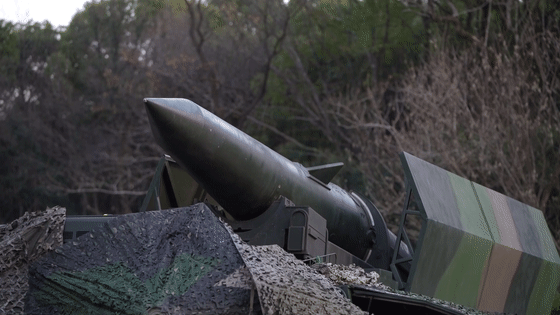
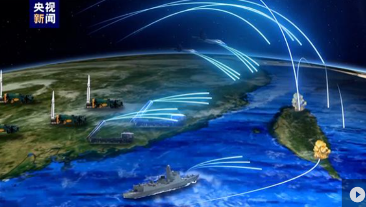
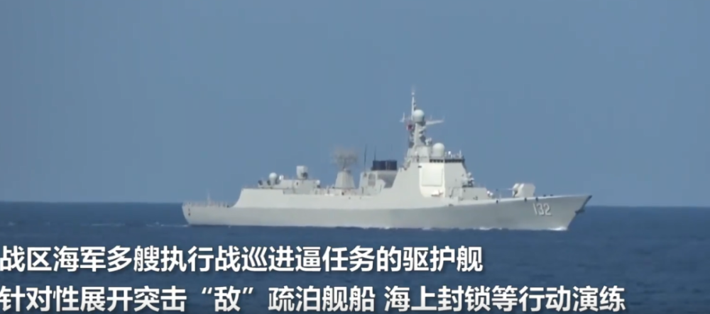
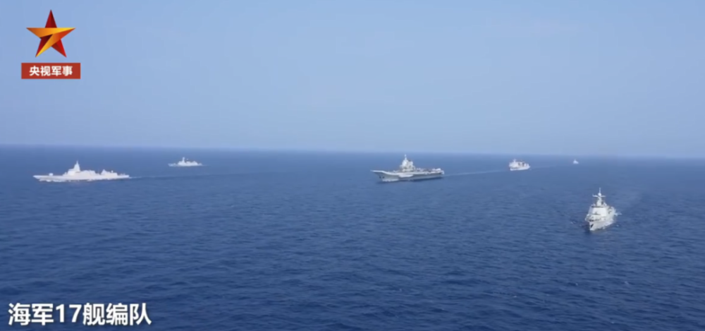

# 首次！环台岛演习第三天，多个罕见任务压轴上演！信息量巨大

**撰文 | 李岩**

东部战区日前消息披露，4月8日至10日，中国人民解放军东部战区按计划在台湾海峡和台岛北部、南部、台岛以东海空域组织环台岛战备警巡和“联合利剑”演习。

今天（4月10日），作为此轮环台岛演习的最后一天，政知君梳理发现，东部战区拿出了三个罕见“压轴”科目。

**火箭军饱和攻击海上移动目标**

就第三天的演习内容，东部战区4月10日发布视频披露，受领慑阻打击任务的火箭军部队闻令而动，采取周边快反、设伏快打、监视打击等战法，
**对海上移动目标进行火力追瞄，实施大弹量、多波次模拟火力打击。**

根据政知君梳理，在此前历次对台演训活动中，虽然解放军常导兵力（火箭军）已经多次亮相， **可进行“火箭军打击海上移动目标”演习，这是解放军首次证实。**

军迷读者不会陌生，“区域拒止”能力是解放军近些年着力打造的新质战力。其中，“弹道导弹打击水面移动目标（航母）”能力作为“区域拒止”核心，被公认是火箭军独步天下的“杀手锏”。

相比巡航导弹，弹道导弹具备速度快、射程远、突防能力强等优势。可传统的弹道导弹由于飞行航迹相对固定，只能对固定目标进行打击。而火箭军突破了通信、材料等诸多瓶颈，解决了弹道导弹在末段冲刺时侦搜并追击移动目标难题，独创并装配可以打击海上移动目标的弹道导弹。其中，东风-21D、东风-26此前已公开展示其打击效能，被誉为名副其实的“航母杀手”。

军事评论员宋忠平就此解读称，火箭军打击海上移动目标，主要针对就是域外势力的航母等大型水面舰艇。火箭军这一“杀手锏”，目前，现有的舰载防空系统无法进行有效拦截。
**“大弹量、多波次”，显然是在验证火箭军对海上移动目标发起饱和攻击的能力，在这样的火力精度、密度下，防御体系完备的航母战群也难以遁逃。**
火箭军已经在邻近海域构筑起了可靠、有效的拒止屏障。

他表示，解放军在演习中展示“杀手锏”并官方通报证实，震慑意味显而易见，属意料之中。另外，在联合演训中进行相关演练，本身对提升火箭军战力也是不可或缺的好机会，对优化作战流程有着重要意义。加之近日美国尼米兹级航母战群正临近海域挑衅，我们此举拿敌练兵的意味也很明显，充分表明了捍卫领土完整的决心和能力。

**突击“疏泊舰船”**

东部战区4月10日披露，当天，战区海军多艘执行战巡进逼任务的驱护舰，针对性展开 **突击“敌”疏泊舰船** 、海上封锁等行动演练。

“针对性开展突击疏泊舰船”，同样是首次出现在对台演训通报中。

何为“疏泊舰船”？

台海网此前刊文披露，去年5月，解放军辽宁舰航母编队曾在台岛以东约300公里海域进行演训。报道援引分析人士观点称，该海域正是台军舰进行战力保存的“疏泊”区域。

宋忠平向政知君解释称，疏泊有疏散停泊之意。现代海战中，交战方为了避免舰船在第一波攻势中消耗殆尽，或会将部分舰船疏散停泊至相对较远海域，伺机而动。
**若战局有利，疏泊舰船或介入战斗进行支援，若战局不利，疏泊舰船可逃离战场。**

“显而易见，台军疏泊舰船不论是介入还是逃跑，解放军都是不会允许的。”宋忠平表示。

**山东舰航母编队参演**

东部战区4月10日披露，当天，海军17舰编队参加演练。相关视频画面显示，演练中，歼-15舰载机挂载实弹从山东舰甲板起飞。

另据“央视军事”视频披露，4月10日， **山东舰航母编队位台岛以东游弋待战** ，密切协同此前前出的战区海空力量。

山东号航母是我国自主研制建造的首艘国产航母，舷号“17”。日前消息显示，4月5日，解放军山东舰航母编队穿越巴士海峡，经台湾岛东南海域，展开首次西太平洋航行训练。

就此，宋忠平解读称，美海军尼米兹级航母编队正在临近海域挑衅，日前已经前出西太平洋的山东舰编队加入环台演训，无疑是正面进行回应，展示解放军的意志、决心和能力。

此外他还分析称，解放军航母编队在台海遂行任务，不但要抗衡域外势力的水面力量，同时也是解放军对台海实施联合封锁的不可或缺的力量。另外，从战术角度来看，依靠解放军岸基力量、部署在台湾海峡中的海空力量，无法对台岛东侧山区的高价值目标形成有效威慑。“
**能游弋至台岛以东海域的航母编队，依靠其舰载机和导弹等装备，可有效打击台岛东侧山区中的目标。** ”

回顾三天来的演训活动，宋忠平表示，相比去年夏天的演训，此次针对性更强，科目也更加完整。“我们不光要看到很多新式装备、新的演习科目被编入此次活动，同时也要看到体系作战下解放军的快速反应能力。”

军事科学院大校研究员赵小卓还对媒体总结称，此次演练禁闭的力度更大、兵力运用更加灵活、实战的意味更浓。

**【版权声明】本文著作权归政知新媒体独家所有，未经授权，不得转载。**

