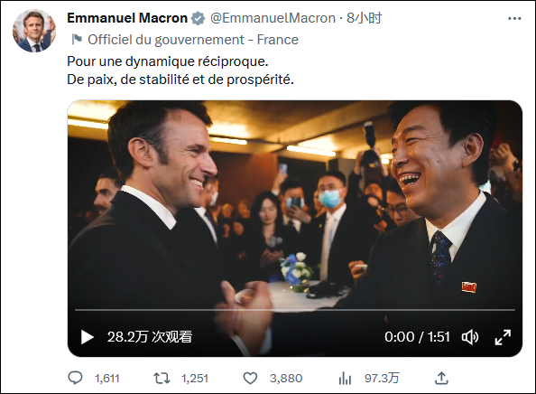

# 马克龙接受专访：如果欧洲没有战略自主权，就有“退出历史”的风险

【文/观察者网 周弋博】

当地时间4月9日，法国《回声报》（lesEchos）报道称，法国总统马克龙在接受该报专访时表示，如果欧洲没有战略自主权，就有“退出历史”的风险。

马克龙认为，当欧洲可以成为对抗中美之外的“第三极”时，战略自主权对于防止欧洲国家成为“附庸”至关重要，“欧洲所面临的陷阱是，每当其战略地位被明确时，就会陷入世界的混乱和与我们无关的危机之中”。

同时，马克龙还抗议“美元特权”，强调目前欧洲既要强化战略自主权，也要为自身经济发展解决好融资问题。在他看来，“历史正在加速”，而欧洲经济的发展必须跟上历史的节奏。

_法国《回声报》（lesEchos）报道截图_

4月5日至7日，马克龙对中国进行了国事访问，先后到访北京与广州。在访华期间，马克龙接受《回声报》专访，谈及乌克兰局势、台海问题、中美关系、欧洲战略自主等多方面的问题。

马克龙表示，在乌克兰问题上，中法已经达成了多项共识，即支持一切在国际法和联合国宪章宗旨和原则基础上恢复乌克兰和平的努力，反对针对核电站和其他和平核设施的武装攻击，强调冲突当事方应严格遵守国际人道法的重要性，呼吁通过对话协商和平解决国家间分歧和争端。

在被问及“中美在台海问题上的对抗，是否会将欧洲视为两者之间的棋子”时，马克龙表示，“作为欧洲人，我们关心的是我们的团结……我们正在向中国表明我们是团结一致的，这就是与欧盟委员会主席乌尔苏拉·冯德莱恩进行这次联合访问的意义所在。”

“摆在我们欧洲人面前的问题是：我们是否有兴趣加快台海问题的进程？不，最糟糕的是认为我们欧洲人应该在这个问题上紧跟美国或中国的节奏。”马克龙说道，“为什么我们要按照别人选择的节奏前进？在某些时候，我们必须问问自己我们的利益是什么。”

“我们欧洲人需要觉醒，我们的优先事项并不是去适应全世界其他国家的议程。”

“欧洲所面临的陷阱是，每当其战略地位被明确时，在战略上比新冠疫情前更自主时，就会陷入世界的混乱和与我们无关的危机之中。”马克龙认为，如果中美冲突加速爆发，欧洲将失去建设自身战略自主地位的时间，最终成为“附庸”，“如果我们有几年的时间来进行建设，我们就可以成为‘第三极’。”

_4月7日下午，马克龙参访中山大学并接受学生提问
图源：法新社_

“欧洲战略自主”的概念于2016年被正式提出；特朗普当选后，频频威胁只要欧洲国家不增加军费开支，将降低对欧洲的军事支持，同时也抬高了欧洲进口商品的关税，促使欧盟将“欧洲战略自主”的落实提上日程，2017年新上任的马克龙成为其最强烈的推动者。

这一概念实际上得到了本届美国政府和美国学界的一定支持；不过，美国认为欧洲的“战略自主”意味着后者应该加大军事开支，尤其是满足北约的“军费开支占GDP2%”基准，帮助美国分摊一定军事开支压力，认为一个“战略自主”的欧洲可以帮助美国打压中俄。

在谈到“越来越多的欧洲国家比以往任何时候都更加依赖美国来确保自身安全”的问题时，马克龙直言，这是“当前形势的巨大悖论”。

“五年前，（欧洲）战略自主只是一个幻想。如今，每个人都在谈论这件事，这是一个重大变化。我们已经为自己配备了国防和工业政策工具，并取得了许多进展……我们已经开始建立电池、储氢元件和电子产品的工厂。我们已经装备了防御手段，这与欧洲人三四年前的意识形态完全相反。”

马克龙认为，战略自主地位是属于欧洲的斗争，而欧洲不应该在该问题上依赖任何国家，欧洲需要在能源、安全、社交网络、人工智能等领域实现独立，建设并具备相应的基础设施。

_马克龙在推特发Vlog总结访华行程_

不过，马克龙也承认，在俄乌冲突爆发后，欧洲在能源问题上对美国的依赖加强了，但这也是此前严重依赖俄罗斯能源的结果之一。

“减少对美国人依赖的关键首先在于加强我们的国防工业，在共同标准上达成一致。”马克龙说，“然后，（我们）需要加速欧洲对核能和可再生能源之争。我们的大陆不生产化石燃料，而再工业化、气候和战略自主权之间存在一致性，这是同一场战斗，即核能、可再生能源和欧洲能源节制的问题。”

“战略自主意味着，即便我们与美国有相似的观点，但无论是在乌克兰在乌克兰、与中国的关系还是制裁问题上，我们都有欧洲自己的战略。”

“矛盾的是，当我们将真正的欧洲战略自主的要素落实到位时，我们会出于一种恐慌反射而开始遵循美国的政策。相反，今天（欧洲）要面临的斗争，一方面是加快我们的战略自主建设，另一方面是确保我们经济发展的融资。我借此机会强调一点：我们绝不能依赖美元的霸权。”

**本文系观察者网独家稿件，未经授权，不得转载。**

