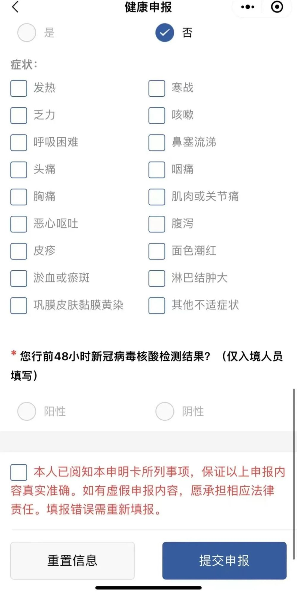

# 不同国家不同要求，到底从哪些地方回国还要查核酸？

3月下旬，在土耳其见完客户的外贸人丁言东，在踏上回国班机之前花了不少精力在“提供核酸阴性证明”上。

“做核酸的地方不好找，我是托了关系，专门找人问的。”丁言东告诉第一财经记者，由于飞机是在第二天起飞，也不知道在伊斯坦布尔做完核酸后要多久才能出结果，“做的太早或者太晚都不合适，特别困扰。”

好在最终找到了核酸点，花了300元人民币检测后在当天晚上拿到了阴性证明，于第二天顺利登上了飞机，“飞回中国的乘客，不做核酸上不了飞机，我坐的埃及航空，航司还拍了张照片留档。”

不过，记者又咨询了近期从希腊、俄罗斯拓市场回国的外贸人，均反馈说入境手续已经基本恢复到了疫情前，既不需要提供核酸证明，也不用做抗原，只需要在海关小程序上申报“阴性”即可顺利登机回国。

这意味着，从不同国家回国，对是否需要核酸阴性证明的要求是不同的，并且对来自不同国家的入境要求也在不断更新。比如3月下旬从德国入境中国的外资高管和外贸人尚且还需要提供核酸阴性证明，但近期有商务人士从德国入华时发现，已不再需要任何相关证明。

这样的现实情况，对不少有意出国谈生意或探亲旅游的人士来说，造成了不小的困扰。到底要不要做核酸，成了他们决策是否出国的重要因素之一。

**哪些国家回国还要查核酸**

去年年底时，从国外来华是都需要提供核酸阴性证明的。根据中国政府2022年12月27日发布的新型冠状病毒感染乙类乙管后中外人员往来暂行措施要求，前往中国旅客须在行前48小时进行核酸检测，结果阴性者可来华。

自2023年1月17日起， **来华核酸检测的监管更加明确**
：要求执飞赴华航班的航空公司负责查验旅客登机前48小时内核酸检测阴性证明，中国海关将在旅客入境时对证明进行抽查。

不过，自3月1日起，中国驻新西兰大使馆率先发布信息称，允许搭乘自新西兰来华直飞航班人员以抗原检测（包括用试剂盒自测）替代核酸检测，航空公司不再查验登机前核酸检测阴性证明及抗原检测结果。

随后，中国驻马来西亚，南非等多国大使馆也陆续发布了同样的通知，这些国家对来自中国的旅客入境该国时，也大多没有查验核酸的要求。

那么，截至目前， **到底从哪些国家回国不需要核酸阴性证明了？**

第一财经记者今日从一家国内航空公司拿到的最新航班入境更新政策显示：泰国、印度尼西亚、柬埔寨、马尔代夫、斯里兰卡、菲律宾、马来西亚、新加坡、老挝、阿联酋、埃及、肯尼亚、南非、俄罗斯、瑞士、匈牙利、新西兰、尼泊尔、文莱、越南、蒙古、伊朗、坦桑尼亚、哈萨克斯坦、乌兹别克斯坦、格鲁吉亚、阿塞拜疆、塞尔维亚、法国、希腊、西班牙、意大利、丹麦、葡萄牙，允许来华直飞航班以抗原检测替代核酸检测，
**其他国际及地区赴华旅客须在行前48小时进行核酸检测** ，结果阴性者可赴华。

这意味着，除了上述提到的国家，从美国，日本，韩国，英国，德国，奥地利等不少国家来华，依然需要在行前准备48小时核酸检测。

不过，来自航空公司的入境提示也指出：入华旅客通过微信小程序“海关旅客指尖服务”、掌上海关APP或出入境健康申报网页填写《中华人民共和国出/入境健康申明卡》进行申报，
**航空公司不再查验登机前核酸检测阴性证明及抗原检测结果** 。抵达口岸后凭海关健康申报码完成必要通关手续。 **海关将按照一定比例进行抽样检测**
，并对健康申报异常或出现发热等症状人员进行检测。

**做还是不做？监管有差异**

记者多方了解发现，目前从不同国家来华的入境政策，确实存在不少差异，而从不同国家经过中国香港和中国澳门到内地的政策，也有一些不同，并且
**在实际执行中的监管也有松紧的差异** 。

在一家德国外企工作的张先生，三月到德国出差，从奥地利经中国香港回国，当时他就查阅了具体的回国核酸要求：如7天内无外国或其他境外地区旅居史，从香港到内地无需凭行前新冠病毒感染核酸检测阴性结果入境；但如果7天内有外国或其他境外地区旅居史，从香港到内地则需要查验行前48小时新冠病毒感染核酸检测阴性证明，结果为阴性者放行进入内地。

为此，张先生在落地香港后，花费499港元做了一次核酸检测，拿到阴性报告后即入关深圳。然而，到了深圳并没有人要求他出示核酸检测报告，海关所要求他填写的《中华人民共和国出/入境健康申明卡》，也没有上传核酸检测报告的要求，只需要自觉填写“行前48小时新冠病毒核酸检测结果是阴性还是阳性”。

“订票时航空公司的系统里是要求提供核酸检测报告的，但实际入境时并没有人查验，填写海关申报表也是全凭自觉，是不是从奥地利回国实际上已经不需要核酸报告了？但我看大使馆也没有官宣类似新西兰等国可以用抗原取代核酸的消息。”张先生说。

记者咨询最近从日本，美国回国的部分人士，也有张先生类似的经历。而根据目前官方对外披露的政策，从这些国家回国是依然需要在行前准备48小时核酸检测的。

而对于自中国去往美国和日本等国家，提供行前核酸检测报告的要求则已经陆续解除。美国疾病控制与预防中心CDC是在当地时间3月10日发布通知，取消了针对中国赴美旅客的强制性新冠核酸检测要求；日本则是要求自4月5日起，从中国大陆直飞日本的旅客，持有有效疫苗接种（三针）证明就不再需要做核酸检测，不符合有效疫苗接种（三针）证明的旅客需要在出国前72小时以内做核酸检测，并出示由医疗机构出具的检测证明，对抵达人员将实施抽样检测。

“希望从各国回国的核酸检测要求能够尽快统一，有利于促进招商引资和旅游需求的更快恢复，否则像我这样去过德国，匈牙利，奥地利多个国家的，到底按照哪个国家的回国政策要求执行都会很困惑，因为匈牙利回国已经不需要查核酸，但德国和奥地利在政策要求层面上还需要，实际执行时又是另一种结果。”张先生说。

